# ASDK 3.0 具体落实方案（可实施版）

- **文档状态**：工程落地设计稿
- **目标版本**：ASDK 3.0
- **实现语言**：C++17 / C11 ABI
- **目标系统**：Ubuntu 22.04 / 24.04，systemd，Linux UDS，Fast DDS 3.6.x
- **主要用途**：研发拆分、接口冻结、并行开发、集成验证和版本验收

## 目录

1. 文档定位与最终裁决
2. 实现模块划分
3. M01：公共契约与 Core
4. M02：配置、Manifest 与 DeploymentPlan
5. M03：Linux 平台适配与控制线协议
6. M04：asdkd 控制循环、编排与 Supervisor
7. M05：宿主进程框架
8. M06：PluginRuntime 与受控资源代理
9. M07：Fast DDS 数据适配
10. M08：本机共享内存大数据通道
11. M09：管理 API、asdkctl 与 Portal 适配
12. M10：可观测性、测试支撑与发布保障
13. 并行开发组织与接口冻结
14. 分阶段集成门槛
15. 首个垂直切片的明确范围
16. 测试矩阵、最终交付物与 Definition of Done

---

## 0. 文档定位与最终裁决

### 0.1 两份输入文档的使用方式

《ASDK3.0模块实现说明》只保留以下参考价值：

- 应用层、控制面、宿主层、Runtime 代理层、数据面之间的分层思路；
- `PluginRuntime`、`TaskGroup`、`DdsSession`、`ShmManager`、`CallbackGate` 等模块名称和基础职责；
- 插件生命周期、控制 IPC、小数据 DDS、大数据共享内存等基础流程。

该文档中以下约束不进入 ASDK 3.0 最终实现：

- daemon 失败导致全部宿主停止；
- 不支持 daemon 重启接管；
- 单插件失败导致整个 ASDK 服务失败；
- 配置永远只在进程启动时读取且不能事务更新；
- 插件只能逐个串行启动；
- 运行期不执行插件级恢复。

发生冲突时，以《ASDK 3.0 重构改进方案 v2》的目标和架构不变量为准。

### 0.2 本方案对重构方案的工程化修订

重构方案给出了正确方向，但其中部分描述仍不足以直接编码。本方案作出以下确定性修订：

| 事项 | 最终工程决策 |
|---|---|
| 默认隔离方式 | ASDK 3.0 首要实现路径为“一插件一宿主进程”；线程组宿主在独占宿主稳定后启用 |
| daemon 与宿主关系 | 宿主是独立 systemd unit，不属于 `asdkd.service` 的 cgroup；daemon 重启不停止宿主 |
| 生命周期语义 | `LOADED` 表示动态库、descriptor 和 plugin handle 均已建立；`STOP` 只进入 `STOPPED`，不自动 `dlclose` |
| 配置更新 | Runtime 内配置不可变；系统允许通过“全量停止—新配置启动—失败回滚”的事务更新 |
| 插件资源 | 不采用无法落地的“插件绝对零资源”；改为“Runtime 创建或登记所有长期资源，未登记资源视为违规” |
| DDS 端点 | 插件在 `initialize()` 阶段声明逻辑端点，Runtime 在 `start()` 阶段创建物理端点，在 `stop()` 阶段销毁物理端点 |
| DDS 回调 | 默认先进入 Runtime 有界队列，再由 Runtime 回调执行器调用插件；不允许业务插件长期阻塞 Fast DDS 内部线程 |
| 共享内存 | 首版使用“每通道固定大小 block 池”，不实现通用可变长内存分配器 |
| SHM 引用 | acquire/release 由发布宿主本地控制通道管理；daemon 不参与 block 回收 |
| 状态权威 | 宿主保存实际 lifecycle；daemon 保存 desired state 和 operation，并镜像实际状态 |
| 状态持久化 | FileStateStore 以快照和 journal 保存配置、期望状态、操作日志和最后观测；重启后必须与宿主快照对账 |
| 时钟 | 超时与本机延迟统一使用 `CLOCK_MONOTONIC`；不得直接比较 `CLOCK_REALTIME-CLOCK_MONOTONIC` 判断同步误差 |
| 资源泄漏判断 | 不使用“相对基线增长 50% 即重启”的单一规则；使用绝对预算、持续趋势和 cgroup 事件联合判断 |

### 0.3 ASDK 3.0 最终运行架构

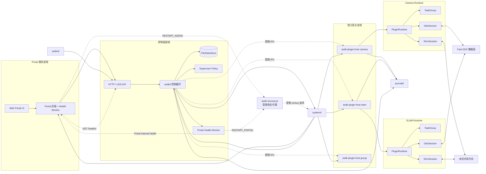

### 0.4 必须保持的架构不变量

1. `asdkd` 不链接业务消息库，不创建业务 Participant、Topic、Reader、Writer 或 SHM payload。
2. 每个 `PluginRuntime` 独立拥有插件对象、任务、逻辑端点、物理端点、回调栅栏和 SHM 引用。
3. 插件对象销毁前，Runtime 必须确认任务退出、回调排空、DDS 端点关闭和 SHM 引用释放。
4. IPC 断开只代表控制连接失效，不代表宿主死亡。
5. 宿主死亡必须由 pidfd、PID start-time、systemd unit 状态或进程退出事件确认。
6. 配置未完整校验前，不得创建 unit、进程、DDS 实体或共享内存区域。
7. daemon 和宿主之间只传递控制消息、配置快照和状态元数据，不传业务 payload。
8. 所有外部操作都必须具备 `request_id`、`operation_id`、`config_generation` 和 `state_generation`。
9. process 模式下一个宿主只能包含一个 Runtime；thread 模式只能显式配置并通过准入检查。
10. 任一模块只能依赖其下层接口，不得通过全局单例绕过依赖边界。
11. Portal 服务与 `asdkd` 必须双向监视健康状态；两者只可向 `asdk-recoveryd` 提交恢复请求，不能直接执行 `systemctl`、`fork/exec` 或终止对方进程。
12. `asdk-recoveryd` 只允许重启 `asdkd.service` 与 `asdk-portal.service`，并执行目标级限流和熔断；不得管理 host unit、`asdk.target` 或 systemd manager。

---

# 1. 实现模块划分

## 1.1 模块划分结果

ASDK 3.0 按十个可独立构建、独立测试、可使用 Fake Adapter 替换的实现模块划分。

| 编号 | 实现模块 | 主要 CMake 目标 | 核心交付 | 可独立开发条件 |
|---|---|---|---|---|
| M01 | 公共契约与 Core | `asdk_abi`、`asdk_core`、`asdk_ports` | C ABI、状态模型、操作模型、错误模型、内部端口接口 | 最先冻结 |
| M02 | 配置与部署计划 | `asdk_config` | JSON Schema、Manifest、规范化、DAG、`DeploymentPlan` | 依赖 M01 头文件 |
| M03 | Linux 平台适配 | `asdk_platform_linux`、`asdk_control_wire`、`asdk-recoveryd` | systemd、受限恢复代理、UDS、文件状态存储、pidfd、时钟、journald 适配 | 依赖 M01 端口接口 |
| M04 | daemon 控制与编排 | `asdk_orchestrator`、`asdk_supervisor`、`asdkd` | 单写者控制循环、操作编排、接管、恢复、配置事务 | 使用 M03 Fake 可先开发 |
| M05 | 宿主进程框架 | `asdk_host_core`、`asdk-plugin-host` | 注册重连、操作路由、Runtime Registry、事件补发 | 使用 Runtime Fake 可先开发 |
| M06 | PluginRuntime 与资源代理 | `asdk_runtime` | 插件加载、生命周期、TaskGroup、CallbackGate、资源登记 | 使用 DDS/SHM Fake 可先开发 |
| M07 | Fast DDS 数据适配 | `asdk_transport_api`、`asdk_transport_fastdds` | 逻辑端点、类型支持、物理端点、收发队列 | 依赖 M01 接口 |
| M08 | 共享内存数据通道 | `asdk_shm_api`、`asdk_shm_posix` | 固定 block 池、注册、acquire/release、回收和背压 | 依赖 M01 接口 |
| M09 | 管理 API、CLI 与 Portal 适配 | `asdk_control_service`、`asdkctl` | HTTP/UDS API、异步 operation、CLI、Portal Client | 使用 Orchestrator Fake 可先开发 |
| M10 | 可观测性、测试与发布保障 | `asdk_observability`、`asdk_test_support` | 日志、指标、Fake、故障注入、包和升级检查 | 与全部模块并行 |

## 1.2 模块依赖关系

箭头表示“编译时依赖”。`M04`、`M05`、`M06` 均只依赖抽象端口；真实适配器在应用组合根中注入。

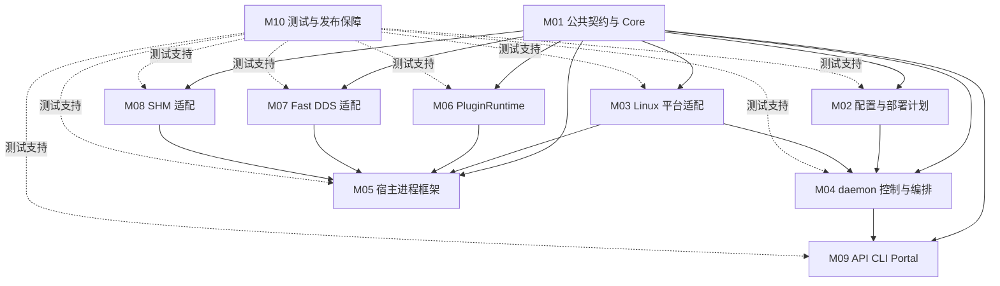

## 1.3 最终代码目录

```text
asdk/
├── CMakeLists.txt
├── cmake/
│   ├── AsdkDependencyRules.cmake
│   ├── AsdkSanitizers.cmake
│   └── AsdkAbiCheck.cmake
├── include/asdk/
│   ├── abi/                         # M01：唯一插件 ABI
│   │   ├── common_v3.h
│   │   ├── plugin_v3.h
│   │   ├── host_api_v3.h
│   │   └── message_codec_v1.h
│   ├── core/                        # M01：纯业务模型
│   │   ├── error.hpp
│   │   ├── ids.hpp
│   │   ├── state.hpp
│   │   ├── operation.hpp
│   │   ├── recovery_types.hpp
│   │   ├── deployment_plan.hpp
│   │   └── status_snapshot.hpp
│   └── ports/                       # M01：内部抽象端口
│       ├── state_store.hpp
│       ├── unit_manager.hpp
│       ├── host_channel.hpp
│       ├── recovery_requester.hpp
│       ├── process_probe.hpp
│       ├── transport.hpp
│       ├── shm.hpp
│       ├── clock.hpp
│       └── log_sink.hpp
├── src/
│   ├── core/                        # M01
│   ├── config/                      # M02
│   ├── platform_linux/              # M03
│   ├── control_wire/                # M03
│   ├── orchestrator/                # M04
│   ├── supervisor/                  # M04
│   ├── host_core/                   # M05
│   ├── runtime/                     # M06
│   ├── transport_fastdds/           # M07
│   ├── shm_posix/                   # M08
│   ├── control_service/             # M09
│   └── observability/               # M10
├── apps/
│   ├── asdkd/
│   ├── asdk-plugin-host/
│   ├── asdkctl/
│   ├── asdk-recoveryd/
│   ├── asdk-plugin-inspect/
│   └── asdk-config-migrate/
├── interfaces/
│   ├── config/asdk-v3.schema.json
│   ├── control/control-v3.schema.json
│   └── idl/
├── generated/
│   ├── fastddsgen-4.3.0/
│   └── message-codec/
├── examples/
│   ├── producer_v3/
│   ├── consumer_v3/
│   ├── crash_v3/
│   └── blocking_stop_v3/
├── packaging/
│   ├── systemd/
│   ├── debian/
│   └── migration/
└── tests/
    ├── unit/
    ├── contract/
    ├── integration/
    ├── fault/
    ├── performance/
    ├── abi/
    └── test_support/
```

## 1.4 CMake 依赖约束

| 目标 | 允许依赖 | 禁止依赖 |
|---|---|---|
| `asdk_abi` | C 标准头 | STL、JSON、Fast DDS、systemd |
| `asdk_core` | C++17 标准库、`asdk_abi` | POSIX、文件状态存储、HTTP、Fast DDS |
| `asdk_config` | `asdk_core`、JSON Schema 库 | systemd、Runtime、DDS、SHM |
| `asdk_orchestrator` | `asdk_core`、`asdk_ports` | sd-bus、socket、文件状态存储实现、Fast DDS |
| `asdk_host_core` | `asdk_core`、`asdk_ports`、`asdk_runtime` | HTTP、文件状态存储、Portal |
| `asdk_runtime` | `asdk_core`、`asdk_ports`、`asdk_abi` | systemd、HTTP、StateStore |
| `asdk_transport_fastdds` | `asdk_ports`、Fast DDS/Fast CDR | Orchestrator、StateStore、HTTP |
| `asdk_shm_posix` | `asdk_ports`、POSIX | Orchestrator、HTTP、Fast DDS 业务层 |
| `asdkd` | M02、M03、M04、M09、M10 | 业务 IDL、插件 `.so`、Fast DDS |
| `asdk-plugin-host` | M03、M05、M06、M07、M08、M10 | HTTP、FileStateStore、Portal |

CI 必须执行以下检查：

```text
1. 扫描 public header，禁止出现 eprosima、systemd、文件状态存储、httplib 等实现类型。
2. 使用 readelf -d 检查 asdkd 的 NEEDED，不得包含 libfastdds、业务消息库和插件库。
3. 使用 nm -D 检查插件唯一强制导出符号。
4. 使用 include-what-you-use 或自定义脚本检查跨模块私有头引用。
5. 每个模块只通过 target_link_libraries 链接公开目标，不允许全局 include_directories。
```

---

# 2. M01：公共契约与 Core

## 2.1 模块目标

M01 是全部并行开发的唯一前置模块。其产物只定义“系统说什么”和“模块如何交互”，不包含 Linux、Fast DDS、JSON、文件状态存储 或 HTTP 实现。

### 代码目标

```text
asdk_abi      INTERFACE library
asdk_core     STATIC library
asdk_ports    INTERFACE library
```

### 必须冻结的公共内容

- 插件 C ABI；
- Host API C ABI；
- 错误码和错误链；
- lifecycle / operation / health 状态；
- desired state；
- `DeploymentPlan`；
- daemon-host 控制消息 DTO；
- StateStore、UnitManager、HostChannel、RecoveryRequester、Transport、SHM 等内部端口；
- ID、generation、deadline 和时间戳语义。

## 2.2 状态模型

### 状态定义

```cpp
enum class LifecycleState : uint8_t {
    UNLOADED,
    LOADED,        // .so、descriptor、plugin handle 均有效
    INITIALIZED,   // 配置已解析，逻辑资源声明完成
    RUNNING,       // 任务、DDS、SHM 均 ready
    STOPPED        // 运行资源已释放，可再次 start
};

enum class OperationState : uint8_t {
    IDLE,
    LOADING,
    INITIALIZING,
    STARTING,
    STOPPING,
    DEINITIALIZING,
    UNLOADING,
    RECOVERING
};

enum class HealthState : uint8_t {
    UNKNOWN,
    HEALTHY,
    DEGRADED,
    FAILED
};

enum class DesiredState : uint8_t {
    ABSENT,
    STOPPED,
    RUNNING
};
```

### 生命周期状态机

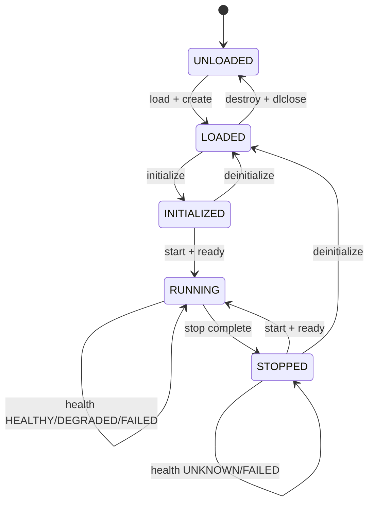

### 状态提交规则

1. lifecycle、operation、health 任一对外可见字段变化时，`state_generation` 递增。
2. `config_generation` 只由 daemon 配置事务递增，宿主不得自行修改。
3. 同一 Runtime 同一时刻只能存在一个 active operation。
4. 宿主是 lifecycle、operation、health 的实际状态权威。
5. daemon 是 desired state、配置代际和恢复策略的权威。
6. `FAILED` 不改变 lifecycle；例如任务崩溃可表达为 `RUNNING + IDLE + FAILED`。
7. 清理失败时保留最后真实 lifecycle，不伪造为 `UNLOADED`。

### 状态结构

```cpp
struct PluginActualState {
    PluginId plugin_id;
    HostId host_id;
    BootId host_boot_id;

    LifecycleState lifecycle;
    OperationState operation;
    HealthState health;

    uint64_t state_generation;
    uint64_t config_generation;
    Hash256 config_hash;

    std::optional<OperationId> active_operation_id;
    std::optional<FailurePhase> failed_phase;
    ErrorChain last_error_chain;

    uint64_t state_since_monotonic_ns;
};
```

## 2.3 错误模型

```cpp
enum class ErrorCode : uint32_t {
    OK = 0,
    INVALID_ARGUMENT,
    INVALID_STATE,
    NOT_FOUND,
    ALREADY_EXISTS,
    PERMISSION_DENIED,
    ABI_MISMATCH,
    CONFIG_INVALID,
    DEPENDENCY_CYCLE,
    STALE_GENERATION,
    OPERATION_CONFLICT,
    RESOURCE_EXHAUSTED,
    TIMEOUT,
    IPC_ERROR,
    UNIT_ERROR,
    DDS_ERROR,
    SHM_ERROR,
    PLUGIN_ERROR,
    HOST_EXITED,
    UNSAFE_TO_UNLOAD,
    INTERNAL_ERROR
};

struct ErrorInfo {
    ErrorCode code;
    std::string module;
    std::string plugin_id;
    std::string phase;
    std::string message;
    uint64_t monotonic_ns;
};
```

### 对端恢复契约

恢复请求是 Portal 后端与 asdkd 共用的内部契约，必须由 M01 冻结；调用方不携带可选目标 unit，恢复代理只根据已认证的调用方身份决定唯一的对端恢复目标。

```cpp
enum class RecoveryReason : uint8_t {
    PEER_HEALTH_TIMEOUT,
    PEER_WATCHDOG_TIMEOUT,
    OPERATOR_APPROVED
};

enum class RecoveryResult : uint8_t {
    ACCEPTED,
    RATE_LIMITED,
    CIRCUIT_OPEN,
    PERMISSION_DENIED,
    UNAVAILABLE
};

struct PeerRecoveryRequest {
    RecoveryReason reason;
    uint32_t consecutive_failures;
    uint64_t last_success_monotonic_ns;
};
```

约束：

- 控制逻辑只能依据 `ErrorCode` 和结构化字段判断，不得解析 `message`；
- `message` 在进入宿主或 daemon 时必须复制，不得保存插件返回的临时指针；
- 一个 operation 可保存多步错误形成 `ErrorChain`；
- 清理阶段的新错误追加到错误链，不覆盖首个根因。

## 2.4 最终插件 C ABI

插件唯一导出符号：

```c
ASDK_ABI_EXPORT
const asdk_plugin_descriptor_v3* asdk_get_plugin_descriptor_v3(void);
```

```c
typedef void* asdk_plugin_handle;

typedef struct asdk_plugin_descriptor_v3 {
    uint32_t struct_size;
    uint32_t abi_version;
    asdk_string_view plugin_type;
    asdk_string_view build_id;
    uint64_t capabilities;

    asdk_status_code (*create)(
        const asdk_host_api_v3* host,
        asdk_plugin_handle* out_handle);

    asdk_status_code (*initialize)(
        asdk_plugin_handle handle,
        asdk_bytes_view immutable_config);

    asdk_status_code (*start)(asdk_plugin_handle handle);
    asdk_status_code (*request_stop)(asdk_plugin_handle handle);
    asdk_status_code (*deinitialize)(asdk_plugin_handle handle);
    asdk_status_code (*health)(
        asdk_plugin_handle handle,
        asdk_health_v3* out_health);

    void (*destroy)(asdk_plugin_handle handle);
} asdk_plugin_descriptor_v3;
```

### ABI 约束

- 不允许 STL、虚函数对象、RTTI、异常、可变长 C struct 和编译器相关 bit-field 跨边界；
- 所有结构包含 `struct_size` 和 `abi_version`；
- 插件异常必须在插件内部捕获，Runtime 仍在最外层执行 `catch (...)`；
- 插件分配的内存由插件释放，宿主分配的内存由宿主释放；
- 插件通过 Host API 上报详细错误，生命周期函数只返回稳定错误码；
- `destroy()` 必须允许对有效 handle 调用一次；重复调用由 Runtime 阻止，不要求插件容忍双重销毁。

## 2.5 Host API 分组

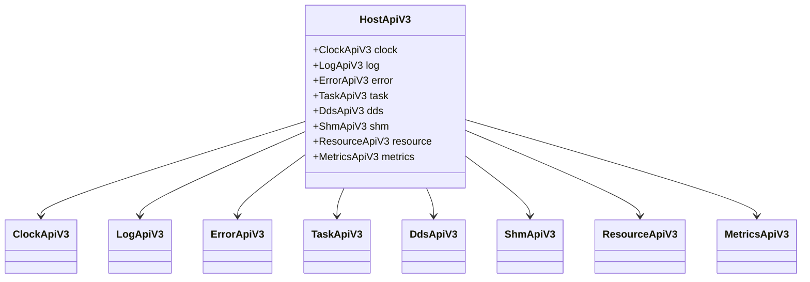

| API 组 | 允许阶段 | 核心操作 |
|---|---|---|
| Clock | 全阶段 | `now_monotonic_ns`、`now_realtime_ns`、`sync_state` |
| Log | 全阶段 | 结构化日志，Runtime 自动绑定 host/plugin/operation 上下文 |
| Error | 生命周期调用和任务阶段 | `set_last_error`、`append_error` |
| Task | `start()` 期间 | 创建受控任务、ready、error、stop token |
| DDS | `initialize()` 声明；`RUNNING` 发布 | 声明 reader/writer、publish、查询匹配状态 |
| SHM | `initialize()` 声明；`RUNNING` 使用 | 声明通道、allocate、seal、acquire、release |
| Resource | initialize/start | 登记 FD、mmap、vendor handle 和 cleanup callback |
| Metrics | 全阶段 | counter、gauge、histogram，不允许动态无限创建 label |

## 2.6 内部端口接口

以下接口是模块并行开发的边界。它们属于 ASDK 内部 C++ ABI，不承诺跨大版本二进制兼容。

```cpp
class IStateStore {
public:
    virtual ~IStateStore() = default;
    virtual Result<PersistedState> load() = 0;
    virtual Result<void> commit_operation(const OperationRecord&) = 0;
    virtual Result<void> commit_observation(const ObservationBatch&) = 0;
    virtual Result<void> begin_config_tx(const ConfigTransaction&) = 0;
    virtual Result<void> finish_config_tx(const ConfigTransactionResult&) = 0;
};

class IUnitManager {
public:
    virtual ~IUnitManager() = default;
    virtual AsyncResult<UnitInfo> ensure_host(const HostPlan&) = 0;
    virtual AsyncResult<void> stop_host(const HostId&, StopMode) = 0;
    virtual AsyncResult<UnitInfo> query_host(const HostId&) = 0;
    virtual Result<UnitIdentity> resolve_unit_by_pid(ProcessId) = 0;
};

class IHostChannel {
public:
    virtual ~IHostChannel() = default;
    virtual Result<void> send(const HostId&, const ControlMessage&) = 0;
    virtual void set_event_sink(IHostEventSink*) = 0;
};

class IRecoveryRequester {
public:
    virtual ~IRecoveryRequester() = default;
    virtual Result<RecoveryResult> request_peer_restart(
        const PeerRecoveryRequest&) = 0;
};

class ITransportSession {
public:
    virtual ~ITransportSession() = default;
    virtual Result<WriterHandle> declare_writer(const ChannelDescriptor&) = 0;
    virtual Result<ReaderHandle> declare_reader(
        const ChannelDescriptor&, SerializedDataCallback) = 0;
    virtual Result<void> start() = 0;
    virtual Result<void> stop(uint64_t deadline_ns) = 0;
    virtual Result<void> publish(
        WriterHandle, ByteView, const SampleMetadata&) = 0;
};

class IShmSession {
public:
    virtual ~IShmSession() = default;
    virtual Result<void> declare_channel(const ShmChannelDescriptor&) = 0;
    virtual Result<void> start() = 0;
    virtual Result<WritableBlock> allocate(
        ChannelId, uint32_t length, uint64_t deadline_ns) = 0;
    virtual Result<LargeDataHeader> seal(WritableBlock&&) = 0;
    virtual Result<SharedSample> acquire(const LargeDataHeader&) = 0;
    virtual Result<void> stop(uint64_t deadline_ns) = 0;
};
```

## 2.7 M01 实现任务

- [ ] M01-01：建立固定宽度 C 类型、字符串视图、字节视图、UUID 和版本宏。
- [ ] M01-02：冻结 `asdk_plugin_descriptor_v3` 和 Host API 分组。
- [ ] M01-03：实现三维状态模型、合法转换表和纯函数校验器。
- [ ] M01-04：实现 operation、generation、幂等和冲突模型。
- [ ] M01-05：定义 `DeploymentPlan`、`HostPlan`、`PluginPlan`、`ChannelPlan`。
- [ ] M01-06：定义全部内部端口接口和 Fake 所需语义。
- [ ] M01-07：冻结 `RecoveryReason`、`RecoveryResult`、`PeerRecoveryRequest` 和 `IRecoveryRequester`，并定义 Fake 语义。
- [ ] M01-08：实现 ABI layout 静态断言及 C/C++ 双编译测试。

## 2.8 M01 验收条件

1. 在没有 JSON、Fast DDS、systemd、文件状态存储、HTTP 的环境中可 `configure/build/ctest`。
2. C 插件和 C++ Runtime 均能包含 ABI 头并成功编译。
3. 所有合法/非法状态转换均有表驱动测试。
4. 相同 `request_id` 幂等、旧 generation 拒绝、并发 operation 冲突均有测试。
5. `sizeof`、`offsetof`、ABI version 和 `struct_size` 有自动校验。
6. M01 公共头冻结后，其余模块可仅依靠 Fake 并行开发。

---
# 3. M02：配置、Manifest 与 DeploymentPlan

## 3.1 模块职责

M02 只负责把外部 JSON 和插件 Manifest 编译成完整、不可变、可执行的 `DeploymentPlan`。M02 不启动进程、不连接 DDS、不创建 SHM，也不修改 StateStore。

```text
输入：配置 JSON + 插件 Manifest + 插件私有 JSON Schema
输出：DeploymentPlan 或完整 ValidationReport
副作用：无
```

### 代码结构

```text
src/config/
├── config_loader.cpp
├── schema_validator.cpp
├── manifest_loader.cpp
├── path_normalizer.cpp
├── policy_validator.cpp
├── channel_validator.cpp
├── resource_validator.cpp
├── dag_compiler.cpp
├── host_plan_builder.cpp
└── deployment_compiler.cpp
```

### 核心类

```cpp
class DeploymentCompiler {
public:
    Result<DeploymentPlan> compile(
        ByteView raw_json,
        const CompileContext& context,
        ValidationReport* report) const;
};

struct CompileContext {
    std::filesystem::path config_path;
    std::vector<std::filesystem::path> allowed_plugin_prefixes;
    std::vector<std::filesystem::path> allowed_manifest_prefixes;
    uint64_t next_config_generation;
    MachineCapacity machine_capacity;
};
```

## 3.2 配置编译流程

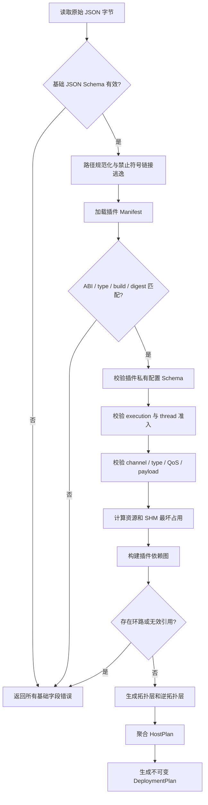

要求：一次编译尽可能返回全部错误，而不是遇到第一个错误立即退出。只有依赖前一步结果才能继续的错误才允许短路。

## 3.3 DeploymentPlan 数据结构

```cpp
struct DeploymentPlan {
    uint32_t schema_version;
    uint64_t config_generation;
    Hash256 config_hash;
    std::string node_id;

    SystemPolicy system;
    std::unordered_map<PluginId, PluginPlan> plugins;
    std::unordered_map<HostId, HostPlan> hosts;
    std::unordered_map<ChannelId, ChannelPlan> channels;

    std::vector<std::vector<PluginId>> startup_layers;
    std::vector<std::vector<PluginId>> shutdown_layers;
};

struct PluginPlan {
    PluginId id;
    std::string type;
    std::filesystem::path library;
    std::filesystem::path manifest;
    Hash256 library_digest;

    HostId host_id;
    ExecutionMode execution_mode;
    bool critical;
    DesiredState initial_desired_state;

    std::vector<PluginId> required_dependencies;
    std::vector<PluginId> optional_dependencies;
    DependencyFailurePolicy dependency_failure_policy;
    RecoveryPolicy recovery_policy;

    TimeoutPolicy timeouts;
    ResourceBudget resources;
    std::vector<ChannelId> channels;
    std::vector<std::byte> immutable_config_json;
};
```

`DeploymentPlan` 生成后不得原位修改。配置更新必须生成新的 plan 和新的 `config_generation`。

## 3.4 插件 Manifest

每个插件必须安装：

```text
/opt/asdk/v3/plugins/libCamera.so.3
/opt/asdk/v3/plugins/Camera.asdk-manifest.json
/opt/asdk/v3/plugins/Camera.config.schema.json
```

Manifest 最小格式：

```json
{
  "manifest_version": 1,
  "plugin_type": "Camera",
  "build_id": "camera-3.0.0+gabcdef",
  "library": "libCamera.so.3",
  "library_sha256": "sha256:...",
  "abi": {
    "major": 3,
    "minor_min": 0,
    "minor_max": 2
  },
  "supported_execution_modes": ["process"],
  "capabilities": ["TASK_API", "DDS_API", "SHM_PUBLISH", "RESOURCE_ADOPT"],
  "config_schema": "Camera.config.schema.json",
  "message_types": [
    {
      "type_name": "amov.camera.GrayImageHeader",
      "schema_hash": "sha256:...",
      "type_support": "libasdk_type_camera.so.1"
    }
  ]
}
```

Manifest 是“无副作用预检依据”，Runtime 实际加载后仍必须使用 descriptor 进行二次校验。

## 3.5 系统配置格式

```json
{
  "schema_version": 3,
  "system": {
    "node_id": "flycore-001",
    "max_parallel_start": 4,
    "adoption_timeout_ms": 3000,
    "control_message_max_bytes": 262144,
    "plugin_prefixes": ["/opt/asdk/v3/plugins"],
    "reconciliation": "alert",
    "config_update_policy": "full_restart_with_rollback"
  },
  "plugins": [
    {
      "id": "camera",
      "type": "Camera",
      "library": "/opt/asdk/v3/plugins/libCamera.so.3",
      "manifest": "/opt/asdk/v3/plugins/Camera.asdk-manifest.json",
      "critical": true,
      "initial_desired_state": "RUNNING",
      "execution": {
        "mode": "process",
        "host_group": null,
        "user": "asdk",
        "group": "asdk",
        "cpu_affinity": [2, 3],
        "memory_max_bytes": 1073741824,
        "tasks_max": 128,
        "nofile_max": 512
      },
      "dependencies": {
        "required": [],
        "optional": [],
        "on_required_failure": "STOP"
      },
      "recovery": {
        "action": "RESTART_HOST",
        "max_attempts": 3,
        "window_ms": 60000,
        "backoff_initial_ms": 500,
        "backoff_max_ms": 10000,
        "quarantine_after_exhausted": true
      },
      "timeouts": {
        "load_ms": 1000,
        "initialize_ms": 3000,
        "start_ms": 5000,
        "stop_ms": 3000,
        "callback_drain_ms": 1000
      },
      "channels": [
        {
          "id": "camera.gray",
          "direction": "PUBLISH",
          "domain_id": 10,
          "scope": "LOCAL",
          "topic": "img/gray",
          "type_name": "amov.camera.GrayImageHeader",
          "schema_hash": "sha256:...",
          "payload": "SHARED_MEMORY",
          "qos_profile": "sensor_best_effort",
          "callback_mode": "QUEUED",
          "shm": {
            "max_payload_bytes": 2097152,
            "block_count": 12,
            "header_lifespan_ms": 500,
            "backpressure": "DROP_OLDEST_UNACQUIRED"
          }
        }
      ],
      "config": {
        "device": "/dev/video0",
        "width": 1600,
        "height": 1300,
        "fps": 30
      }
    }
  ]
}
```

## 3.6 配置校验清单

### 基础与路径

- `schema_version` 必须为支持的主版本；
- plugin ID、host group、channel ID 只允许 `[A-Za-z0-9_.-]`，长度不超过 64；
- 所有路径执行 `weakly_canonical` 后必须仍位于允许前缀；
- 插件库、Manifest、私有 Schema 必须为普通文件；
- 默认拒绝 world-writable 文件和目录；
- library digest 必须与 Manifest 一致；
- 未知字段默认报错。

### execution

- process 模式不得配置 `host_group`；
- thread 模式必须配置 `host_group`；
- thread 组内插件 UID/GID、权限、关键性和恢复策略必须兼容；
- Manifest 未声明 thread capability 时拒绝 thread；
- process 模式一个 `HostPlan` 只能包含一个插件；
- CPU affinity 不得超出在线 CPU；
- `memory_max_bytes`、`tasks_max`、`nofile_max` 必须为正且不超过机器策略上限。

### 依赖与 DAG

- required/optional 依赖必须存在；
- 插件不得依赖自己；
- required 依赖图不得存在环；
- thread group 内仍按插件 DAG 排序；
- 聚合成 host 后不得引入 host 级循环；
- 依赖失败策略必须与插件关键性兼容。

### Channel 与 DDS

- `type_name + schema_hash` 必须存在于 Manifest；
- 同一插件重复声明相同 EndpointKey 必须完全一致；
- 同 topic/type 的发布订阅 payload mode 必须一致；
- global/跨机 channel 禁止 `SHARED_MEMORY`；
- `callback_mode=DIRECT` 必须经过白名单；
- QoS profile 必须来自已安装 profile catalog；
- reliable 通道必须配置有限 `max_blocking_time`、history depth 和 resource limits。

### SHM 容量

固定 block 池建议满足：

```text
minimum_blocks =
    ceil(publish_rate_hz × header_lifespan_ms / 1000)
  + max_acquired_per_consumer × max_consumers
  + safety_blocks
```

其中 `safety_blocks` 默认不小于 2。若配置无法覆盖最坏占用，编译失败，不允许运行后再自动扩容。

## 3.7 M02 实现任务

- [ ] M02-01：编写 `asdk-v3.schema.json` 和字段版本策略。
- [ ] M02-02：实现 Manifest loader、SHA-256 校验和路径逃逸检查。
- [ ] M02-03：实现插件私有 JSON Schema 校验。
- [ ] M02-04：实现 execution、资源、channel 和 SHM 容量校验器。
- [ ] M02-05：实现 DAG、拓扑层、逆拓扑层和 HostPlan 聚合。
- [ ] M02-06：实现一次返回多错误的 `ValidationReport`。
- [ ] M02-07：提供 `asdk-config-migrate` 和 `asdk-plugin-inspect` 所需 API。

## 3.8 M02 验收条件

1. 无 systemd、DDS 和 SHM 环境可独立测试。
2. 对同一规范化配置生成稳定 `config_hash`。
3. 1000 个插件规模的 DAG 编译结果稳定且可重复。
4. 环路、路径逃逸、错误 Manifest、错误 schema hash、资源超限均有负向测试。
5. 编译失败不创建任何运行时副作用。
6. `DeploymentPlan` 可序列化用于 StateStore 和 HostConfigure 消息。

---

# 4. M03：Linux 平台适配与控制线协议

## 4.1 模块边界

M03 实现 M01 定义的端口，不包含任何恢复、启动顺序或业务策略。

| 子模块 | 实现类 | 对应端口 |
|---|---|---|
| systemd | `SystemdUnitManager` | `IUnitManager` |
| UDS | `SeqpacketServer`、`SeqpacketClient` | `IHostChannel` 的底层传输 |
| 控制协议 | `ControlFrameEncoder/Decoder` | `ControlMessage` 编解码 |
| 文件状态存储 | `FileStateStore` | `IStateStore` |
| 进程检测 | `LinuxProcessProbe` | `IProcessProbe` |
| 时钟 | `LinuxClock` | `IClock` |
| 日志 | `JournaldLogSink` | `ILogSink` |

## 4.2 daemon-host 线协议

### 传输选择

- Unix `SOCK_SEQPACKET`；
- daemon 监听 `/run/asdk/host-control.sock`；
- 一条 packet 对应一条完整 frame；
- payload 使用受 Schema 约束的 JSON UTF-8；
- 默认单条消息上限 256 KiB；
- 大状态快照超过上限时分片，但每个分片仍为独立 frame；
- 不允许传递业务数据或大图像 payload。

### Frame 结构

```text
固定二进制头
+ host_id 字节
+ plugin_id 字节
+ JSON payload 字节
```

```cpp
struct ControlFrameHeaderV3 {
    uint32_t magic;                  // "ASD3"
    uint16_t protocol_major;
    uint16_t protocol_minor;
    uint16_t header_size;
    uint16_t message_type;
    uint32_t flags;
    uint32_t frame_size;

    uint64_t sequence;
    uint64_t ack_sequence;
    uint64_t connection_epoch;
    uint64_t config_generation;
    uint64_t state_generation;
    uint64_t deadline_monotonic_ns;

    std::array<uint8_t, 16> daemon_boot_id;
    std::array<uint8_t, 16> host_boot_id;
    std::array<uint8_t, 16> request_id;
    std::array<uint8_t, 16> operation_id;

    uint16_t host_id_size;
    uint16_t plugin_id_size;
    uint32_t payload_size;
    uint32_t header_crc32c;
};
```

实现时不得直接 `reinterpret_cast` 网络字节为该 C++ struct。必须逐字段编码，固定采用 little-endian，并校验所有长度相加等于 frame size。

### 消息类型

| 类型 | 方向 | 作用 |
|---|---|---|
| `REGISTER_HOST` | Host → daemon | 提交 PID、start-time、unit、host boot ID、能力 |
| `ACCEPT_SESSION` | daemon → Host | 建立新的 daemon session 和 connection epoch |
| `REJECT_SESSION` | daemon → Host | 凭据、配置或冲突拒绝 |
| `FULL_STATE_SNAPSHOT` | Host → daemon | 当前 Runtime、操作、端点和事件水位线 |
| `EVENT_BATCH` | Host → daemon | 补发 watermark 后事件 |
| `CONFIGURE_HOST` | daemon → Host | 首次发送不可变 HostPlan |
| `APPLY_DESIRED_STATE` | daemon → Host | 将指定插件推进到目标状态 |
| `OPERATION_ACCEPTED` | Host → daemon | 宿主已接收并持久到内存队列 |
| `OPERATION_PROGRESS` | Host → daemon | 生命周期阶段变化 |
| `OPERATION_FINISHED` | Host → daemon | 最终实际状态和错误链 |
| `HEALTH_EVENT` | Host → daemon | 健康状态变化 |
| `RESOURCE_REPORT` | Host → daemon | 资源事实快照 |
| `PING/PONG` | 双向 | 连接活性，不用于判定进程死亡 |
| `DRAIN_HOST` | daemon → Host | 停止接收新操作并优雅停止 Runtime |
| `TERMINATE_HOST` | daemon → Host | 请求宿主自行退出；最终强制动作仍由 systemd 完成 |

### 会话状态机

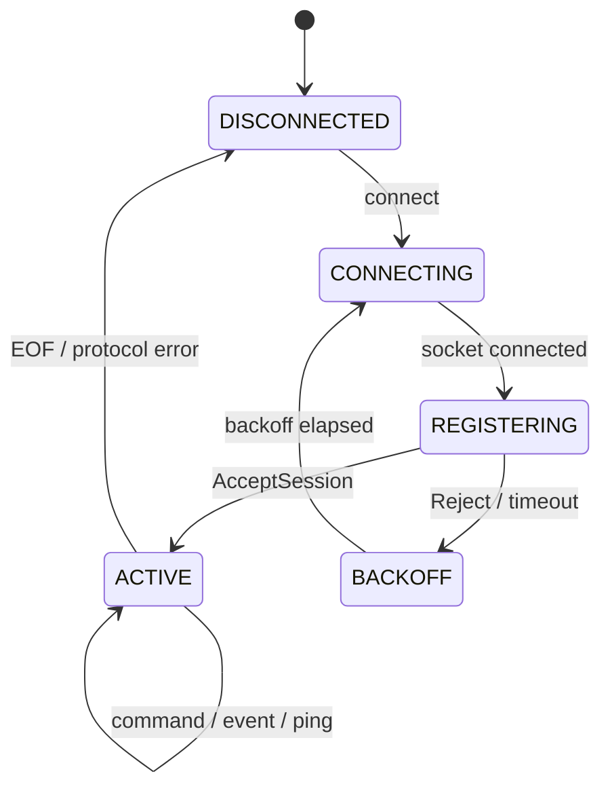

## 4.3 身份认证

### daemon 校验 Host

1. 读取 `SO_PEERCRED` 得到 PID、UID、GID；
2. 使用 `IUnitManager::resolve_unit_by_pid()` 查询 systemd unit；
3. 校验 unit 名与 `host_id` 一致；
4. 读取 `/proc/<pid>/stat` start-time；
5. 建立 pidfd；
6. 比较注册消息内 PID/start-time；
7. 检查 host unit UID/GID 与 DeploymentPlan 一致。

### Host 校验 daemon

1. 读取服务端 `SO_PEERCRED`；
2. 校验 UID 为配置的 ASDK 控制用户；
3. 通过 `/proc/<pid>/cgroup` 或 systemd 查询确认属于 `asdkd.service`；
4. 接受后记录新的 `daemon_boot_id` 和 `connection_epoch`；
5. 只接受当前 epoch 且 sequence 单调的新命令。

## 4.4 systemd unit 实现

### 采用 transient unit

`asdkd` 通过 `sd-bus` 调用 `StartTransientUnit` 创建：

```text
asdk-host-<escaped-host-id>.service
```

宿主不作为 `asdkd.service` 的子进程，而是独立 systemd unit。

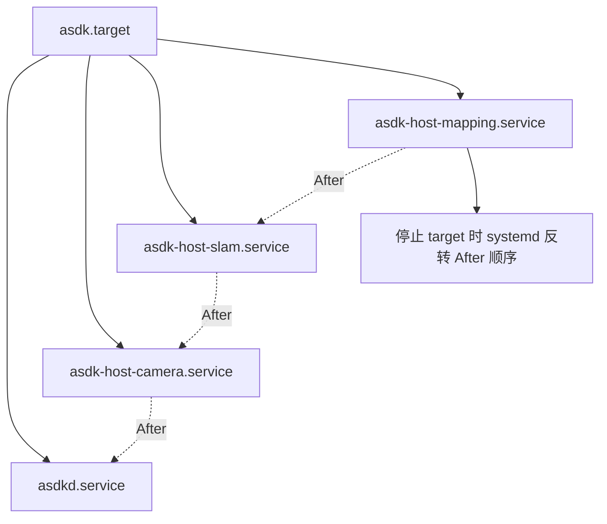

### 固定属性

```text
Description=ASDK plugin host <host-id>
PartOf=asdk.target
After=asdkd.service <dependency-host-units>
Restart=no
KillMode=control-group
Type=notify
RuntimeDirectory=asdk/hosts/<escaped-host-id>
RuntimeDirectoryMode=0750
NoNewPrivileges=yes
PrivateTmp=yes
ProtectSystem=strict
ProtectHome=yes
MemoryMax=<HostPlan>
TasksMax=<HostPlan>
LimitNOFILE=<HostPlan>
User=<HostPlan>
Group=<HostPlan>
StandardOutput=journal
StandardError=journal
```

说明：

- `PartOf=asdk.target`，但绝不设置 `PartOf=asdkd.service`；
- `After=asdkd.service` 只定义启停顺序，不产生 daemon stop 时的连带停止；
- host 之间根据依赖关系添加 `After`，以便系统停止时形成逆依赖顺序；
- `Restart=no`，避免 systemd 与 Supervisor 双重重启策略；
- `Type=notify`，宿主完成 IPC 注册并可接收操作后调用 `sd_notify(READY=1)`。

### 控制面、Portal 与恢复代理 unit

`asdkd`、Portal 后端与恢复代理均为独立 systemd service；它们不属于任一 host cgroup，也不因 host 重启而退出。

```text
# asdkd.service 与 asdk-portal.service 的共同基线
Restart=on-failure
RestartSec=2s
WatchdogSec=15s
StartLimitIntervalSec=10min
StartLimitBurst=3
Type=notify

# asdk-recoveryd.service
Restart=on-failure
RestartSec=2s
NoNewPrivileges=yes
ProtectSystem=strict
ProtectHome=yes
```

健康检查与恢复动作：

| 监视方 | 被监视方 | 探测方式 | 连续失败判定 | 恢复请求 |
|---|---|---|---|---|
| Portal Health Monitor | `asdkd` | `GET /healthz` | 5 秒一次，连续 3 次失败 | `RESTART_ASDKD` |
| asdkd Portal Health Monitor | Portal 后端 | 本地 UDS `PING/PONG` 或 loopback `/internal/healthz` | 5 秒一次，连续 3 次失败 | `RESTART_PORTAL` |

恢复请求通过 M01 的 `IRecoveryRequester` 统一发送给 `asdk-recoveryd`。其实现使用 systemd socket activation，而不是由恢复代理在启动时自行创建 socket：

```text
asdk-recovery.socket
  ListenSequentialPacket=/run/asdk/recovery.sock
  SocketUser=asdk-recovery
  SocketGroup=asdk-recovery-requesters
  SocketMode=0660
  Accept=no
  Service=asdk-recoveryd.service

asdk-recoveryd.service
  User=asdk-recovery
  SupplementaryGroups=asdk-recovery-requesters
  StateDirectory=asdk-recovery
  Type=notify
```

`asdkd.service` 与 `asdk-portal.service` 使用不同的 Linux 用户，但都加入 `asdk-recovery-requesters` 补充组。socket 由 `asdk-recovery.socket` 持有，因此恢复代理重启时 socket 不会消失；浏览器用户不属于该组，不能连接 socket。

`PeerRecoveryRequest` 只包含原因码、连续失败次数和最后成功单调时间，**不得包含调用方身份、目标 service、unit 名或 shell 命令**。恢复代理通过 `SO_PEERCRED` 与 systemd cgroup 身份同时校验调用方，并执行以下固定映射：

```text
asdk-portal.service  -> 仅可请求 RestartUnit(asdkd.service)
asdkd.service        -> 仅可请求 RestartUnit(asdk-portal.service)
其他调用方           -> 拒绝
```

- `asdk-recoveryd` 以专用 `asdk-recovery` 用户连接 systemd D-Bus。部署必须安装并通过 contract test 验证 Polkit 规则：只允许该用户以 `restart` 动词管理 `asdkd.service` 和 `asdk-portal.service`；任何其他 unit 或动词均拒绝。若目标系统无法证明该规则对 unit/动词的精确限制，则该构建不得启用自动恢复。
- 同一目标 unit 在 60 秒内最多执行一次恢复请求；被重启服务在 10 分钟内连续恢复失败 3 次时进入熔断。状态持久化于 `/var/lib/asdk-recovery/recovery-state.snapshot`，不得因恢复代理重启而清零。
- 超限或熔断时返回 `RATE_LIMITED` 或 `CIRCUIT_OPEN`，写入 journald 和指标；系统保留人工恢复入口，但不能由未认证 HTTP 请求绕过。
- `asdk-recoveryd` 只调用固定映射的 `RestartUnit`，绝不执行 shell、接受动态 unit 名，或重启 systemd manager、host unit、`asdk.target`。

### UnitManager 方法映射

| 接口 | sd-bus 动作 |
|---|---|
| `ensure_host` | 查询 unit；不存在则 `StartTransientUnit`；存在则返回当前属性 |
| `stop_host(GRACEFUL)` | 先由 daemon 发送 `DRAIN_HOST`，超时后 `StopUnit` |
| `stop_host(FORCE)` | `KillUnit(SIGKILL)`，依赖 `KillMode=control-group` |
| `query_host` | `GetUnit` + service properties |
| `resolve_unit_by_pid` | `GetUnitByPID` 并读取 MainPID、ControlGroup、ExecMainStartTimestampMonotonic |

## 4.5 FileStateStore

FileStateStore 是 asdkd 的单写者持久化实现，不使用数据库。它保存控制面的配置代际、期望状态、operation、配置事务、最近观测和恢复预算；不保存 DDS 或 SHM payload，host 的实时快照始终高于文件中的历史观测。

### 文件布局

```text
/var/lib/asdk/state/
├── config/
│   ├── active.json                 # 当前生效配置及 generation/hash
│   ├── previous.json               # 最近一次已提交配置
│   └── candidate.json              # 未完成事务的候选配置
├── control.snapshot                # desired state、最近观测、watermark
├── operations.journal              # append-only operation 状态变更
├── config-transaction.journal      # PREPARED/STOPPING/STARTING/COMMITTED/ROLLED_BACK
└── recovery.snapshot               # restart budget、quarantine、snapshot generation
```

### 文件记录与原子提交

- 所有 snapshot 文件包含 `format_version`、generation、长度和 CRC32C；
- snapshot 更新必须写入同目录临时文件，`fsync` 文件后原子 `rename`，再 `fsync` 父目录；
- journal 每条记录使用固定头部：record type、sequence、长度、CRC32C 和 payload；追加完成后必须 `fsync`，才能向 API 返回 operation 已接受；
- journal 达到容量阈值时，先写入包含相同或更高 sequence 的新 snapshot 并持久化，再截断旧 journal；
- asdkd 通过独占 `flock` 保证单写者；无法获得锁时拒绝启动；
- 任何 CRC、长度、sequence 或 format_version 异常都停止重放该记录，并进入 `RECONCILIATION_REQUIRED`，不得猜测状态。

### 恢复规则

- daemon 启动时加载 snapshot 并按 sequence 重放 journal；
- 未完成的配置事务根据 transaction journal 进入既定回滚或对账路径；
- heartbeat 不落盘；Host/Plugin observation 可限频合并进 `control.snapshot`；
- 系统 boot ID 改变后，旧 monotonic 时间只用于诊断，不参与 deadline 判断；
- 接管时，host `FULL_STATE_SNAPSHOT` 是实际运行状态权威；FileStateStore 只提供期望状态、配置版本和历史观测用于对比。

## 4.6 Linux 时钟实现

## 4.6 Linux 时钟实现

```cpp
struct ClockSnapshot {
    uint64_t monotonic_ns;
    uint64_t boottime_ns;
    uint64_t realtime_ns;
    ClockSyncState sync_state;
};
```

| 场景 | 时钟 |
|---|---|
| operation deadline | `CLOCK_MONOTONIC` |
| IPC deadline | `CLOCK_MONOTONIC` |
| TaskGroup / CallbackGate 等待 | `CLOCK_MONOTONIC` |
| 本机 SHM 延迟 | `CLOCK_MONOTONIC` |
| 系统挂起检测 | `CLOCK_BOOTTIME - CLOCK_MONOTONIC` 的变化 |
| 人类日志 | `CLOCK_REALTIME` |
| 跨设备传感器采集时刻 | 同步后的 realtime、PHC 或传感器硬件时间 |

禁止通过 `CLOCK_REALTIME - CLOCK_MONOTONIC` 的绝对值判断时钟是否同步，两者 epoch 不同。

## 4.7 M03 实现任务

- [ ] M03-01：实现 frame encoder/decoder、长度校验、CRC 和协议 fuzz test。
- [ ] M03-02：实现 `SeqpacketServer/Client`、epoll reactor、peer credential 获取。
- [ ] M03-03：实现 `SystemdUnitManager` 和 transient unit 属性映射。
- [ ] M03-04：实现 `LinuxProcessProbe`、pidfd 和 PID start-time 校验。
- [ ] M03-05：实现 `FileStateStore`、format version 演进、原子快照/journal 和崩溃一致性测试。
- [ ] M03-06：实现 `LinuxClock`、boot ID 和 suspend 检测。
- [ ] M03-07：实现 journald 结构化字段适配。
- [ ] M03-08：实现 socket-activated `asdk-recoveryd`、M01 RecoveryRequester UDS 适配、SO_PEERCRED/cgroup 身份校验、固定对端映射、持久限流/熔断和 systemd `RestartUnit` 适配。
- [ ] M03-09：实现并验证 `asdk-recovery` 专用 D-Bus/Polkit 授权、socket 权限、恢复代理重启时的 socket 连续性和状态库迁移。

## 4.8 M03 验收条件

1. IPC 可检测截断、超长、错误 CRC、旧 epoch、重复 sequence 和伪造 peer。
2. `systemctl restart asdkd` 不停止任何 host unit。
3. `systemctl stop asdk.target` 能停止所有 host unit。
4. daemon 崩溃后 FileStateStore 中已持久化的 operation 不丢失，未完成写入不产生半状态。
5. PID 复用测试中不会将新进程误认为旧宿主。
6. 是否发起恢复由 Portal/asdkd 上层健康策略决定；M03 只负责恢复请求的身份校验、目标授权、限流、熔断和 systemd 调用。
7. Portal 与 asdkd 只能分别请求其被授权的单一对端；伪造身份、携带 target/unit 字段、越权请求、重复请求和熔断期请求均被拒绝并审计。
8. `asdkd.service` 或 `asdk-portal.service` 停滞但未退出时，watchdog 或对端健康监视可使目标服务恢复，且健康 Host 不被停止。
9. `asdk-recoveryd` 重启时，socket activation 保持 `/run/asdk/recovery.sock` 可连接，限流和熔断状态从持久化状态库恢复。

---
# 5. M04：asdkd 控制循环、编排与 Supervisor

## 5.1 模块职责

M04 负责系统的期望状态、操作编排、依赖顺序、宿主接管、恢复策略和配置事务。它不直接调用 socket、sd-bus 或 文件状态存储实现，而是依赖 M01 端口。

### 代码结构

```text
src/orchestrator/
├── daemon_controller.cpp
├── control_event_loop.cpp
├── startup_coordinator.cpp
├── adoption_coordinator.cpp
├── operation_coordinator.cpp
├── dag_executor.cpp
├── host_registry.cpp
├── desired_state_store.cpp
├── config_transaction_manager.cpp
├── reconciliation_engine.cpp
├── status_snapshot_publisher.cpp
└── service_state_deriver.cpp

src/supervisor/
├── fact_collector.cpp
├── failure_classifier.cpp
├── recovery_policy.cpp
├── restart_budget.cpp
├── portal_health_monitor.cpp
└── dependency_failure_propagator.cpp
```

## 5.2 单写者控制模型

为了避免 daemon 内部出现大量互斥锁，所有状态变更只允许在 `ControlEventLoop` 线程执行。

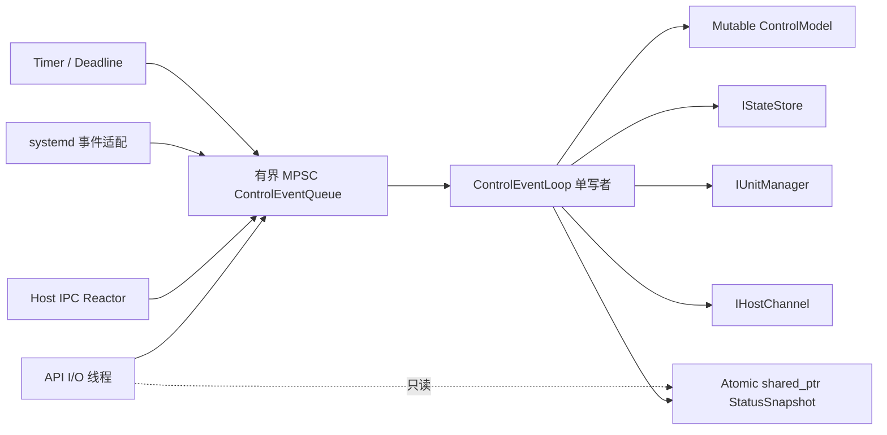

### 线程数量与职责

| 线程 | 数量 | 职责 |
|---|---:|---|
| ControlEventLoop | 1 | 唯一状态写者、操作编排、DAG 和恢复决策 |
| Host IPC Reactor | 1 | socket 收发、解码、投递事件，不修改业务状态 |
| HTTP/UDS I/O | 1～少量 | 请求解析、鉴权、读快照、投递 command |
| systemd adapter | 0 或 1 | 由 M03 实现；若 sd-bus 同步调用则不独立建线程 |
| 文件状态存储 | 0 或 1 | 首版允许由控制线程同步执行低频事务；后续可替换异步 adapter |

### 控制队列要求

- 队列必须有容量上限；
- 状态变化事件不可静默丢弃；
- heartbeat、重复资源快照允许合并；
- API 写操作队列满返回 `RESOURCE_EXHAUSTED`；
- 每类事件定义优先级：进程退出/操作结果 > API 控制 > health > heartbeat；
- ControlEventLoop 单次处理不得执行插件生命周期或长时间阻塞 I/O。

## 5.3 ControlModel

```cpp
struct ControlModel {
    DaemonBootId daemon_boot_id;
    MachineBootId machine_boot_id;
    DaemonPhase phase;

    DeploymentPlan active_plan;
    std::optional<ConfigTransaction> config_tx;

    std::unordered_map<HostId, HostControlState> hosts;
    std::unordered_map<PluginId, PluginControlState> plugins;
    std::unordered_map<OperationId, OperationRecord> operations;
    std::unordered_map<RequestId, OperationId> request_index;

    RestartBudgetTable restart_budgets;
    uint64_t snapshot_generation;
};
```

`DaemonPhase`：

```text
BOOTSTRAP
VALIDATING
ADOPTING
STARTING
SERVING
UPDATING_CONFIG
SHUTTING_DOWN
FAILED
```

`/readyz` 只有在 `SERVING` 时返回成功。`ADOPTING` 和 `STARTING` 均表示 daemon 存活但尚未具备完整控制能力。

## 5.4 daemon 启动与宿主接管

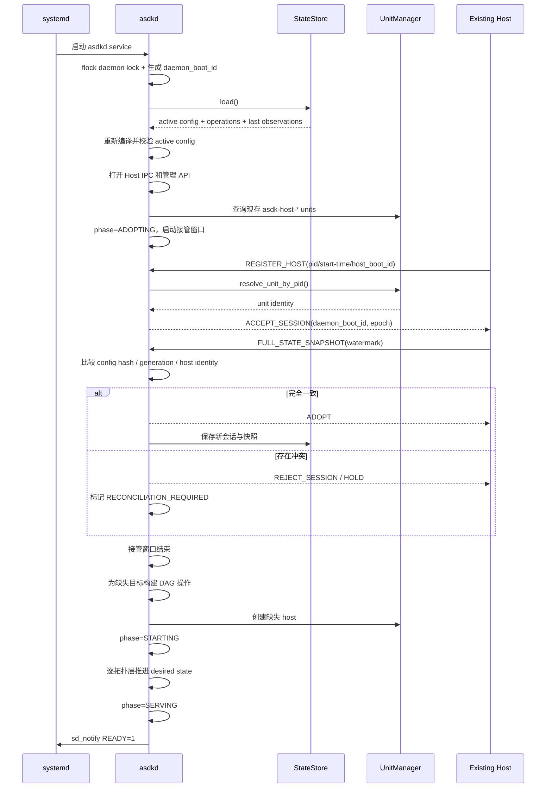

### 接管规则

| 条件 | 动作 |
|---|---|
| `host_id`、unit、PID/start-time、host boot ID 均合法，配置一致 | Adopt，保留现有 Runtime |
| Host 配置代际低于 active plan | 标记 `CONFIG_STALE`，默认不自动修改；由显式 reconcile 策略处理 |
| Host 配置代际高于 active plan | 视为未完成配置事务，进入事务恢复流程 |
| 同一 host ID 出现两个存活 host boot ID | 标记冲突，禁止自动选择，拒绝新的生命周期操作 |
| StateStore 有 RUNNING 记录但宿主不存在 | 以实际事实为准，创建恢复 operation |
| 宿主存在但 StateStore 无记录 | 验证身份后标记 orphan；默认隔离并要求显式 adopt 或 stop |
| snapshot 期间有新事件 | Host 以 watermark 为边界补发，daemon 先应用 snapshot 再应用后续事件 |

## 5.5 外部 operation 模型

### operation 状态

```text
PENDING
DISPATCHED
ACCEPTED
RUNNING
SUCCEEDED
FAILED
CANCELLED
INTERRUPTED
```

### 请求处理流程

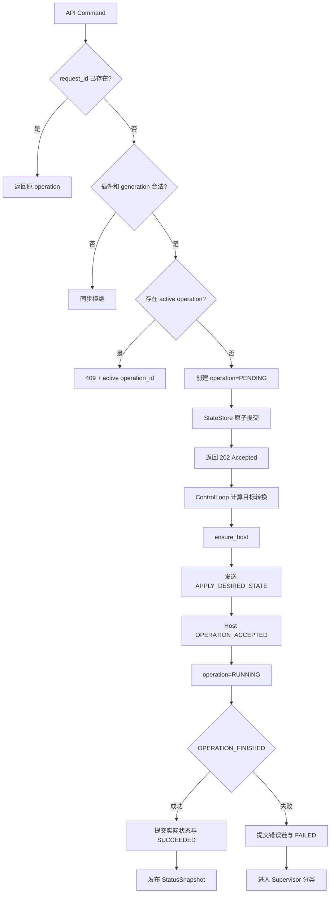

### `APPLY_DESIRED_STATE` 内容

```cpp
struct ApplyDesiredStateCommand {
    RequestId request_id;
    OperationId operation_id;
    PluginId plugin_id;
    DesiredState target_state;

    uint64_t expected_state_generation;
    uint64_t config_generation;
    Hash256 config_hash;
    uint64_t deadline_monotonic_ns;

    std::optional<PluginPlanPayload> plan_if_not_configured;
};
```

### 幂等规则

- 相同 `request_id` 永远返回同一 operation；
- 已处于目标状态时返回成功，但仍生成可追踪 operation；
- Host 已完成但 daemon 未收到结果时，重连快照中根据 operation ID 恢复完成状态；
- 旧 `expected_state_generation` 返回 `STALE_GENERATION`；
- daemon 重启不复用旧 `daemon_boot_id`，但 operation ID 保持不变；
- 不允许 daemon 发送 `dlopen`、`initialize`、`start` 等细粒度 IPC 命令。

## 5.6 DAG 执行器

### 执行策略

- 插件依赖由 `DeploymentPlan.startup_layers` 提供；
- 层与层之间串行；
- 同一层最多并行 `max_parallel_start` 个 operation；
- required dependency 未达到 `RUNNING + HEALTHY/DEGRADED` 时，不启动依赖者；
- optional dependency 失败不阻止启动，但依赖者初始 health 可标记 `DEGRADED`；
- 停止使用 `shutdown_layers`，同层仍可有界并行；
- thread group 内由 Host 按组内插件 DAG 执行，daemon 仍跟踪每个插件状态。

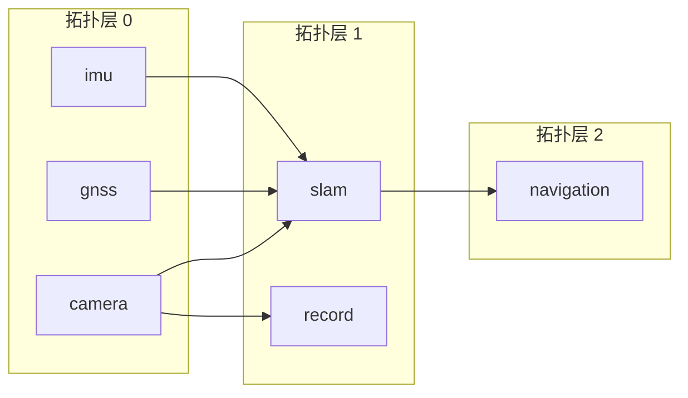

### 层失败行为

| 场景 | 行为 |
|---|---|
| 非关键插件失败 | 该分支按依赖策略停止，其他无关分支继续，服务状态 `DEGRADED` |
| 关键插件失败且不可恢复 | 依赖分支停止，服务状态 `FAILED`；不自动停止无关关键分支，除非系统策略指定 |
| 同层多个失败 | 分别记录 operation 和错误，不以第一个错误覆盖其他错误 |
| 启动超时 | 请求 Host 停止；无法安全停止则终止相应 host unit |
| thread group 中一个 Runtime 失败 | 整组进入恢复；其他 host 不受影响 |

## 5.7 Supervisor 的事实、分类和动作分离

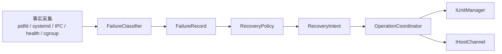

### FailureClassifier 输入事实

```text
HOST_PROCESS_EXITED
HOST_UNIT_FAILED
HOST_IPC_DISCONNECTED
PLUGIN_HEALTH_DEGRADED
PLUGIN_HEALTH_FAILED
OPERATION_TIMEOUT
TASK_EXITED_UNEXPECTEDLY
CALLBACK_DRAIN_TIMEOUT
CGROUP_OOM
RESOURCE_BUDGET_EXCEEDED
DDS_ENDPOINT_FAILED
SHM_PROTOCOL_ERROR
```

### 关键分类规则

1. `HOST_IPC_DISCONNECTED` 单独出现时只标记 `CONTROL_DISCONNECTED`，不判定 host 死亡。
2. pidfd readable、systemd inactive/failed 或 wait status 才能确认 host 退出。
3. `DEGRADED` 默认告警，不自动重启。
4. process 模式的最小恢复边界为独占 host。
5. thread 模式的最小恢复边界为整个 host group。
6. 不允许尝试强杀某个 C++ 线程。
7. cgroup OOM 直接视为 host 不安全，执行宿主级恢复。
8. FD/线程增长只有持续多个审计周期并超过绝对预算时才触发恢复。

### RecoveryIntent

```cpp
struct RecoveryIntent {
    RecoveryAction action; // NONE, RESTART_HOST, STOP_BRANCH, QUARANTINE_HOST
    HostId host_id;
    std::optional<PluginId> root_plugin_id;
    FailureRecord failure;
    uint32_t attempt;
    uint64_t not_before_monotonic_ns;
};
```

### 重启预算

- 按 host ID 维护滑动窗口；
- 达到 `max_attempts` 后进入 quarantine；
- daemon 重启后预算从 StateStore 恢复；
- 手工 `asdkctl host recover` 可清除 quarantine，但必须记录审计日志；
- 配置更新导致的计划性重启不消耗故障预算。

## 5.8 配置更新事务

配置更新不在 Runtime 内原位修改配置，而是执行全量事务。

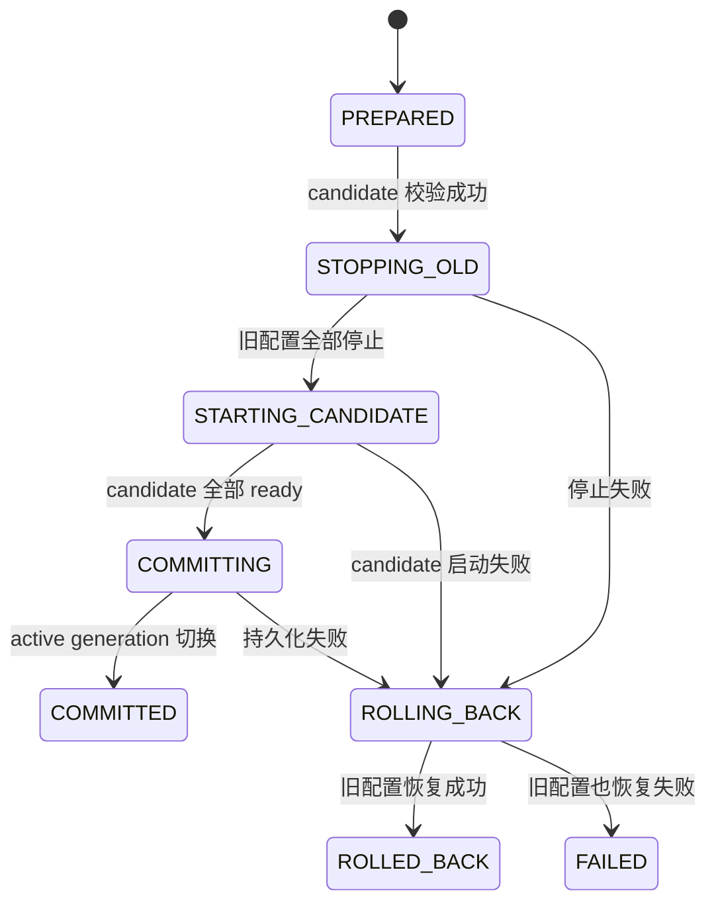

### 事务步骤

1. 编译 candidate plan，无运行时副作用；
2. 写入 `config_versions(status=CANDIDATE)` 和 `config_transactions(PREPARED)`；
3. 设置 daemon phase 为 `UPDATING_CONFIG`，拒绝新的插件级控制 operation；
4. 按旧计划逆 DAG 停止全部插件；
5. 将事务 phase 提交为 `STARTING_CANDIDATE`；
6. 按 candidate plan 创建/重配 host 并启动；
7. 全部目标达到 ready 后，原子将 candidate 标记为 `ACTIVE`、旧版本标记为 `PREVIOUS`；
8. 若任一步失败，停止 candidate 已启动部分，使用最后 COMMITTED plan 恢复；
9. 事务结束后恢复 `SERVING`。

### daemon 在事务中崩溃

新 daemon 读取未完成事务后采用确定策略：

```text
未看到 candidate 全部 COMMITTED
→ 进入 ADOPTING
→ 获取全部宿主真实快照
→ 停止使用 candidate_generation 的 Runtime
→ 恢复最后 COMMITTED generation
→ 将事务标记 ROLLED_BACK 或 FAILED
```

不根据旧持久化文件猜测 candidate 是否已经成功。

## 5.9 服务状态推导

```text
STARTING：至少一个目标插件正在启动，且无关键不可恢复失败
RUNNING：所有 critical 目标插件 HEALTHY，非关键目标无失败
DEGRADED：critical 可运行，但存在非关键失败、optional 依赖缺失或性能降级
FAILED：critical 插件不可恢复、配置回滚失败或状态冲突无法自动处理
STOPPED：所有 desired state 非 RUNNING
ADOPTING：daemon 正在接管，API 只读可用、写操作受限
```

服务状态为纯推导结果，不单独作为覆盖插件真实状态的总开关。

## 5.10 M04 实现任务

- [ ] M04-01：实现有界 ControlEventQueue 和单写者 ControlModel。
- [ ] M04-02：实现 StatusSnapshot 原子发布和只读查询。
- [ ] M04-03：实现 daemon 启动、接管窗口和 HostRegistry。
- [ ] M04-04：实现 operation 幂等、generation、持久化和完成恢复。
- [ ] M04-05：实现 DAG 层并行执行器和依赖失败传播。
- [ ] M04-06：实现 FailureClassifier、RecoveryPolicy 和 RestartBudget。
- [ ] M04-07：实现配置事务、回滚和崩溃恢复。
- [ ] M04-08：实现系统 shutdown 的逆 DAG 控制。
- [ ] M04-09：实现 asdkd Portal Health Monitor，并通过 M01 `IRecoveryRequester` 请求对端恢复。

## 5.11 M04 验收条件

1. 使用 `FakeUnitManager + FakeHostChannel + InMemoryStateStore` 可完整运行启动、停止、恢复和配置事务测试。
2. `kill -9 asdkd` 后，Fake Host 保持运行；新 daemon 能通过 snapshot adopt。
3. 同一 request ID 不重复执行；旧 generation 不覆盖新状态。
4. 单插件失败只传播到其依赖分支。
5. 配置 candidate 启动失败后可恢复最后 committed 配置。
6. 控制事件高压下无状态数据竞争，TSan 通过。
7. API 查询不需要获取 ControlModel 写锁。

---

# 6. M05：宿主进程框架

## 6.1 统一宿主二进制

ASDK 3.0 只提供一个宿主程序：

```text
/opt/asdk/v3/bin/asdk-plugin-host
```

启动参数：

```text
--host-id <id>
--mode process|thread
--control-socket /run/asdk/host-control.sock
--runtime-dir /run/asdk/hosts/<id>
--protocol-major 3
```

插件路径、私有配置和 channel 不通过命令行或环境变量传递，由 daemon 在认证会话中发送 `CONFIGURE_HOST`。

## 6.2 宿主内部组件

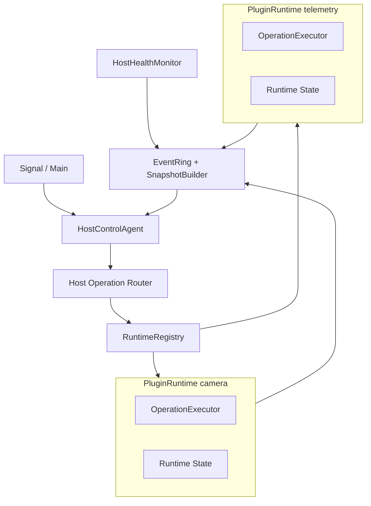

### 类划分

```text
HostApplication
├── HostIdentity
├── HostControlAgent
├── HostPlanHolder
├── RuntimeRegistry
├── HostOperationRouter
├── HostEventJournal
├── HostSnapshotBuilder
├── HostHealthMonitor
└── SignalCoordinator
```

## 6.3 宿主线程模型

| 线程 | process 模式 | thread 模式 | 说明 |
|---|---:|---:|---|
| Main/Signal | 1 | 1 | 初始化、signal、退出协调 |
| IPC/Reconnect | 1 | 1 | epoll、认证、命令收发、事件补发 |
| Runtime Operation Worker | 1 | 每 Runtime 1 | 生命周期操作串行执行 |
| Host Health Scheduler | 1 | 1 | 低频 health、资源事实采样 |
| Runtime Callback Executor | Runtime 配置 | 每 Runtime 独立 | M06/M07 管理 |
| Plugin TaskGroup | Runtime 配置 | 每 Runtime 独立 | 插件业务任务 |
| Fast DDS internal | Fast DDS 管理 | Fast DDS 管理 | 不直接执行长业务逻辑 |

process 模式下 `RuntimeRegistry.size()` 必须始终为 0 或 1。thread 模式允许多个 Runtime，但每个 Runtime 独立操作队列、DdsSession、TaskGroup 和 CallbackGate。

## 6.4 Host 启动流程

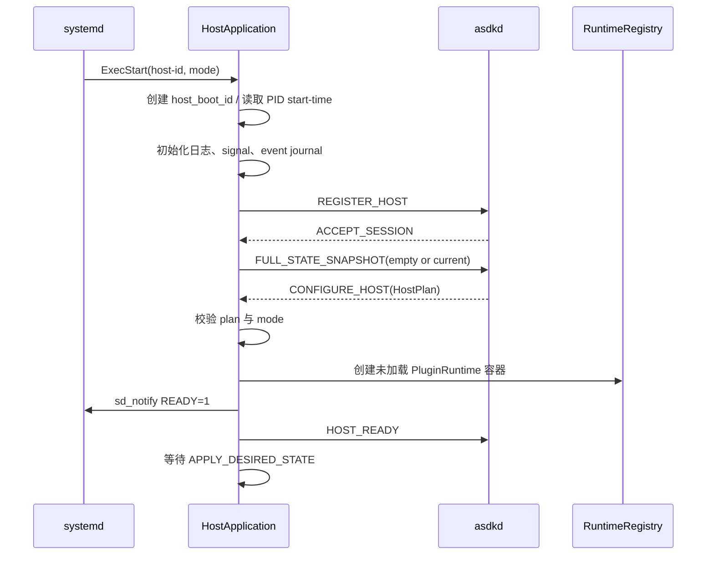

若 daemon 不可用，刚创建且从未收到 HostPlan 的宿主不得自行加载插件；它只重连或在启动超时后退出。已经配置并运行的宿主在 daemon 断开后继续运行。

## 6.5 HostControlAgent

### 职责

- 建立和重建 daemon session；
- 校验 daemon peer；
- 维护 sequence、ack、connection epoch；
- 将控制命令投递给 HostOperationRouter；
- 发送 operation/health/resource 事件；
- 维护 bounded EventRing；
- 重连后先发 snapshot，再补发 watermark 后事件。

### EventRing

```cpp
struct HostEventRecord {
    uint64_t sequence;
    HostEventType type;
    std::vector<std::byte> encoded_payload;
    uint64_t monotonic_ns;
};
```

要求：

- 默认同时限制事件条数和总字节数；
- operation finished、health failed、host fatal 不得被低优先级事件挤出；
- resource snapshot 和 heartbeat 可只保留最新一条；
- 若关键历史被覆盖，snapshot 设置 `history_lost=true`；
- daemon 看到 `history_lost` 后必须以完整快照为准，不得依赖增量事件恢复。

## 6.6 HostOperationRouter

```cpp
class HostOperationRouter {
public:
    Result<void> submit(const ApplyDesiredStateCommand& command);
    RuntimeSnapshot snapshot(const PluginId&) const;
    Result<void> drain_all(uint64_t deadline_ns);
};
```

路由规则：

1. 校验 session epoch、host ID、plugin ID、config generation；
2. process 模式拒绝非唯一 plugin ID；
3. 将命令投递到对应 Runtime 的单消费者 operation queue；
4. 队列接受后立即发送 `OPERATION_ACCEPTED`；
5. Runtime 每个阶段发送 `OPERATION_PROGRESS`；
6. 完成后将状态和错误链写入 HostEventJournal；
7. 相同 operation ID 直接返回缓存结果，不重复执行。

## 6.7 daemon 断开期间行为

```text
daemon socket 断开
→ HostControlAgent 标记 CONTROL_DISCONNECTED
→ 不停止 Runtime / DDS / SHM
→ 已接受 operation 继续执行到完成或失败
→ 完成事件写入 EventRing
→ 拒绝来源不明的新 operation
→ HostHealthMonitor 继续本地工作
→ 周期性重连
→ 新 session 建立后发送完整 snapshot + watermark 后事件
```

宿主不得在 daemon 离线时反复自行重启插件。若出现段错误、OOM、无法安全停止等宿主级故障，由进程直接退出，等待新 daemon 根据 systemd 事实执行恢复。

## 6.8 SIGTERM 与系统关机

宿主收到 SIGTERM 时不依赖 daemon：

1. 停止接受新 operation；
2. 根据已缓存 HostPlan，按组内逆 DAG 停止 Runtime；
3. 每个 Runtime 执行 `RUNNING → STOPPED → LOADED → UNLOADED`；
4. flush 关键事件到 journald；
5. 在 `TimeoutStopSec` 内退出；
6. 超时由 systemd 根据 `KillMode=control-group` 强制终止。

这样即使系统关机时 daemon 已不可用，宿主仍能完成本地资源清理。

## 6.9 thread 模式准入实现

thread 模式不是只靠配置字符串启用。配置编译和 Host 启动都必须校验：

- Manifest 声明 `THREAD_MODE_SAFE`；
- 插件不安装 signal handler、不调用 fork、不修改 cwd/umask/locale/environment；
- 长期任务全部通过 Task API；
- 外部 FD 和 vendor handle 全部登记；
- 组内插件使用相同 UID/GID 和安全属性；
- 组内可用性等级兼容；
- 任一 Runtime 不可安全停止时，允许重启整组。

首个垂直切片只实现 process 模式。thread 模式复用相同 RuntimeRegistry 和协议，在 process 模式验收后开放。

## 6.10 M05 实现任务

- [ ] M05-01：实现 HostApplication 启动、identity、sd_notify 和 signal。
- [ ] M05-02：实现 HostControlAgent、重连、sequence/ack 和 EventRing。
- [ ] M05-03：实现 HostPlanHolder 和配置代际校验。
- [ ] M05-04：实现 RuntimeRegistry 和 per-Runtime operation queue。
- [ ] M05-05：实现 snapshot、event watermark 和 history lost。
- [ ] M05-06：实现 daemon 离线继续运行与重连接管。
- [ ] M05-07：实现 SIGTERM 本地逆序清理。
- [ ] M05-08：在 process 模式稳定后实现 thread group。

## 6.11 M05 验收条件

1. 使用 `FakeRuntime` 可独立验证注册、命令路由、重连和事件补发。
2. 断开 daemon socket 后 Runtime 不被停止。
3. operation 完成发生在断线期间时，新 daemon 能从 snapshot/result cache 恢复结果。
4. process 模式拒绝第二个 Runtime。
5. 旧 session、旧 epoch、旧 config generation 命令均被拒绝。
6. SIGTERM 能在 daemon 不存在时完成 Runtime 本地停止。
7. EventRing 溢出时不会丢失“存在历史缺口”这一事实。

---
# 7. M06：PluginRuntime 与受控资源代理

## 7.1 Runtime 所有权边界

一个 `PluginRuntime` 管理且只管理一个插件实例。所有能跨越生命周期函数返回点的资源，必须属于 Runtime 或登记到 Runtime。

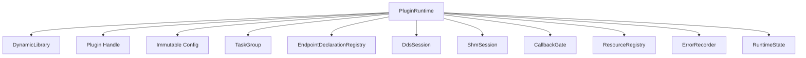

### Runtime 不负责

- 不读取全局配置文件；
- 不创建 systemd unit；
- 不连接 HTTP；
- 不写 文件状态存储；
- 不决定是否重启宿主；
- 不感知 Portal 或 asdkctl；
- 不直接持有 daemon 连接。

## 7.2 类结构

```text
PluginRuntime
├── RuntimeOperationExecutor
├── DynamicLibraryHolder
├── AbiDescriptorValidator
├── PluginHandleHolder
├── ImmutableConfigHolder
├── TaskGroup
├── EndpointDeclarationRegistry
├── DdsSession (ITransportSession)
├── ShmSession (IShmSession)
├── CallbackGate
├── ResourceRegistry
├── ErrorRecorder
└── RuntimeStateStore
```

### 核心接口

```cpp
class PluginRuntime {
public:
    explicit PluginRuntime(RuntimeDependencies deps, PluginPlan plan);

    OperationResult apply_desired_state(
        const ApplyDesiredStateCommand& command);

    PluginActualState snapshot() const;
    ResourceSnapshot resource_snapshot() const;
    Result<HealthState> poll_health(uint64_t deadline_ns);
};
```

`apply_desired_state()` 只能由 Runtime 自己的 operation worker 调用，不允许并发进入。

## 7.3 生命周期实现语义

### 生命周期与资源域

| lifecycle | 必须存在 | 不得存在 |
|---|---|---|
| `UNLOADED` | Runtime 容器、PluginPlan | `.so`、descriptor、handle、插件资源 |
| `LOADED` | `.so`、descriptor、handle、LOAD_SCOPE | 初始化资源、运行任务、物理端点 |
| `INITIALIZED` | LOADED 内容、配置快照、逻辑端点声明、INIT_SCOPE | 运行任务、启用回调、物理端点 |
| `RUNNING` | INITIALIZED 内容、RUN_SCOPE、物理端点、任务、开放回调 | 无 |
| `STOPPED` | INITIALIZED 内容、可重启逻辑声明 | 运行任务、物理端点、在途回调、active SHM acquire |

### 目标状态规划

```cpp
Result<std::vector<LifecycleStep>> plan_transition(
    LifecycleState actual,
    DesiredState desired);
```

| actual | desired | steps |
|---|---|---|
| UNLOADED | RUNNING | LOAD → INITIALIZE → START |
| LOADED | RUNNING | INITIALIZE → START |
| INITIALIZED | RUNNING | START |
| STOPPED | RUNNING | START |
| RUNNING | STOPPED | STOP |
| INITIALIZED | STOPPED | 保持 INITIALIZED 或按策略转 STOPPED；首版保持 INITIALIZED |
| UNLOADED | STOPPED | LOAD → INITIALIZE，不自动 start |
| 任意 | ABSENT | STOP（若需）→ DEINITIALIZE → UNLOAD |
| 已达到目标 | 同目标 | 幂等成功 |

为避免 `STOPPED` 和 `INITIALIZED` 语义混乱，外部 desired state 只表达业务目标；Host 返回的实际 lifecycle 保持精确。

## 7.4 完整启动时序

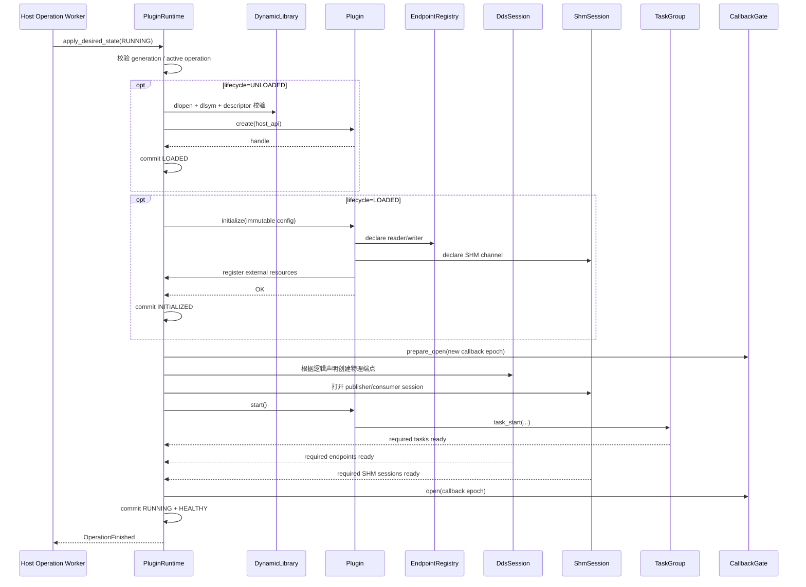

### ready 条件

插件 `start()` 返回 `OK` 不代表启动完成。Runtime 只有在以下全部满足后才提交 `RUNNING`：

- `start()` 已返回成功；
- 所有 `required=true` 的 Task 已调用 `report_ready()`；
- 所有 required DDS writer/reader 已创建；
- 配置要求等待匹配的端点已达到匹配数量；
- required SHM publisher/consumer session 已建立；
- CallbackGate 已成功打开；
- operation deadline 尚未到达。

## 7.5 完整停止与卸载时序

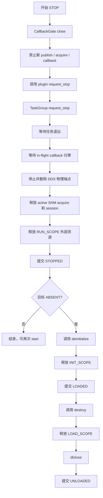

### 不可安全停止的处理

以下任一情况返回 `UNSAFE_TO_UNLOAD`，Host 必须终止整个宿主边界：

- plugin 生命周期函数本身阻塞超过 deadline；
- TaskGroup 存在无法 join 的长期线程；
- CallbackGate 无法排空；
- DDS listener 仍能进入旧 callback epoch；
- ResourceRegistry cleanup 失败且可能继续访问插件代码；
- `deinitialize()` 或 `destroy()` 发生异常；
- 发现未登记的活动线程或 FD 无法归属。

Runtime 不使用 `pthread_cancel`，不尝试从外部强杀单个业务线程，也不在不安全状态下执行 `dlclose`。

## 7.6 TaskGroup

### C ABI 任务函数

```c
typedef void (*asdk_task_fn_v3)(
    asdk_task_context_v3* context,
    void* user_data);
```

### C++ 实现接口

```cpp
class TaskGroup {
public:
    Result<TaskId> start(TaskOptions options,
                         AsdkTaskFunction function,
                         void* user_data);

    void request_stop();
    Result<void> wait_required_ready(uint64_t deadline_ns);
    Result<void> wait_all(uint64_t deadline_ns);
    std::vector<TaskStatus> snapshot() const;
};
```

### TaskContext

```cpp
class TaskContext {
public:
    bool should_stop() const noexcept;
    void report_ready();
    void report_degraded(ErrorInfo);
    void report_error(ErrorInfo);
};
```

### TaskOptions

```cpp
struct TaskOptions {
    std::string name;
    bool required_ready;
    uint32_t ready_timeout_ms;
    std::optional<std::vector<uint32_t>> cpu_affinity;
    SchedulingClass scheduling_class;
    int scheduling_priority;
};
```

### 实现规则

- 禁止 detached 线程；
- 任务入口捕获所有异常；
- `report_ready()` 只允许一次；
- required task 未 ready 前意外退出，启动失败；
- RUNNING 后 required task 意外退出，health 转为 FAILED；
- `request_stop()` 幂等；
- `wait_all()` 先复制待 join 线程句柄，再释放注册表锁后 join；
- Runtime 析构前所有任务必须 join；
- Task ID 在单 Runtime 内不复用，避免旧诊断记录混淆。

## 7.7 CallbackGate

```cpp
class CallbackGate {
public:
    Result<void> prepare_open(uint64_t next_epoch);
    Result<CallbackGuard> try_enter(uint64_t callback_epoch);
    void open(uint64_t callback_epoch);
    void close();
    Result<void> wait_drained(uint64_t deadline_ns);
    uint32_t in_flight() const;
};
```

### 状态机

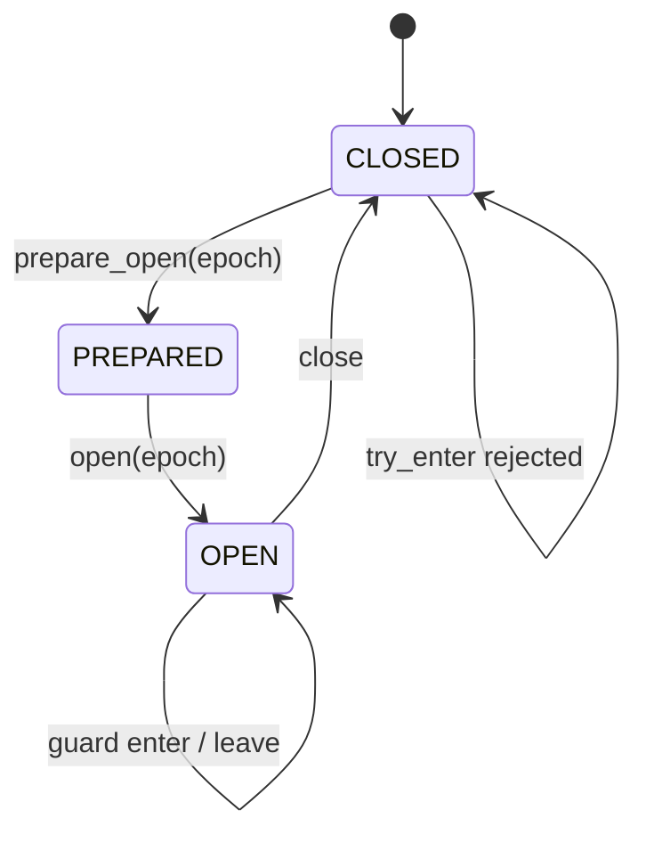

约束：

- `close()` 与 `try_enter()` 使用同一原子状态协议；
- guard 创建成功后递增 in-flight，析构递减；
- callback 携带创建端点时的 epoch，旧 epoch 一律拒绝；
- `prepare_open()` 只允许在 CLOSED 且 in-flight=0 时执行；
- 插件回调不持有 Runtime 生命周期锁。

## 7.8 EndpointDeclarationRegistry

插件在 `initialize()` 中只声明逻辑端点：

```cpp
struct EndpointDeclaration {
    ChannelId channel_id;
    Direction direction;
    bool required;
    CallbackMode callback_mode;
    uint32_t queue_capacity;
    SerializedDataCallback callback;
    void* callback_context;
};
```

规则：

- 相同 channel 重复声明且参数完全一致时幂等成功；
- 参数不一致返回 `ALREADY_EXISTS`；
- initialize 结束后 Registry 冻结；
- start 时 DdsSession 根据 Registry 创建物理端点；
- stop 时销毁物理端点，但保留逻辑声明；
- deinitialize 时清空逻辑声明；
- 这样 `STOPPED → RUNNING` 不需要重新调用 `initialize()`。

## 7.9 ResourceRegistry

### 资源域

```text
LOAD_SCOPE
INIT_SCOPE
RUN_SCOPE
```

### 支持资源

```text
FILE_DESCRIPTOR
MMAP_REGION
TIMER_FD
EVENT_FD
VENDOR_HANDLE
DEVICE_SESSION
CUSTOM_CLEANUP
```

```cpp
struct ResourceRecord {
    ResourceId id;
    ResourceKind kind;
    ResourceScope scope;
    uint64_t creation_sequence;
    uint64_t native_handle;
    CleanupFunction cleanup;
    void* cleanup_context;
    ResourceState state;
};
```

### 外部资源登记 API

```c
asdk_status_code asdk_resource_adopt_v3(
    asdk_resource_kind kind,
    uint64_t native_handle,
    asdk_resource_scope scope,
    asdk_resource_cleanup_fn cleanup,
    void* cleanup_context,
    asdk_resource_id* out_id);
```

这允许 Camera、LiDAR、串口等插件使用第三方 SDK，但要求它们把长期 handle 和清理函数交给 Runtime 登记。Runtime 按 scope 和 creation sequence 的逆序清理。

### 审计规则

- Runtime 记录注册资源数；
- Host 同时扫描 `/proc/<pid>/fd` 和 `/proc/<pid>/task`；
- 注册表只能解释“已知资源”，不能假定未登记资源不存在；
- 超过绝对预算立即告警；
- 连续多个周期增长且无法由 operation 解释时标记泄漏嫌疑；
- 是否重启由 Supervisor 决定，不由 ResourceRegistry 自行执行。

## 7.10 Health 检查

`descriptor->health()` 在 HostHealthMonitor 触发，但必须经过 Runtime 串行保护，不能与 initialize/start/stop/deinitialize 并发。

```text
IDLE + RUNNING
→ 提交 health probe
→ 限时调用 descriptor->health
→ HEALTHY / DEGRADED / FAILED
→ 状态变化才产生事件
```

若 `health()` 本身阻塞，视为插件不可安全控制，终止独占 host 或整个 thread group。

## 7.11 M06 实现任务

- [ ] M06-01：实现 DynamicLibraryHolder、路径二次校验和 descriptor validator。
- [ ] M06-02：实现 Runtime 三维状态和 transition planner。
- [ ] M06-03：实现 operation worker、deadline 和阶段进度事件。
- [ ] M06-04：实现 TaskGroup、ready、stop、join 和异常边界。
- [ ] M06-05：实现 CallbackGate epoch 和 drain。
- [ ] M06-06：实现 EndpointDeclarationRegistry 和 start/stop 重建。
- [ ] M06-07：实现 ResourceRegistry、scope 逆序清理和审计快照。
- [ ] M06-08：实现 DDS/SHM Fake 注入和 Runtime 单元测试。
- [ ] M06-09：实现不安全清理时的 `UNSAFE_TO_UNLOAD` 上报。

## 7.12 M06 验收条件

1. 示例插件可完整执行 `load → initialize → start → stop → start → stop → deinitialize → unload`。
2. 每一步失败均保持真实 lifecycle，并按逆序释放已创建资源。
3. start 返回成功但 required task 未 ready 时，operation 最终失败。
4. stop 后无插件任务、物理 DDS 端点、active SHM acquire 或在途回调。
5. 任务不退出或 callback 不排空时不执行危险 `dlclose`。
6. ASan、UBSan、LSan 通过；TaskGroup/CallbackGate 的 TSan 专项通过。
7. Runtime 测试不需要真实 Fast DDS 或共享内存实现。

---
# 8. M07：Fast DDS 数据适配

## 8.1 模块目标

M07 将 Runtime 的中间件无关 `ITransportSession` 映射到 Fast DDS 3.6.x。它不认识 daemon、operation、StateStore 或 Portal。

### 代码结构

```text
src/transport_fastdds/
├── fastdds_session_factory.cpp
├── fastdds_session.cpp
├── participant_registry.cpp
├── type_support_catalog.cpp
├── serialized_cdr_type.cpp
├── topic_registry.cpp
├── writer_impl.cpp
├── reader_impl.cpp
├── reader_queue.cpp
├── callback_executor.cpp
├── qos_resolver.cpp
├── discovery_listener.cpp
└── endpoint_metrics.cpp
```

## 8.2 每 Runtime 独立 DdsSession

```cpp
class FastDdsSession final : public ITransportSession {
public:
    Result<WriterHandle> declare_writer(const ChannelDescriptor&) override;
    Result<ReaderHandle> declare_reader(
        const ChannelDescriptor&, SerializedDataCallback) override;
    Result<void> start() override;
    Result<void> stop(uint64_t deadline_ns) override;
    Result<void> publish(
        WriterHandle, ByteView, const SampleMetadata&) override;
};
```

每个 Runtime：

- 拥有独立 `FastDdsSession`；
- 每个 domain ID 最多创建一个独立 Participant；
- 不与其他 Runtime 共享 Reader、Writer、Listener 或回调队列；
- endpoint handle 只在该 Runtime 内有效；
- stop 后全部物理 endpoint 被删除，逻辑声明仍由 M06 保留；
- deinitialize 后 DdsSession 对象可销毁。

## 8.3 消息类型包

插件 ABI 和公共 SDK 不暴露 Fast DDS 类型。每组 IDL 生成一个消息类型包：

```text
interfaces/idl/camera.idl
        │
        ├── generated/message-codec/camera_types.hpp
        ├── generated/message-codec/camera_codec_v1.h
        ├── libasdk_codec_camera.so.1
        ├── libasdk_typesupport_camera.so.1
        └── camera.type-manifest.json
```

### 插件侧

- 插件只包含生成的数据结构和 `asdk::Writer<T>/Reader<T>`；
- `Writer<T>` 调用 codec C ABI，把业务对象编码为 CDR 字节；
- `Reader<T>` 把 Runtime 提供的 CDR 字节解码为业务对象；
- 插件不包含 `DataWriter`、`DataReader`、`DomainParticipant` 等 Fast DDS 类型。

### Host 侧

- 根据 `type_name + schema_hash` 从 `TypeSupportCatalog` 加载受信任 type-support 包；
- type-support 包提供 type name、schema hash、TypeObject 元数据、key 提取和最大序列化长度；
- `SerializedCdrTopicDataType` 将已经编码的 CDR 字节写入 Fast DDS payload；
- 接收端只输出 CDR 字节，不在 Host 中构造插件业务 C++ 对象。

### 类型描述 ABI

```c
typedef struct asdk_message_type_descriptor_v1 {
    uint32_t struct_size;
    uint32_t abi_version;
    asdk_string_view type_name;
    asdk_hash256 schema_hash;
    uint32_t max_serialized_size;
    uint8_t is_keyed;

    asdk_bytes_view serialized_type_object;
    asdk_status_code (*extract_key_from_cdr)(
        asdk_bytes_view cdr,
        asdk_mut_bytes_view key_buffer,
        uint32_t* key_size);
} asdk_message_type_descriptor_v1;
```

### 必须先完成的技术验证

在冻结消息类型包 ABI 前，必须用 Fast DDS 3.6.x 验证：

```text
普通 Fast DDS-Gen 生成端
↔ SerializedCdrTopicDataType 端
```

验证项：

1. XTypes / TypeObject 匹配；
2. keyed 与 non-keyed 类型；
3. XCDR1/XCDR2 表示；
4. reliable / best-effort；
5. 跨进程和跨机互通；
6. schema hash 不一致时拒绝创建端点。

若目标版本无法稳定注册自定义 TypeObject，则采用备选实现：Host 动态加载同工具链生成的 typed adapter，由 adapter 内部完成 CDR 与 generated type 的转换。该备选只影响 M07 内部，不改变插件 ABI、Runtime 接口和配置格式。

## 8.4 端点键与去重

```cpp
struct EndpointKey {
    uint32_t domain_id;
    std::string topic_name;
    std::string type_name;
    Hash256 type_schema_hash;
    Direction direction;
    Hash256 qos_profile_hash;
    PayloadMode payload_mode;
};
```

- 同一 Runtime 内 EndpointKey 完全相同才允许复用；
- 任一字段不同都创建独立端点；
- Topic Registry 只在当前 Runtime 内共享；
- Participant 不跨 Runtime 共享；
- payload mode 为 SHM 时，DDS 类型必须是对应的 `LargeDataHeader` 类型。

## 8.5 Reader 回调模型

Fast DDS listener 默认不直接进入插件。


### ReaderQueue 策略

```text
DROP_OLDEST
DROP_NEWEST
FAIL_READER
```

- `sensor_best_effort` 默认 `DROP_OLDEST`；
- 可靠控制类通道默认 `FAIL_READER`，不能在 listener 中无限阻塞；
- queue capacity 在配置中固定；
- overflow 必须计数并生成 health 事件；
- callback executor 属于 Runtime，不属于 Fast DDS；
- `DIRECT` 模式仅用于经过审核的极短回调，并仍须经过 CallbackGate。

## 8.6 Writer 发布模型

```mermaid
sequenceDiagram
    participant P as Plugin
    participant SDK as Writer<T>
    participant C as Codec
    participant R as Runtime Host API
    participant D as DdsSession
    participant F as Fast DDS

    P->>SDK: write(message)
    SDK->>C: encode CDR
    C-->>SDK: bytes + representation
    SDK->>R: dds_publish(writer_handle, bytes, metadata)
    R->>R: 校验 lifecycle=RUNNING / handle / size
    R->>D: publish()
    D->>F: DataWriter write serialized sample
    F-->>D: return code
    D-->>R: Result
    R-->>SDK: stable status
```

发布路径规则：

- Runtime 不允许插件发布超过类型包声明的最大序列化长度；
- 发布前校验 writer handle 属于当前 Runtime 和当前 start epoch；
- stop 开始后新 publish 返回 `INVALID_STATE`；
- 插件传入字节在 `publish()` 返回后即可释放；
- M07 可使用预分配 buffer pool 减少小消息拷贝，但不得把插件内存保存到异步线程后继续访问。

## 8.7 端点启动和停止

### start

```text
冻结逻辑声明
→ 加载 type-support
→ 为每个 domain 创建 Participant
→ 创建 Publisher/Subscriber
→ 创建 Topic
→ 创建 Reader/Writer
→ 安装 listener
→ 启动 callback executor
→ 根据配置等待 required match
→ 返回 ready
```

### stop

```text
上层先关闭 CallbackGate
→ listener 停止入队
→ 停止 callback executor 接收新任务
→ 排空或丢弃队列（按 stop policy）
→ 删除 Reader/Writer
→ 删除 Topic/Publisher/Subscriber
→ 删除 Participant
→ 返回 stop 完成
```

M07 不调用插件 `request_stop()`，也不决定 stop 顺序；这些由 M06 完成。

## 8.8 QoS Profile Catalog

QoS 不允许插件直接构造 Fast DDS QoS 对象。配置只引用稳定 profile 名：

```text
sensor_best_effort
sensor_reliable
control_reliable
state_transient_local
bulk_best_effort
```

`QosResolver` 将 profile 映射为具体 Fast DDS 配置，并计算 `qos_profile_hash`。发布端和订阅端可通过状态接口展示实际生效值。

每个 profile 必须显式设置：

- reliability；
- history kind/depth；
- resource limits；
- durability；
- lifespan；
- deadline；
- liveliness；
- publish mode；
- max blocking time；
- data representation。

不得依赖 Fast DDS 版本默认值作为 ASDK 对外行为。

## 8.9 M07 实现任务

- [ ] M07-01：完成 Fast DDS 3.6.x 工具链与 Serialized CDR 互通 spike。
- [ ] M07-02：实现消息类型包生成、Manifest 和 schema hash。
- [ ] M07-03：实现 TypeSupportCatalog 和动态加载校验。
- [ ] M07-04：实现 Participant/Topic/Endpoint Registry。
- [ ] M07-05：实现 Writer serialized publish。
- [ ] M07-06：实现 ReaderQueue、CallbackExecutor 和 overflow 策略。
- [ ] M07-07：实现 QoS Catalog 和实际 QoS 快照。
- [ ] M07-08：实现 start/stop 独立销毁和回调静默测试。

## 8.10 M07 验收条件

1. V3 producer 与 V3 consumer 可跨进程发送小消息。
2. V3 serialized 端与普通 Fast DDS-Gen 端互通。
3. 两个 Runtime 可独立创建和销毁 Participant，不互相影响。
4. stop 返回后旧 listener 不再进入插件回调。
5. schema hash、type name、payload mode 或 QoS 不一致时端点创建失败。
6. ReaderQueue 满时执行明确策略并产生指标，不阻塞 Fast DDS 内部线程。
7. `asdkd` 二进制不因 M07 引入 Fast DDS 依赖。

---

# 9. M08：本机共享内存大数据通道

## 9.1 首版范围

首版不实现通用 allocator，而是每个 publisher channel 创建一个固定 block 大小、固定 block 数量的独立内存池。

```text
一个 SHM publisher channel
= 一个 region
+ N 个等长 block
+ 一个 publisher control socket
+ 若干 consumer session
```

优势：

- 无碎片整理；
- block index 和 generation 可直接定位；
- 容量可在配置阶段精确计算；
- 恢复扫描简单；
- 不会因一个通道耗尽而破坏其他通道。

## 9.2 组件结构

```mermaid
flowchart LR
    PluginPub[Publisher Plugin]
    PubSession[ShmPublisherSession]
    Pool[FixedBlockPool]
    Control[Publisher Control Server]
    DDS[Fast DDS Header]
    ConSession[ShmConsumerSession]
    PluginCon[Consumer Plugin]

    PluginPub --> PubSession
    PubSession --> Pool
    PubSession --> DDS
    Control --> Pool
    DDS --> ConSession
    ConSession -.register/acquire/release.-> Control
    ConSession --> PluginCon
    Pool -.mmap payload.-> ConSession
```

### 代码结构

```text
src/shm_posix/
├── shm_session_factory.cpp
├── publisher_session.cpp
├── consumer_session.cpp
├── fixed_block_pool.cpp
├── region_layout.cpp
├── control_server.cpp
├── control_client.cpp
├── consumer_registry.cpp
├── lease_table.cpp
├── safe_reclaimer.cpp
├── backpressure.cpp
└── recovery_scanner.cpp
```

## 9.3 Region 布局

```text
+-----------------------------+
| RegionHeader                |
+-----------------------------+
| BlockMetadata[block_count]  |
+-----------------------------+
| Payload Block 0             |
+-----------------------------+
| Payload Block 1             |
+-----------------------------+
| ...                         |
+-----------------------------+
| Payload Block N-1           |
+-----------------------------+
```

```cpp
struct RegionHeaderV1 {
    uint32_t magic;
    uint16_t protocol_major;
    uint16_t protocol_minor;
    uint64_t publisher_epoch;
    Hash256 channel_schema_hash;
    uint32_t block_count;
    uint32_t block_capacity;
    uint64_t payload_offset;
    uint64_t region_size;
};

enum class BlockState : uint8_t {
    FREE,
    WRITING,
    READABLE,
    RECLAIM_BLOCKED
};

struct BlockMetadataV1 {
    std::atomic<uint8_t> state;
    uint32_t block_generation;
    uint32_t length;
    uint32_t checksum_crc32c;
    uint64_t sequence;
    uint64_t publish_monotonic_ns;
    uint64_t valid_until_monotonic_ns;
    uint32_t active_acquire_count;
    uint32_t reserved;
};
```

发布者是 metadata 唯一写入者。消费者只通过控制协议申请 lease，并以只读方式映射 payload。

## 9.4 LargeDataHeader

DDS 中只发布固定大小 header：

```cpp
struct LargeDataHeaderV1 {
    uint32_t protocol_version;
    PublisherId publisher_id;
    uint64_t publisher_epoch;
    ChannelId channel_id;
    RegionId region_id;

    uint32_t block_index;
    uint32_t block_generation;
    uint32_t length;
    uint32_t capacity;

    Hash256 data_type_hash;
    uint64_t sequence;
    uint64_t capture_time_ns;
    uint64_t publish_monotonic_ns;
    uint64_t valid_until_monotonic_ns;
    uint32_t checksum_crc32c;
    uint32_t flags;
};
```

Header 不包含可直接打开任意文件的路径。消费者必须先完成受认证注册并持有 region capability。

## 9.5 消费者注册

控制 socket：

```text
/run/asdk/hosts/<publisher-host>/shm/<channel-id>.sock
```

注册消息包含：

```text
consumer_runtime_id
consumer_host_id
consumer_host_boot_id
consumer_pid
consumer_pid_start_time
channel_id
schema_hash
registration_nonce
```

发布者校验后返回：

```text
consumer_token
region_id
region_capability
registration_generation
region file descriptor（SCM_RIGHTS）
block_count / block_capacity / publisher_epoch
```

发布者为每个 consumer 建立：

- 受认证控制连接；
- pidfd 或 PID start-time 事实；
- active lease 表；
- bounded release batch 队列；
- registration generation。

DDS matched reader 数只用于诊断，不代替消费者注册。

## 9.6 发布、acquire 与 release

```mermaid
sequenceDiagram
    participant P as Publisher Plugin
    participant PS as PublisherSession
    participant Pool as FixedBlockPool
    participant DDS as Fast DDS
    participant CS as ConsumerSession
    participant C as Consumer Plugin

    P->>PS: allocate(length, deadline)
    PS->>Pool: 选择 FREE block
    Pool-->>PS: WritableBlock(index, generation)
    P->>PS: 写入 payload
    PS->>Pool: seal(length, crc, valid_until)
    Pool-->>PS: READABLE
    PS->>DDS: publish LargeDataHeader

    DDS-->>CS: LargeDataHeader
    CS->>CS: 校验 epoch/generation/schema/bounds/expiry
    CS->>PS: ACQUIRE(token, block, generation)
    PS->>Pool: 检查仍 READABLE 且未过期，active_acquire++
    PS-->>CS: ACQUIRE_OK(lease_id)
    CS-->>C: SharedSample(read-only view)
    C->>CS: SharedSample 析构
    CS->>PS: RELEASE_BATCH(lease_id)
    PS->>Pool: active_acquire--
    Pool->>Pool: 满足回收条件后 FREE + generation++
```

### acquire 规则

- header 的 `publisher_epoch` 必须等于当前 session；
- block index 不越界；
- generation 必须匹配；
- state 必须为 `READABLE`；
- 当前 monotonic 时间不得超过 `valid_until`；
- consumer token 和 registration generation 必须有效；
- 每个 consumer 对同一 block 最多持有一个 active lease；
- acquire 成功后才能向插件返回 payload view。

### release 规则

- `SharedSample` 使用 RAII；
- release 在本地先进入有界 batch queue，由 control client 批量发送；
- 重复 release 幂等忽略并计数；
- consumer 正常退出前必须 flush release queue；
- consumer 崩溃后，发布者只有确认进程退出，才能回收该 consumer 的全部 lease。

## 9.7 Block 状态机

```mermaid
stateDiagram-v2
    [*] --> FREE
    FREE --> WRITING: allocate
    WRITING --> READABLE: seal
    WRITING --> FREE: abort write
    READABLE --> FREE: expired && acquire_count=0
    READABLE --> RECLAIM_BLOCKED: expired && acquire_count>0
    RECLAIM_BLOCKED --> FREE: all release / consumer death confirmed
    FREE --> FREE: generation++ on recycle
```

### 回收条件

```text
state=READABLE
AND current_time >= valid_until
AND active_acquire_count=0
→ 可回收
```

或：

```text
state=RECLAIM_BLOCKED
AND 所有 lease 已 release
→ 可回收
```

严禁：

- 仅凭 consumer heartbeat 超时释放 lease；
- 覆盖 `READABLE` 或 `RECLAIM_BLOCKED` block；
- daemon 离线时停止回收；
- daemon 作为唯一恢复执行者；
- 复用 block 时不递增 generation。

## 9.8 DDS Lifespan 与未 acquire header

未被 consumer acquire 的 header 不能永久占用 block。每个 SHM channel 强制设置：

```text
LargeDataHeader DDS lifespan = header_lifespan_ms
Block valid_until = publish_monotonic + header_lifespan_ms + safety_margin
```

配置校验必须确保：

- reliable writer 的 history/resource limits 能在 lifespan 内交付；
- `valid_until` 不早于 DDS lifespan；
- safety margin 覆盖本机调度和控制通道抖动；
- consumer 在 header 过期后收到迟到样本时，acquire 明确返回 `STALE_GENERATION/EXPIRED`；
- 应用层按数据过期处理，而不是读取已复用 block。

## 9.9 背压策略

| 策略 | 条件 | 行为 |
|---|---|---|
| `DROP_NEWEST` | 无 FREE block | 当前 allocate 失败，不影响旧 block |
| `DROP_OLDEST_UNACQUIRED` | 存在已过期且 acquire=0 block | 先安全回收该 block；否则退化为 DROP_NEWEST |
| `BLOCK_WITH_TIMEOUT` | 无 FREE block | 等待 condition variable 到 deadline，不持全局业务锁 |
| `FAIL_PUBLISH` | 无 FREE block | 立即返回 `RESOURCE_EXHAUSTED`，可触发 health policy |

背压只作用于该 channel，不得阻塞其他 Runtime 或其他 SHM pool。

## 9.10 故障恢复

| 故障 | 处理 |
|---|---|
| daemon 崩溃 | 无影响；publisher/consumer 直接通信并回收 |
| consumer 控制 socket 断开 | 先检查 pidfd；进程仍存活则进入待重连，不释放 lease |
| consumer 进程退出 | 确认 PID/start-time 后释放其所有 lease |
| publisher Runtime 重启 | `publisher_epoch++`，创建新 region；旧 header 全部失效 |
| publisher 进程崩溃 | consumer 现有 mapping 只读保留，但新 acquire 失败；上层丢弃并等待新 epoch |
| block CRC 错误 | consumer 拒绝样本，channel health DEGRADED/FAILED |
| release queue 满 | consumer 立即 flush；仍失败则停止接收新样本并上报 health |
| pool 长期无 FREE block | 执行背压并输出 active lease 诊断，不强制覆盖 |

## 9.11 性能演进边界

首版采用控制 socket 完成 acquire/release，优先保证正确性。若性能测试证明控制往返成为瓶颈，可在不改变 `IShmSession` 和 LargeDataHeader 的前提下增加：

- 每 consumer 独立 SPSC acquire/release ring；
- eventfd 批量唤醒；
- metadata 与 payload 分离映射；
- NUMA/hugepage 可选优化。

不得在首版直接引入多写者共享 allocator。

## 9.12 M08 实现任务

- [ ] M08-01：冻结 RegionHeader、BlockMetadata 和 LargeDataHeader 布局。
- [ ] M08-02：实现固定 block pool、allocate、abort、seal 和 recycle。
- [ ] M08-03：实现 consumer 注册、SCM_RIGHTS 和 capability。
- [ ] M08-04：实现 acquire/release lease table 和 batch release。
- [ ] M08-05：实现 pidfd consumer death 判定和安全回收。
- [ ] M08-06：实现 DDS lifespan 联动和过期 header 拒绝。
- [ ] M08-07：实现四种背压策略和容量诊断。
- [ ] M08-08：实现 publisher/consumer/daemon 崩溃故障矩阵。

## 9.13 M08 验收条件

1. 1 MiB 以上 payload 不进入 DDS serialized payload，消费者读取同一 SHM block。
2. 已 acquire block 在 consumer 存活期间绝不提前复用。
3. consumer 崩溃后能基于 pidfd 释放 lease，无永久增长。
4. publisher epoch 或 block generation 不匹配时，旧 header 必须拒绝。
5. pool 满且无安全可回收 block 时，只执行配置背压，不覆盖旧数据。
6. daemon `kill -9` 不影响 SHM 发布、读取和回收。
7. 多 consumer、迟到 header、重复 release、PID 复用和控制断线全部有测试。

---
# 10. M09：管理 API、asdkctl 与 Portal 适配

## 10.1 模块边界

M09 通过 `IControlService` 访问控制模型；Portal 后端还可调用 M01 定义的受限 `IRecoveryRequester` 提交对端 daemon 恢复请求。M09 不定义恢复协议，不直接调用 UnitManager、HostChannel、StateStore、Fast DDS、SHM、systemd D-Bus 或 `systemctl`。

```cpp
class IControlService {
public:
    virtual ~IControlService() = default;

    virtual std::shared_ptr<const StatusSnapshot> status() const = 0;
    virtual Result<OperationAccepted> submit(const ControlCommand&) = 0;
    virtual Result<OperationView> operation(const OperationId&) const = 0;
    virtual Result<ValidationReport> validate_config(ByteView) const = 0;
};
```

Portal 调用 `request_peer_restart(PeerRecoveryRequest)` 时不指定 target；恢复代理基于 `SO_PEERCRED` 和 cgroup 身份映射唯一对端。asdkd 的 Portal Health Monitor 使用同一 M01 契约，具体恢复代理实现属于 M03。

### 组件

```text
ControlServiceFacade
├── HttpListener
├── UnixHttpListener
├── RequestParser
├── PeerAuthenticator
├── Router
├── ResponseEncoder
├── RateLimiter
└── AuditLogger
```

## 10.2 API 端点

### 查询

| 方法 | 路径 | 说明 |
|---|---|---|
| GET | `/healthz` | 只表示 `asdkd` 进程和 API 线程存活 |
| GET | `/readyz` | 表示 daemon 已完成配置加载和接管，可接受控制命令 |
| GET | `/v3/status` | 服务总体状态和配置代际 |
| GET | `/v3/plugins` | 插件列表和三维状态 |
| GET | `/v3/plugins/{id}` | 单插件详情、依赖、错误链和资源摘要 |
| GET | `/v3/hosts` | 宿主 unit、连接、PID、boot ID 和资源状态 |
| GET | `/v3/operations/{id}` | operation 进度和结果 |
| GET | `/v3/config` | 当前 active 配置摘要和 hash |

### 控制

| 方法 | 路径 | desired state / 行为 |
|---|---|---|
| POST | `/v3/plugins/{id}/start` | desired=`RUNNING` |
| POST | `/v3/plugins/{id}/stop` | desired=`STOPPED` |
| POST | `/v3/plugins/{id}/restart` | stop 后 start，单一复合 operation |
| POST | `/v3/plugins/{id}/unload` | desired=`ABSENT` |
| POST | `/v3/hosts/{id}/recover` | 清除 quarantine 并发起宿主恢复 |
| POST | `/v3/config/validate` | 只编译 candidate，不产生副作用 |
| PUT | `/v3/config` | 发起全量配置事务 |
| POST | `/v3/system/shutdown` | 按逆 DAG 停止全部插件和宿主 |

## 10.3 请求和响应

### 写操作请求

```json
{
  "request_id": "6f6a3320-62a4-4ca4-bccd-b8430c8e5421",
  "expected_state_generation": 42,
  "reason": "operator request"
}
```

### 接受响应

```json
{
  "request_id": "6f6a3320-62a4-4ca4-bccd-b8430c8e5421",
  "operation_id": "19bbd749-af83-45da-a5a7-f14f88c32220",
  "plugin_id": "camera",
  "accepted_generation": 42,
  "status": "ACCEPTED"
}
```

### 错误响应

```json
{
  "request_id": "...",
  "status": "ERROR",
  "error": {
    "code": "STALE_GENERATION",
    "module": "control_service",
    "plugin_id": "camera",
    "phase": "request_validation",
    "message": "expected generation 41, actual generation 42"
  }
}
```

### HTTP 状态码

| HTTP | ASDK 语义 |
|---:|---|
| 200 | 查询或同步校验成功 |
| 202 | 异步 operation 已持久化并接受 |
| 400 | 格式错误或缺少字段 |
| 403 | 身份或权限不足 |
| 404 | 资源不存在 |
| 409 | active operation 冲突或 host 冲突 |
| 412 | generation 前置条件失败 |
| 422 | 配置语义无效 |
| 429 | 限流或控制队列满 |
| 503 | daemon 未 ready、正在配置事务或控制面不可用 |

## 10.4 API 处理时序

```mermaid
sequenceDiagram
    participant C as asdkctl / Portal
    participant A as API Thread
    participant S as IControlService
    participant Q as ControlEventQueue
    participant L as ControlEventLoop
    participant DB as StateStore

    C->>A: POST start(request_id, generation)
    A->>A: 解析、大小限制、鉴权
    A->>S: submit(command)
    S->>Q: enqueue command
    Q->>L: command event
    L->>L: 幂等/冲突/generation 校验
    L->>DB: commit operation=PENDING
    DB-->>L: committed
    L-->>S: OperationAccepted
    S-->>A: accepted
    A-->>C: 202 + operation_id

    C->>A: GET operation/{id}
    A->>S: operation(id)
    S-->>A: immutable snapshot
    A-->>C: current progress/result
```

API 线程不等待插件启动或停止完成。

## 10.5 认证与权限

### UDS

- 默认路径 `/run/asdk/control.sock`；
- 通过 `SO_PEERCRED` 获取 UID/GID/PID；
- 只读和写操作可按 Unix group 区分；
- CLI 默认优先 UDS；
- UDS peer 身份直接进入审计日志。

### HTTP

- 默认只监听 `127.0.0.1`；
- Portal 使用独立 service credential；
- 不将浏览器用户字段直接当作 Linux 系统身份；
- 非 loopback 监听必须显式配置 TLS/mTLS；
- 默认禁止 CORS；
- request body、JSON 深度、数组元素和字符串长度均有限制。

## 10.6 asdkctl

```text
asdkctl status [--json]
asdkctl plugin list [--json]
asdkctl plugin show <id> [--json]
asdkctl plugin start <id> [--expected-generation N]
asdkctl plugin stop <id> [--expected-generation N]
asdkctl plugin restart <id>
asdkctl plugin unload <id>
asdkctl host list [--json]
asdkctl host recover <id>
asdkctl operation show <operation-id> [--watch]
asdkctl config validate <file>
asdkctl config apply <file>
asdkctl system shutdown
```

### 稳定退出码

| 退出码 | 含义 |
|---:|---|
| 0 | 成功 |
| 2 | 命令行参数错误 |
| 3 | daemon 不可达 |
| 4 | 权限不足 |
| 5 | 请求被拒绝（配置、generation、冲突） |
| 6 | operation 最终失败 |
| 7 | 请求超时但 operation 仍可能继续 |
| 8 | 输出/协议解析错误 |

`--json` 模式不得输出颜色、进度动画或额外说明文本。

## 10.7 Portal 适配

Portal 后端实现 `DaemonClient` 与 M01 的 `IRecoveryRequester`：

```text
Portal UI
→ DaemonClient
→ loopback HTTP / UDS proxy
→ asdkd API

Portal Health Monitor
→ 连续 3 次 `/healthz` 失败
→ IRecoveryRequester(request_peer_restart)
→ /run/asdk/recovery.sock
→ asdk-recoveryd
→ systemd RestartUnit(asdkd.service)
```

页面至少区分：

```text
DAEMON_UNAVAILABLE
ADOPTING
STARTING
RUNNING
DEGRADED
FAILED
UPDATING_CONFIG
SHUTTING_DOWN
```

`asdkd` 同时使用本地 Portal health endpoint 监视 Portal 后端；连续 3 次失败后，它经同一恢复代理请求 `RestartUnit(asdk-portal.service)`。双方只报告和请求恢复，不直接操作对方进程。

Portal 不再创建 V2 控制 DDS Topic，不直接查询 Host，不读取 文件状态存储，不执行 `systemctl`；它只能使用受限恢复 socket 请求恢复 `asdkd.service`。

首版状态刷新可使用短轮询；只有在状态量和并发证明需要时再增加 SSE/WebSocket，不作为 ASDK Core 前置条件。

## 10.8 M09 实现任务

- [ ] M09-01：实现 `IControlService` facade 和 immutable snapshot 查询。
- [ ] M09-02：实现 UDS HTTP listener、SO_PEERCRED 和权限映射。
- [ ] M09-03：实现 loopback HTTP、请求限制和审计日志。
- [ ] M09-04：实现所有 v3 查询、operation 和配置端点。
- [ ] M09-05：实现 `asdkctl` 稳定 JSON、退出码和 operation watch。
- [ ] M09-06：实现 Portal `DaemonClient`、Health Monitor 和受限 `IRecoveryRequester`，移除 V2 控制 Topic。
- [ ] M09-07：实现 Portal 侧恢复请求状态展示、审计关联和恢复后的 daemon re-ready 刷新。
- [ ] M09-08：实现 API contract tests 和 OpenAPI/JSON Schema 文档。

## 10.9 M09 验收条件

1. 使用 `FakeControlService` 可独立完成 API、CLI 和 Portal 适配开发。
2. 写操作在持久化接受后返回 202，不阻塞等待生命周期完成。
3. 旧 generation 返回 412，冲突返回 409。
4. daemon 未 ready 时查询可用、写操作明确返回 503。
5. Portal 停止后，asdkctl 和 daemon 原生 API 仍完整可用。
6. Portal 与 asdkctl 均不依赖 Fast DDS 或插件业务消息库。
7. Portal 连续 3 次探测不到 daemon 时只能请求恢复 `asdkd.service`；asdkd 连续 3 次探测不到 Portal 时只能请求恢复 `asdk-portal.service`。
8. 恢复代理必须拒绝伪造身份、越权 target、60 秒内重复请求和熔断期请求。

---

# 11. M10：可观测性、测试支撑与发布保障

## 11.1 结构化日志

所有模块通过 `ILogSink` 输出，Linux 实现写入 journald。

### 必填字段

```text
MESSAGE
PRIORITY
ASDK_MODULE
ASDK_PROCESS_ROLE
ASDK_HOST_ID
ASDK_PLUGIN_ID
ASDK_OPERATION_ID
ASDK_REQUEST_ID
ASDK_PHASE
ASDK_ERROR_CODE
ASDK_CONFIG_GENERATION
ASDK_STATE_GENERATION
ASDK_MONOTONIC_NS
```

规则：

- 生命周期开始、完成、失败必须各有一条事件；
- 相同高频错误需要 rate limit，但首次、恢复和最终统计不可丢；
- 禁止记录 token、capability、设备凭据、完整配置密钥和业务 payload；
- 插件日志自动绑定 Runtime 上下文，插件不得自行伪造 host/plugin ID；
- daemon 接管、配置事务和 quarantine 必须形成审计链。

## 11.2 指标

### daemon

```text
asdk_control_queue_depth
asdk_operation_total{type,result}
asdk_operation_duration_seconds{type,phase}
asdk_host_connected
asdk_host_adoption_total{result}
asdk_restart_total{host,reason}
asdk_recovery_request_total{caller,target,result}
asdk_recovery_circuit_open{target}
asdk_config_transaction_total{result}
```

### Host / Runtime

```text
asdk_runtime_state{plugin,lifecycle,operation,health}
asdk_task_count{plugin,state}
asdk_callback_inflight{plugin}
asdk_reader_queue_depth{plugin,channel}
asdk_reader_queue_drop_total{plugin,channel}
asdk_dds_match_count{plugin,channel}
asdk_shm_blocks{plugin,channel,state}
asdk_shm_active_leases{plugin,channel}
asdk_resource_count{plugin,kind}
asdk_process_rss_bytes{host}
asdk_process_fd_count{host}
asdk_process_thread_count{host}
```

生产环境禁止使用无限增长的动态 label，例如任意 error message、PID 或 sequence 不得作为 label。

## 11.3 Fake 与 Contract Test

```text
ManualClock
InMemoryStateStore
FakeUnitManager
LoopbackHostChannel
FakeProcessProbe
FakeTransportFactory / FakeTransportSession
FakeShmFactory / FakeShmSession
FakeLogSink
FakeControlService
ScriptedPlugin
```

每个端口必须有一套 contract test，同时运行在 Fake 和真实实现上：

```mermaid
flowchart LR
    Contract[同一套 Contract Tests]
    Contract --> Fake[Fake Adapter]
    Contract --> Real[Linux / Fast DDS / SHM Adapter]
```

示例：

- `IStateStore`：事务原子性、幂等 request、崩溃重开；
- `IUnitManager`：ensure 幂等、stop、PID/unit 查询；
- `IHostChannel`：顺序、重复、断线、重连；
- `ITransportSession`：声明、start、publish、stop、回调静默；
- `IShmSession`：allocate、seal、acquire、release、过期和崩溃。

## 11.4 故障注入插件

| 示例插件 | 故障用途 |
|---|---|
| `producer_v3` | 正常小消息发布 |
| `consumer_v3` | 正常订阅与回调 |
| `crash_v3` | start 后 `SIGSEGV` |
| `throw_v3` | 生命周期函数抛异常 |
| `blocking_start_v3` | start 永不返回 |
| `blocking_stop_v3` | request_stop 永不返回 |
| `task_leak_v3` | 任务忽略 stop token |
| `callback_block_v3` | 回调长期阻塞 |
| `resource_leak_v3` | 泄漏 FD/线程用于审计测试 |
| `bad_abi_v3` | 错误 struct size、版本和缺函数指针 |

## 11.5 Sanitizer 与测试任务

```text
unit-debug
contract-linux
integration-process-host
integration-daemon-adopt
integration-fastdds
integration-shm
fault-injection
asan-ubsan
lsan
-tsan-runtime
-tsan-daemon
performance-small-message
performance-large-message
stability-24h
package-install-upgrade-rollback
```

ASan/UBSan、LSan 和 TSan 分开执行，不把全部 sanitizer 混在同一个构建中。

## 11.6 发布与安装布局

```text
/opt/asdk/v3/bin/
/opt/asdk/v3/lib/
/opt/asdk/v3/plugins/
/opt/asdk/v3/typesupport/
/etc/asdk/v3/asdk.json
/var/lib/asdk/state
/run/asdk/
```

### 发布约束

- V3 使用独立包名、SONAME 和安装前缀；
- 所有 V3 ELF 不依赖 Fast DDS 2.14；
- 插件、type-support 和 schema 均带 Manifest；
- 安装后运行 `asdk-plugin-inspect --all`；
- 升级工具先校验再切换 systemd target；
- V2 与 V3 不共用 StateStore；
- 回滚必须恢复旧 systemd unit、配置和运行前缀，不只回滚二进制。

## 11.7 M10 实现任务

- [ ] M10-01：实现统一日志上下文、journald 和 rate limiter。
- [ ] M10-02：实现 daemon/host/runtime/DDS/SHM 指标接口。
- [ ] M10-03：实现全部 Fake Adapter 和 contract test harness。
- [ ] M10-04：实现故障注入插件。
- [ ] M10-05：建立 sanitizer、fuzz、性能和稳定性 CI 任务。
- [ ] M10-06：实现 ELF/SONAME/RPATH/依赖检查。
- [ ] M10-07：实现安装、升级、整体回滚脚本和演练用例。

## 11.8 M10 验收条件

1. 关键 operation 可通过 request/operation ID 串联 daemon、host 和插件日志。
2. 任一模块可在测试中使用 Fake，不依赖整套系统启动。
3. IPC decoder、配置 parser、ABI loader 均有 fuzz test。
4. 24 小时测试中 FD、线程、SHM lease 和内存无不可解释永久增长。
5. 安装、V2→V3、V3→V2 整体切换均可重复执行。

---
# 12. 并行开发组织与接口冻结

## 12.1 必须先冻结的 ADR

在大规模编码前必须完成以下 ADR。ADR 只冻结跨模块契约，不提前冻结模块内部实现。

| ADR | 必须形成的确定结论 | 直接影响模块 |
|---|---|---|
| ADR-001 插件 ABI | struct 布局、版本、Host API、内存所有权、错误上报、工具链约束 | M01、M06、业务插件 |
| ADR-002 状态与 operation | lifecycle/operation/health、desired、generation、幂等和权威来源 | M01、M04、M05、M09 |
| ADR-003 daemon-host IPC | frame、JSON payload、认证、sequence、epoch、snapshot watermark | M01、M03、M04、M05 |
| ADR-004 systemd 与恢复监管 | transient host unit、cgroup、target、启停顺序、host `Restart=no`、Portal/asdkd 双向监视、恢复代理授权与熔断 | M03、M04、M05、M09 |
| ADR-005 消息类型包 | CDR、TypeObject、schema hash、插件 SDK 与 Host TypeSupport 边界 | M01、M06、M07 |
| ADR-006 Runtime 资源 | Task、Callback、DDS/SHM 声明、外部资源 adopt 和 cleanup scope | M01、M06、业务插件 |
| ADR-007 SHM 协议 | 固定 block、header、注册、lease、lifespan、回收和背压 | M01、M08 |
| ADR-008 时钟 | monotonic/realtime/boottime/硬件时钟及系统重启语义 | M01、M03、M06、M08 |
| ADR-009 配置事务 | candidate、generation、全量停止、回滚和 daemon 崩溃恢复 | M02、M03、M04、M09 |
| ADR-010 对端恢复协调 | M01 恢复契约、socket activation、调用方到对端的固定映射、Polkit 授权、持久限流/熔断和人工恢复审计 | M01、M03、M04、M09、M10 |

冻结顺序：

```mermaid
flowchart LR
    A1[ADR-001 ABI]
    A2[ADR-002 状态]
    A3[ADR-003 IPC]
    A4[ADR-004 systemd]
    A5[ADR-005 消息类型]
    A6[ADR-006 Runtime资源]
    A7[ADR-007 SHM]
    A8[ADR-008 时钟]
    A9[ADR-009 配置事务]
    A10[ADR-010 对端恢复]

    A1 --> A6
    A2 --> A3
    A3 --> A4
    A1 --> A5
    A6 --> A7
    A2 --> A9
    A3 --> A9
    A1 --> A10
    A4 --> A10
```

ADR-001、002、003、005、006、010 通过后，M02～M10 即可大范围并行。

## 12.2 并行工作流

| 工作流 | 负责模块 | 初始依赖 | 可使用的 Fake | 首个独立交付 |
|---|---|---|---|---|
| W-A 契约 | M01 | 无 | 无 | ABI/Core/Ports 头文件和单元测试 |
| W-B 配置 | M02 | M01 数据结构 | Fake Manifest Catalog | JSON → DeploymentPlan |
| W-C 平台 | M03 | M01 ports、IPC DTO | Fake Policy | UDS、systemd、FileStateStore contract tests |
| W-D daemon | M04 | M01、M02 plan | Fake Unit/Channel/Store/Clock | 纯内存启动、接管和恢复 |
| W-E Host | M05 | M01 IPC、Runtime interface | Fake Runtime、Loopback Channel | 注册、路由、断线与补发 |
| W-F Runtime | M06 | M01 ABI、Transport/SHM ports | Fake Transport、Fake SHM | 示例插件完整生命周期 |
| W-G DDS | M07 | M01 Transport port、ADR-005 | Fake Runtime Callback | 跨进程小消息闭环 |
| W-H SHM | M08 | M01 SHM port、ADR-007 | Fake Header Transport | 多进程 block 生命周期 |
| W-I 管理面 | M09 | M01 DTO、ControlService interface | Fake ControlService | API、CLI、Portal Client |
| W-J 质量与发布 | M10 | 各端口语义 | 全部 Fake | Contract harness、CI、包检查 |

## 12.3 并行开发的模块替换关系

```mermaid
flowchart TB
    Orchestrator[M04 Orchestrator]
    Host[M05 Host]
    Runtime[M06 Runtime]
    API[M09 API]

    FU[FakeUnitManager]
    FC[LoopbackHostChannel]
    FS[InMemoryStateStore]
    FR[FakeRuntime]
    FT[FakeTransport]
    FSHM[FakeShmSession]
    FCS[FakeControlService]

    Orchestrator --> FU
    Orchestrator --> FC
    Orchestrator --> FS
    Host --> FR
    Runtime --> FT
    Runtime --> FSHM
    API --> FCS
```

真实模块接入时只替换组合根：

```text
asdkd Composition Root:
  FileStateStore
  + SystemdUnitManager
  + SeqpacketHostChannel
  + DeploymentCompiler
  + Orchestrator
  + ControlService

asdk-plugin-host Composition Root:
  SeqpacketClient
  + HostCore
  + PluginRuntimeFactory
  + FastDdsSessionFactory
  + PosixShmSessionFactory
  + JournaldLogSink
```

## 12.4 分支与合并约束

- 公共头修改必须关联 ADR 和 ABI/API diff；
- 未经评审不得从模块私有目录 include 其他模块私有头；
- 每个模块 PR 必须带单元测试和至少一个 contract test；
- 模块开发不得等待真实下游，必须先接 Fake；
- 集成分支只接受通过模块验收条件的构建目标；
- ABI 主版本发布后，字段只允许尾部扩展，并使用 `struct_size` 判断可用字段；
- 文件状态格式、控制协议和配置 schema 均必须有显式 migration/version。

---

# 13. 分阶段集成门槛

本节不是按团队串行开发，而是定义何时允许把不同并行成果合并为系统能力。

## G0：基线与阻塞技术验证

### 必须完成

- V2 插件、Topic、QoS、线程、FD、设备、SHM 和大消息清单；
- 当前系统启动时间、消息性能、内存和 CPU 基线；
- Fast DDS 3.6.x serialized CDR / TypeObject 互通 spike；
- systemd transient unit / daemon 独立重启 spike；
- pidfd 与 PID start-time 验证；
- ADR-001～009 初稿。

### 退出条件

- 关键技术路径均有可运行最小程序，不再只依靠文档假设；
- 发现不可行项时先修订 ADR，再冻结接口。

## G1：公共契约可用

### 组合

```text
M01 + M02(minimal) + M10(test support)
```

### 验证

- ABI C/C++ 双编译；
- 三维状态和 operation；
- 配置 → DeploymentPlan；
- Fake Unit/Channel/Store/Transport/SHM；
- 无第三方运行时依赖的 `ctest`。

### 退出条件

M02～M09 可仅基于 M01 公共头独立编译。

## G2：纯 Runtime 垂直切片

### 组合

```text
M05 Host Core
+ M06 Runtime
+ Fake Transport
+ Fake SHM
+ producer_v3 / consumer_v3 / fault plugins
```

### 验证

- load、initialize、start、ready、stop、restart、unload；
- TaskGroup 不退出；
- CallbackGate 在途回调；
- ABI mismatch；
- 资源 scope 逆序清理；
- process 模式只允许一个 Runtime。

## G3：daemon、systemd 与接管闭环

### 组合

```text
M02 + M03 + M04 + M05 + M06 + M09(asdkctl minimal)
```

### 第一条完整控制链

```mermaid
sequenceDiagram
    participant CLI as asdkctl
    participant D as asdkd
    participant SD as systemd
    participant H as plugin-host
    participant R as PluginRuntime
    participant P as example plugin

    CLI->>D: start example_producer
    D->>D: 创建并持久化 operation
    D->>SD: StartTransientUnit
    SD->>H: 启动宿主
    H->>D: REGISTER_HOST
    D-->>H: ACCEPT + CONFIGURE_HOST
    D->>H: APPLY_DESIRED_STATE RUNNING
    H->>R: transition UNLOADED→RUNNING
    R->>P: create/initialize/start
    P-->>R: task ready
    R-->>H: RUNNING
    H-->>D: OPERATION_FINISHED
    D-->>CLI: operation 查询为 SUCCEEDED

    Note over D,H: kill -9 asdkd
    D-xD: daemon 崩溃
    H->>H: Runtime 继续运行
    SD->>D: 重启 daemon
    H->>D: REGISTER + FULL_STATE_SNAPSHOT
    D-->>H: ADOPT
```

### 必测

- daemon stop/restart/crash 均不停止 host；
- Portal 连续 3 次探测不到 daemon 时，通过恢复代理仅重启 `asdkd.service`；daemon adopt 后不重复启动 Runtime；
- daemon 连续 3 次探测不到 Portal 时，通过恢复代理仅重启 `asdk-portal.service`；Portal 恢复不影响 daemon、host 或数据面；
- `asdk.target` stop 会停止全部 host；
- Host crash 只影响自身；
- 新 daemon 不重复启动已运行插件；
- 旧 session command 拒绝；
- orphan/双 host 冲突进入明确状态。

## G4：Fast DDS 小消息闭环

### 组合

```text
G3 + M07
```

### 验证

- example producer → Fast DDS → example consumer；
- process 间小消息 P99；
- reliable/best-effort；
- schema mismatch；
- daemon 崩溃时数据继续流动；
- stop 后回调静默；
- Runtime 独立销毁。

此门槛完成前，不迁移 Camera、SLAM 等高风险业务插件。

## G5：完整管理面、Supervisor 与配置事务

### 组合

```text
G4 + M04 full + M09 full + Portal DaemonClient
```

### 验证

- 非关键插件失败形成 DEGRADED；
- 关键插件恢复预算和 quarantine；
- required dependency 失败传播；
- 配置 validate / apply / rollback；
- daemon 在配置事务各阶段崩溃；
- Portal 完全移除 V2 控制 Topic。

## G6：共享内存 Canary

### 组合

```text
G5 + M08 + Gray/Depth/PointCloud 中一个 canary
```

### 验证

- payload 不进入 DDS；
- 多 consumer；
- 迟到 header；
- consumer 卡死/崩溃；
- publisher 崩溃与 epoch 切换；
- daemon 崩溃；
- pool 满与全部背压策略；
- 长时间 lease 无永久增长。

## G7：thread 模式和全量迁移

### 前置条件

- process 模式稳定；
- thread 准入清单和静态检查完成；
- 至少一个低风险插件组完成 process/thread 对照测试。

### 验证

- 每 Runtime 生命周期可独立操作；
- 组内一个插件不可安全停止时整组退出；
- 其他独占 Host 不受影响；
- 组内权限、资源和可用性策略校验有效。

---

# 14. 首个垂直切片的明确范围

为了避免再次出现“所有模块同时铺开、没有可运行系统”的问题，首个垂直切片严格限定如下。

## 14.1 必须实现

```text
asdkctl
→ UDS Control API
→ asdkd 单写者控制循环
→ FileStateStore operation
→ systemd transient 独占 host
→ daemon-host SOCK_SEQPACKET
→ PluginRuntime
→ C ABI example producer/consumer
→ Fast DDS 小消息
→ 状态、日志、stop、host crash、daemon adopt
```

## 14.2 暂不进入首切片

- thread host；
- 共享内存 payload；
- Portal 页面重构；
- 配置运行期更新；
- 复杂资源恢复；
- Camera、SLAM、LiDAR 等业务插件；
- 跨机大消息；
- WebSocket/SSE；
- SPSC SHM 优化。

这些能力的接口可以保留，但不得阻塞首条闭环运行。

## 14.3 首切片的验收脚本

```bash
# 1. 校验配置
asdkctl config validate /etc/asdk/v3/asdk.json

# 2. 启动生产者和消费者
asdkctl plugin start example_producer
asdkctl plugin start example_consumer

# 3. 等待并检查 operation
asdkctl operation show <operation-id> --watch

# 4. 验证数据计数持续增长
asdkctl plugin show example_consumer --json

# 5. 强杀 daemon
sudo kill -9 "$(pidof asdkd)"

# 6. 确认两个 host 未退出，数据计数继续增长
systemctl status asdk-host-example_producer.service
systemctl status asdk-host-example_consumer.service

# 7. daemon 重启后确认 adopt 且无重复 Runtime
asdkctl status --json

# 8. 强杀 producer host，确认 consumer host 和 daemon 仍运行
sudo systemctl kill -s SIGKILL asdk-host-example_producer.service

# 9. 检查恢复或 quarantine 结果
asdkctl host list --json

# 10. 系统级停止
asdkctl system shutdown
```

---

# 15. 测试矩阵

## 15.1 模块级测试

| 模块 | 必测内容 |
|---|---|
| M01 | ABI layout、状态所有合法边、非法跳转、幂等、generation、错误链 |
| M02 | Schema、未知字段、路径逃逸、Manifest digest、DAG、资源和 SHM 容量 |
| M03 | frame fuzz、peer spoof、旧 epoch、文件状态存储 崩溃、transient unit、PID 复用 |
| M04 | 接管、操作恢复、依赖传播、重启预算、配置事务各阶段崩溃 |
| M05 | 断线、重连、snapshot watermark、event ring overflow、SIGTERM 本地清理 |
| M06 | 每阶段失败、task 不退出、callback 不排空、resource cleanup、二次 start |
| M07 | QoS、匹配变化、队列溢出、serialized CDR、独立销毁、旧 callback epoch |
| M08 | 多 consumer、过期、CRC、崩溃、PID 复用、pool 满、重复 release |
| M09 | 鉴权、请求限制、202、409、412、503、稳定 JSON 和 CLI exit code |
| M10 | 日志字段、metrics label、Fake contract、sanitizer、包和回滚 |

## 15.2 系统级故障矩阵

| 注入动作 | 必须保持 | 预期恢复 |
|---|---|---|
| `kill -9 asdkd` | 所有健康 Host、DDS、SHM 数据面 | 新 daemon adopt |
| `systemctl restart asdkd` | Host 不被 PartOf 连带停止 | 新 session 和 snapshot |
| Portal 后端崩溃或健康检查连续失败 | daemon、所有 Host、DDS、SHM 数据面 | systemd 或 daemon 经恢复代理重启 Portal |
| asdkd 健康检查连续失败但进程未退出 | 所有 Host、DDS、SHM 数据面 | Portal 经恢复代理重启 asdkd，随后 daemon adopt |
| 双向恢复请求超过限流或熔断阈值 | Host 与飞行数据面持续运行 | 拒绝自动重启、产生高优先级告警并等待人工恢复 |
| 独占 Host SIGSEGV | daemon、其他 Host | 按预算重启该 Host |
| thread 组一个插件崩溃 | daemon、其他 Host | 整组重启 |
| plugin start 阻塞 | 其他 Host | 终止目标 Host |
| plugin stop 阻塞 | 其他 Host | 不执行危险 dlclose，终止目标 Host |
| Fast DDS reader 队列满 | daemon 和其他 channel | 执行配置 overflow policy |
| SHM consumer 卡死 | 已 acquire block 不被复用 | 确认进程死亡后释放 |
| FileStateStore 写入中断电/崩溃 | 最后 committed 配置 | 原子快照与 journal 重放恢复，无半状态 |
| candidate 配置启动失败 | 旧配置文件和状态 | 全量回滚旧配置 |
| 双 host boot ID | 不误杀或误 adopt | 冲突、禁止自动控制 |
| 系统关机 | systemd 可终止所有 cgroup | Host 本地清理，超时强杀 |

## 15.3 性能测试口径

性能目标必须先以目标硬件上的 V2 基线为参照，不直接沿用未经测量的固定数字。

至少测量：

- daemon API P50/P95/P99；
- operation 接受到 Host accepted 的时间；
- Host 创建到 READY 的时间；
- 小消息端到端 P50/P95/P99；
- 1 MiB、2 MiB、8 MiB SHM 吞吐和延迟；
- 每独占 Host 基础 RSS、线程和 FD；
- Runtime start/stop 1000 次后的资源趋势；
- daemon 重启到 adopt 完成时间；
- Host crash 到恢复 ready 时间；
- 24 小时持续发布下的 drop、lease、RSS 和 CPU。

测试报告必须同时给出：

```text
硬件平台
内核版本
Fast DDS 版本
编译选项
QoS
消息大小和频率
进程 CPU affinity
是否启用 sanitizer
```

---

# 16. 最终交付物

## 16.1 代码交付

```text
libasdk_core.a
libasdk_config.a
libasdk_platform_linux.so.3
libasdk_runtime.so.3
libasdk_transport_fastdds.so.3
libasdk_shm_posix.so.3
libasdk_control_service.so.3
asdkd
asdk-recoveryd
asdk-plugin-host
asdkctl
asdk-plugin-inspect
asdk-config-migrate
```

## 16.2 接口与生成物

```text
C ABI headers
C++17 plugin SDK headers
control protocol schema
configuration JSON schema
plugin manifest schema
message codec/type-support generator
LargeDataHeader IDL
OpenAPI / JSON Schema
systemd target and packaging files
```

## 16.3 文档交付

```text
ADR-001～ADR-010
插件迁移指南
业务消息类型包生成指南
systemd 与 cgroup 说明
故障诊断手册
配置字段手册
API / asdkctl 手册
共享内存协议说明
升级与回滚手册
测试与性能报告
```

---

# 17. Definition of Done

ASDK 3.0 只有同时满足以下条件，才允许认定完成：

1. 插件动态库边界不存在 STL、虚函数对象、RTTI 对象或跨边界异常。
2. `asdkd.service` stop/restart/crash 均不会连带终止健康 Host。
3. daemon 可通过身份、boot ID、generation、snapshot 和 watermark 安全接管 Host。
4. lifecycle、operation、health、desired state 均可独立查询和测试。
5. process 模式下插件不可安全停止时只终止其独占 Host。
6. thread 模式下故障只扩大到显式 host group，不影响其他 Host。
7. daemon 不链接 Fast DDS 和业务消息库，不位于业务消息路径。
8. 每个 Runtime 的任务、DDS、SHM 和 callback 可独立停止、排空和销毁。
9. `STOPPED → RUNNING` 不需要重新 `dlopen`，且不会复用旧 callback epoch。
10. 大消息 DDS 样本只包含 `LargeDataHeader`，不复制完整 payload。
11. acquired SHM block 不会因 TTL 或 daemon 失联提前复用。
12. 配置更新具备 candidate 校验、全量切换、失败回滚和中断恢复。
13. Portal 不再创建或依赖 V2 控制 Topic。
14. 全部 V3 ELF 使用独立 SONAME/前缀，不依赖 Fast DDS 2.14。
15. Fake/Contract/Integration/Fault/Sanitizer/24h 稳定性测试全部达到发布门槛。
16. V2→V3 和 V3→V2 整体切换均在目标设备完成演练。
17. Portal 与 asdkd 的双向健康监视、受限恢复请求、限流和熔断均经故障注入验证；任何恢复动作都不影响健康 Host 和飞行数据面。

---

# 18. 实施优先级结论

实际开发不得按“先把所有模块骨架写完，再统一联调”的方式推进。正确优先级是：

```mermaid
flowchart LR
    A[ABI / 状态 / IPC / 消息类型契约]
    B[Runtime + Fake DDS/SHM]
    C[独占 Host]
    D[最小 daemon + systemd + asdkctl]
    E[daemon crash/adopt]
    F[Fast DDS 小消息]
    G[Supervisor + 配置事务 + Portal]
    H[SHM Canary]
    I[thread 模式]
    J[业务插件批量迁移]

    A --> B --> C --> D --> E --> F --> G --> H --> I --> J
```

其中，最先必须用代码验证而不是继续写概念文档的四个风险点是：

1. Fast DDS serialized CDR 与 TypeObject 的消息类型包方案；
2. daemon 独立重启后基于 systemd/PID/snapshot 的安全接管；
3. 插件 start/stop 阻塞时，Runtime 不执行危险清理而由宿主边界止损；
4. SHM 多消费者 lease、迟到 header 和发布者/消费者崩溃后的安全回收。

只有这四项完成可运行验证后，才应开始 Camera、SLAM、LiDAR 等真实业务插件的批量迁移。
