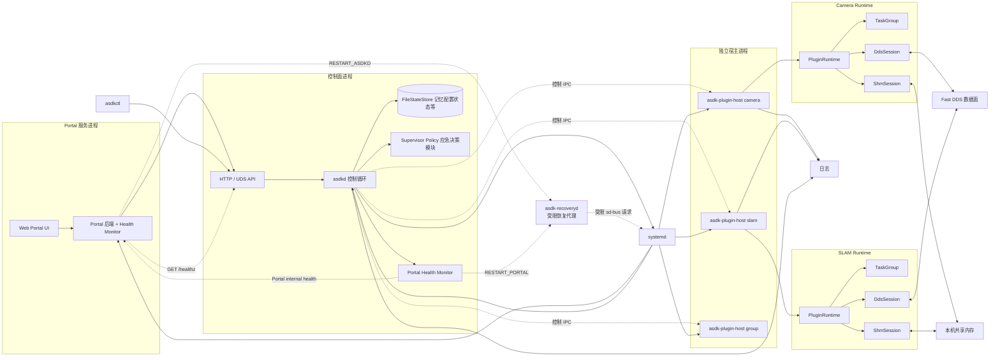
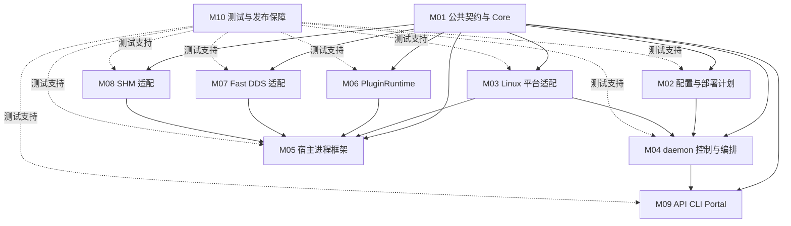

# ASDK 3.0 具体落实方案


| 事项 | 最终工程决策 |
|---|---|
| 默认隔离方式 | ASDK 3.0 首要实现路径为“一插件一宿主进程”；线程组宿主在独占宿主稳定后启用 |
| daemon 与宿主关系 | 宿主是独立 systemd unit，不属于 `asdkd.service` 的 cgroup；daemon 重启不停止宿主 |
| 生命周期语义 | `LOADED` 表示动态库、descriptor 和 plugin handle 均已建立；`STOP` 只进入 `STOPPED`，不自动 `dlclose` |
| 配置更新 | Runtime （插件允许管理）内配置不可变；系统允许通过“全量停止—新配置启动—失败回滚”的事务更新 |
| 插件资源 | 不采用无法落地的“插件绝对零资源”；改为“Runtime 创建或登记所有长期资源，未登记资源视为违规” |
| DDS 端点 | 插件在 `initialize()` 阶段声明逻辑端点，Runtime 在 `start()` 阶段创建物理端点，在 `stop()` 阶段销毁物理端点 |
| DDS 回调 | 默认先进入 Runtime 有界队列，再由 Runtime 回调执行器调用插件；不允许业务插件长期阻塞 Fast DDS 内部线程 |
| 共享内存 | 首版使用“每通道固定大小 block 池”，不实现通用可变长内存分配器 |
| SHM 引用 | acquire（借用）/release（释放） 由发布宿主本地控制通道管理；daemon 不参与 block 回收 |
| 状态权威 | 宿主保存实际 lifecycle；daemon 保存 desired state 和 operation，并镜像实际状态 |
| 状态持久化 | FileStateStore 以快照和 journal 保存配置、期望状态、操作日志和最后观测；重启后必须与宿主快照对账 |
| 时钟 | 超时与本机延迟统一使用 `CLOCK_MONOTONIC`；不得直接比较 `CLOCK_REALTIME-CLOCK_MONOTONIC` 判断同步误差 |
| 资源泄漏判断 | 不使用“相对基线增长 50% 即重启”的单一规则；使用绝对预算、持续趋势和 cgroup 事件联合判断 |

### ASDK 3.0 最终运行架构



### 0.4 必须保持的架构不变量

1. `asdkd` 不链接业务消息库，不创建业务 Participant、Topic、Reader、Writer 或 SHM payload。
2. 每个 `PluginRuntime` 独立拥有插件对象、任务、逻辑端点、物理端点、回调栅栏和 SHM 引用。
3. 插件对象销毁前，Runtime 必须确认任务退出、回调排空、DDS 端点关闭和 SHM 引用释放。
4. IPC 断开只代表控制连接失效，不代表宿主死亡。
5. 宿主死亡必须由 pidfd、PID start-time、systemd unit 状态或进程退出事件确认。
6. 配置未完整校验前，不得创建 unit、进程、DDS 实体或共享内存区域。
7. daemon 和宿主之间只传递控制消息、配置快照和状态元数据，不传业务 payload。
8. 所有外部操作都必须具备 `request_id`、`operation_id`、`config_generation` 和 `state_generation`。
9. process 模式下一个宿主只能包含一个 Runtime；thread 模式只能显式配置并通过准入检查。
10. 任一模块只能依赖其下层接口，不得通过全局单例绕过依赖边界。
11. Portal 服务与 `asdkd` 必须双向监视健康状态；两者只可向 `asdk-recoveryd` 提交恢复请求，不能直接执行 `systemctl`、`fork/exec` 或终止对方进程。
12. `asdk-recoveryd` 只允许重启 `asdkd.service` 与 `asdk-portal.service`，并执行目标级限流和熔断；不得管理 host unit、`asdk.target` 或 systemd manager。

---

# 1. 实现模块划分

## 1.1 模块划分结果

ASDK 3.0 按十个可独立构建、独立测试、可使用 Fake Adapter 替换的实现模块划分。

| 编号 | 实现模块 | 主要 CMake 目标 | 核心交付 | 可独立开发条件 |
|---|---|---|---|---|
| M01 | 公共契约与 Core | `asdk_abi`、`asdk_core`、`asdk_ports` | C ABI、状态模型、操作模型、错误模型、内部端口接口 | 最先冻结 |
| M02 | 配置与部署计划 | `asdk_config` | JSON Schema、Manifest、规范化、DAG、`DeploymentPlan` | 依赖 M01 头文件 |
| M03 | Linux 平台适配 | `asdk_platform_linux`、`asdk_control_wire`、`asdk-recoveryd` | systemd、受限恢复代理、UDS、文件状态存储、pidfd、时钟、journald 适配 | 依赖 M01 端口接口 |
| M04 | daemon 控制与编排 | `asdk_orchestrator`、`asdk_supervisor`、`asdkd` | 单写者控制循环、操作编排、接管、恢复、配置事务 | 使用 M03 Fake 可先开发 |
| M05 | 宿主进程框架 | `asdk_host_core`、`asdk-plugin-host` | 注册重连、操作路由、Runtime Registry、事件补发 | 使用 Runtime Fake 可先开发 |
| M06 | PluginRuntime 与资源代理 | `asdk_runtime` | 插件加载、生命周期、TaskGroup、CallbackGate、资源登记 | 使用 DDS/SHM Fake 可先开发 |
| M07 | Fast DDS 数据适配 | `asdk_transport_api`、`asdk_transport_fastdds` | 逻辑端点、类型支持、物理端点、收发队列 | 依赖 M01 接口 |
| M08 | 共享内存数据通道 | `asdk_shm_api`、`asdk_shm_posix` | 固定 block 池、注册、acquire/release、回收和背压 | 依赖 M01 接口 |
| M09 | 管理 API、CLI 与 Portal 适配 | `asdk_control_service`、`asdkctl` | HTTP/UDS API、异步 operation、CLI、Portal Client | 使用 Orchestrator Fake 可先开发 |
| M10 | 可观测性、测试与发布保障 | `asdk_observability`、`asdk_test_support` | 日志、指标、Fake、故障注入、包和升级检查 | 与全部模块并行 |

## 1.2 模块依赖关系

箭头表示“编译时依赖”。`M04`、`M05`、`M06` 均只依赖抽象端口；真实适配器在应用组合根中注入。



## 1.3 最终代码目录

```text
asdk/
├── CMakeLists.txt
├── cmake/
│   ├── AsdkDependencyRules.cmake
│   ├── AsdkSanitizers.cmake
│   └── AsdkAbiCheck.cmake
├── include/asdk/
│   ├── abi/                         # M01：唯一插件 ABI
│   │   ├── common_v3.h
│   │   ├── plugin_v3.h
│   │   ├── host_api_v3.h
│   │   └── message_codec_v1.h
│   ├── core/                        # M01：纯业务模型
│   │   ├── error.hpp
│   │   ├── ids.hpp
│   │   ├── state.hpp
│   │   ├── operation.hpp
│   │   ├── recovery_types.hpp
│   │   ├── deployment_plan.hpp
│   │   └── status_snapshot.hpp
│   └── ports/                       # M01：内部抽象端口
│       ├── state_store.hpp
│       ├── unit_manager.hpp
│       ├── host_channel.hpp
│       ├── recovery_requester.hpp
│       ├── process_probe.hpp
│       ├── transport.hpp
│       ├── shm.hpp
│       ├── clock.hpp
│       └── log_sink.hpp
├── src/
│   ├── core/                        # M01
│   ├── config/                      # M02
│   ├── platform_linux/              # M03
│   ├── control_wire/                # M03
│   ├── orchestrator/                # M04
│   ├── supervisor/                  # M04
│   ├── host_core/                   # M05
│   ├── runtime/                     # M06
│   ├── transport_fastdds/           # M07
│   ├── shm_posix/                   # M08
│   ├── control_service/             # M09
│   └── observability/               # M10
├── apps/
│   ├── asdkd/
│   ├── asdk-plugin-host/
│   ├── asdkctl/
│   ├── asdk-recoveryd/
│   ├── asdk-plugin-inspect/
│   └── asdk-config-migrate/
├── interfaces/
│   ├── config/asdk-v3.schema.json
│   ├── control/control-v3.schema.json
│   └── idl/
├── generated/
│   ├── fastddsgen-4.3.0/
│   └── message-codec/
├── examples/
│   ├── producer_v3/
│   ├── consumer_v3/
│   ├── crash_v3/
│   └── blocking_stop_v3/
├── packaging/
│   ├── systemd/
│   ├── debian/
│   └── migration/
└── tests/
    ├── unit/
    ├── contract/
    ├── integration/
    ├── fault/
    ├── performance/
    ├── abi/
    └── test_support/
```

## 1.4 CMake 依赖约束

| 目标 | 允许依赖 | 禁止依赖 |
|---|---|---|
| `asdk_abi` | C 标准头 | STL、JSON、Fast DDS、systemd |
| `asdk_core` | C++17 标准库、`asdk_abi` | POSIX、文件状态存储、HTTP、Fast DDS |
| `asdk_config` | `asdk_core`、JSON Schema 库 | systemd、Runtime、DDS、SHM |
| `asdk_orchestrator` | `asdk_core`、`asdk_ports` | sd-bus、socket、文件状态存储实现、Fast DDS |
| `asdk_host_core` | `asdk_core`、`asdk_ports`、`asdk_runtime` | HTTP、文件状态存储、Portal |
| `asdk_runtime` | `asdk_core`、`asdk_ports`、`asdk_abi` | systemd、HTTP、StateStore |
| `asdk_transport_fastdds` | `asdk_ports`、Fast DDS/Fast CDR | Orchestrator、StateStore、HTTP |
| `asdk_shm_posix` | `asdk_ports`、POSIX | Orchestrator、HTTP、Fast DDS 业务层 |
| `asdkd` | M02、M03、M04、M09、M10 | 业务 IDL、插件 `.so`、Fast DDS |
| `asdk-plugin-host` | M03、M05、M06、M07、M08、M10 | HTTP、FileStateStore、Portal |

CI 必须执行以下检查：

```text
1. 扫描 public header，禁止出现 eprosima、systemd、文件状态存储、httplib 等实现类型。
2. 使用 readelf -d 检查 asdkd 的 NEEDED，不得包含 libfastdds、业务消息库和插件库。
3. 使用 nm -D 检查插件唯一强制导出符号。
4. 使用 include-what-you-use 或自定义脚本检查跨模块私有头引用。
5. 每个模块只通过 target_link_libraries 链接公开目标，不允许全局 include_directories。
```

---
