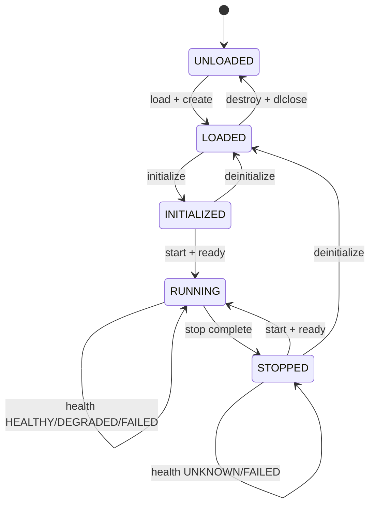
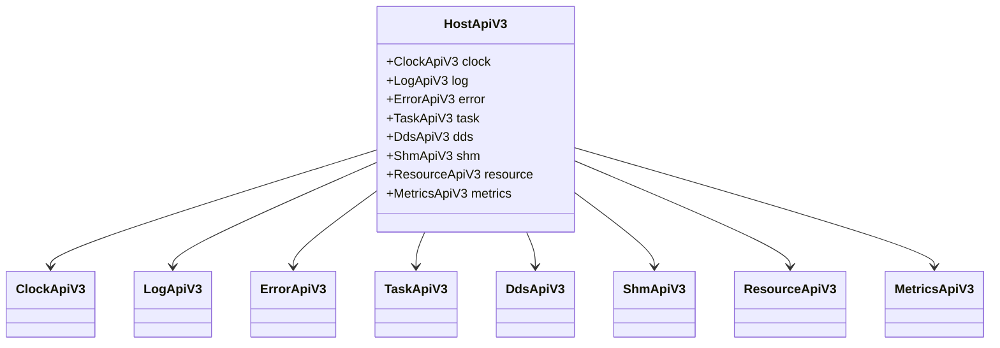

# 2. M01：公共契约与 Core

## 2.1 模块目标

M01 是全部并行开发的唯一前置模块。其产物只定义“系统说什么”和“模块如何交互”，不包含 Linux、Fast DDS、JSON、文件状态存储 或 HTTP 实现。

### 代码目标

```text
asdk_abi      INTERFACE library
asdk_core     STATIC library
asdk_ports    INTERFACE library
```

### 必须冻结的公共内容

- 插件 C ABI；
- Host API C ABI；
- 错误码和错误链；
- lifecycle / operation / health 状态；
- desired state；
- `DeploymentPlan`；
- daemon-host 控制消息 DTO；
- StateStore、UnitManager、HostChannel、RecoveryRequester、Transport、SHM 等内部端口；
- ID、generation、deadline 和时间戳语义。

## 2.2 状态模型

### 状态定义

```cpp
enum class LifecycleState : uint8_t {
    UNLOADED,
    LOADED,        // .so、descriptor、plugin handle 均有效
    INITIALIZED,   // 配置已解析，逻辑资源声明完成
    RUNNING,       // 任务、DDS、SHM 均 ready
    STOPPED        // 运行资源已释放，可再次 start
};

enum class OperationState : uint8_t {
    IDLE,
    LOADING,
    INITIALIZING,
    STARTING,
    STOPPING,
    DEINITIALIZING,
    UNLOADING,
    RECOVERING
};

enum class HealthState : uint8_t {
    UNKNOWN,
    HEALTHY,
    DEGRADED,
    FAILED
};

enum class DesiredState : uint8_t {
    ABSENT,
    STOPPED,
    RUNNING
};
```

### 生命周期状态机



### 状态提交规则

1. lifecycle、operation、health 任一对外可见字段变化时，`state_generation` 递增。
2. `config_generation` 只由 daemon 配置事务递增，宿主不得自行修改。
3. 同一 Runtime 同一时刻只能存在一个 active operation。
4. 宿主是 lifecycle、operation、health 的实际状态权威。
5. daemon 是 desired state、配置代际和恢复策略的权威。
6. `FAILED` 不改变 lifecycle；例如任务崩溃可表达为 `RUNNING + IDLE + FAILED`。
7. 清理失败时保留最后真实 lifecycle，不伪造为 `UNLOADED`。

### 状态结构

```cpp
struct PluginActualState {
    PluginId plugin_id;
    HostId host_id;
    BootId host_boot_id;

    LifecycleState lifecycle;
    OperationState operation;
    HealthState health;

    uint64_t state_generation;
    uint64_t config_generation;
    Hash256 config_hash;

    std::optional<OperationId> active_operation_id;
    std::optional<FailurePhase> failed_phase;
    ErrorChain last_error_chain;

    uint64_t state_since_monotonic_ns;
};
```

## 2.3 错误模型

```cpp
enum class ErrorCode : uint32_t {
    OK = 0,
    INVALID_ARGUMENT,
    INVALID_STATE,
    NOT_FOUND,
    ALREADY_EXISTS,
    PERMISSION_DENIED,
    ABI_MISMATCH,
    CONFIG_INVALID,
    DEPENDENCY_CYCLE,
    STALE_GENERATION,
    OPERATION_CONFLICT,
    RESOURCE_EXHAUSTED,
    TIMEOUT,
    IPC_ERROR,
    UNIT_ERROR,
    DDS_ERROR,
    SHM_ERROR,
    PLUGIN_ERROR,
    HOST_EXITED,
    UNSAFE_TO_UNLOAD,
    INTERNAL_ERROR
};

struct ErrorInfo {
    ErrorCode code;
    std::string module;
    std::string plugin_id;
    std::string phase;
    std::string message;
    uint64_t monotonic_ns;
};
```

### 对端恢复契约

恢复请求是 Portal 后端与 asdkd 共用的内部契约，必须由 M01 冻结；调用方不携带可选目标 unit，恢复代理只根据已认证的调用方身份决定唯一的对端恢复目标。

```cpp
enum class RecoveryReason : uint8_t {
    PEER_HEALTH_TIMEOUT,
    PEER_WATCHDOG_TIMEOUT,
    OPERATOR_APPROVED
};

enum class RecoveryResult : uint8_t {
    ACCEPTED,
    RATE_LIMITED,
    CIRCUIT_OPEN,
    PERMISSION_DENIED,
    UNAVAILABLE
};

struct PeerRecoveryRequest {
    RecoveryReason reason;
    uint32_t consecutive_failures;
    uint64_t last_success_monotonic_ns;
};
```

约束：

- 控制逻辑只能依据 `ErrorCode` 和结构化字段判断，不得解析 `message`；
- `message` 在进入宿主或 daemon 时必须复制，不得保存插件返回的临时指针；
- 一个 operation 可保存多步错误形成 `ErrorChain`；
- 清理阶段的新错误追加到错误链，不覆盖首个根因。

## 2.4 最终插件 C ABI

插件唯一导出符号：

这块主要是给插件导出.so，照着下面的函数指针去实现之后再导出。

```c
ASDK_ABI_EXPORT
const asdk_plugin_descriptor_v3* asdk_get_plugin_descriptor_v3(void);
```

```c
typedef void* asdk_plugin_handle;

typedef struct asdk_plugin_descriptor_v3 {
    uint32_t struct_size;
    uint32_t abi_version;
    asdk_string_view plugin_type;
    asdk_string_view build_id;
    uint64_t capabilities;

    asdk_status_code (*create)(
        const asdk_host_api_v3* host,
        asdk_plugin_handle* out_handle);

    asdk_status_code (*initialize)(
        asdk_plugin_handle handle,
        asdk_bytes_view immutable_config);

    asdk_status_code (*start)(asdk_plugin_handle handle);
    asdk_status_code (*request_stop)(asdk_plugin_handle handle);
    asdk_status_code (*deinitialize)(asdk_plugin_handle handle);
    asdk_status_code (*health)(
        asdk_plugin_handle handle,
        asdk_health_v3* out_health);

    void (*destroy)(asdk_plugin_handle handle);
} asdk_plugin_descriptor_v3;
```

### ABI 约束

- 不允许 STL、虚函数对象、RTTI、异常、可变长 C struct 和编译器相关 bit-field 跨边界；
- 所有结构包含 `struct_size` 和 `abi_version`；
- 插件异常必须在插件内部捕获，Runtime 仍在最外层执行 `catch (...)`；
- 插件分配的内存由插件释放，宿主分配的内存由宿主释放；
- 插件通过 Host API 上报详细错误，生命周期函数只返回稳定错误码；
- `destroy()` 必须允许对有效 handle 调用一次；重复调用由 Runtime 阻止，不要求插件容忍双重销毁。

## 2.5 Host API 分组


组成部分（聚合）：

ClockApiV3（时间）

LogApiV3（记录）

ErrorApiV3（错误上报）

TaskApiV3（线程/异步工作）

DdsApiV3（小消息通讯）

ShmApiV3（大内存块通讯）

ResourceApiV3（文件描述符/资源管理）

MetricsApiV3（统计/监控）。




| API 组 | 允许阶段 | 核心操作 |
|---|---|---|
| Clock | 全阶段 | `now_monotonic_ns`、`now_realtime_ns`、`sync_state` |
| Log | 全阶段 | 结构化日志，Runtime 自动绑定 host/plugin/operation 上下文 |
| Error | 生命周期调用和任务阶段 | `set_last_error`、`append_error` |
| Task | `start()` 期间 | 创建受控任务、ready、error、stop token |
| DDS | `initialize()` 声明；`RUNNING` 发布 | 声明 reader/writer、publish、查询匹配状态 |
| SHM | `initialize()` 声明；`RUNNING` 使用 | 声明通道、allocate、seal、acquire、release |
| Resource | initialize/start | 登记 FD、mmap、vendor handle 和 cleanup callback |
| Metrics | 全阶段 | counter、gauge、histogram，不允许动态无限创建 label |

## 2.6 内部端口接口

以下接口是模块并行开发的边界。它们属于 ASDK 内部 C++ ABI，不承诺跨大版本二进制兼容。

```cpp


// ============================================================================
// 1. IStateStore：控制面的“持久化硬盘”
//    实现者：FileStateStore (M03)  |  调用者：asdkd 控制循环 (M04)
// ============================================================================
class IStateStore {
public:
    virtual ~IStateStore() = default;

    /**
     * @brief 从持久化存储中加载系统最后已知状态（配置、操作、观测值）。
     * @return PersistedState 包含 active_config、未完成操作、最后观测的快照。
     * @note 用于 daemon 启动或崩溃恢复时的数据重建。
     */
    virtual Result<PersistedState> load() = 0;

    /**
     * @brief 提交（持久化）一个外部操作（如 start、stop）。
     * @param op 包含 operation_id、request_id、目标插件、期望状态等。
     * @note 必须原子写入。这是实现 operation 幂等性和崩溃恢复的关键。
     */
    virtual Result<void> commit_operation(const OperationRecord& op) = 0;

    /**
     * @brief 批量提交宿主上报的观测快照（如三维状态、资源使用）。
     * @param batch 批量观测数据，可限频落库，避免高频心跳写入导致 IO 瓶颈。
     * @note 用于 daemon 接管（Adoption）时的状态对账。
     */
    virtual Result<void> commit_observation(const ObservationBatch& batch) = 0;

    /**
     * @brief 开始一个配置事务（预备阶段）。
     * @param tx 包含 config_generation、candidate_plan、旧代际信息。
     * @note 进入 UPDATING_CONFIG 阶段前调用，用于标记事务开始，防止半途崩溃时丢失上下文。
     */
    virtual Result<void> begin_config_tx(const ConfigTransaction& tx) = 0;

    /**
     * @brief 结束一个配置事务（提交或回滚）。
     * @param result 包含事务最终状态（COMMITTED / ROLLED_BACK / FAILED）及错误链。
     * @note 只有结果明确时才调用。若 daemon 在途中崩溃，重启后根据此记录决定恢复路径。
     */
    virtual Result<void> finish_config_tx(const ConfigTransactionResult& result) = 0;
};

// ============================================================================
// 2. IUnitManager：操作 systemd 的“进程遥控器”
//    实现者：SystemdUnitManager (M03) | 调用者：asdkd (M04)
// ============================================================================
class IUnitManager {
public:
    virtual ~IUnitManager() = default;

    /**
     * @brief 确保目标宿主进程存在（幂等）。
     * @param plan 包含 HostId、资源限制（CPU/内存）、环境变量等。
     * @return AsyncResult<UnitInfo> 异步返回 unit 状态（PID、启动时间、激活状态）。
     * @note 如果 unit 不存在，则通过 sd-bus 调用 StartTransientUnit 创建；
     *       如果已存在，则验证属性是否匹配。
     */
    virtual AsyncResult<UnitInfo> ensure_host(const HostPlan& plan) = 0;

    /**
     * @brief 停止目标宿主。
     * @param id 目标 HostId。
     * @param mode StopMode::GRACEFUL（先 DRAIN 再 Stop）或 FORCE（直接 SIGKILL）。
     * @note 宿主作为独立 unit，停止它不影响其他 host 或 asdkd 自身。
     */
    virtual AsyncResult<void> stop_host(const HostId& id, StopMode mode) = 0;

    /**
     * @brief 查询宿主当前状态（同步）。
     * @return UnitInfo 包含 MainPID、LoadState、ActiveState、SubState。
     * @note 用于健康检查或接管前的信息收集。
     */
    virtual AsyncResult<UnitInfo> query_host(const HostId& id) = 0;

    /**
     * @brief 通过进程 PID 反查其所属的 systemd unit 身份。
     * @param pid 进程 ID（通常来自 SO_PEERCRED）。
     * @return UnitIdentity 包含 unit 名称、所属目标（如 asdk.target）。
     * @note 这是 daemon 校验对端身份（防止伪造）的关键步骤。
     */
    virtual Result<UnitIdentity> resolve_unit_by_pid(ProcessId pid) = 0;
};

// ============================================================================
// 3. IHostChannel：大脑与手脚之间的“对讲机线路”
//    实现者：SeqpacketServer/Client (M03, UDS) | 调用者：asdkd & Host (M04/M05)
// ============================================================================
class IHostChannel {
public:
    virtual ~IHostChannel() = default;

    /**
     * @brief 向指定宿主发送控制消息（如 APPLY_DESIRED_STATE、PING）。
     * @param id 目标 HostId。
     * @param msg 控制帧，包含 request_id、operation_id、config_generation 等。
     * @note 发送是尽力而为的；可靠性由上层重连和 sequence/ack 机制保证。
     */
    virtual Result<void> send(const HostId& id, const ControlMessage& msg) = 0;

    /**
     * @brief 注册事件接收器，用于接收来自对端（宿主）的事件（如 OPERATION_FINISHED）。
     * @param sink 回调接口指针。
     * @note 通常由控制循环在初始化时设置。
     */
    virtual void set_event_sink(IHostEventSink* sink) = 0;
};

// ============================================================================
// 4. IRecoveryRequester：紧急情况下的“呼叫按钮”
//    实现者：RecoveryRequesterImpl (M03, UDS) | 调用者：Portal 健康监控 / asdkd 健康监控
// ============================================================================
class IRecoveryRequester {
public:
    virtual ~IRecoveryRequester() = default;

    /**
     * @brief 请求对端进程重启（如请求重启 asdkd 或 Portal）。
     * @param req 包含失败原因、连续失败次数、上次成功时间。
     * @return RecoveryResult ACCEPTED / RATE_LIMITED / CIRCUIT_OPEN / PERMISSION_DENIED。
     * @note 调用方不指定目标 unit；目标由恢复代理基于 SO_PEERCRED 固定映射决定。
     *       这防止了权限滥用（如 Portal 只能请求重启 asdkd，反之亦然）。
     */
    virtual Result<RecoveryResult> request_peer_restart(const PeerRecoveryRequest& req) = 0;
};

// ============================================================================
// 5. ITransportSession：小数据（DDS）“快递员”
//    实现者：FastDdsSession (M07) | 调用者：PluginRuntime (M06)
// ============================================================================
class ITransportSession {
public:
    virtual ~ITransportSession() = default;

    /**
     * @brief 声明一个 DDS 发布端（Writer）。
     * @param desc 通道描述符（Domain、Topic、TypeName、QoS 等）。
     * @return WriterHandle 句柄，用于后续 publish 操作。
     * @note 此时只是逻辑声明，物理端点直到 start() 才创建。
     */
    virtual Result<WriterHandle> declare_writer(const ChannelDescriptor& desc) = 0;

    /**
     * @brief 声明一个 DDS 订阅端（Reader）。
     * @param desc 通道描述符。
     * @param callback 收到数据时的回调函数（接收序列化 CDR 字节流）。
     * @return ReaderHandle 句柄。
     * @note 回调默认先进入有界队列（ReaderQueue），再由 Runtime 回调执行器调用，
     *       绝不允许业务插件阻塞 Fast DDS 内部线程。
     */
    virtual Result<ReaderHandle> declare_reader(const ChannelDescriptor& desc,
                                                SerializedDataCallback callback) = 0;

    /**
     * @brief 启动所有已声明的物理端点（Participant、Topic、Writer/Reader）。
     * @note 必须等待必要的匹配（Matched）完成后才返回成功。
     */
    virtual Result<void> start() = 0;

    /**
     * @brief 停止并销毁所有物理端点。
     * @param deadline_ns 绝对截止时间（CLOCK_MONOTONIC），超时则强制清理。
     * @note 停止后，旧回调不会进入插件（由 CallbackGate 配合静默）。
     */
    virtual Result<void> stop(uint64_t deadline_ns) = 0;

    /**
     * @brief 发布一条序列化消息。
     * @param handle Writer 句柄。
     * @param data 序列化后的 CDR 字节视图。
     * @param metadata 采样元数据（时间戳、序列号等）。
     * @note 插件传入的字节在函数返回后即可释放；M07 内部可能会拷贝或复用 buffer。
     */
    virtual Result<void> publish(WriterHandle handle,
                                 ByteView data,
                                 const SampleMetadata& metadata) = 0;
};

// ============================================================================
// 6. IShmSession：大数据（共享内存）“大卡车”
//    实现者：PosixShmSession (M08) | 调用者：PluginRuntime (M06)
// ============================================================================
class IShmSession {
public:
    virtual ~IShmSession() = default;

    /**
     * @brief 声明一个共享内存通道（如摄像头图像流）。
     * @param desc 包含 ChannelId、block 大小、block 数量、背压策略等。
     * @note 只做配置检查，实际内存池在 start() 时分配。
     */
    virtual Result<void> declare_channel(const ShmChannelDescriptor& desc) = 0;

    /**
     * @brief 分配并初始化共享内存区域（mmap 或 posix_shm_open）。
     * @note 发布者调用；分配后内存池 Ready。
     */
    virtual Result<void> start() = 0;

    /**
     * @brief 分配一个可写的共享内存块（用于发布者写入数据）。
     * @param id 通道 ID。
     * @param length 所需长度（必须 <= block 容量）。
     * @param deadline_ns 分配截止时间。
     * @return WritableBlock 包含内存地址、block_index、generation。
     * @note 若无空闲 block，根据配置的背压策略（如 DROP_OLDEST 或阻塞）处理。
     */
    virtual Result<WritableBlock> allocate(ChannelId id,
                                           uint32_t length,
                                           uint64_t deadline_ns) = 0;

    /**
     * @brief 封存已写入的 block，使其变为可读（READABLE）。
     * @param block 由 allocate 返回的 WritableBlock。
     * @return LargeDataHeader 包含 block 索引、generation、长度、校验和。
     * @note 封存后，此 header 将通过 DDS 小消息广播给消费者。
     *       Daemon 不参与此过程，完全由发布者宿主本地管理。
     */
    virtual Result<LargeDataHeader> seal(WritableBlock&& block) = 0;

    /**
     * @brief 消费者获取共享内存块的只读视图。
     * @param header 从 DDS 收到的大数据头（含 block_index、generation）。
     * @return SharedSample 包含数据指针、长度、有效期。
     * @note acquire 由发布者宿主的本地控制通道管理，不经过 daemon。
     *       必须校验 generation 匹配且 block 处于 READABLE 状态。
     */
    virtual Result<SharedSample> acquire(const LargeDataHeader& header) = 0;

    /**
     * @brief 停止并销毁共享内存区域（释放 mmap、关闭 fd）。
     * @param deadline_ns 截止时间。
     * @note 必须确保所有 active lease 已释放（或由发布者强制回收）。
     */
    virtual Result<void> stop(uint64_t deadline_ns) = 0;
};
```

## 2.7 M01 实现任务

- [ ] M01-01：建立固定宽度 C 类型、字符串视图、字节视图、UUID 和版本宏。
- [ ] M01-02：冻结 `asdk_plugin_descriptor_v3` 和 Host API 分组。
- [ ] M01-03：实现三维状态模型、合法转换表和纯函数校验器。
- [ ] M01-04：实现 operation、generation、幂等和冲突模型。
- [ ] M01-05：定义 `DeploymentPlan`、`HostPlan`、`PluginPlan`、`ChannelPlan`。
- [ ] M01-06：定义全部内部端口接口和 Fake 所需语义。
- [ ] M01-07：冻结 `RecoveryReason`、`RecoveryResult`、`PeerRecoveryRequest` 和 `IRecoveryRequester`，并定义 Fake 语义。
- [ ] M01-08：实现 ABI layout 静态断言及 C/C++ 双编译测试。

## 2.8 M01 验收条件

1. 在没有 JSON、Fast DDS、systemd、文件状态存储、HTTP 的环境中可 `configure/build/ctest`。
2. C 插件和 C++ Runtime 均能包含 ABI 头并成功编译。
3. 所有合法/非法状态转换均有表驱动测试。
4. 相同 `request_id` 幂等、旧 generation 拒绝、并发 operation 冲突均有测试。
5. `sizeof`、`offsetof`、ABI version 和 `struct_size` 有自动校验。
6. M01 公共头冻结后，其余模块可仅依靠 Fake 并行开发。

---
