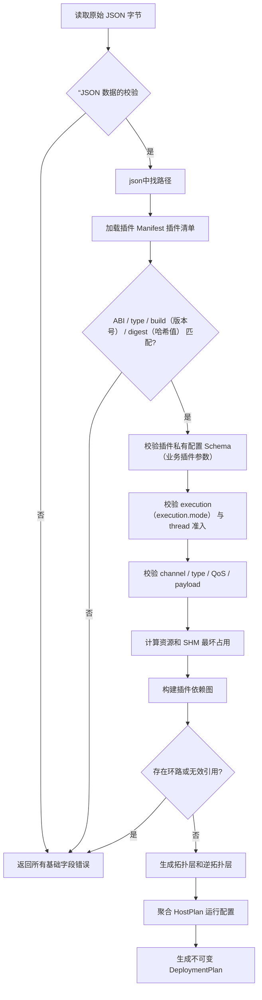

# 3. M02：配置、Manifest（插件清单）和DeploymentPlan（部署计划）

## 3.1 模块职责

M02 只负责把外部 JSON 和插件 Manifest 编译成完整、不可变、可执行的 `DeploymentPlan`。M02 不启动进程、不连接 DDS、不创建 SHM，也不修改 StateStore。

```text
输入：配置 JSON + 插件 Manifest + 插件私有 JSON Schema
输出：DeploymentPlan 或完整 ValidationReport
副作用：无
```

### 代码结构

```text
src/config/
├── config_loader.cpp
├── schema_validator.cpp
├── manifest_loader.cpp
├── path_normalizer.cpp
├── policy_validator.cpp
├── channel_validator.cpp
├── resource_validator.cpp
├── dag_compiler.cpp
├── host_plan_builder.cpp
└── deployment_compiler.cpp
```

### 核心类

```cpp
class DeploymentCompiler {
public:
    Result<DeploymentPlan> compile(
        ByteView raw_json,
        const CompileContext& context,
        ValidationReport* report) const;
};

struct CompileContext {
    std::filesystem::path config_path;
    std::vector<std::filesystem::path> allowed_plugin_prefixes;
    std::vector<std::filesystem::path> allowed_manifest_prefixes;
    uint64_t next_config_generation;
    MachineCapacity machine_capacity;
};
```

## 3.2 配置编译流程
配置编译流程确保的是：在 ASDK 按下“启动”按钮（STARTING 阶段）之前，所有插件配置不仅在“语法上”合格，在“业务逻辑”和“系统资源”上也绝对合法。


要求：一次编译尽可能返回全部错误，而不是遇到第一个错误立即退出。只有依赖前一步结果才能继续的错误才允许短路。

## 3.3 DeploymentPlan 数据结构

```cpp
struct DeploymentPlan {
    uint32_t schema_version;
    uint64_t config_generation;
    Hash256 config_hash;
    std::string node_id;

    SystemPolicy system;
    std::unordered_map<PluginId, PluginPlan> plugins;
    std::unordered_map<HostId, HostPlan> hosts;
    std::unordered_map<ChannelId, ChannelPlan> channels;

    std::vector<std::vector<PluginId>> startup_layers;
    std::vector<std::vector<PluginId>> shutdown_layers;
};

struct PluginPlan {
    PluginId id;
    std::string type;
    std::filesystem::path library;
    std::filesystem::path manifest;
    Hash256 library_digest;

    HostId host_id;
    ExecutionMode execution_mode;
    bool critical;
    DesiredState initial_desired_state;

    std::vector<PluginId> required_dependencies;
    std::vector<PluginId> optional_dependencies;
    DependencyFailurePolicy dependency_failure_policy;
    RecoveryPolicy recovery_policy;

    TimeoutPolicy timeouts;
    ResourceBudget resources;
    std::vector<ChannelId> channels;
    std::vector<std::byte> immutable_config_json;
};
```

`DeploymentPlan` 生成后不得原位修改。配置更新必须生成新的 plan 和新的 `config_generation`。

## 3.4 插件 Manifest

每个插件必须安装：

```text
/opt/asdk/v3/plugins/libCamera.so.3
/opt/asdk/v3/plugins/Camera.asdk-manifest.json
/opt/asdk/v3/plugins/Camera.config.schema.json
```

Manifest 最小格式：

```json
{
  "manifest_version": 1,
  "plugin_type": "Camera",
  "build_id": "camera-3.0.0+gabcdef",
  "library": "libCamera.so.3",
  "library_sha256": "sha256:...",
  "abi": {
    "major": 3,
    "minor_min": 0,
    "minor_max": 2
  },
  "supported_execution_modes": ["process"],
  "capabilities": ["TASK_API", "DDS_API", "SHM_PUBLISH", "RESOURCE_ADOPT"],
  "config_schema": "Camera.config.schema.json",
  "message_types": [
    {
      "type_name": "amov.camera.GrayImageHeader",
      "schema_hash": "sha256:...",
      "type_support": "libasdk_type_camera.so.1"
    }
  ]
}
```

Manifest 是“无副作用预检依据”，Runtime 实际加载后仍必须使用 descriptor 进行二次校验。

## 3.5 系统配置格式

```json
{
  // ========================================================================
  // 顶层配置
  // ========================================================================
  
  // 配置格式版本号：固定为 3，表示该配置文件遵循 ASDK 3.0 的 schema 规范
  "schema_version": 3,

  // ========================================================================
  // system：ASDK 框架全局系统策略（由框架团队维护）
  // ========================================================================
  "system": {
    // 当前物理节点的唯一标识符，用于日志、监控和跨机通信时的身份识别
    "node_id": "flycore-001",

    // 同一时刻最大允许并行启动的插件数量（受 DAG 拓扑限制）
    // 层内并行数由该值控制，防止启动风暴耗尽系统资源
    "max_parallel_start": 4,

    // daemon (asdkd) 启动后，等待宿主注册的接管超时时间（毫秒）
    // 超时后，daemon 会认为该宿主的旧会话已失效并强制进入恢复逻辑
    "adoption_timeout_ms": 3000,

    // daemon ↔ 宿主 之间控制 IPC 单条消息的最大字节数（256 KiB）
    // 超出此限制的消息会被分片传输，且控制层严禁传递业务大数据
    "control_message_max_bytes": 262144,

    // 插件动态库和 Manifest 的允许搜索路径白名单
    // 编译器会对所有插件路径执行“路径规范化与禁止符号链接逃逸”检查
    "plugin_prefixes": ["/opt/asdk/v3/plugins"],

    // 当 daemon 重启后，发现 StateStore 中记录的配置与宿主实际运行配置不符时的处理策略
    // "alert" = 仅告警并记录审计日志，不自动修改宿主状态；由运维人员介入决策
    "reconciliation": "alert",

    // 系统级配置更新策略
    // "full_restart_with_rollback" = 全量停止旧配置所有插件，启动新配置，失败则原子回滚
    "config_update_policy": "full_restart_with_rollback"
  },

  // ========================================================================
  // plugins：插件部署描述列表（定义系统中所有要运行的插件实例）
  // ========================================================================
  "plugins": [
    {
      // ===== 插件身份标识 =====
      
      // 插件实例的唯一 ID（在同一节点内不可重复）
      // 命名规范：仅允许 [A-Za-z0-9_.-]，最大长度 64 字符
      "id": "camera",

      // 插件类型名称，必须与 Manifest (Camera.asdk-manifest.json) 中的 plugin_type 完全一致
      "type": "Camera",

      // 动态库的绝对路径（或经过白名单校验后的相对路径）
      // 加载前会校验 SHA-256 是否与 Manifest 中的 library_sha256 匹配
      "library": "/opt/asdk/v3/plugins/libCamera.so.3",

      // 插件清单文件的绝对路径
      // 包含 ABI 版本、能力集、消息类型定义等元数据
      "manifest": "/opt/asdk/v3/plugins/Camera.asdk-manifest.json",

      // ===== 服务等级与初始期望状态 =====
      
      // 是否为关键（核心）插件
      // true 表示该插件不可降级，若崩溃且无法恢复，系统整体服务状态切换为 FAILED
      "critical": true,

      // 该插件实例的初始期望状态（daemon 启动后自动执行的状态转换目标）
      // RUNNING = 加载 → 初始化 → 启动并保持运行
      "initial_desired_state": "RUNNING",

      // ===== execution：运行时资源隔离策略（Systemd Unit 属性） =====
      "execution": {
        // 执行模式：
        //   "process" = 独占一个独立宿主进程（一插件一进程，首个切片只支持此模式）
        //   "thread"  = 与同 host_group 的插件共享一个宿主进程（延后实现）
        "mode": "process",

        // 线程组 ID：process 模式下必须为 null；thread 模式下需指定组名
        "host_group": null,

        // 运行该宿主进程的 Linux 用户和组
        // 用于权限隔离，防止插件越权访问系统资源
        "user": "asdk",
        "group": "asdk",

        // CPU 亲和性绑定列表（指定该进程可运行的 CPU 核心编号）
        // 减少上下文切换抖动，对实时性要求高的传感器插件尤其重要
        "cpu_affinity": [2, 3],

        // 内存硬上限（字节）：1 GiB = 1073741824 bytes
        // 对应 systemd unit 的 MemoryMax 属性，超限会触发 OOM Killer
        "memory_max_bytes": 1073741824,

        // 进程允许创建的最大线程数（对应 systemd 的 TasksMax）
        // 防止单个插件产生线程泄露拖垮整机
        "tasks_max": 128,

        // 进程允许打开的最大文件描述符数量（对应 LimitNOFILE）
        // 涵盖设备文件、socket、共享内存 fd 等
        "nofile_max": 512
      },

      // ===== dependencies：插件间依赖关系拓扑 =====
      "dependencies": {
        // 强依赖列表：当前插件启动前，这些插件必须达到 RUNNING + HEALTHY/DEGRADED
        // 若依赖失败，根据 on_required_failure 策略处理
        "required": [],

        // 弱依赖列表：若这些插件失败，当前插件继续启动，但自身 health 降级为 DEGRADED
        "optional": [],

        // 强依赖失败时的行为：
        //   "STOP"  = 停止当前插件（依赖分支失败，本插件也无法正常工作）
        //   "IGNORE"= 忽略依赖失败（极少使用，仅用于非关键统计类插件）
        "on_required_failure": "STOP"
      },

      // ===== recovery：故障恢复策略 =====
      "recovery": {
        // 恢复动作：当前仅支持 RESTART_HOST（重启整个独占宿主或整组宿主）
        "action": "RESTART_HOST",

        // 在滑动窗口 (window_ms) 内允许的最大重启尝试次数
        "max_attempts": 3,

        // 滑动窗口大小（毫秒）：60 秒
        "window_ms": 60000,

        // 退避初始等待时间（毫秒）：首次失败后 500 ms 再重试
        "backoff_initial_ms": 500,

        // 退避最大等待时间（毫秒）：后续重试按指数退避增长，但不超过此上限
        "backoff_max_ms": 10000,

        // 当尝试次数耗尽（达到 max_attempts）后，是否将宿主置入隔离（quarantine）状态
        // true = 不再自动恢复，需人工通过 asdkctl host recover 清除隔离标记
        "quarantine_after_exhausted": true
      },

      // ===== timeouts：各生命周期阶段的超时控制 =====
      "timeouts": {
        // dlopen() + dlsym() 加载动态库的超时（毫秒）
        "load_ms": 1000,

        // 插件 initialize() 回调的超时（毫秒），包含逻辑端点声明和设备预初始化
        "initialize_ms": 3000,

        // 插件 start() 回调的超时（毫秒），包含任务创建、物理端点启动等
        "start_ms": 5000,

        // 插件 request_stop() + 回调排空的总超时（毫秒）
        "stop_ms": 3000,

        // CallbackGate 关闭后等待 in-flight 回调降为零的专用超时（毫秒）
        "callback_drain_ms": 1000
      },

      // ===== channels：数据传输通道（DDS + SHM）配置 =====
      "channels": [
        {
          // 通道唯一标识符，用于日志和诊断
          "id": "camera.gray",

          // 数据流向：PUBLISH（发布者） 或 SUBSCRIBE（订阅者）
          "direction": "PUBLISH",

          // DDS 域 ID（DomainId），同一域内的端点才能互相通信
          "domain_id": 10,

          // 通信范围：
          //   "LOCAL"  = 仅本机通信（共享内存优先）
          //   "GLOBAL" = 跨机通信（仅走 DDS 网络栈，禁止 SHM）
          "scope": "LOCAL",

          // DDS 主题名称（Topic），发布者和订阅者必须完全一致
          "topic": "img/gray",

          // 消息类型的完全限定名（对应 IDL 中定义的 struct 名称）
          "type_name": "amov.camera.GrayImageHeader",

          // 消息类型 Schema 的哈希值（SHA-256），用于校验发布/订阅端的类型匹配
          "schema_hash": "sha256:...",

          // 大负载传输模式：
          //   "SHARED_MEMORY" = 负载走本机共享内存，DDS 只传轻量级头 (LargeDataHeader)
          //   "DDS"          = 负载直接序列化后走 DDS 网络（适用于小消息）
          "payload": "SHARED_MEMORY",

          // DDS QoS 配置模板名称，由框架内置的 QosResolver 映射为具体 Fast DDS 配置
          // 此处 "sensor_best_effort" 表示：尽量交付（不阻塞）、低延迟、允许少量丢包
          "qos_profile": "sensor_best_effort",

          // 回调模式：
          //   "QUEUED"  = DDS Listener 将数据投递到有界队列，由 Runtime 回调执行器调度调用
          //               （默认且推荐，避免阻塞 DDS 内部线程）
          //   "DIRECT"  = 直接在 DDS 线程中调用插件回调（仅极短且经审核的回调允许）
          "callback_mode": "QUEUED",

          // ===== shm：共享内存子配置（仅当 payload = "SHARED_MEMORY" 时生效） =====
          "shm": {
            // 单个共享内存块的最大负载容量（字节）：2 MiB
            // 必须大于等于该通道可能出现的最大图像或点云大小
            "max_payload_bytes": 2097152,

            // 固定 block 池中的 block 数量
            // 容量计算公式：block_count >= (发布速率Hz × header_lifespan_ms / 1000) + 消费者数 + 安全余量
            "block_count": 12,

            // 大消息头（LargeDataHeader）在 DDS 中的有效期（毫秒）
            // 超过此期限的 header，消费者 acquire 时会直接被拒绝（STALE/EXPIRED）
            // 同时用于控制 block 的回收时机：valid_until = publish_time + header_lifespan_ms + safety_margin
            "header_lifespan_ms": 500,

            // 共享内存池耗尽时的背压策略：
            //   "DROP_OLDEST_UNACQUIRED" = 尝试回收已过期且未被 acquire 的最旧 block；
            //                               若无可回收 block，则退化为 DROP_NEWEST（当前分配失败）
            "backpressure": "DROP_OLDEST_UNACQUIRED"
          }
        }
      ],

      // ===== config：插件业务私有配置 =====
      // 该 JSON 对象的 Schema 由插件团队通过 Camera.config.schema.json 定义并校验
      // ASDK 框架不感知内部字段语义，仅负责校验和透传
      "config": {
        "device": "/dev/video0",   // 相机设备文件路径
        "width": 1600,            // 图像宽度（像素）
        "height": 1300,           // 图像高度（像素）
        "fps": 30                 // 目标采集帧率
      }
    }
  ]
}
```

## 3.6 配置校验清单

### 基础与路径

- `schema_version` 必须为支持的主版本；
- plugin ID、host group、channel ID 只允许 `[A-Za-z0-9_.-]`，长度不超过 64；
- 所有路径执行 `weakly_canonical` 后必须仍位于允许前缀；
- 插件库、Manifest、私有 Schema 必须为普通文件；
- 默认拒绝 world-writable 文件和目录；
- library digest 必须与 Manifest 一致；
- 未知字段默认报错。

### execution

- process 模式不得配置 `host_group`；
- thread 模式必须配置 `host_group`；
- thread 组内插件 UID/GID、权限、关键性和恢复策略必须兼容；
- Manifest 未声明 thread capability 时拒绝 thread；
- process 模式一个 `HostPlan` 只能包含一个插件；
- CPU affinity 不得超出在线 CPU；
- `memory_max_bytes`、`tasks_max`、`nofile_max` 必须为正且不超过机器策略上限。

### 依赖与 DAG

- required/optional 依赖必须存在；
- 插件不得依赖自己；
- required 依赖图不得存在环；
- thread group 内仍按插件 DAG 排序；
- 聚合成 host 后不得引入 host 级循环；
- 依赖失败策略必须与插件关键性兼容。


### SHM 容量

固定 block 池建议满足：

```text
minimum_blocks =
    ceil(publish_rate_hz × header_lifespan_ms / 1000)
  + max_acquired_per_consumer × max_consumers
  + safety_blocks

  最低块数 = 向上取整（发布频率（帧/秒） × 消息头存活时间（毫秒） ÷ 1000）+ 每个消费者最多持有块数 × 最大消费者数量 + 安全块数
```

其中 `safety_blocks` 默认不小于 2。若配置无法覆盖最坏占用，编译失败，不允许运行后再自动扩容。

## 3.7 M02 实现任务

- [ ] M02-01：编写 `asdk-v3.schema.json` 和字段版本策略。
- [ ] M02-02：实现 Manifest loader、SHA-256 校验和路径逃逸检查。
- [ ] M02-03：实现插件私有 JSON Schema 校验。
- [ ] M02-04：实现 execution、资源、channel 和 SHM 容量校验器。
- [ ] M02-05：实现 DAG、拓扑层、逆拓扑层和 HostPlan 聚合。
- [ ] M02-06：实现一次返回多错误的 `ValidationReport`。
- [ ] M02-07：提供 `asdk-config-migrate` 和 `asdk-plugin-inspect` 所需 API。

## 3.8 M02 验收条件

1. 无 systemd、DDS 和 SHM 环境可独立测试。
2. 对同一规范化配置生成稳定 `config_hash`。
3. 1000 个插件规模的 DAG 编译结果稳定且可重复。
4. 环路、路径逃逸、错误 Manifest、错误 schema hash、资源超限均有负向测试。
5. 编译失败不创建任何运行时副作用。
6. `DeploymentPlan` 可序列化用于 StateStore 和 HostConfigure 消息。

---
