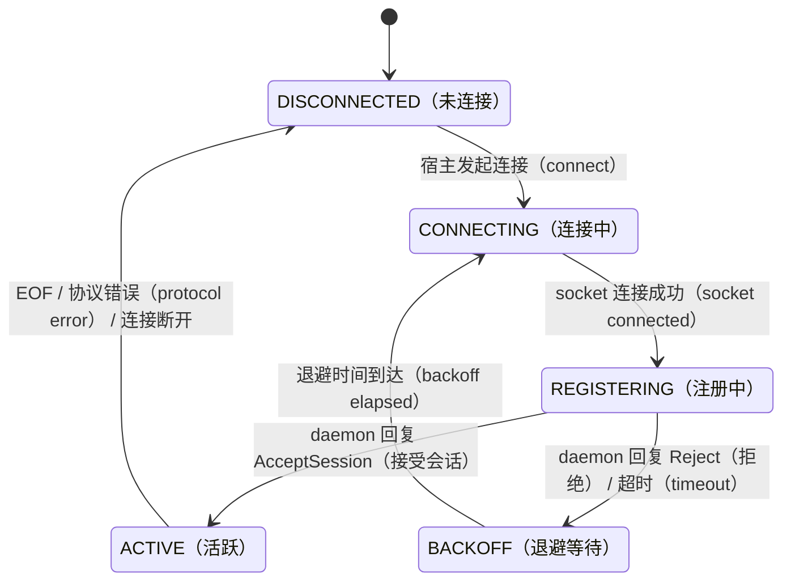
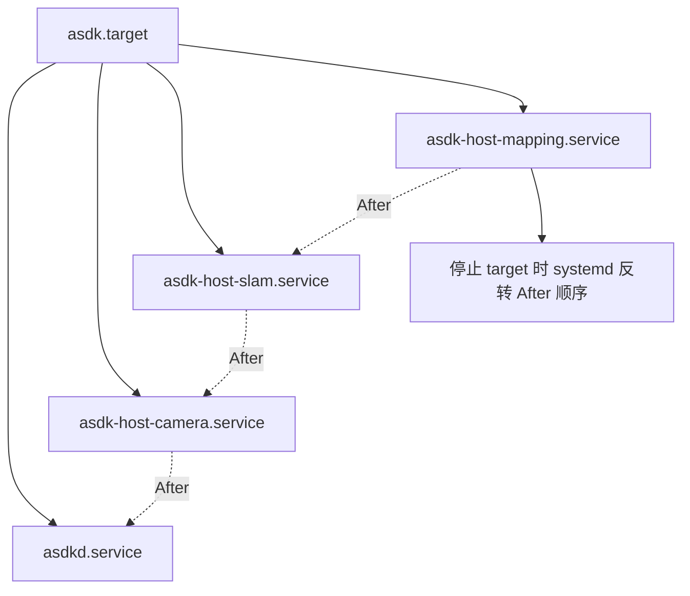

# 4. M03：Linux 平台适配与控制线协议

## 4.1 模块边界

M03 实现 M01 定义的端口，不包含任何恢复、启动顺序或业务策略。

| 子模块 | 实现类 | 对应端口 |
|---|---|---|
| systemd | `SystemdUnitManager` | `IUnitManager` |
| UDS | `SeqpacketServer`、`SeqpacketClient` | `IHostChannel` 的底层传输 |
| 控制协议 | `ControlFrameEncoder/Decoder` | `ControlMessage` 编解码 |
| 文件状态存储 | `FileStateStore` | `IStateStore` |
| 进程检测 | `LinuxProcessProbe` | `IProcessProbe` |
| 时钟 | `LinuxClock` | `IClock` |
| 日志 | `JournaldLogSink` | `ILogSink` |

## 4.2 daemon-host 线协议

### 传输选择

- Unix `SOCK_SEQPACKET`；
- daemon 监听 `/run/asdk/host-control.sock`；
- 一条 packet 对应一条完整 frame；
- payload 使用受 Schema 约束的 JSON UTF-8；
- 默认单条消息上限 256 KiB；
- 大状态快照超过上限时分片，但每个分片仍为独立 frame；
- 不允许传递业务数据或大图像 payload。

### Frame 结构

```text
固定二进制头
+ host_id 字节
+ plugin_id 字节
+ JSON payload 字节
```

```cpp
struct ControlFrameHeaderV3 {
    uint32_t magic;                  // "ASD3"
    uint16_t protocol_major;
    uint16_t protocol_minor;
    uint16_t header_size;
    uint16_t message_type;
    uint32_t flags;
    uint32_t frame_size;

    uint64_t sequence;
    uint64_t ack_sequence;
    uint64_t connection_epoch;
    uint64_t config_generation;
    uint64_t state_generation;
    uint64_t deadline_monotonic_ns;

    std::array<uint8_t, 16> daemon_boot_id;
    std::array<uint8_t, 16> host_boot_id;
    std::array<uint8_t, 16> request_id;
    std::array<uint8_t, 16> operation_id;

    uint16_t host_id_size;
    uint16_t plugin_id_size;
    uint32_t payload_size;
    uint32_t header_crc32c;
};
```

实现时不得直接 `reinterpret_cast` 网络字节为该 C++ struct。必须逐字段编码，固定采用 little-endian，并校验所有长度相加等于 frame size。

### 消息类型

| 类型 | 方向 | 作用 |
|---|---|---|
| `REGISTER_HOST` | Host → daemon | 提交 PID、start-time、unit、host boot ID、能力 |
| `ACCEPT_SESSION` | daemon → Host | 建立新的 daemon session 和 connection epoch |
| `REJECT_SESSION` | daemon → Host | 凭据、配置或冲突拒绝 |
| `FULL_STATE_SNAPSHOT` | Host → daemon | 当前 Runtime、操作、端点和事件水位线 |
| `EVENT_BATCH` | Host → daemon | 补发 watermark 后事件 |
| `CONFIGURE_HOST` | daemon → Host | 首次发送不可变 HostPlan |
| `APPLY_DESIRED_STATE` | daemon → Host | 将指定插件推进到目标状态 |
| `OPERATION_ACCEPTED` | Host → daemon | 宿主已接收并持久到内存队列 |
| `OPERATION_PROGRESS` | Host → daemon | 生命周期阶段变化 |
| `OPERATION_FINISHED` | Host → daemon | 最终实际状态和错误链 |
| `HEALTH_EVENT` | Host → daemon | 健康状态变化 |
| `RESOURCE_REPORT` | Host → daemon | 资源事实快照 |
| `PING/PONG` | 双向 | 连接活性，不用于判定进程死亡 |
| `DRAIN_HOST` | daemon → Host | 停止接收新操作并优雅停止 Runtime |
| `TERMINATE_HOST` | daemon → Host | 请求宿主自行退出；最终强制动作仍由 systemd 完成 |

### 会话状态机

主要给asdkd和asdk-host使用。确保host和asdkd不会因为断联而认为对方死掉。会话状态机是为“控制通道的两端”服务的，即 asdkd（ASDK守护进程，服务端）和 asdk-plugin-host（宿主进程，客户端）共同使用。有了 BACKOFF：宿主被拒绝后会强制休息（如等待 500ms ~ 10s）。这防止了 asdkd 因瞬时过载而误认为所有宿主都出问题了，从而避免了大规模“重复关断和拉起”的系统震荡。


## 4.3 身份认证

### daemon 校验 Host

1. 读取 `SO_PEERCRED` 得到 PID、UID、GID；
2. 使用 `IUnitManager::resolve_unit_by_pid()` 查询 systemd unit；
3. 校验 unit 名与 `host_id` 一致；
4. 读取 `/proc/<pid>/stat` start-time；
5. 建立 pidfd；
6. 比较注册消息内 PID/start-time；
7. 检查 host unit UID/GID 与 DeploymentPlan 一致。

### Host 校验 daemon

1. 读取服务端 `SO_PEERCRED`；
2. 校验 UID 为配置的 ASDK 控制用户；
3. 通过 `/proc/<pid>/cgroup` 或 systemd 查询确认属于 `asdkd.service`；
4. 接受后记录新的 `daemon_boot_id` 和 `connection_epoch`；
5. 只接受当前 epoch 且 sequence 单调的新命令。

## 4.4 systemd unit 实现

### 采用 transient unit

`asdkd` 通过 `sd-bus` 调用 `StartTransientUnit` 创建：

```text
asdk-host-<escaped-host-id>.service
```

宿主不作为 `asdkd.service` 的子进程，而是独立 systemd unit。

开机：先大脑，后手脚（After 保证顺序）。
重启大脑：手脚独立（缺 PartOf 保证隔离）。
关机：逆序执行，手脚先退，大脑最后断电。
创建方式：内存中瞬态创建，不动磁盘。



### 固定属性

```text
Description=ASDK plugin host <host-id>
PartOf=asdk.target
After=asdkd.service <dependency-host-units>
Restart=no
KillMode=control-group
Type=notify
RuntimeDirectory=asdk/hosts/<escaped-host-id>
RuntimeDirectoryMode=0750
NoNewPrivileges=yes
PrivateTmp=yes
ProtectSystem=strict
ProtectHome=yes
MemoryMax=<HostPlan>
TasksMax=<HostPlan>
LimitNOFILE=<HostPlan>
User=<HostPlan>
Group=<HostPlan>
StandardOutput=journal
StandardError=journal
```

说明：

- `PartOf=asdk.target`，但绝不设置 `PartOf=asdkd.service`；
- `After=asdkd.service` 只定义启停顺序，不产生 daemon stop 时的连带停止；
- host 之间根据依赖关系添加 `After`，以便系统停止时形成逆依赖顺序；
- `Restart=no`，避免 systemd 与 Supervisor 双重重启策略；
- `Type=notify`，宿主完成 IPC 注册并可接收操作后调用 `sd_notify(READY=1)`。

### 控制面、Portal 与恢复代理 unit

`asdkd`、Portal 后端与恢复代理均为独立 systemd service；它们不属于任一 host cgroup，也不因 host 重启而退出。

```text
# asdkd.service 与 asdk-portal.service 的共同基线
Restart=on-failure
RestartSec=2s
WatchdogSec=15s
StartLimitIntervalSec=10min
StartLimitBurst=3
Type=notify

# asdk-recoveryd.service
Restart=on-failure
RestartSec=2s
NoNewPrivileges=yes
ProtectSystem=strict
ProtectHome=yes
```

健康检查与恢复动作：

| 监视方 | 被监视方 | 探测方式 | 连续失败判定 | 恢复请求 |
|---|---|---|---|---|
| Portal Health Monitor | `asdkd` | `GET /healthz` | 5 秒一次，连续 3 次失败 | `RESTART_ASDKD` |
| asdkd Portal Health Monitor | Portal 后端 | 本地 UDS `PING/PONG` 或 loopback `/internal/healthz` | 5 秒一次，连续 3 次失败 | `RESTART_PORTAL` |

恢复请求通过 M01 的 `IRecoveryRequester` 统一发送给 `asdk-recoveryd`。其实现使用 systemd socket activation，而不是由恢复代理在启动时自行创建 socket：

```text
asdk-recovery.socket
  ListenSequentialPacket=/run/asdk/recovery.sock
  SocketUser=asdk-recovery
  SocketGroup=asdk-recovery-requesters
  SocketMode=0660
  Accept=no
  Service=asdk-recoveryd.service

asdk-recoveryd.service
  User=asdk-recovery
  SupplementaryGroups=asdk-recovery-requesters
  StateDirectory=asdk-recovery
  Type=notify
```

`asdkd.service` 与 `asdk-portal.service` 使用不同的 Linux 用户，但都加入 `asdk-recovery-requesters` 补充组。socket 由 `asdk-recovery.socket` 持有，因此恢复代理重启时 socket 不会消失；浏览器用户不属于该组，不能连接 socket。

`PeerRecoveryRequest` 只包含原因码、连续失败次数和最后成功单调时间，**不得包含调用方身份、目标 service、unit 名或 shell 命令**。恢复代理通过 `SO_PEERCRED` 与 systemd cgroup 身份同时校验调用方，并执行以下固定映射：

```text
asdk-portal.service  -> 仅可请求 RestartUnit(asdkd.service)
asdkd.service        -> 仅可请求 RestartUnit(asdk-portal.service)
其他调用方           -> 拒绝
```

- `asdk-recoveryd` 以专用 `asdk-recovery` 用户连接 systemd D-Bus。部署必须安装并通过 contract test 验证 Polkit 规则：只允许该用户以 `restart` 动词管理 `asdkd.service` 和 `asdk-portal.service`；任何其他 unit 或动词均拒绝。若目标系统无法证明该规则对 unit/动词的精确限制，则该构建不得启用自动恢复。
- 同一目标 unit 在 60 秒内最多执行一次恢复请求；被重启服务在 10 分钟内连续恢复失败 3 次时进入熔断。状态持久化于 `/var/lib/asdk-recovery/recovery-state.snapshot`，不得因恢复代理重启而清零。
- 超限或熔断时返回 `RATE_LIMITED` 或 `CIRCUIT_OPEN`，写入 journald 和指标；系统保留人工恢复入口，但不能由未认证 HTTP 请求绕过。
- `asdk-recoveryd` 只调用固定映射的 `RestartUnit`，绝不执行 shell、接受动态 unit 名，或重启 systemd manager、host unit、`asdk.target`。

### UnitManager 方法映射

| 接口 | sd-bus 动作 |
|---|---|
| `ensure_host` | 查询 unit；不存在则 `StartTransientUnit`；存在则返回当前属性 |
| `stop_host(GRACEFUL)` | 先由 daemon 发送 `DRAIN_HOST`，超时后 `StopUnit` |
| `stop_host(FORCE)` | `KillUnit(SIGKILL)`，依赖 `KillMode=control-group` |
| `query_host` | `GetUnit` + service properties |
| `resolve_unit_by_pid` | `GetUnitByPID` 并读取 MainPID、ControlGroup、ExecMainStartTimestampMonotonic |

## 4.5 FileStateStore

FileStateStore 是 asdkd 的单写者持久化实现，不使用数据库。它保存控制面的配置代际、期望状态、operation、配置事务、最近观测和恢复预算；不保存 DDS 或 SHM payload，host 的实时快照始终高于文件中的历史观测。

### 文件布局

```text
/var/lib/asdk/state/
├── config/
│   ├── active.json                 # 当前生效配置及 generation/hash
│   ├── previous.json               # 最近一次已提交配置
│   └── candidate.json              # 未完成事务的候选配置
├── control.snapshot                # desired state、最近观测、watermark
├── operations.journal              # append-only operation 状态变更
├── config-transaction.journal      # PREPARED/STOPPING/STARTING/COMMITTED/ROLLED_BACK
└── recovery.snapshot               # restart budget、quarantine、snapshot generation
```

### 文件记录与原子提交

- 所有 snapshot 文件包含 `format_version`、generation、长度和 CRC32C；
- snapshot 更新必须写入同目录临时文件，`fsync` 文件后原子 `rename`，再 `fsync` 父目录；
- journal 每条记录使用固定头部：record type、sequence、长度、CRC32C 和 payload；追加完成后必须 `fsync`，才能向 API 返回 operation 已接受；
- journal 达到容量阈值时，先写入包含相同或更高 sequence 的新 snapshot 并持久化，再截断旧 journal；
- asdkd 通过独占 `flock` 保证单写者；无法获得锁时拒绝启动；
- 任何 CRC、长度、sequence 或 format_version 异常都停止重放该记录，并进入 `RECONCILIATION_REQUIRED`，不得猜测状态。

### 恢复规则

- daemon 启动时加载 snapshot 并按 sequence 重放 journal；
- 未完成的配置事务根据 transaction journal 进入既定回滚或对账路径；
- heartbeat 不落盘；Host/Plugin observation 可限频合并进 `control.snapshot`；
- 系统 boot ID 改变后，旧 monotonic 时间只用于诊断，不参与 deadline 判断；
- 接管时，host `FULL_STATE_SNAPSHOT` 是实际运行状态权威；FileStateStore 只提供期望状态、配置版本和历史观测用于对比。

## 4.6 Linux 时钟实现

## 4.6 Linux 时钟实现

```cpp
struct ClockSnapshot {
    uint64_t monotonic_ns;
    uint64_t boottime_ns;
    uint64_t realtime_ns;
    ClockSyncState sync_state;
};
```

| 场景 | 时钟 |
|---|---|
| operation deadline | `CLOCK_MONOTONIC` |
| IPC deadline | `CLOCK_MONOTONIC` |
| TaskGroup / CallbackGate 等待 | `CLOCK_MONOTONIC` |
| 本机 SHM 延迟 | `CLOCK_MONOTONIC` |
| 系统挂起检测 | `CLOCK_BOOTTIME - CLOCK_MONOTONIC` 的变化 |
| 人类日志 | `CLOCK_REALTIME` |
| 跨设备传感器采集时刻 | 同步后的 realtime、PHC 或传感器硬件时间 |

禁止通过 `CLOCK_REALTIME - CLOCK_MONOTONIC` 的绝对值判断时钟是否同步，两者 epoch 不同。

## 4.7 M03 实现任务

- [ ] M03-01：实现 frame encoder/decoder、长度校验、CRC 和协议 fuzz test。
- [ ] M03-02：实现 `SeqpacketServer/Client`、epoll reactor、peer credential 获取。
- [ ] M03-03：实现 `SystemdUnitManager` 和 transient unit 属性映射。
- [ ] M03-04：实现 `LinuxProcessProbe`、pidfd 和 PID start-time 校验。
- [ ] M03-05：实现 `FileStateStore`、format version 演进、原子快照/journal 和崩溃一致性测试。
- [ ] M03-06：实现 `LinuxClock`、boot ID 和 suspend 检测。
- [ ] M03-07：实现 journald 结构化字段适配。
- [ ] M03-08：实现 socket-activated `asdk-recoveryd`、M01 RecoveryRequester UDS 适配、SO_PEERCRED/cgroup 身份校验、固定对端映射、持久限流/熔断和 systemd `RestartUnit` 适配。
- [ ] M03-09：实现并验证 `asdk-recovery` 专用 D-Bus/Polkit 授权、socket 权限、恢复代理重启时的 socket 连续性和状态库迁移。

## 4.8 M03 验收条件

1. IPC 可检测截断、超长、错误 CRC、旧 epoch、重复 sequence 和伪造 peer。
2. `systemctl restart asdkd` 不停止任何 host unit。
3. `systemctl stop asdk.target` 能停止所有 host unit。
4. daemon 崩溃后 FileStateStore 中已持久化的 operation 不丢失，未完成写入不产生半状态。
5. PID 复用测试中不会将新进程误认为旧宿主。
6. 是否发起恢复由 Portal/asdkd 上层健康策略决定；M03 只负责恢复请求的身份校验、目标授权、限流、熔断和 systemd 调用。
7. Portal 与 asdkd 只能分别请求其被授权的单一对端；伪造身份、携带 target/unit 字段、越权请求、重复请求和熔断期请求均被拒绝并审计。
8. `asdkd.service` 或 `asdk-portal.service` 停滞但未退出时，watchdog 或对端健康监视可使目标服务恢复，且健康 Host 不被停止。
9. `asdk-recoveryd` 重启时，socket activation 保持 `/run/asdk/recovery.sock` 可连接，限流和熔断状态从持久化状态库恢复。

---
