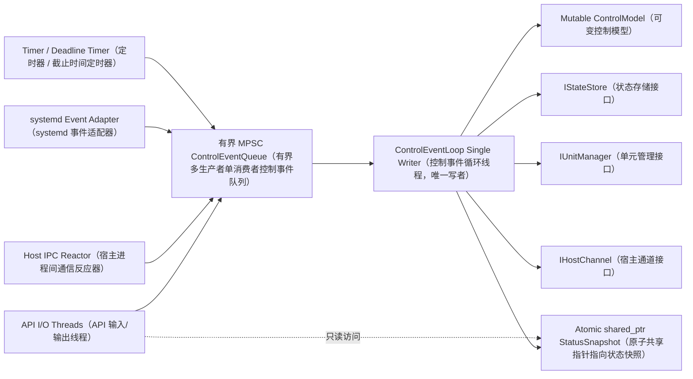
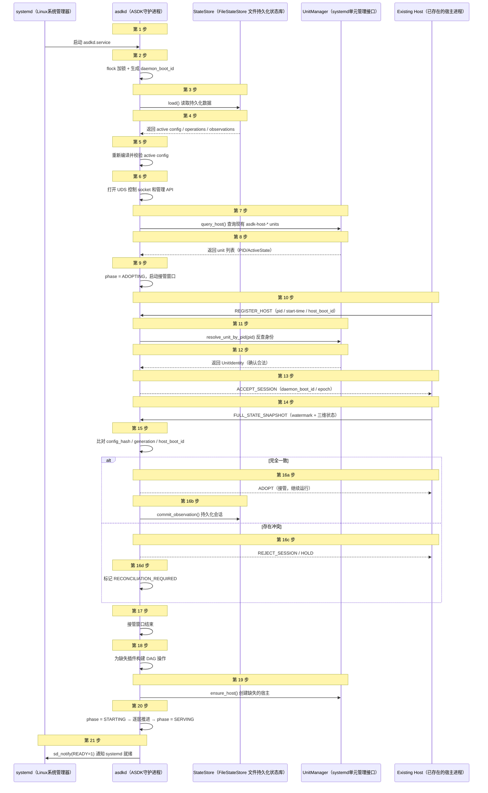
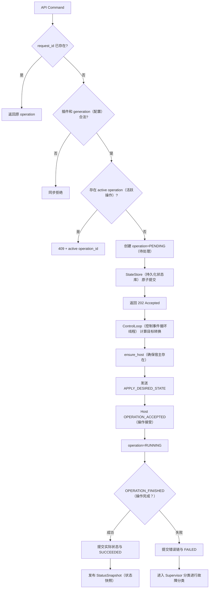
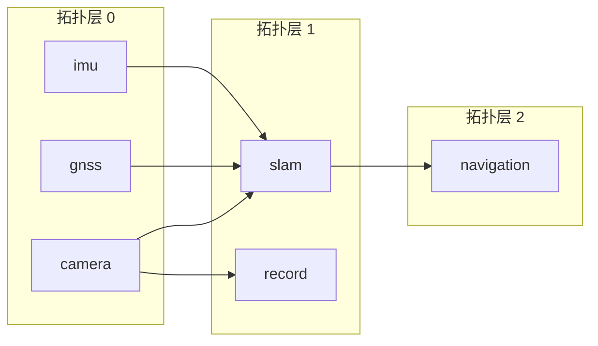
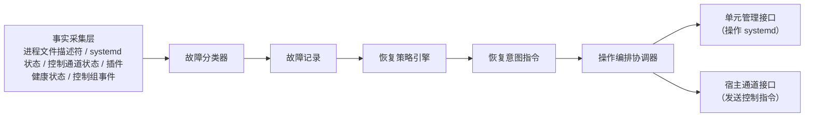
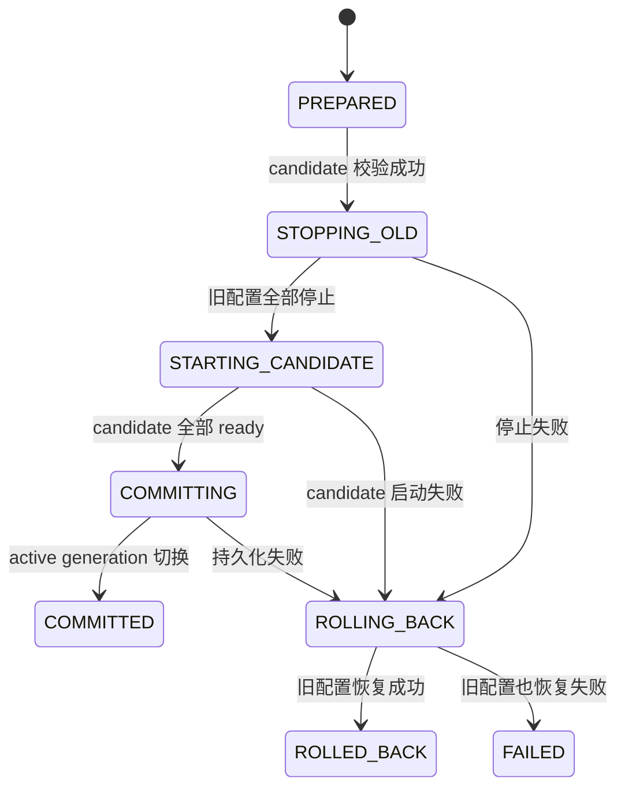

# 5. M04：asdkd 控制循环、编排与 Supervisor

## 5.1 模块职责

M04 负责系统的期望状态、操作编排、依赖顺序、宿主接管、恢复策略和配置事务。它不直接调用 socket、sd-bus 或 文件状态存储实现，而是依赖 M01 端口。

### 代码结构

```text
src/orchestrator/
├── daemon_controller.cpp
├── control_event_loop.cpp
├── startup_coordinator.cpp
├── adoption_coordinator.cpp
├── operation_coordinator.cpp
├── dag_executor.cpp
├── host_registry.cpp
├── desired_state_store.cpp
├── config_transaction_manager.cpp
├── reconciliation_engine.cpp
├── status_snapshot_publisher.cpp
└── service_state_deriver.cpp

src/supervisor/
├── fact_collector.cpp
├── failure_classifier.cpp
├── recovery_policy.cpp
├── restart_budget.cpp
├── portal_health_monitor.cpp
└── dependency_failure_propagator.cpp
```

## 5.2 单写者控制模型

为了避免 daemon 内部出现大量互斥锁，所有状态变更只允许在 `ControlEventLoop` 线程执行。

asdkd 作为一个控制中心，要同时面对三股“外力”：

用户通过 API 发来的指令（启动/停止插件）；

宿主进程通过 IPC 发来的事件（OperationFinished、HealthChange）；

内部定时器（超时检查、心跳检测）。

如果允许多个线程同时去修改 asdkd 内部的状态表（比如“当前 camera 插件是 RUNNING 还是 STOPPED”），那就必须用大量的 std::mutex（互斥锁）去保护。锁一多，就容易出现死锁



### 线程数量与职责

| 线程 | 数量 | 职责 |
|---|---:|---|
| ControlEventLoop | 1 | 唯一状态写者、操作编排、DAG 和恢复决策 |
| Host IPC Reactor | 1 | socket 收发、解码、投递事件，不修改业务状态 |
| HTTP/UDS I/O | 1～少量 | 请求解析、鉴权、读快照、投递 command |
| systemd adapter | 0 或 1 | 由 M03 实现；若 sd-bus 同步调用则不独立建线程 |
| 文件状态存储 | 0 或 1 | 首版允许由控制线程同步执行低频事务；后续可替换异步 adapter |

### 控制队列要求

- 队列必须有容量上限；
- 状态变化事件不可静默丢弃；
- heartbeat、重复资源快照允许合并；
- API 写操作队列满返回 `RESOURCE_EXHAUSTED`；
- 每类事件定义优先级：进程退出/操作结果 > API 控制 > health > heartbeat；
- ControlEventLoop 单次处理不得执行插件生命周期或长时间阻塞 I/O。

## 5.3 ControlModel

```cpp
struct ControlModel {
    DaemonBootId daemon_boot_id;
    MachineBootId machine_boot_id;
    DaemonPhase phase;

    DeploymentPlan active_plan;
    std::optional<ConfigTransaction> config_tx;

    std::unordered_map<HostId, HostControlState> hosts;
    std::unordered_map<PluginId, PluginControlState> plugins;
    std::unordered_map<OperationId, OperationRecord> operations;
    std::unordered_map<RequestId, OperationId> request_index;

    RestartBudgetTable restart_budgets;
    uint64_t snapshot_generation;
};
```

`DaemonPhase`：
asdkd的生命状态
```text
BOOTSTRAP -> 引导 / 启动初始化。更合适的说法是“引导中”。

VALIDATING -> 验证中 / 校验中。

ADOPTING -> 接管中（指接管现有宿主）。

STARTING -> 启动中（部署新宿主/插件）。

SERVING -> 运行中 / 服务中（完全就绪）。

UPDATING_CONFIG -> 配置更新中。

SHUTTING_DOWN -> 正在关闭 / 关闭中。

FAILED -> 失败 / 故障。


```

`/readyz` 只有在 `SERVING` 时返回成功。`ADOPTING` 和 `STARTING` 均表示 daemon 存活但尚未具备完整控制能力。

## 5.4 daemon 启动与宿主接管


通过接管窗口与状态快照，实现控制面热切换，无缝复用现有宿主进程。

依赖 systemd 反向校验 PID 与启动时间，阻断非法进程伪装接管。

依据配置代际比对决策接管或重建，避免宿主重复创建与资源冲突。

简单说，它让 ASDK 3.0 的控制面具备了热切换（Hot-Swap）能力。下面是它在技术层面做到的三个具体结果：



### 接管规则

| 条件 | 动作 |
|---|---|
| `host_id`、unit、PID/start-time、host boot ID 均合法，配置一致 | Adopt，保留现有 Runtime |
| Host 配置代际低于 active plan | 标记 `CONFIG_STALE`，默认不自动修改；由显式 reconcile 策略处理 |
| Host 配置代际高于 active plan | 视为未完成配置事务，进入事务恢复流程 |
| 同一 host ID 出现两个存活 host boot ID | 标记冲突，禁止自动选择，拒绝新的生命周期操作 |
| StateStore 有 RUNNING 记录但宿主不存在 | 以实际事实为准，创建恢复 operation |
| 宿主存在但 StateStore 无记录 | 验证身份后标记 orphan；默认隔离并要求显式 adopt 或 stop |
| snapshot 期间有新事件 | Host 以 watermark 为边界补发，daemon 先应用 snapshot 再应用后续事件 |

## 5.5 外部 operation 模型

### operation 状态

```text
PENDING 待处理
DISPATCHED   已提交
ACCEPTED  接收 
RUNNING 运行中
SUCCEEDED 成功
FAILED 失败
CANCELLED 取消
INTERRUPTED 中断
```

### 请求处理流程
request_id 主要是为了避免重复启动


### 执行策略

- 插件依赖由 `DeploymentPlan.startup_layers` 提供；
- 层与层之间串行；
- 同一层最多并行 `max_parallel_start` 个 operation；
- required dependency 未达到 `RUNNING + HEALTHY/DEGRADED` 时，不启动依赖者；
- optional dependency 失败不阻止启动，但依赖者初始 health 可标记 `DEGRADED`；
- 停止使用 `shutdown_layers`，同层仍可有界并行；
- thread group 内由 Host 按组内插件 DAG 执行，daemon 仍跟踪每个插件状态。



### 层失败行为

| 场景 | 行为 |
|---|---|
| 非关键插件失败 | 该分支按依赖策略停止，其他无关分支继续，服务状态 `DEGRADED` |
| 关键插件失败且不可恢复 | 依赖分支停止，服务状态 `FAILED`；不自动停止无关关键分支，除非系统策略指定 |
| 同层多个失败 | 分别记录 operation 和错误，不以第一个错误覆盖其他错误 |
| 启动超时 | 请求 Host 停止；无法安全停止则终止相应 host unit |
| thread group 中一个 Runtime 失败 | 整组进入恢复；其他 host 不受影响 |

## 5.7 Supervisor
故障分类和恢复策略

。

### RecoveryIntent

```cpp
struct RecoveryIntent {
    RecoveryAction action; // NONE, RESTART_HOST, STOP_BRANCH, QUARANTINE_HOST
    HostId host_id;
    std::optional<PluginId> root_plugin_id;
    FailureRecord failure;
    uint32_t attempt;
    uint64_t not_before_monotonic_ns;
};
```

### 重启预算

- 按 host ID 维护滑动窗口；
- 达到 `max_attempts` 后进入 quarantine；
- daemon 重启后预算从 StateStore 恢复；
- 手工 `asdkctl host recover` 可清除 quarantine，但必须记录审计日志；
- 配置更新导致的计划性重启不消耗故障预算。

## 5.8 配置更新事务

配置更新不在 Runtime 内原位修改配置，而是执行全量事务。



### 事务步骤

1. 编译 candidate plan，无运行时副作用；
2. 写入 `config_versions(status=CANDIDATE)` 和 `config_transactions(PREPARED)`；
3. 设置 daemon phase 为 `UPDATING_CONFIG`，拒绝新的插件级控制 operation；
4. 按旧计划逆 DAG 停止全部插件；
5. 将事务 phase 提交为 `STARTING_CANDIDATE`；
6. 按 candidate plan 创建/重配 host 并启动；
7. 全部目标达到 ready 后，原子将 candidate 标记为 `ACTIVE`、旧版本标记为 `PREVIOUS`；
8. 若任一步失败，停止 candidate 已启动部分，使用最后 COMMITTED plan 恢复；
9. 事务结束后恢复 `SERVING`。

### daemon 在事务中崩溃

新 daemon 读取未完成事务后采用确定策略：

```text
未看到 candidate 全部 COMMITTED
→ 进入 ADOPTING
→ 获取全部宿主真实快照
→ 停止使用 candidate_generation 的 Runtime
→ 恢复最后 COMMITTED generation
→ 将事务标记 ROLLED_BACK 或 FAILED
```

不根据旧持久化文件猜测 candidate 是否已经成功。

## 5.9 服务状态推导

```text
STARTING：至少一个目标插件正在启动，且无关键不可恢复失败
RUNNING：所有 critical 目标插件 HEALTHY，非关键目标无失败
DEGRADED：critical 可运行，但存在非关键失败、optional 依赖缺失或性能降级
FAILED：critical 插件不可恢复、配置回滚失败或状态冲突无法自动处理
STOPPED：所有 desired state 非 RUNNING
ADOPTING：daemon 正在接管，API 只读可用、写操作受限
```

服务状态为纯推导结果，不单独作为覆盖插件真实状态的总开关。

## 5.10 M04 实现任务

- [ ] M04-01：实现有界 ControlEventQueue 和单写者 ControlModel。
- [ ] M04-02：实现 StatusSnapshot 原子发布和只读查询。
- [ ] M04-03：实现 daemon 启动、接管窗口和 HostRegistry。
- [ ] M04-04：实现 operation 幂等、generation、持久化和完成恢复。
- [ ] M04-05：实现 DAG 层并行执行器和依赖失败传播。
- [ ] M04-06：实现 FailureClassifier、RecoveryPolicy 和 RestartBudget。
- [ ] M04-07：实现配置事务、回滚和崩溃恢复。
- [ ] M04-08：实现系统 shutdown 的逆 DAG 控制。
- [ ] M04-09：实现 asdkd Portal Health Monitor，并通过 M01 `IRecoveryRequester` 请求对端恢复。

## 5.11 M04 验收条件

1. 使用 `FakeUnitManager + FakeHostChannel + InMemoryStateStore` 可完整运行启动、停止、恢复和配置事务测试。
2. `kill -9 asdkd` 后，Fake Host 保持运行；新 daemon 能通过 snapshot adopt。
3. 同一 request ID 不重复执行；旧 generation 不覆盖新状态。
4. 单插件失败只传播到其依赖分支。
5. 配置 candidate 启动失败后可恢复最后 committed 配置。
6. 控制事件高压下无状态数据竞争，TSan 通过。
7. API 查询不需要获取 ControlModel 写锁。

---
