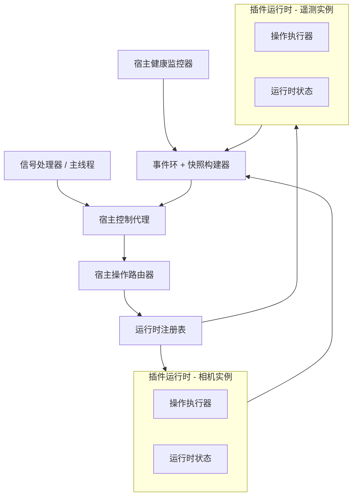
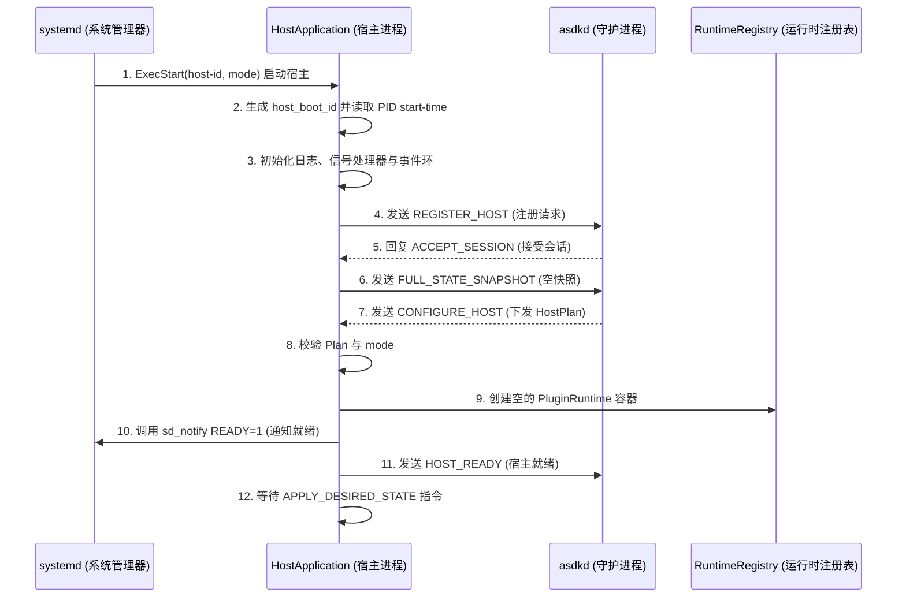

# 6. M05：宿主进程框架

## 6.1 统一宿主二进制

ASDK 3.0 只提供一个宿主程序：

```text
/opt/asdk/v3/bin/asdk-plugin-host
```

启动参数：

```text
--host-id <id>
--mode process|thread
--control-socket /run/asdk/host-control.sock
--runtime-dir /run/asdk/hosts/<id>
--protocol-major 3
```

插件路径、私有配置和 channel 不通过命令行或环境变量传递，由 daemon 在认证会话中发送 `CONFIGURE_HOST`。

## 6.2 宿主内部组件

主要是将控制指令和事件状态分开，这里和数据无关数据走的dds和共享内存



### 类划分

```text
HostApplication
├── HostIdentity
├── HostControlAgent
├── HostPlanHolder
├── RuntimeRegistry
├── HostOperationRouter
├── HostEventJournal
├── HostSnapshotBuilder
├── HostHealthMonitor
└── SignalCoordinator
```

## 6.3 宿主线程模型

| 线程 | process 模式 | thread 模式 | 说明 |
|---|---:|---:|---|
| Main/Signal | 1 | 1 | 初始化、signal、退出协调 |
| IPC/Reconnect | 1 | 1 | epoll、认证、命令收发、事件补发 |
| Runtime Operation Worker | 1 | 每 Runtime 1 | 生命周期操作串行执行 |
| Host Health Scheduler | 1 | 1 | 低频 health、资源事实采样 |
| Runtime Callback Executor | Runtime 配置 | 每 Runtime 独立 | M06/M07 管理 |
| Plugin TaskGroup | Runtime 配置 | 每 Runtime 独立 | 插件业务任务 |
| Fast DDS internal | Fast DDS 管理 | Fast DDS 管理 | 不直接执行长业务逻辑 |

process 模式下 `RuntimeRegistry.size()` 必须始终为 0 或 1。thread 模式允许多个 Runtime，但每个 Runtime 独立操作队列、DdsSession、TaskGroup 和 CallbackGate。

## 6.4 Host 启动流程

宿主进程启动后，必须先完成身份注册、接收配置、创建 Runtime 容器、通知 systemd 就绪，最后才进入等待状态。在收到 APPLY_DESIRED_STATE（应用期望状态）指令之前，宿主绝不主动加载任何插件，确保了 asdkd（大脑）对插件启动时机的绝对控制权，避免了“宿主先跑起来但大脑还没准备好发配置”的时序错乱。



若 daemon 不可用，刚创建且从未收到 HostPlan 的宿主不得自行加载插件；它只重连或在启动超时后退出。已经配置并运行的宿主在 daemon 断开后继续运行。

## 6.5 HostControlAgent
承担着 “收指令、发状态、管会话” 三大核心职责
### 职责

- 建立和重建 daemon session；
- 校验 daemon peer；
- 维护 sequence、ack、connection epoch；
- 将控制命令投递给 HostOperationRouter；
- 发送 operation/health/resource 事件；
- 维护 bounded EventRing；
- 重连后先发 snapshot，再补发 watermark 后事件。

### EventRing

```cpp
struct HostEventRecord {
    uint64_t sequence;
    HostEventType type;
    std::vector<std::byte> encoded_payload;
    uint64_t monotonic_ns;
};
```

要求：

- 默认同时限制事件条数和总字节数；
- operation finished、health failed、host fatal 不得被低优先级事件挤出；
- resource snapshot 和 heartbeat 可只保留最新一条；
- 若关键历史被覆盖，snapshot 设置 `history_lost=true`；
- daemon 看到 `history_lost` 后必须以完整快照为准，不得依赖增量事件恢复。

## 6.6 HostOperationRouter
（宿主操作路由器）是宿主进程内部的 “指令调度中心”。指令的查表、路由、派发
```cpp
class HostOperationRouter {
public:
    Result<void> submit(const ApplyDesiredStateCommand& command);
    RuntimeSnapshot snapshot(const PluginId&) const;
    Result<void> drain_all(uint64_t deadline_ns);
};
```

路由规则：

1. 校验 session epoch、host ID、plugin ID、config generation；
2. process 模式拒绝非唯一 plugin ID；
3. 将命令投递到对应 Runtime 的单消费者 operation queue；
4. 队列接受后立即发送 `OPERATION_ACCEPTED`；
5. Runtime 每个阶段发送 `OPERATION_PROGRESS`；
6. 完成后将状态和错误链写入 HostEventJournal；
7. 相同 operation ID 直接返回缓存结果，不重复执行。

## 6.7 daemon 断开期间行为

```text
daemon socket 断开
→ HostControlAgent 标记 CONTROL_DISCONNECTED
→ 不停止 Runtime / DDS / SHM
→ 已接受 operation 继续执行到完成或失败
→ 完成事件写入 EventRing
→ 拒绝来源不明的新 operation
→ HostHealthMonitor 继续本地工作
→ 周期性重连
→ 新 session 建立后发送完整 snapshot + watermark 后事件
```

宿主不得在 daemon 离线时反复自行重启插件。若出现段错误、OOM、无法安全停止等宿主级故障，由进程直接退出，等待新 daemon 根据 systemd 事实执行恢复。

## 6.8 SIGTERM 与系统关机

宿主收到 SIGTERM 时不依赖 daemon：

1. 停止接受新 operation；
2. 根据已缓存 HostPlan，按组内逆 DAG 停止 Runtime；
3. 每个 Runtime 执行 `RUNNING → STOPPED → LOADED → UNLOADED`；
4. flush 关键事件到 journald；
5. 在 `TimeoutStopSec` 内退出；
6. 超时由 systemd 根据 `KillMode=control-group` 强制终止。

这样即使系统关机时 daemon 已不可用，宿主仍能完成本地资源清理。

## 6.9 thread 模式准入实现

thread 模式不是只靠配置字符串启用。配置编译和 Host 启动都必须校验：

- Manifest 声明 `THREAD_MODE_SAFE`；
- 插件不安装 signal handler、不调用 fork、不修改 cwd/umask/locale/environment；
- 长期任务全部通过 Task API；
- 外部 FD 和 vendor handle 全部登记；
- 组内插件使用相同 UID/GID 和安全属性；
- 组内可用性等级兼容；
- 任一 Runtime 不可安全停止时，允许重启整组。

首个垂直切片只实现 process 模式。thread 模式复用相同 RuntimeRegistry 和协议，在 process 模式验收后开放。

## 6.10 M05 实现任务

- [ ] M05-01：实现 HostApplication 启动、identity、sd_notify 和 signal。
- [ ] M05-02：实现 HostControlAgent、重连、sequence/ack 和 EventRing。
- [ ] M05-03：实现 HostPlanHolder 和配置代际校验。
- [ ] M05-04：实现 RuntimeRegistry 和 per-Runtime operation queue。
- [ ] M05-05：实现 snapshot、event watermark 和 history lost。
- [ ] M05-06：实现 daemon 离线继续运行与重连接管。
- [ ] M05-07：实现 SIGTERM 本地逆序清理。
- [ ] M05-08：在 process 模式稳定后实现 thread group。

## 6.11 M05 验收条件

1. 使用 `FakeRuntime` 可独立验证注册、命令路由、重连和事件补发。
2. 断开 daemon socket 后 Runtime 不被停止。
3. operation 完成发生在断线期间时，新 daemon 能从 snapshot/result cache 恢复结果。
4. process 模式拒绝第二个 Runtime。
5. 旧 session、旧 epoch、旧 config generation 命令均被拒绝。
6. SIGTERM 能在 daemon 不存在时完成 Runtime 本地停止。
7. EventRing 溢出时不会丢失“存在历史缺口”这一事实。

---
