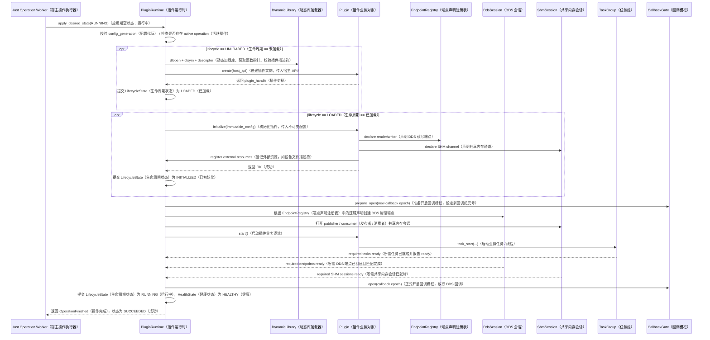
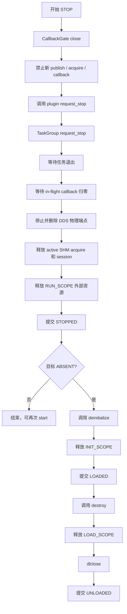
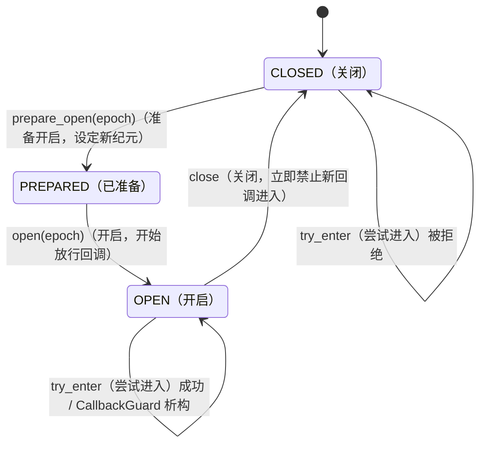

# 7. M06：PluginRuntime 与受控资源代理


### 核心接口

```cpp
class PluginRuntime {
public:
    explicit PluginRuntime(RuntimeDependencies deps, PluginPlan plan);

    OperationResult apply_desired_state(
        const ApplyDesiredStateCommand& command);

    PluginActualState snapshot() const;
    ResourceSnapshot resource_snapshot() const;
    Result<HealthState> poll_health(uint64_t deadline_ns);
};
```

`apply_desired_state()` 只能由 Runtime 自己的 operation worker 调用，不允许并发进入。

## 7.3 生命周期实现语义

### 生命周期与资源域

| lifecycle | 必须存在 | 不得存在 |
|---|---|---|
| `UNLOADED` | Runtime 容器、PluginPlan | `.so`、descriptor、handle、插件资源 |
| `LOADED` | `.so`、descriptor、handle、LOAD_SCOPE | 初始化资源、运行任务、物理端点 |
| `INITIALIZED` | LOADED 内容、配置快照、逻辑端点声明、INIT_SCOPE | 运行任务、启用回调、物理端点 |
| `RUNNING` | INITIALIZED 内容、RUN_SCOPE、物理端点、任务、开放回调 | 无 |
| `STOPPED` | INITIALIZED 内容、可重启逻辑声明 | 运行任务、物理端点、在途回调、active SHM acquire |

### 目标状态规划

```cpp
Result<std::vector<LifecycleStep>> plan_transition(
    LifecycleState actual,
    DesiredState desired);
```

| actual | desired | steps |
|---|---|---|
| UNLOADED | RUNNING | LOAD → INITIALIZE → START |
| LOADED | RUNNING | INITIALIZE → START |
| INITIALIZED | RUNNING | START |
| STOPPED | RUNNING | START |
| RUNNING | STOPPED | STOP |
| INITIALIZED | STOPPED | 保持 INITIALIZED 或按策略转 STOPPED；首版保持 INITIALIZED |
| UNLOADED | STOPPED | LOAD → INITIALIZE，不自动 start |
| 任意 | ABSENT | STOP（若需）→ DEINITIALIZE → UNLOAD |
| 已达到目标 | 同目标 | 幂等成功 |

为避免 `STOPPED` 和 `INITIALIZED` 语义混乱，外部 desired state 只表达业务目标；Host 返回的实际 lifecycle 保持精确。

## 7.4 完整启动时序



### ready 条件

插件 `start()` 返回 `OK` 不代表启动完成。Runtime 只有在以下全部满足后才提交 `RUNNING`：

- `start()` 已返回成功；
- 所有 `required=true` 的 Task 已调用 `report_ready()`；
- 所有 required DDS writer/reader 已创建；
- 配置要求等待匹配的端点已达到匹配数量；
- required SHM publisher/consumer session 已建立；
- CallbackGate 已成功打开；
- operation deadline 尚未到达。

## 7.5 完整停止与卸载时序


判断逻辑完全由 asdkd 根据用户指令（stop vs unload）或配置计划决定，宿主只是被动接收指令中的 DesiredState 枚举值并机械执行。如果目标是 STOPPED，流程停在 STOPPED；如果目标是 ABSENT，流程继续走到 UNLOADED。
### 不可安全停止的处理

以下任一情况返回 `UNSAFE_TO_UNLOAD`，Host 必须终止整个宿主边界：

- plugin 生命周期函数本身阻塞超过 deadline；
- TaskGroup 存在无法 join 的长期线程；
- CallbackGate 无法排空；
- DDS listener 仍能进入旧 callback epoch；
- ResourceRegistry cleanup 失败且可能继续访问插件代码；
- `deinitialize()` 或 `destroy()` 发生异常；
- 发现未登记的活动线程或 FD 无法归属。

Runtime 不使用 `pthread_cancel`，不尝试从外部强杀单个业务线程，也不在不安全状态下执行 `dlclose`。

## 7.6 TaskGroup

### C ABI 任务函数

```c
typedef void (*asdk_task_fn_v3)(
    asdk_task_context_v3* context,
    void* user_data);
```

### C++ 实现接口

```cpp
class TaskGroup {
public:
    Result<TaskId> start(TaskOptions options,
                         AsdkTaskFunction function,
                         void* user_data);

    void request_stop();
    Result<void> wait_required_ready(uint64_t deadline_ns);
    Result<void> wait_all(uint64_t deadline_ns);
    std::vector<TaskStatus> snapshot() const;
};
```

### TaskContext

```cpp
class TaskContext {
public:
    bool should_stop() const noexcept;
    void report_ready();
    void report_degraded(ErrorInfo);
    void report_error(ErrorInfo);
};
```

### TaskOptions

```cpp

struct TaskOptions {
    std::string name;
    bool required_ready;
    uint32_t ready_timeout_ms;
    std::optional<std::vector<uint32_t>> cpu_affinity;
    SchedulingClass scheduling_class;
    int scheduling_priority;
};
```

### 实现规则

- 禁止 detached 线程；
- 任务入口捕获所有异常；
- `report_ready()` 只允许一次；
- required task 未 ready 前意外退出，启动失败；
- RUNNING 后 required task 意外退出，health 转为 FAILED；
- `request_stop()` 幂等；
- `wait_all()` 先复制待 join 线程句柄，再释放注册表锁后 join；
- Runtime 析构前所有任务必须 join；
- Task ID 在单 Runtime 内不复用，避免旧诊断记录混淆。

## 7.7 CallbackGate
CallbackGate（回调栅栏）是 PluginRuntime 内部的一个“单向可控阀门”，位于 Fast DDS 网络接收线程 和 插件业务回调函数之间。   
```cpp
class CallbackGate {
public:
    Result<void> prepare_open(uint64_t next_epoch);
    Result<CallbackGuard> try_enter(uint64_t callback_epoch);
    void open(uint64_t callback_epoch);
    void close();
    Result<void> wait_drained(uint64_t deadline_ns);
    uint32_t in_flight() const;
};
```

### 状态机

回调Gate 的状态机如下：



约束：

- `close()` 与 `try_enter()` 使用同一原子状态协议；
- guard 创建成功后递增 in-flight，析构递减；
- callback 携带创建端点时的 epoch，旧 epoch 一律拒绝；
- `prepare_open()` 只允许在 CLOSED 且 in-flight=0 时执行；
- 插件回调不持有 Runtime 生命周期锁。

## 7.8 EndpointDeclarationRegistry端点声明注册表
它的核心作用是：在插件 initialize（初始化）阶段，记录插件“想用什么通道（Topic）”、“想发还是想收”、“数据来了调哪个回调函数”，但在 start（启动）阶段之前，绝不实际创建任何 Fast DDS 物理端点（Participant/Reader/Writer）。
插件在 `initialize()` 中只声明逻辑端点：

```cpp
struct EndpointDeclaration {
    ChannelId channel_id;
    Direction direction;
    bool required;
    CallbackMode callback_mode;
    uint32_t queue_capacity;
    SerializedDataCallback callback;
    void* callback_context;
};
```

规则：

- 相同 channel 重复声明且参数完全一致时幂等成功；
- 参数不一致返回 `ALREADY_EXISTS`；
- initialize 结束后 Registry 冻结；
- start 时 DdsSession 根据 Registry 创建物理端点；
- stop 时销毁物理端点，但保留逻辑声明；
- deinitialize 时清空逻辑声明；
- 这样 `STOPPED → RUNNING` 不需要重新调用 `initialize()`。


## 7.9 ResourceRegistry资源注册表
件占用的每一个设备 FD、每一块映射内存、每一个第三方 SDK 句柄，都必须在此登记，并附上“拆房合同”（清理回调）。插件停止时，Runtime 按“先拆违建（RUN_SCOPE）、再拆主体（INIT_SCOPE）、最后拆地基（LOAD_SCOPE）”的顺序强制收房。

### 资源域

```text
LOAD_SCOPE
INIT_SCOPE
RUN_SCOPE
```

### 支持资源

```text
FILE_DESCRIPTOR
MMAP_REGION
TIMER_FD
EVENT_FD
VENDOR_HANDLE
DEVICE_SESSION
CUSTOM_CLEANUP
```

```cpp
struct ResourceRecord {
    ResourceId id;
    ResourceKind kind;
    ResourceScope scope;
    uint64_t creation_sequence;
    uint64_t native_handle;
    CleanupFunction cleanup;
    void* cleanup_context;
    ResourceState state;
};
```

### 外部资源登记 API

```c
asdk_status_code asdk_resource_adopt_v3(
    asdk_resource_kind kind,
    uint64_t native_handle,
    asdk_resource_scope scope,
    asdk_resource_cleanup_fn cleanup,
    void* cleanup_context,
    asdk_resource_id* out_id);
```

这允许 Camera、LiDAR、串口等插件使用第三方 SDK，但要求它们把长期 handle 和清理函数交给 Runtime 登记。Runtime 按 scope 和 creation sequence 的逆序清理。

### 审计规则

- Runtime 记录注册资源数；
- Host 同时扫描 `/proc/<pid>/fd` 和 `/proc/<pid>/task`；
- 注册表只能解释“已知资源”，不能假定未登记资源不存在；
- 超过绝对预算立即告警；
- 连续多个周期增长且无法由 operation 解释时标记泄漏嫌疑；
- 是否重启由 Supervisor 决定，不由 ResourceRegistry 自行执行。

## 7.10 Health 检查

`descriptor->health()` 在 HostHealthMonitor 触发，但必须经过 Runtime 串行保护，不能与 initialize/start/stop/deinitialize 并发。

```text
IDLE + RUNNING
→ 提交 health probe
→ 限时调用 descriptor->health
→ HEALTHY / DEGRADED / FAILED
→ 状态变化才产生事件
```

若 `health()` 本身阻塞，视为插件不可安全控制，终止独占 host 或整个 thread group。

## 7.11 M06 实现任务

- [ ] M06-01：实现 DynamicLibraryHolder、路径二次校验和 descriptor validator。
- [ ] M06-02：实现 Runtime 三维状态和 transition planner。
- [ ] M06-03：实现 operation worker、deadline 和阶段进度事件。
- [ ] M06-04：实现 TaskGroup、ready、stop、join 和异常边界。
- [ ] M06-05：实现 CallbackGate epoch 和 drain。
- [ ] M06-06：实现 EndpointDeclarationRegistry 和 start/stop 重建。
- [ ] M06-07：实现 ResourceRegistry、scope 逆序清理和审计快照。
- [ ] M06-08：实现 DDS/SHM Fake 注入和 Runtime 单元测试。
- [ ] M06-09：实现不安全清理时的 `UNSAFE_TO_UNLOAD` 上报。

## 7.12 M06 验收条件

1. 示例插件可完整执行 `load → initialize → start → stop → start → stop → deinitialize → unload`。
2. 每一步失败均保持真实 lifecycle，并按逆序释放已创建资源。
3. start 返回成功但 required task 未 ready 时，operation 最终失败。
4. stop 后无插件任务、物理 DDS 端点、active SHM acquire 或在途回调。
5. 任务不退出或 callback 不排空时不执行危险 `dlclose`。
6. ASan、UBSan、LSan 通过；TaskGroup/CallbackGate 的 TSan 专项通过。
7. Runtime 测试不需要真实 Fast DDS 或共享内存实现。

---
