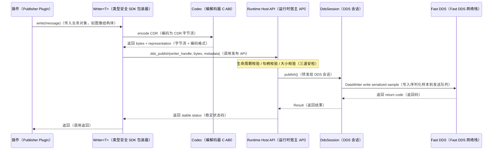

# 8. M07：Fast DDS 数据适配

## 8.1 模块目标

M07 将 Runtime 的中间件无关 `ITransportSession` 映射到 Fast DDS 3.6.x。它不认识 daemon、operation、StateStore 或 Portal。

### 代码结构

```text
src/transport_fastdds/
├── fastdds_session_factory.cpp
├── fastdds_session.cpp
├── participant_registry.cpp
├── type_support_catalog.cpp
├── serialized_cdr_type.cpp
├── topic_registry.cpp
├── writer_impl.cpp
├── reader_impl.cpp
├── reader_queue.cpp
├── callback_executor.cpp
├── qos_resolver.cpp
├── discovery_listener.cpp
└── endpoint_metrics.cpp
```

## 8.2 每 Runtime 独立 DdsSession

```cpp
class FastDdsSession final : public ITransportSession {
public:
    Result<WriterHandle> declare_writer(const ChannelDescriptor&) override;
    Result<ReaderHandle> declare_reader(
        const ChannelDescriptor&, SerializedDataCallback) override;
    Result<void> start() override;
    Result<void> stop(uint64_t deadline_ns) override;
    Result<void> publish(
        WriterHandle, ByteView, const SampleMetadata&) override;
};
```

每个 Runtime：

- 拥有独立 `FastDdsSession`；
- 每个 domain ID 最多创建一个独立 Participant；
- 不与其他 Runtime 共享 Reader、Writer、Listener 或回调队列；
- endpoint handle 只在该 Runtime 内有效；
- stop 后全部物理 endpoint 被删除，逻辑声明仍由 M06 保留；
- deinitialize 后 DdsSession 对象可销毁。

## 8.3 消息类型包

插件 ABI 和公共 SDK 不暴露 Fast DDS 类型。每组 IDL 生成一个消息类型包：

```text
interfaces/idl/camera.idl
        │
        ├── generated/message-codec/camera_types.hpp
        ├── generated/message-codec/camera_codec_v1.h
        ├── libasdk_codec_camera.so.1
        ├── libasdk_typesupport_camera.so.1
        └── camera.type-manifest.json
```

### 插件侧

- 插件只包含生成的数据结构和 `asdk::Writer<T>/Reader<T>`；
- `Writer<T>` 调用 codec C ABI，把业务对象编码为 CDR 字节；
- `Reader<T>` 把 Runtime 提供的 CDR 字节解码为业务对象；
- 插件不包含 `DataWriter`、`DataReader`、`DomainParticipant` 等 Fast DDS 类型。

### Host 侧

- 根据 `type_name + schema_hash` 从 `TypeSupportCatalog` 加载受信任 type-support 包；
- type-support 包提供 type name、schema hash、TypeObject 元数据、key 提取和最大序列化长度；
- `SerializedCdrTopicDataType` 将已经编码的 CDR 字节写入 Fast DDS payload；
- 接收端只输出 CDR 字节，不在 Host 中构造插件业务 C++ 对象。

### 类型描述 ABI

```c
typedef struct asdk_message_type_descriptor_v1 {
    uint32_t struct_size;
    uint32_t abi_version;
    asdk_string_view type_name;
    asdk_hash256 schema_hash;
    uint32_t max_serialized_size;
    uint8_t is_keyed;

    asdk_bytes_view serialized_type_object;
    asdk_status_code (*extract_key_from_cdr)(
        asdk_bytes_view cdr,
        asdk_mut_bytes_view key_buffer,
        uint32_t* key_size);
} asdk_message_type_descriptor_v1;
```

### 必须先完成的技术验证

在冻结消息类型包 ABI 前，必须用 Fast DDS 3.6.x 验证：

```text
普通 Fast DDS-Gen 生成端
↔ SerializedCdrTopicDataType 端
```

验证项：

1. XTypes / TypeObject 匹配；
2. keyed 与 non-keyed 类型；
3. XCDR1/XCDR2 表示；
4. reliable / best-effort；
5. 跨进程和跨机互通；
6. schema hash 不一致时拒绝创建端点。

若目标版本无法稳定注册自定义 TypeObject，则采用备选实现：Host 动态加载同工具链生成的 typed adapter，由 adapter 内部完成 CDR 与 generated type 的转换。该备选只影响 M07 内部，不改变插件 ABI、Runtime 接口和配置格式。

## 8.4 端点键与去重

```cpp
struct EndpointKey {
    uint32_t domain_id;
    std::string topic_name;
    std::string type_name;
    Hash256 type_schema_hash;
    Direction direction;
    Hash256 qos_profile_hash;
    PayloadMode payload_mode;
};
```

- 同一 Runtime 内 EndpointKey 完全相同才允许复用；
- 任一字段不同都创建独立端点；
- Topic Registry 只在当前 Runtime 内共享；
- Participant 不跨 Runtime 共享；
- payload mode 为 SHM 时，DDS 类型必须是对应的 `LargeDataHeader` 类型。

## 8.5 Reader 回调模型

Fast DDS listener 默认不直接进入插件。


### ReaderQueue 策略

```text
DROP_OLDEST
DROP_NEWEST
FAIL_READER
```

- `sensor_best_effort` 默认 `DROP_OLDEST`；
- 可靠控制类通道默认 `FAIL_READER`，不能在 listener 中无限阻塞；
- queue capacity 在配置中固定；
- overflow 必须计数并生成 health 事件；
- callback executor 属于 Runtime，不属于 Fast DDS；
- `DIRECT` 模式仅用于经过审核的极短回调，并仍须经过 CallbackGate。

## 8.6 Writer 发布模型



发布路径规则：

- Runtime 不允许插件发布超过类型包声明的最大序列化长度；
- 发布前校验 writer handle 属于当前 Runtime 和当前 start epoch；
- stop 开始后新 publish 返回 `INVALID_STATE`；
- 插件传入字节在 `publish()` 返回后即可释放；
- M07 可使用预分配 buffer pool 减少小消息拷贝，但不得把插件内存保存到异步线程后继续访问。

## 8.7 端点启动和停止

### start

```text
冻结逻辑声明
→ 加载 type-support
→ 为每个 domain 创建 Participant
→ 创建 Publisher/Subscriber
→ 创建 Topic
→ 创建 Reader/Writer
→ 安装 listener
→ 启动 callback executor
→ 根据配置等待 required match
→ 返回 ready
```

### stop

```text
上层先关闭 CallbackGate
→ listener 停止入队
→ 停止 callback executor 接收新任务
→ 排空或丢弃队列（按 stop policy）
→ 删除 Reader/Writer
→ 删除 Topic/Publisher/Subscriber
→ 删除 Participant
→ 返回 stop 完成
```

M07 不调用插件 `request_stop()`，也不决定 stop 顺序；这些由 M06 完成。

## 8.8 QoS Profile Catalog

QoS 不允许插件直接构造 Fast DDS QoS 对象。配置只引用稳定 profile 名：

```text
sensor_best_effort
sensor_reliable
control_reliable
state_transient_local
bulk_best_effort
```

`QosResolver` 将 profile 映射为具体 Fast DDS 配置，并计算 `qos_profile_hash`。发布端和订阅端可通过状态接口展示实际生效值。

每个 profile 必须显式设置：

- reliability；
- history kind/depth；
- resource limits；
- durability；
- lifespan；
- deadline；
- liveliness；
- publish mode；
- max blocking time；
- data representation。

不得依赖 Fast DDS 版本默认值作为 ASDK 对外行为。

## 8.9 M07 实现任务

- [ ] M07-01：完成 Fast DDS 3.6.x 工具链与 Serialized CDR 互通 spike。
- [ ] M07-02：实现消息类型包生成、Manifest 和 schema hash。
- [ ] M07-03：实现 TypeSupportCatalog 和动态加载校验。
- [ ] M07-04：实现 Participant/Topic/Endpoint Registry。
- [ ] M07-05：实现 Writer serialized publish。
- [ ] M07-06：实现 ReaderQueue、CallbackExecutor 和 overflow 策略。
- [ ] M07-07：实现 QoS Catalog 和实际 QoS 快照。
- [ ] M07-08：实现 start/stop 独立销毁和回调静默测试。

## 8.10 M07 验收条件

1. V3 producer 与 V3 consumer 可跨进程发送小消息。
2. V3 serialized 端与普通 Fast DDS-Gen 端互通。
3. 两个 Runtime 可独立创建和销毁 Participant，不互相影响。
4. stop 返回后旧 listener 不再进入插件回调。
5. schema hash、type name、payload mode 或 QoS 不一致时端点创建失败。
6. ReaderQueue 满时执行明确策略并产生指标，不阻塞 Fast DDS 内部线程。
7. `asdkd` 二进制不因 M07 引入 Fast DDS 依赖。

---
