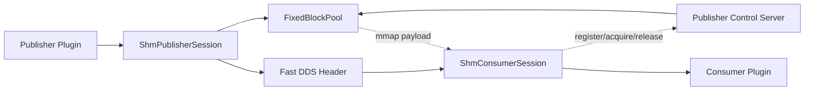
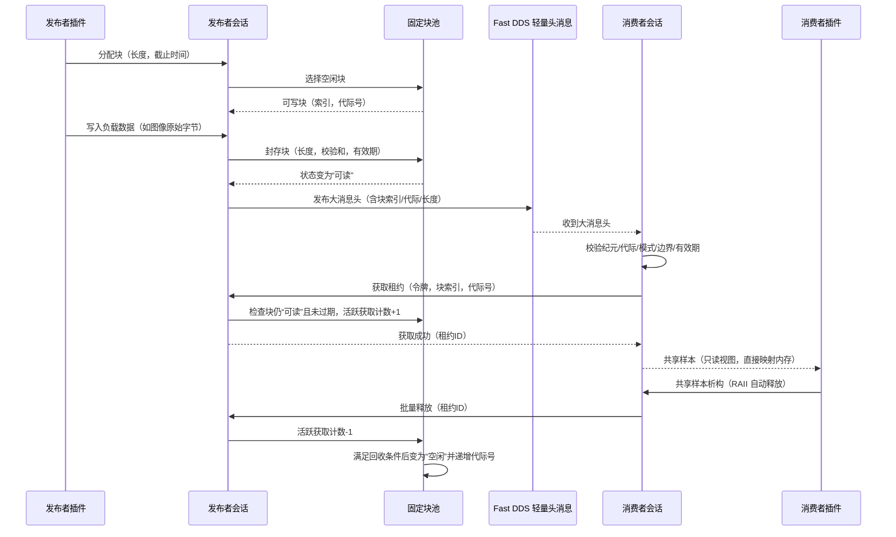
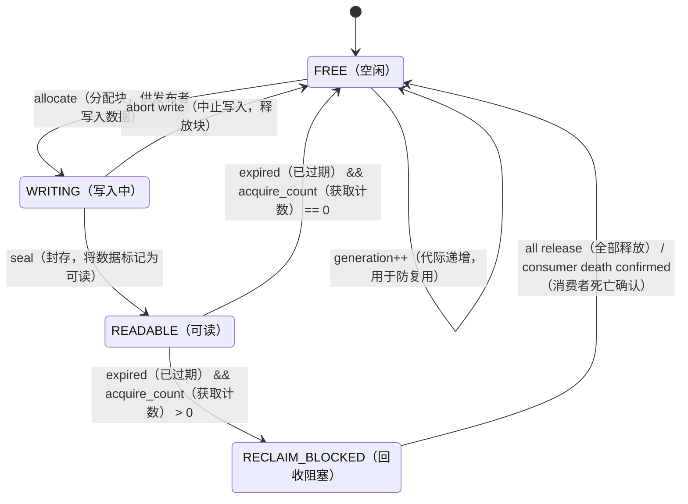

# 9. M08：本机共享内存大数据通道

## 9.1 首版范围

首版不实现通用 allocator，而是每个 publisher channel 创建一个固定 block 大小、固定 block 数量的独立内存池。

```text
一个 SHM publisher channel
= 一个 region
+ N 个等长 block
+ 一个 publisher control socket
+ 若干 consumer session
```

优势：

- 无碎片整理；
- block index 和 generation 可直接定位；
- 容量可在配置阶段精确计算；
- 恢复扫描简单；
- 不会因一个通道耗尽而破坏其他通道。

## 9.2 组件结构



### 代码结构

```text
src/shm_posix/
├── shm_session_factory.cpp
├── publisher_session.cpp
├── consumer_session.cpp
├── fixed_block_pool.cpp
├── region_layout.cpp
├── control_server.cpp
├── control_client.cpp
├── consumer_registry.cpp
├── lease_table.cpp
├── safe_reclaimer.cpp
├── backpressure.cpp
└── recovery_scanner.cpp
```

## 9.3 Region 布局

```text
+-----------------------------+
| RegionHeader                |
+-----------------------------+
| BlockMetadata[block_count]  |
+-----------------------------+
| Payload Block 0             |
+-----------------------------+
| Payload Block 1             |
+-----------------------------+
| ...                         |
+-----------------------------+
| Payload Block N-1           |
+-----------------------------+
```

```cpp
struct RegionHeaderV1 {
    uint32_t magic;
    uint16_t protocol_major;
    uint16_t protocol_minor;
    uint64_t publisher_epoch;
    Hash256 channel_schema_hash;
    uint32_t block_count;
    uint32_t block_capacity;
    uint64_t payload_offset;
    uint64_t region_size;
};

enum class BlockState : uint8_t {
    FREE,
    WRITING,
    READABLE,
    RECLAIM_BLOCKED
};

struct BlockMetadataV1 {
    std::atomic<uint8_t> state;
    uint32_t block_generation;
    uint32_t length;
    uint32_t checksum_crc32c;
    uint64_t sequence;
    uint64_t publish_monotonic_ns;
    uint64_t valid_until_monotonic_ns;
    uint32_t active_acquire_count;
    uint32_t reserved;
};
```

发布者是 metadata 唯一写入者。消费者只通过控制协议申请 lease，并以只读方式映射 payload。

## 9.4 LargeDataHeader

DDS 中只发布固定大小 header：

```cpp
struct LargeDataHeaderV1 {
    uint32_t protocol_version;
    PublisherId publisher_id;
    uint64_t publisher_epoch;
    ChannelId channel_id;
    RegionId region_id;

    uint32_t block_index;
    uint32_t block_generation;
    uint32_t length;
    uint32_t capacity;

    Hash256 data_type_hash;
    uint64_t sequence;
    uint64_t capture_time_ns;
    uint64_t publish_monotonic_ns;
    uint64_t valid_until_monotonic_ns;
    uint32_t checksum_crc32c;
    uint32_t flags;
};
```

Header 不包含可直接打开任意文件的路径。消费者必须先完成受认证注册并持有 region capability。

## 9.5 消费者注册

控制 socket：

```text
/run/asdk/hosts/<publisher-host>/shm/<channel-id>.sock
```

注册消息包含：

```text
consumer_runtime_id
consumer_host_id
consumer_host_boot_id
consumer_pid
consumer_pid_start_time
channel_id
schema_hash
registration_nonce
```

发布者校验后返回：

```text
consumer_token
region_id
region_capability
registration_generation
region file descriptor（SCM_RIGHTS）
block_count / block_capacity / publisher_epoch
```

发布者为每个 consumer 建立：

- 受认证控制连接；
- pidfd 或 PID start-time 事实；
- active lease 表；
- bounded release batch 队列；
- registration generation。

DDS matched reader 数只用于诊断，不代替消费者注册。

## 9.6 发布、acquire 与 release



### acquire 规则

- header 的 `publisher_epoch` 必须等于当前 session；
- block index 不越界；
- generation 必须匹配；
- state 必须为 `READABLE`；
- 当前 monotonic 时间不得超过 `valid_until`；
- consumer token 和 registration generation 必须有效；
- 每个 consumer 对同一 block 最多持有一个 active lease；
- acquire 成功后才能向插件返回 payload view。

### release 规则

- `SharedSample` 使用 RAII；
- release 在本地先进入有界 batch queue，由 control client 批量发送；
- 重复 release 幂等忽略并计数；
- consumer 正常退出前必须 flush release queue；
- consumer 崩溃后，发布者只有确认进程退出，才能回收该 consumer 的全部 lease。

## 9.7 Block 状态机
Block 状态机定义了 SHM 块从“空闲”到“写入”再到“可读”最后“回收”的完整生命周期，并通过 RECLAIM_BLOCKED 状态和 generation++ 机制，确保已过期但仍在被读取的块永远不会被覆写，同时通过 pidfd 消费者死亡检测实现无 daemon 参与的自动安全回收。



### 回收条件

```text
state=READABLE
AND current_time >= valid_until
AND active_acquire_count=0
→ 可回收
```

或：

```text
state=RECLAIM_BLOCKED
AND 所有 lease 已 release
→ 可回收
```

严禁：

- 仅凭 consumer heartbeat 超时释放 lease；
- 覆盖 `READABLE` 或 `RECLAIM_BLOCKED` block；
- daemon 离线时停止回收；
- daemon 作为唯一恢复执行者；
- 复用 block 时不递增 generation。

## 9.8 DDS Lifespan 与未 acquire header

未被 consumer acquire 的 header 不能永久占用 block。每个 SHM channel 强制设置：

```text
LargeDataHeader DDS lifespan = header_lifespan_ms
Block valid_until = publish_monotonic + header_lifespan_ms + safety_margin

大消息头 DDS 有效期 = 消息头存活时间（毫秒）

数据块有效期截止时刻 = 发布单调时间 + 消息头存活时间（毫秒） + 安全余量
```

配置校验必须确保：

- reliable writer 的 history/resource limits 能在 lifespan 内交付；
- `valid_until` 不早于 DDS lifespan；
- safety margin 覆盖本机调度和控制通道抖动；
- consumer 在 header 过期后收到迟到样本时，acquire 明确返回 `STALE_GENERATION/EXPIRED`；
- 应用层按数据过期处理，而不是读取已复用 block。

## 9.9 背压策略
FREE（空闲）
WRITING（写入中）
READABLE（可读）
RECLAIM_BLOCKED（回收阻塞）
| 策略 | 条件 | 行为 |
|---|---|---|
| `DROP_NEWEST` | 无 FREE block | 当前 allocate 失败，不影响旧 block |
| `DROP_OLDEST_UNACQUIRED` | 存在已过期且 acquire=0 block | 先安全回收该 block；否则退化为 DROP_NEWEST |
| `BLOCK_WITH_TIMEOUT` | 无 FREE block | 等待 condition variable 到 deadline，不持全局业务锁 |
| `FAIL_PUBLISH` | 无 FREE block | 立即返回 `RESOURCE_EXHAUSTED`，可触发 health policy |

背压只作用于该 channel，不得阻塞其他 Runtime 或其他 SHM pool。

## 9.10 故障恢复

| 故障 | 处理 |
|---|---|
| daemon 崩溃 | 无影响；publisher/consumer 直接通信并回收 |
| consumer 控制 socket 断开 | 先检查 pidfd；进程仍存活则进入待重连，不释放 lease |
| consumer 进程退出 | 确认 PID/start-time 后释放其所有 lease |
| publisher Runtime 重启 | `publisher_epoch++`，创建新 region；旧 header 全部失效 |
| publisher 进程崩溃 | consumer 现有 mapping 只读保留，但新 acquire 失败；上层丢弃并等待新 epoch |
| block CRC 错误 | consumer 拒绝样本，channel health DEGRADED/FAILED |
| release queue 满 | consumer 立即 flush；仍失败则停止接收新样本并上报 health |
| pool 长期无 FREE block | 执行背压并输出 active lease 诊断，不强制覆盖 |

## 9.11 性能演进边界

首版采用控制 socket 完成 acquire/release，优先保证正确性。若性能测试证明控制往返成为瓶颈，可在不改变 `IShmSession` 和 LargeDataHeader 的前提下增加：

- 每 consumer 独立 SPSC acquire/release ring；
- eventfd 批量唤醒；
- metadata 与 payload 分离映射；
- NUMA/hugepage 可选优化。

不得在首版直接引入多写者共享 allocator。

## 9.12 M08 实现任务

- [ ] M08-01：冻结 RegionHeader、BlockMetadata 和 LargeDataHeader 布局。
- [ ] M08-02：实现固定 block pool、allocate、abort、seal 和 recycle。
- [ ] M08-03：实现 consumer 注册、SCM_RIGHTS 和 capability。
- [ ] M08-04：实现 acquire/release lease table 和 batch release。
- [ ] M08-05：实现 pidfd consumer death 判定和安全回收。
- [ ] M08-06：实现 DDS lifespan 联动和过期 header 拒绝。
- [ ] M08-07：实现四种背压策略和容量诊断。
- [ ] M08-08：实现 publisher/consumer/daemon 崩溃故障矩阵。

## 9.13 M08 验收条件

1. 1 MiB 以上 payload 不进入 DDS serialized payload，消费者读取同一 SHM block。
2. 已 acquire block 在 consumer 存活期间绝不提前复用。
3. consumer 崩溃后能基于 pidfd 释放 lease，无永久增长。
4. publisher epoch 或 block generation 不匹配时，旧 header 必须拒绝。
5. pool 满且无安全可回收 block 时，只执行配置背压，不覆盖旧数据。
6. daemon `kill -9` 不影响 SHM 发布、读取和回收。
7. 多 consumer、迟到 header、重复 release、PID 复用和控制断线全部有测试。

---
