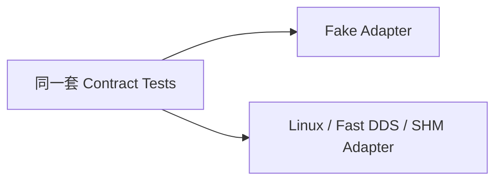

# 11. M10：可观测性、测试支撑与发布保障

## 11.1 结构化日志

所有模块通过 `ILogSink` 输出，Linux 实现写入 journald。

### 必填字段

```text
MESSAGE
PRIORITY
ASDK_MODULE
ASDK_PROCESS_ROLE
ASDK_HOST_ID
ASDK_PLUGIN_ID
ASDK_OPERATION_ID
ASDK_REQUEST_ID
ASDK_PHASE
ASDK_ERROR_CODE
ASDK_CONFIG_GENERATION
ASDK_STATE_GENERATION
ASDK_MONOTONIC_NS
```

规则：

- 生命周期开始、完成、失败必须各有一条事件；
- 相同高频错误需要 rate limit，但首次、恢复和最终统计不可丢；
- 禁止记录 token、capability、设备凭据、完整配置密钥和业务 payload；
- 插件日志自动绑定 Runtime 上下文，插件不得自行伪造 host/plugin ID；
- daemon 接管、配置事务和 quarantine 必须形成审计链。

## 11.2 指标

### daemon

```text
asdk_control_queue_depth
asdk_operation_total{type,result}
asdk_operation_duration_seconds{type,phase}
asdk_host_connected
asdk_host_adoption_total{result}
asdk_restart_total{host,reason}
asdk_recovery_request_total{caller,target,result}
asdk_recovery_circuit_open{target}
asdk_config_transaction_total{result}
```

### Host / Runtime

```text
asdk_runtime_state{plugin,lifecycle,operation,health}
asdk_task_count{plugin,state}
asdk_callback_inflight{plugin}
asdk_reader_queue_depth{plugin,channel}
asdk_reader_queue_drop_total{plugin,channel}
asdk_dds_match_count{plugin,channel}
asdk_shm_blocks{plugin,channel,state}
asdk_shm_active_leases{plugin,channel}
asdk_resource_count{plugin,kind}
asdk_process_rss_bytes{host}
asdk_process_fd_count{host}
asdk_process_thread_count{host}
```

生产环境禁止使用无限增长的动态 label，例如任意 error message、PID 或 sequence 不得作为 label。

## 11.3 Fake 与 Contract Test

```text
ManualClock
InMemoryStateStore
FakeUnitManager
LoopbackHostChannel
FakeProcessProbe
FakeTransportFactory / FakeTransportSession
FakeShmFactory / FakeShmSession
FakeLogSink
FakeControlService
ScriptedPlugin
```

每个端口必须有一套 contract test，同时运行在 Fake 和真实实现上：



示例：

- `IStateStore`：事务原子性、幂等 request、崩溃重开；
- `IUnitManager`：ensure 幂等、stop、PID/unit 查询；
- `IHostChannel`：顺序、重复、断线、重连；
- `ITransportSession`：声明、start、publish、stop、回调静默；
- `IShmSession`：allocate、seal、acquire、release、过期和崩溃。

## 11.4 故障注入插件

| 示例插件 | 故障用途 |
|---|---|
| `producer_v3` | 正常小消息发布 |
| `consumer_v3` | 正常订阅与回调 |
| `crash_v3` | start 后 `SIGSEGV` |
| `throw_v3` | 生命周期函数抛异常 |
| `blocking_start_v3` | start 永不返回 |
| `blocking_stop_v3` | request_stop 永不返回 |
| `task_leak_v3` | 任务忽略 stop token |
| `callback_block_v3` | 回调长期阻塞 |
| `resource_leak_v3` | 泄漏 FD/线程用于审计测试 |
| `bad_abi_v3` | 错误 struct size、版本和缺函数指针 |

## 11.5 Sanitizer 与测试任务

```text
unit-debug
contract-linux
integration-process-host
integration-daemon-adopt
integration-fastdds
integration-shm
fault-injection
asan-ubsan
lsan
-tsan-runtime
-tsan-daemon
performance-small-message
performance-large-message
stability-24h
package-install-upgrade-rollback
```

ASan/UBSan、LSan 和 TSan 分开执行，不把全部 sanitizer 混在同一个构建中。

## 11.6 发布与安装布局

```text
/opt/asdk/v3/bin/
/opt/asdk/v3/lib/
/opt/asdk/v3/plugins/
/opt/asdk/v3/typesupport/
/etc/asdk/v3/asdk.json
/var/lib/asdk/state
/run/asdk/
```

### 发布约束

- V3 使用独立包名、SONAME 和安装前缀；
- 所有 V3 ELF 不依赖 Fast DDS 2.14；
- 插件、type-support 和 schema 均带 Manifest；
- 安装后运行 `asdk-plugin-inspect --all`；
- 升级工具先校验再切换 systemd target；
- V2 与 V3 不共用 StateStore；
- 回滚必须恢复旧 systemd unit、配置和运行前缀，不只回滚二进制。

## 11.7 M10 实现任务

- [ ] M10-01：实现统一日志上下文、journald 和 rate limiter。
- [ ] M10-02：实现 daemon/host/runtime/DDS/SHM 指标接口。
- [ ] M10-03：实现全部 Fake Adapter 和 contract test harness。
- [ ] M10-04：实现故障注入插件。
- [ ] M10-05：建立 sanitizer、fuzz、性能和稳定性 CI 任务。
- [ ] M10-06：实现 ELF/SONAME/RPATH/依赖检查。
- [ ] M10-07：实现安装、升级、整体回滚脚本和演练用例。

## 11.8 M10 验收条件

1. 关键 operation 可通过 request/operation ID 串联 daemon、host 和插件日志。
2. 任一模块可在测试中使用 Fake，不依赖整套系统启动。
3. IPC decoder、配置 parser、ABI loader 均有 fuzz test。
4. 24 小时测试中 FD、线程、SHM lease 和内存无不可解释永久增长。
5. 安装、V2→V3、V3→V2 整体切换均可重复执行。

---
