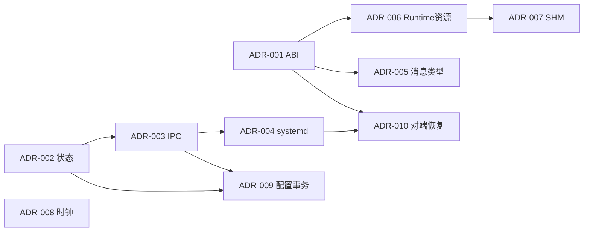
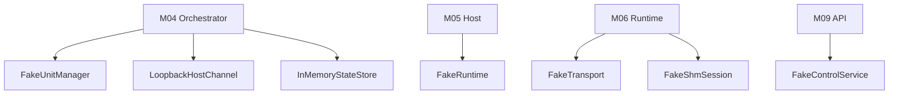
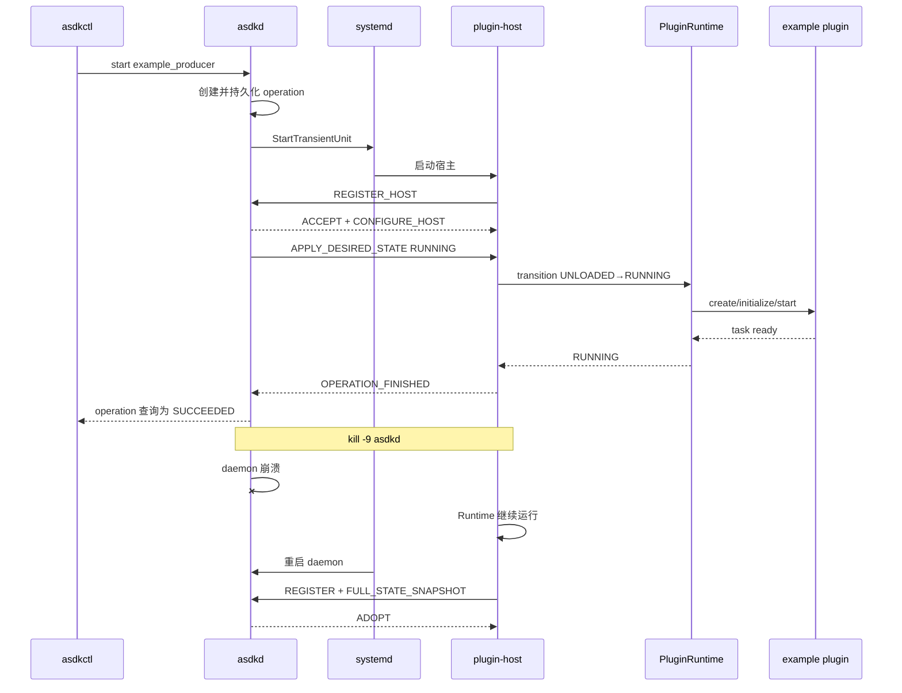

# 12. 并行开发组织与接口冻结

## 12.1 必须先冻结的 ADR

在大规模编码前必须完成以下 ADR。ADR 只冻结跨模块契约，不提前冻结模块内部实现。

| ADR | 必须形成的确定结论 | 直接影响模块 |
|---|---|---|
| ADR-001 插件 ABI | struct 布局、版本、Host API、内存所有权、错误上报、工具链约束 | M01、M06、业务插件 |
| ADR-002 状态与 operation | lifecycle/operation/health、desired、generation、幂等和权威来源 | M01、M04、M05、M09 |
| ADR-003 daemon-host IPC | frame、JSON payload、认证、sequence、epoch、snapshot watermark | M01、M03、M04、M05 |
| ADR-004 systemd 与恢复监管 | transient host unit、cgroup、target、启停顺序、host `Restart=no`、Portal/asdkd 双向监视、恢复代理授权与熔断 | M03、M04、M05、M09 |
| ADR-005 消息类型包 | CDR、TypeObject、schema hash、插件 SDK 与 Host TypeSupport 边界 | M01、M06、M07 |
| ADR-006 Runtime 资源 | Task、Callback、DDS/SHM 声明、外部资源 adopt 和 cleanup scope | M01、M06、业务插件 |
| ADR-007 SHM 协议 | 固定 block、header、注册、lease、lifespan、回收和背压 | M01、M08 |
| ADR-008 时钟 | monotonic/realtime/boottime/硬件时钟及系统重启语义 | M01、M03、M06、M08 |
| ADR-009 配置事务 | candidate、generation、全量停止、回滚和 daemon 崩溃恢复 | M02、M03、M04、M09 |
| ADR-010 对端恢复协调 | M01 恢复契约、socket activation、调用方到对端的固定映射、Polkit 授权、持久限流/熔断和人工恢复审计 | M01、M03、M04、M09、M10 |

冻结顺序：



ADR-001、002、003、005、006、010 通过后，M02～M10 即可大范围并行。

## 12.2 并行工作流

| 工作流 | 负责模块 | 初始依赖 | 可使用的 Fake | 首个独立交付 |
|---|---|---|---|---|
| W-A 契约 | M01 | 无 | 无 | ABI/Core/Ports 头文件和单元测试 |
| W-B 配置 | M02 | M01 数据结构 | Fake Manifest Catalog | JSON → DeploymentPlan |
| W-C 平台 | M03 | M01 ports、IPC DTO | Fake Policy | UDS、systemd、FileStateStore contract tests |
| W-D daemon | M04 | M01、M02 plan | Fake Unit/Channel/Store/Clock | 纯内存启动、接管和恢复 |
| W-E Host | M05 | M01 IPC、Runtime interface | Fake Runtime、Loopback Channel | 注册、路由、断线与补发 |
| W-F Runtime | M06 | M01 ABI、Transport/SHM ports | Fake Transport、Fake SHM | 示例插件完整生命周期 |
| W-G DDS | M07 | M01 Transport port、ADR-005 | Fake Runtime Callback | 跨进程小消息闭环 |
| W-H SHM | M08 | M01 SHM port、ADR-007 | Fake Header Transport | 多进程 block 生命周期 |
| W-I 管理面 | M09 | M01 DTO、ControlService interface | Fake ControlService | API、CLI、Portal Client |
| W-J 质量与发布 | M10 | 各端口语义 | 全部 Fake | Contract harness、CI、包检查 |

## 12.3 并行开发的模块替换关系



真实模块接入时只替换组合根：

```text
asdkd Composition Root:
  FileStateStore
  + SystemdUnitManager
  + SeqpacketHostChannel
  + DeploymentCompiler
  + Orchestrator
  + ControlService

asdk-plugin-host Composition Root:
  SeqpacketClient
  + HostCore
  + PluginRuntimeFactory
  + FastDdsSessionFactory
  + PosixShmSessionFactory
  + JournaldLogSink
```

## 12.4 分支与合并约束

- 公共头修改必须关联 ADR 和 ABI/API diff；
- 未经评审不得从模块私有目录 include 其他模块私有头；
- 每个模块 PR 必须带单元测试和至少一个 contract test；
- 模块开发不得等待真实下游，必须先接 Fake；
- 集成分支只接受通过模块验收条件的构建目标；
- ABI 主版本发布后，字段只允许尾部扩展，并使用 `struct_size` 判断可用字段；
- 文件状态格式、控制协议和配置 schema 均必须有显式 migration/version。

---

# 13. 分阶段集成门槛

本节不是按团队串行开发，而是定义何时允许把不同并行成果合并为系统能力。

## G0：基线与阻塞技术验证

### 必须完成

- V2 插件、Topic、QoS、线程、FD、设备、SHM 和大消息清单；
- 当前系统启动时间、消息性能、内存和 CPU 基线；
- Fast DDS 3.6.x serialized CDR / TypeObject 互通 spike；
- systemd transient unit / daemon 独立重启 spike；
- pidfd 与 PID start-time 验证；
- ADR-001～009 初稿。

### 退出条件

- 关键技术路径均有可运行最小程序，不再只依靠文档假设；
- 发现不可行项时先修订 ADR，再冻结接口。

## G1：公共契约可用

### 组合

```text
M01 + M02(minimal) + M10(test support)
```

### 验证

- ABI C/C++ 双编译；
- 三维状态和 operation；
- 配置 → DeploymentPlan；
- Fake Unit/Channel/Store/Transport/SHM；
- 无第三方运行时依赖的 `ctest`。

### 退出条件

M02～M09 可仅基于 M01 公共头独立编译。

## G2：纯 Runtime 垂直切片

### 组合

```text
M05 Host Core
+ M06 Runtime
+ Fake Transport
+ Fake SHM
+ producer_v3 / consumer_v3 / fault plugins
```

### 验证

- load、initialize、start、ready、stop、restart、unload；
- TaskGroup 不退出；
- CallbackGate 在途回调；
- ABI mismatch；
- 资源 scope 逆序清理；
- process 模式只允许一个 Runtime。

## G3：daemon、systemd 与接管闭环

### 组合

```text
M02 + M03 + M04 + M05 + M06 + M09(asdkctl minimal)
```

### 第一条完整控制链



### 必测

- daemon stop/restart/crash 均不停止 host；
- Portal 连续 3 次探测不到 daemon 时，通过恢复代理仅重启 `asdkd.service`；daemon adopt 后不重复启动 Runtime；
- daemon 连续 3 次探测不到 Portal 时，通过恢复代理仅重启 `asdk-portal.service`；Portal 恢复不影响 daemon、host 或数据面；
- `asdk.target` stop 会停止全部 host；
- Host crash 只影响自身；
- 新 daemon 不重复启动已运行插件；
- 旧 session command 拒绝；
- orphan/双 host 冲突进入明确状态。

## G4：Fast DDS 小消息闭环

### 组合

```text
G3 + M07
```

### 验证

- example producer → Fast DDS → example consumer；
- process 间小消息 P99；
- reliable/best-effort；
- schema mismatch；
- daemon 崩溃时数据继续流动；
- stop 后回调静默；
- Runtime 独立销毁。

此门槛完成前，不迁移 Camera、SLAM 等高风险业务插件。

## G5：完整管理面、Supervisor 与配置事务

### 组合

```text
G4 + M04 full + M09 full + Portal DaemonClient
```

### 验证

- 非关键插件失败形成 DEGRADED；
- 关键插件恢复预算和 quarantine；
- required dependency 失败传播；
- 配置 validate / apply / rollback；
- daemon 在配置事务各阶段崩溃；
- Portal 完全移除 V2 控制 Topic。

## G6：共享内存 Canary

### 组合

```text
G5 + M08 + Gray/Depth/PointCloud 中一个 canary
```

### 验证

- payload 不进入 DDS；
- 多 consumer；
- 迟到 header；
- consumer 卡死/崩溃；
- publisher 崩溃与 epoch 切换；
- daemon 崩溃；
- pool 满与全部背压策略；
- 长时间 lease 无永久增长。

## G7：thread 模式和全量迁移

### 前置条件

- process 模式稳定；
- thread 准入清单和静态检查完成；
- 至少一个低风险插件组完成 process/thread 对照测试。

### 验证

- 每 Runtime 生命周期可独立操作；
- 组内一个插件不可安全停止时整组退出；
- 其他独占 Host 不受影响；
- 组内权限、资源和可用性策略校验有效。

---

# 14. 首个垂直切片的明确范围

为了避免再次出现“所有模块同时铺开、没有可运行系统”的问题，首个垂直切片严格限定如下。

## 14.1 必须实现

```text
asdkctl
→ UDS Control API
→ asdkd 单写者控制循环
→ FileStateStore operation
→ systemd transient 独占 host
→ daemon-host SOCK_SEQPACKET
→ PluginRuntime
→ C ABI example producer/consumer
→ Fast DDS 小消息
→ 状态、日志、stop、host crash、daemon adopt
```

## 14.2 暂不进入首切片

- thread host；
- 共享内存 payload；
- Portal 页面重构；
- 配置运行期更新；
- 复杂资源恢复；
- Camera、SLAM、LiDAR 等业务插件；
- 跨机大消息；
- WebSocket/SSE；
- SPSC SHM 优化。

这些能力的接口可以保留，但不得阻塞首条闭环运行。

## 14.3 首切片的验收脚本

```bash
# 1. 校验配置
asdkctl config validate /etc/asdk/v3/asdk.json

# 2. 启动生产者和消费者
asdkctl plugin start example_producer
asdkctl plugin start example_consumer

# 3. 等待并检查 operation
asdkctl operation show <operation-id> --watch

# 4. 验证数据计数持续增长
asdkctl plugin show example_consumer --json

# 5. 强杀 daemon
sudo kill -9 "$(pidof asdkd)"

# 6. 确认两个 host 未退出，数据计数继续增长
systemctl status asdk-host-example_producer.service
systemctl status asdk-host-example_consumer.service

# 7. daemon 重启后确认 adopt 且无重复 Runtime
asdkctl status --json

# 8. 强杀 producer host，确认 consumer host 和 daemon 仍运行
sudo systemctl kill -s SIGKILL asdk-host-example_producer.service

# 9. 检查恢复或 quarantine 结果
asdkctl host list --json

# 10. 系统级停止
asdkctl system shutdown
```

---

# 15. 测试矩阵

## 15.1 模块级测试

| 模块 | 必测内容 |
|---|---|
| M01 | ABI layout、状态所有合法边、非法跳转、幂等、generation、错误链 |
| M02 | Schema、未知字段、路径逃逸、Manifest digest、DAG、资源和 SHM 容量 |
| M03 | frame fuzz、peer spoof、旧 epoch、文件状态存储 崩溃、transient unit、PID 复用 |
| M04 | 接管、操作恢复、依赖传播、重启预算、配置事务各阶段崩溃 |
| M05 | 断线、重连、snapshot watermark、event ring overflow、SIGTERM 本地清理 |
| M06 | 每阶段失败、task 不退出、callback 不排空、resource cleanup、二次 start |
| M07 | QoS、匹配变化、队列溢出、serialized CDR、独立销毁、旧 callback epoch |
| M08 | 多 consumer、过期、CRC、崩溃、PID 复用、pool 满、重复 release |
| M09 | 鉴权、请求限制、202、409、412、503、稳定 JSON 和 CLI exit code |
| M10 | 日志字段、metrics label、Fake contract、sanitizer、包和回滚 |

## 15.2 系统级故障矩阵

| 注入动作 | 必须保持 | 预期恢复 |
|---|---|---|
| `kill -9 asdkd` | 所有健康 Host、DDS、SHM 数据面 | 新 daemon adopt |
| `systemctl restart asdkd` | Host 不被 PartOf 连带停止 | 新 session 和 snapshot |
| Portal 后端崩溃或健康检查连续失败 | daemon、所有 Host、DDS、SHM 数据面 | systemd 或 daemon 经恢复代理重启 Portal |
| asdkd 健康检查连续失败但进程未退出 | 所有 Host、DDS、SHM 数据面 | Portal 经恢复代理重启 asdkd，随后 daemon adopt |
| 双向恢复请求超过限流或熔断阈值 | Host 与飞行数据面持续运行 | 拒绝自动重启、产生高优先级告警并等待人工恢复 |
| 独占 Host SIGSEGV | daemon、其他 Host | 按预算重启该 Host |
| thread 组一个插件崩溃 | daemon、其他 Host | 整组重启 |
| plugin start 阻塞 | 其他 Host | 终止目标 Host |
| plugin stop 阻塞 | 其他 Host | 不执行危险 dlclose，终止目标 Host |
| Fast DDS reader 队列满 | daemon 和其他 channel | 执行配置 overflow policy |
| SHM consumer 卡死 | 已 acquire block 不被复用 | 确认进程死亡后释放 |
| FileStateStore 写入中断电/崩溃 | 最后 committed 配置 | 原子快照与 journal 重放恢复，无半状态 |
| candidate 配置启动失败 | 旧配置文件和状态 | 全量回滚旧配置 |
| 双 host boot ID | 不误杀或误 adopt | 冲突、禁止自动控制 |
| 系统关机 | systemd 可终止所有 cgroup | Host 本地清理，超时强杀 |

## 15.3 性能测试口径

性能目标必须先以目标硬件上的 V2 基线为参照，不直接沿用未经测量的固定数字。

至少测量：

- daemon API P50/P95/P99；
- operation 接受到 Host accepted 的时间；
- Host 创建到 READY 的时间；
- 小消息端到端 P50/P95/P99；
- 1 MiB、2 MiB、8 MiB SHM 吞吐和延迟；
- 每独占 Host 基础 RSS、线程和 FD；
- Runtime start/stop 1000 次后的资源趋势；
- daemon 重启到 adopt 完成时间；
- Host crash 到恢复 ready 时间；
- 24 小时持续发布下的 drop、lease、RSS 和 CPU。

测试报告必须同时给出：

```text
硬件平台
内核版本
Fast DDS 版本
编译选项
QoS
消息大小和频率
进程 CPU affinity
是否启用 sanitizer
```

---

# 16. 最终交付物

## 16.1 代码交付

```text
libasdk_core.a
libasdk_config.a
libasdk_platform_linux.so.3
libasdk_runtime.so.3
libasdk_transport_fastdds.so.3
libasdk_shm_posix.so.3
libasdk_control_service.so.3
asdkd
asdk-recoveryd
asdk-plugin-host
asdkctl
asdk-plugin-inspect
asdk-config-migrate
```

## 16.2 接口与生成物

```text
C ABI headers
C++17 plugin SDK headers
control protocol schema
configuration JSON schema
plugin manifest schema
message codec/type-support generator
LargeDataHeader IDL
OpenAPI / JSON Schema
systemd target and packaging files
```

## 16.3 文档交付

```text
ADR-001～ADR-010
插件迁移指南
业务消息类型包生成指南
systemd 与 cgroup 说明
故障诊断手册
配置字段手册
API / asdkctl 手册
共享内存协议说明
升级与回滚手册
测试与性能报告
```

---

# 17. Definition of Done

ASDK 3.0 只有同时满足以下条件，才允许认定完成：

1. 插件动态库边界不存在 STL、虚函数对象、RTTI 对象或跨边界异常。
2. `asdkd.service` stop/restart/crash 均不会连带终止健康 Host。
3. daemon 可通过身份、boot ID、generation、snapshot 和 watermark 安全接管 Host。
4. lifecycle、operation、health、desired state 均可独立查询和测试。
5. process 模式下插件不可安全停止时只终止其独占 Host。
6. thread 模式下故障只扩大到显式 host group，不影响其他 Host。
7. daemon 不链接 Fast DDS 和业务消息库，不位于业务消息路径。
8. 每个 Runtime 的任务、DDS、SHM 和 callback 可独立停止、排空和销毁。
9. `STOPPED → RUNNING` 不需要重新 `dlopen`，且不会复用旧 callback epoch。
10. 大消息 DDS 样本只包含 `LargeDataHeader`，不复制完整 payload。
11. acquired SHM block 不会因 TTL 或 daemon 失联提前复用。
12. 配置更新具备 candidate 校验、全量切换、失败回滚和中断恢复。
13. Portal 不再创建或依赖 V2 控制 Topic。
14. 全部 V3 ELF 使用独立 SONAME/前缀，不依赖 Fast DDS 2.14。
15. Fake/Contract/Integration/Fault/Sanitizer/24h 稳定性测试全部达到发布门槛。
16. V2→V3 和 V3→V2 整体切换均在目标设备完成演练。
17. Portal 与 asdkd 的双向健康监视、受限恢复请求、限流和熔断均经故障注入验证；任何恢复动作都不影响健康 Host 和飞行数据面。

---

# 18. 实施优先级结论

实际开发不得按“先把所有模块骨架写完，再统一联调”的方式推进。正确优先级是：


其中，最先必须用代码验证而不是继续写概念文档的四个风险点是：

1. Fast DDS serialized CDR 与 TypeObject 的消息类型包方案；
2. daemon 独立重启后基于 systemd/PID/snapshot 的安全接管；
3. 插件 start/stop 阻塞时，Runtime 不执行危险清理而由宿主边界止损；
4. SHM 多消费者 lease、迟到 header 和发布者/消费者崩溃后的安全回收。

只有这四项完成可运行验证后，才应开始 Camera、SLAM、LiDAR 等真实业务插件的批量迁移。
