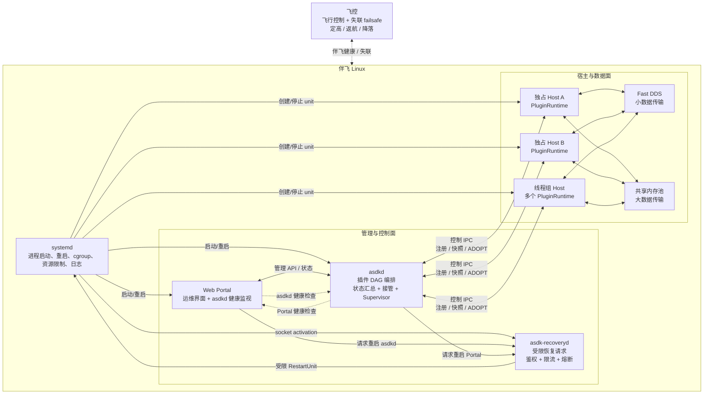

# ASDK 3.0 功能框图

```mermaid
flowchart TB
    FC[飞控\n飞行控制 + 失联 failsafe\n定高 / 返航 / 降落]

    subgraph Linux[伴飞 Linux]
        SD[systemd\n进程启动、重启、cgroup、资源限制、日志]

        subgraph Mgmt[管理与控制面]
            Portal[Web Portal\n运维界面 + asdkd 健康监视]
            Daemon[asdkd\n插件 DAG 编排\n状态汇总 + 接管 + Supervisor]
            Recovery[asdk-recoveryd\n受限恢复请求\n鉴权 + 限流 + 熔断]
        end

        subgraph Runtime[宿主与数据面]
            Host1[独占 Host A\nPluginRuntime]
            Host2[独占 Host B\nPluginRuntime]
            HostG[线程组 Host\n多个 PluginRuntime]
            DDS[Fast DDS\n小数据传输]
            SHM[共享内存池\n大数据传输]
        end
    end

    FC <-.伴飞健康 / 失联.-> Linux

    SD -->|启动/重启| Portal
    SD -->|启动/重启| Daemon
    SD -->|socket activation| Recovery
    SD -->|创建/停止 unit| Host1
    SD -->|创建/停止 unit| Host2
    SD -->|创建/停止 unit| HostG

    Portal <-->|管理 API / 状态| Daemon
    Portal -.asdkd 健康检查.-> Daemon
    Daemon -.Portal 健康检查.-> Portal

    Portal -->|请求重启 asdkd| Recovery
    Daemon -->|请求重启 Portal| Recovery
    Recovery -->|受限 RestartUnit| SD

    Daemon <-->|控制 IPC\n注册 / 快照 / ADOPT| Host1
    Daemon <-->|控制 IPC\n注册 / 快照 / ADOPT| Host2
    Daemon <-->|控制 IPC\n注册 / 快照 / ADOPT| HostG

    Host1 <--> DDS
    Host2 <--> DDS
    HostG <--> DDS
    Host1 <--> SHM
    Host2 <--> SHM
    HostG <--> SHM
```
