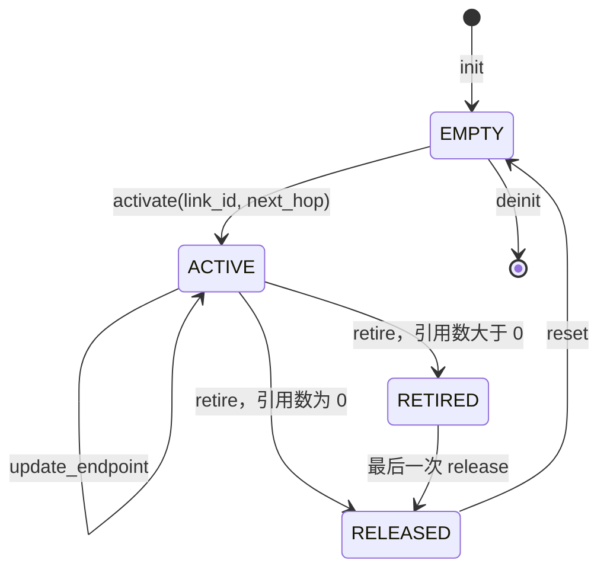

# LinkG Path 模块使用说明

> 对应模块：`core/link/linkg_path.c`、`linkg_path.h`
> 核心原则：**Path 描述一条到对端的传输路径；引用计数保证退役期间不会被提前复用。**

## 1. Path 是什么？

一个 **Peer** 是目的节点，一个 **Path** 是到达它的一条路。

```text
Peer（对端节点）
 ├── Path：link_id = WiFi Link ID      → next_hop = WiFi 对端地址
 └── Path：link_id = Cellular Link ID  → next_hop = 5G 对端地址
```

Path 的最小信息是：

| 字段 | 含义 |
|---|---|
| `link_id` | 使用哪一个**具体 Link 实例**传输；不是固定的 WiFi/5G 编号 |
| `next_hop` | 数据应发送到的下一跳网络端点 |

围绕这两个字段，还包括：

- `state`：路径是否允许被获取和使用。
- `reference_count`：当前仍有多少引用持有这条路径。
- `released` / `released_user_data`：最后释放完成时通知对象所有者。
- `stats`：记录路径收发统计。

**职责边界：** Path 不负责创建 Peer、不选择主备链路、不清理发送队列，也不自行 `free()` 所在的对象。Path 实例及槽位由 Node 管理。

## 2. 生命周期状态图



| 状态 | 含义 | 能否获取新引用 |
|---|---|---|
| `EMPTY` | 已初始化的空闲槽位 | 否 |
| `ACTIVE` | 路径生效，可获取引用并用于业务 | 是 |
| `RETIRED` | 已停止接纳新引用，等待旧引用释放 | 否 |
| `RELEASED` | 引用已归零，等待所有者复位槽位 | 否 |

**记住：** `RETIRED` 是停止使用，`RELEASED` 是引用归零，`EMPTY` 才是槽位可再次激活。

## 3. 核心接口速查

| 接口 | 做什么 | 关键要求 |
|---|---|---|
| `linkg_path_init()` | 初始化 Path，进入 `EMPTY` | 对象首次使用前已清零 |
| `linkg_path_activate()` | 配置 `link_id`、`next_hop` 和释放回调，进入 `ACTIVE` | 必须是 `EMPTY` 且引用数为 0 |
| `linkg_path_acquire()` | 获取 1 个引用 | 仅在 `ACTIVE` 时使用 |
| `linkg_path_acquire_batch()` | 一次获取多个引用 | 获取多少，最终就释放多少次 |
| `linkg_path_release()` | 释放 1 个引用 | 调用方必须持有对应引用 |
| `linkg_path_update_endpoint()` | 更新下一跳地址 | 仅更新 `ACTIVE` Path，不改变 `link_id` |
| `linkg_path_retire()` | 将活动 Path 退役 | **成功不等于所有引用已经释放** |
| `linkg_path_reset()` | 清空运行信息，回到 `EMPTY` | 已 `RELEASED` 且无引用，或原本是 `EMPTY` |
| `linkg_path_deinit()` | 销毁 Path 内部资源 | 必须是 `EMPTY`，引用数为 0 |

## 4. 如何使用一条 Path？

```text
初始化： init() → EMPTY
建立路径： activate(link_id, next_hop) → ACTIVE
业务使用： acquire() → 使用/持有 Path → release()
地址变化： update_endpoint(new_next_hop)（仍为 ACTIVE）
注销路径： retire() → 等待引用归零 → reset() → EMPTY
最终销毁： deinit()
```

使用时要遵守三条规则：

1. **异步持有必须先取得引用。** 只保存一个 Path 指针，不代表拥有有效引用；`release()` 之后不能继续使用该引用。
2. **引用计数不是并发生命周期锁。** `acquire()` 的状态检查与引用增加不是不可分割的操作；`acquire / activate / retire / update_endpoint` 的协调由 Node 负责。
3. **Path 不处理旧发送队列。** `retire()` 不会自动 purge TX Queue；引用释放与排队 Packet 的清理由上层所有者协调。

## 5. 退役后的两种释放方式

| 情况 | 实际流程 | 谁负责后续 `reset()` |
|---|---|---|
| **同步释放**：退役时 `ref=0` | `ACTIVE → retire() → RELEASED`，输出 `released=true`，不触发回调 | 发起退役的所有者 |
| **延迟释放**：退役时 `ref=N` | `ACTIVE → RETIRED → N 次 release() → RELEASED`，最后一次释放触发 `released` 回调 | 收到回调的所有者 |

```text
同步：ACTIVE(ref=0) ─retire─► RELEASED ─reset─► EMPTY

延迟：ACTIVE(ref=N) ─retire─► RETIRED(ref=N)
                                │
                                └─逐一 release 至 0─► RELEASED
                                                        │
                                                    released 回调
                                                        │
                                                      reset
                                                        ▼
                                                       EMPTY
```

**注意 `linkg_path_retire(path, &released)`：** 返回 `0` 只表示退役调用成功；`released=true` 表示本次同步进入 `RELEASED`。`released=false` 不能直接推断仍然有引用，因为 Path 也可能此前已经处于退役或释放状态。

## 6. 一句话总结

> **`activate()` 让路可用，`acquire()/release()` 保护使用期，`retire()` 禁止新使用，引用归零后由所有者 `reset()` 回收槽位。**
