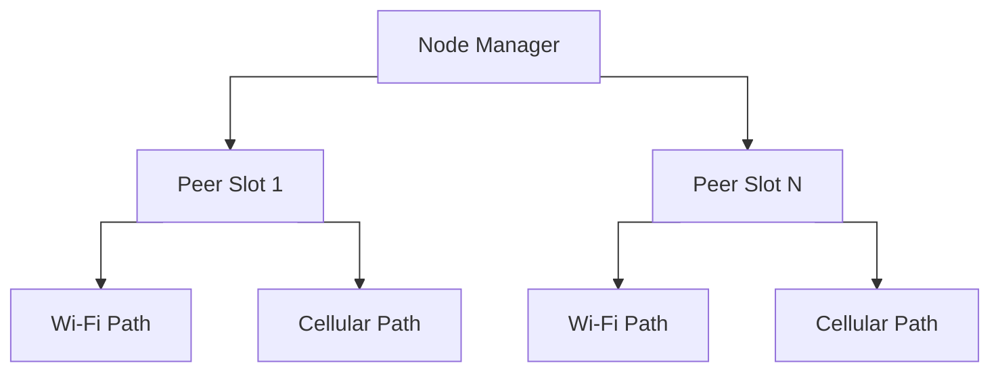
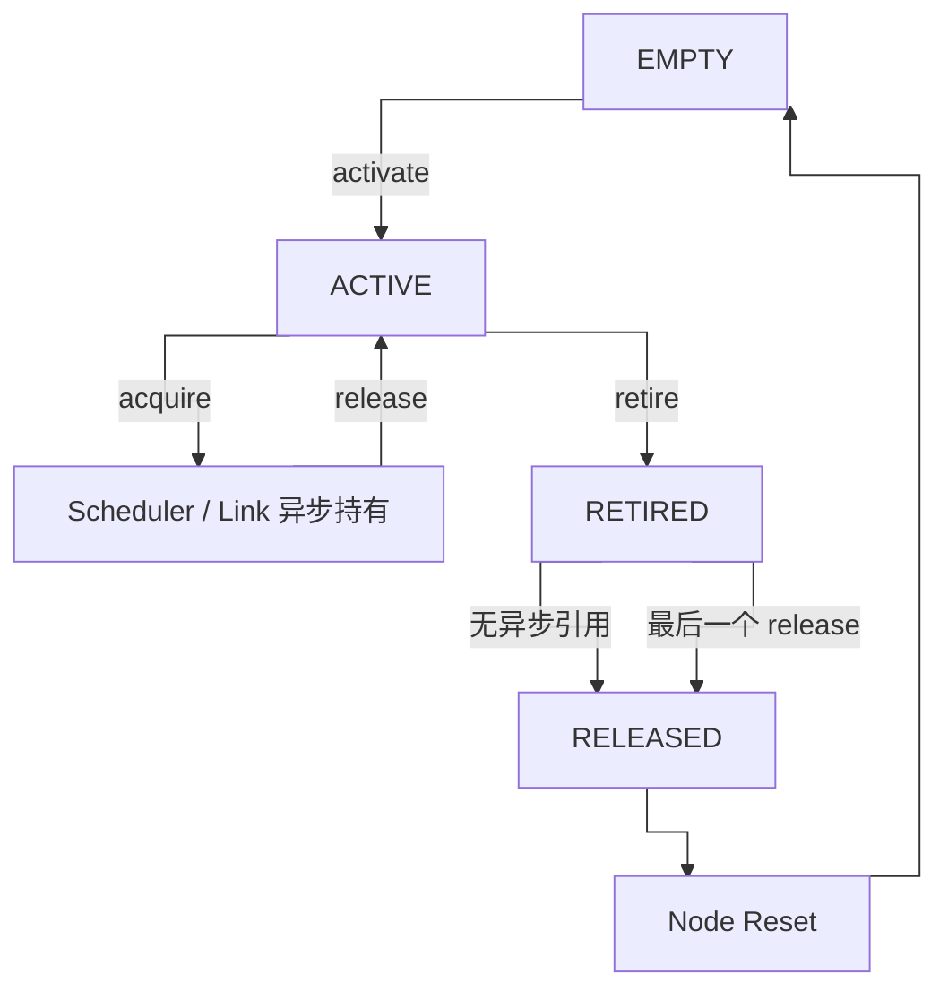

# Node 模块结构与生命周期

## 模块边界

Node 是 Peer 和 Path 的生命周期 Owner。当前产品中每个直接 Peer 最多拥有两条 Path：Wi-Fi 和 Cellular。

## Path 使用流程

生命周期规则：

- Node 锁串行化 Path 的 activate、endpoint update、acquire 和 retire。
- 异步发送者只持有 Path 引用，不持有 Node 锁。
- Peer 注销时先逻辑下线，再退役全部 Path，停止产生新的异步引用。
- Path 没有异步引用时由 Node 同步回收。
- Path 仍有异步引用时，最后一个 `linkg_path_release()` 通过 released callback 通知 Node 回收。
- `stats_lock` 仅保护 Path 累计统计，不参与 Path 生命周期同步。
