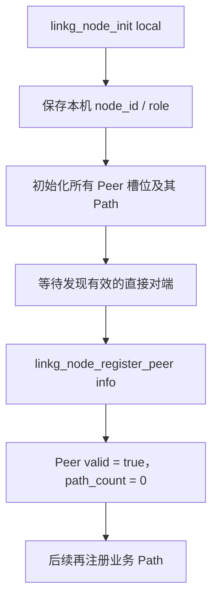
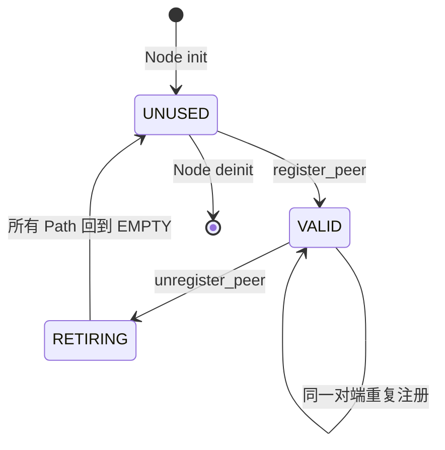
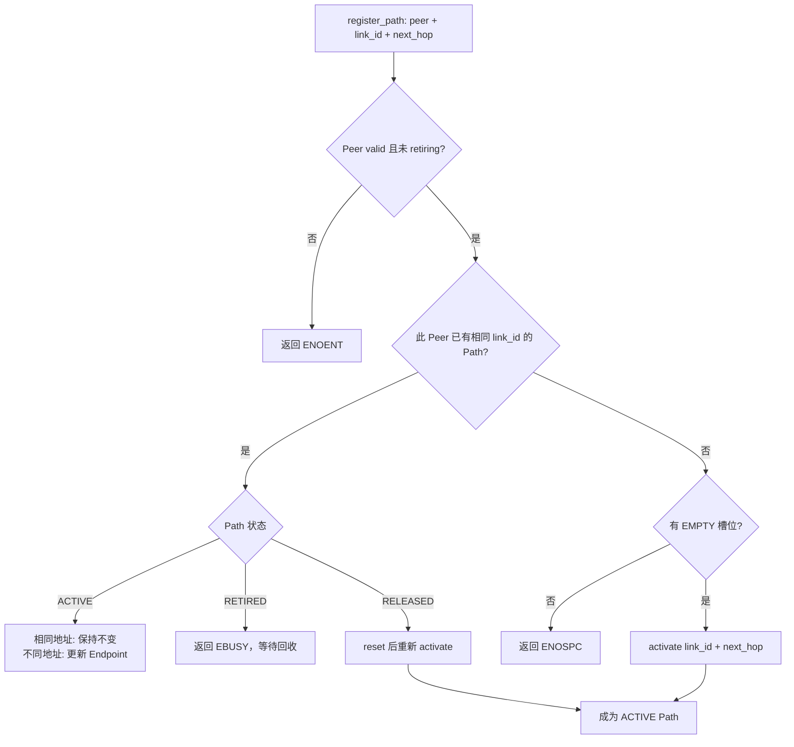
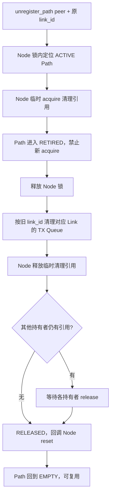
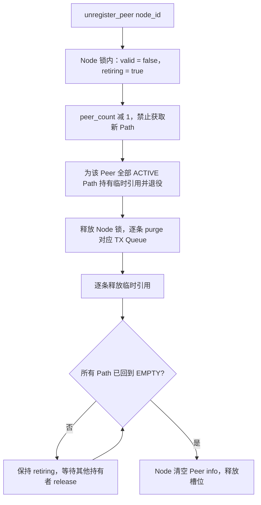

# LinkG Node 模块：Peer 与 Path 生命周期使用说明

> 对应实现：`core/node/linkg_node.c`、`linkg_node.h`
> **核心原则：先注册对端（家），再注册到它的路径（路）；Node 管理对象及槽位，Path 引用计数保证退役期间不会提前复用。**

## 1. Node 管理什么？

Node 保存本机信息和**直接相连的对端 Peer**，每个 Peer 拥有若干 Path 槽位；它不管理所有间接可达的网络节点。

```text
本机 Node（local: node_id + role）
  ├── Peer A（对端 node_id + role）
  │     ├── Path（link_id = WiFi 实例 ID，next_hop = WiFi 对端地址）
  │     └── Path（link_id = 5G 实例 ID，next_hop = 5G 对端地址）
  └── Peer B ...
```

| 对象 / 字段 | 含义 |
|---|---|
| `g_node.local` | 本机身份；不占直接 Peer 槽位 |
| `peers[]` | 固定容量的直接 Peer 槽位 |
| `slot->info` | 对端 `node_id` 和 `role` |
| `slot->paths[]` | 该对端的 Path 对象，按 `(peer_node_id, link_id)` 定位 |
| `slot->path_count` | 当前**逻辑活动** Path 数，不等于未释放 Path 数 |
| `slot->valid` | Peer 已注册，允许获取新 Path 引用 |
| `slot->retiring` | Peer 正在注销、等待 Path 全部回收；该槽位不可复用 |

**容量与角色约束：** AP 允许注册多个直接 STA，数量不超过 `LINKG_NODE_PEER_MAX`；STA 只允许注册 **1 个直接 AP**；每个 Peer 的 Path 槽位数量为 `LINKG_NODE_PATH_MAX`（当前为 **2**）。具体 Peer 总容量以工程头文件中的宏定义为准。

**职责边界：** Discovery 决定何时确认、撤销一个直接 Peer 或业务 Path；Node 执行注册、退役及引用回收；Switch 基于有效 Path 选择发送计划。Node 不负责设备发现、Link 创建销毁或选择 WiFi/5G 主备。

### 接口速查

| 接口 | 含义 |
|---|---|
| `linkg_node_init()` / `linkg_node_deinit()` | 初始化全部固定槽位 / 在全部资源释放后反初始化 |
| `linkg_node_register_peer()` | 建立或更新一个直接 Peer |
| `linkg_node_unregister_peer()` | 将 Peer 逻辑下线，退役它的全部 Path |
| `linkg_node_register_path()` | 为已有 Peer 注册 Path，或更新同 Link ID 的 Endpoint |
| `linkg_node_unregister_path()` | 退役某 Peer 的指定 Link ID Path |
| `linkg_node_acquire_path()` / `linkg_node_acquire_path_batch()` | 获取 Path 引用和 Endpoint 副本；引用须自行释放 |
| `linkg_node_get_local()` / `linkg_node_get_peer_count()` | 获取本机信息 / 逻辑有效 Peer 数量 |
| `linkg_node_get_peer_snapshot()` | 拷贝指定有效 Peer 的基本信息与活动 Path 数量 |
| `linkg_node_get_path_endpoints()` | 按 Link ID 取得全部有效直接 Peer 的 Endpoint 副本 |
| `linkg_node_account_path_rx()` / `linkg_node_account_path_rx_batch()` | 根据 Link ID 与来源 Endpoint 匹配接收 Peer，记录路径 RX 统计 |


## 2. 模块初始化与对端注册


```mermaid
flowchart TD
    A[linkg_node_init local] --> B[保存本机 node_id / role]
    B --> C[初始化所有 Peer 槽位及其 Path]
    C --> D[等待发现有效的直接对端]
    D --> E[linkg_node_register_peer info]
    E --> F[Peer valid = true，path_count = 0]
    F --> G[后续再注册业务 Path]
```

`linkg_node_init(local)` **只准备固定槽位、锁和本机身份**，不注册远端，也不创建 ACTIVE Path。

`linkg_node_register_peer(info)` 建立“家”，使用条件和行为是：

- **何时调用**：上层（通常是 Discovery）确认一个合法的**直接对端**，并准备建立通信资源时；即使暂时没有可用 Path，也可以先注册 Peer。
- **校验**：Node ID 合法、不能是本机；本机 AP 的直接对端必须为 STA，本机 STA 的直接对端必须为 AP。
- **重复注册**：同一 Node ID、同一角色且 Peer 仍有效，更新 `info` 后返回 `0`，不会再占用新槽位；若角色冲突返回 `-EINVAL`。
- **正在注销**：同一 Node ID 的 Peer 仍处于 `retiring` 时返回 `-EBUSY`，不能直接复活旧槽位。
- **容量不足**：返回 `-ENOSPC`。

Peer 的生命周期：


```mermaid
stateDiagram-v2
    [*] --> UNUSED: Node init
    UNUSED --> VALID: register_peer
    VALID --> VALID: 同一对端重复注册
    VALID --> RETIRING: unregister_peer
    RETIRING --> UNUSED: 所有 Path 回到 EMPTY
    UNUSED --> [*]: Node deinit
```

## 3. 注册、更新和使用一条 Path

`linkg_node_register_path(node_id, link_id, next_hop)` 必须在对应 Peer 有效时调用。Node 按 `link_id` 匹配此 Peer 内的 Path，而不是按 WiFi/5G Access 匹配。


```mermaid
flowchart TD
    A[register_path: peer + link_id + next_hop] --> B{Peer valid 且未 retiring?}
    B -- 否 --> X[返回 ENOENT]
    B -- 是 --> C{此 Peer 已有相同 link_id 的 Path?}
    C -- 是 --> D{Path 状态}
    D -- ACTIVE --> E[相同地址: 保持不变<br/>不同地址: 更新 Endpoint]
    D -- RETIRED --> F[返回 EBUSY，等待回收]
    D -- RELEASED --> G[reset 后重新 activate]
    C -- 否 --> H{有 EMPTY 槽位?}
    H -- 否 --> I[返回 ENOSPC]
    H -- 是 --> J[activate link_id + next_hop]
    G --> K[成为 ACTIVE Path]
    J --> K
```

调用前需要满足：

- `link_id` 是当前期望承载的**具体 Link 实例 ID**，不是固定 Access 编号；Endpoint 是有效的 IPv4/IPv6 地址与端口。
- **Node 只校验 Link ID 非 INVALID，并不验证该 ID 在 Link Manager 中仍然注册或正在 RUNNING。** 这个前置条件由调用方保证。
- 同一 Peer + 同一 Link ID + 同一 Endpoint 重复注册，不重复创建；Endpoint 变化则更新已有 ACTIVE Path。
- 新 Link ID 被视作另一条 Path，**不会自动替换旧 Link ID**。旧 Path 未退役时可能占据容量。
- `linkg_node_get_peer_snapshot()` 目前仅提供 Peer 信息和活动 Path 数量，**不会枚举该 Peer 的每个 Link ID**；`path_count` 不能替代对具体 Path 的有效性检查。

### 业务使用：谁需要持有引用？

```c
linkg_path_t          *path;
linkg_path_endpoint_t next_hop;
int                   ret;

path = NULL;
ret = linkg_node_acquire_path(peer_node_id, link_id, &path, &next_hop);
if (ret != 0)
{
    return ret;
}

/* 调用方在持有引用期间使用 path，并使用复制出的 next_hop。 */
/* 如果具体链路异步保存 Path，必须另外增加引用。 */

linkg_path_release(path);
```

| 操作 | 是否需要调用方管理 Path 引用？ |
|---|---|
| `register_peer` / `register_path` | **不需要**，Node 管理槽位 |
| `get_peer_snapshot` / `get_path_endpoints` | **不需要**，返回拷贝的快照，不持有引用 |
| `acquire_path` | **需要**，成功获得 1 个引用，用完执行 1 次 `linkg_path_release()` |
| `acquire_path_batch` | **需要**，获取 `N` 个引用，最终释放 `N` 次 |
| `unregister_path` / `unregister_peer` | **不需要**外部预先获取清理引用；Node 自己临时持有，但调用方已有的引用仍必须正常释放 |

**关键点：** Node 在锁内完成 acquire 与 Path 退役、Endpoint 更新的互斥；调用方拿到的是带引用的 Path 和拷贝出的 `next_hop`。释放引用后，不能再依赖该指针访问 Path。**引用保护对象生命周期，不代表 Path 在整个发送过程中始终为 ACTIVE**；发送入口仍须按自身契约检查 Path 状态。

## 4. 注销一条 Path：只拆一条路


```mermaid
flowchart TD
    A[unregister_path peer + 原 link_id] --> B[Node 锁内定位 ACTIVE Path]
    B --> C[Node 临时 acquire 清理引用]
    C --> D[Path 进入 RETIRED，禁止新 acquire]
    D --> E[释放 Node 锁]
    E --> F[按旧 link_id 清理对应 Link 的 TX Queue]
    F --> G[Node 释放临时清理引用]
    G --> H{其他持有者仍有引用?}
    H -- 无 --> I[RELEASED，回调 Node reset]
    H -- 有 --> J[等待各持有者 release]
    J --> I
    I --> K[Path 回到 EMPTY，可复用]
```

- `linkg_node_unregister_path(node_id, link_id)` **只注销指定 Peer 的一条 Path**，不注销 Peer，也不影响该 Peer 的其他 Path。
- 内部先退役再在锁外执行 `linkg_link_manager_purge_tx_path()`；最后释放自己的临时清理引用，防止 purge 过程中 Path 提前被复用。
- **返回 `0` 不代表 Path 已经是 `EMPTY`**：其他线程、异步发送队列仍可能持有引用。最后一个引用释放时，`released` 回调负责 reset 槽位。
- 重新注册相同 `link_id` 时，若旧 Path 仍是 `RETIRED`，返回 `-EBUSY`；不是等待固定时间自动变好，而是等待真实引用归零。

## 5. 注销整个 Peer：把“家”和所有路一起撤销


```mermaid
flowchart TD
    A[unregister_peer node_id] --> B[Node 锁内：valid = false，retiring = true]
    B --> C[peer_count 减 1，禁止获取新 Path]
    C --> D[为该 Peer 全部 ACTIVE Path 持有临时引用并退役]
    D --> E[释放 Node 锁，逐条 purge 对应 TX Queue]
    E --> F[逐条释放临时引用]
    F --> G{所有 Path 已回到 EMPTY?}
    G -- 否 --> H[保持 retiring，等待其他持有者 release]
    H --> G
    G -- 是 --> I[Node 清空 Peer info，释放槽位]
```

`linkg_node_unregister_peer(node_id)` 的含义是：**整个直接对端逻辑下线，退役它的全部 Path，并启动回收流程**。

- `valid=false`、`peer_count--` 发生在逻辑注销时，**不代表资源全部释放**。
- `retiring=true` 的槽位仍被旧 Peer 占用；同一 Node ID 的 `register_peer` 在此期间返回 `-EBUSY`。
- 已有 Path 引用全部释放、所有 Path 恢复 `EMPTY` 后，Node 才清空 Peer 槽位。
- **返回 `0` 只说明本次逻辑退役和同步 purge 未报告错误；不保证所有异步引用已经结束。**
- Node 的完整 Peer 注销**不自动清除** Discovery 自己的状态、Transport 状态、Switch Plan 或路由；各模块清理由其所有者协调。

**何时使用哪个注销接口？**

| 场景 | 接口 | 结果 |
|---|---|---|
| 5G 停止，WiFi Path 仍可用 | `unregister_path(peer, 旧Cellular Link ID)` | 保留 Peer 与 WiFi Path |
| WiFi 停止，5G Path 仍可用 | `unregister_path(peer, 旧WiFi Link ID)` | 保留 Peer 与 5G Path |
| 整个直接 Peer 真正离线 | `unregister_peer(peer)` | 退役该 Peer 的全部 Path |

## 6. 模块反初始化：什么叫“确实清理完毕”？

`linkg_node_deinit()` 不会替调用方强制注销仍在线的 Peer。它要求：

1. 已注册 `peer_count == 0`；
2. 所有 Peer 均不处于 `retiring`；
3. 所有 Path 均为 `EMPTY`，不存在仍待释放的引用；
4. 无其他线程继续访问 Node/Path。

只要还有未完成退役的 Peer 或 Path，`deinit()` 返回 `-EBUSY`。因此 **`peer_count == 0` 不等于 Node 已经可以反初始化**。

## 7. 使用时最容易踩的两个边界

| 边界 | 当前实际行为 |
|---|---|
| `unregister_path()` / `unregister_peer()` 后再次调用 | 已是 `RETIRED` / `retiring` 时通常返回 `0`，**不会自动重新 purge 旧 TX Queue**；首次 purge 失败需单独分析资源回收闭环 |
| Link 对象重新注册、Link ID 改变 | 新 ID 被视为新 Path；**必须依据旧 ID 退役旧 Path**，不能用新 ID 代替旧 ID 进行注销 |

**一句话记住：** Discovery 可以负责“发现并通知家和路的变化”，但 **Node 才负责实际 Peer/Path 对象的注册、退役和延迟回收**。调用方应区分“逻辑下线”“TX Queue 清理调用结束”和“Path/Peer 槽位最终回收”三个时点。
