# LinkG 项目具体落实方案（可实施版）

> 本文件作为 LinkG 项目的总体设计入口。M01～M12 分章说明各模块的具体设计，本文件只保留系统目标、模块边界、关键数据路径、运行依赖和项目收口重点。

## 0. 项目目标

LinkG 的目标不是简单建立一条 VPN 或隧道，而是把多个独立现场网络通过 Wi-Fi 与 5G 两种物理链路连接起来，并对上提供统一、稳定的虚拟 IPv4 网络。

每个节点继续保留自己的真实 Ethernet 网络，例如：

```text
Node 1 Ethernet：192.168.1.0/24
Node 2 Ethernet：192.168.1.0/24
Node 3 Ethernet：192.168.1.0/24
```

即使不同节点真实地址重复，在 LinkG 中仍然映射为全局唯一的虚拟地址：

```text
Node 1 → 172.28.1.0/24
Node 2 → 172.28.2.0/24
Node 3 → 172.28.3.0/24
```

因此上层设备只需要访问：

```text
172.28.<node_id>.<host>
```

不需要理解远端真实局域网地址、Wi-Fi、5G、IPv4/IPv6 或底层 Modem。

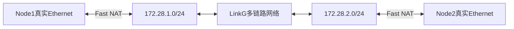

---

## 1. 总体模块划分

当前项目划分为 12 个模块：

| 编号 | 模块 | 核心职责 | 当前源码范围 |
|---|---|---|---|
| M01 | 应用骨架、配置与基础设施 | 统一生命周期、配置、日志、线程和基础能力 | `app/`、`infra/`、公共基础接口 |
| M02 | Packet 与数据包资源管理 | 固定 Packet Pool、引用计数、Headroom、零拷贝基础 | `core/packet/` |
| M03 | Node 与 Discovery 设备发现 | Peer、Path、双链路存活、Session/Revision、AP拓扑 | `core/node/`、`core/discovery/` |
| M04 | Link Manager 与物理链路抽象 | 统一 Link 接口、Link ID、生命周期和收发入口 | `core/link/` |
| M05 | Transport 传输协议 | Wire、Sequence、分片重组、本机交付和 AP 中继 | `core/transport/` |
| M06 | Scheduler 与 Route 路径调度 | Send Plan执行、主备/冗余调度、Linux虚拟路由 | `core/scheduler/`、`core/switch/`、`core/route/` |
| M07 | TUN 与用户数据面接入 | `linkg0`、Linux↔LinkG、目标Node解析和业务分类 | `core/tun/` |
| M08 | NAT 与 Fast NAT 内核加速 | 真实/虚拟IPv4映射、Hairpin、内核Fast Path | `core/nat/`、`kernel/linkg_fast_nat/` |
| M09 | Network Service 与系统网络适配 | Ethernet、IPv4 Forwarding、Wi-Fi/5G Owner 生命周期 | `service/network/` |
| M10 | Statistics、测试、构建与发布保障 | 可观测性、性能基线、回归、x86/ARM构建和发布保障 | `core/statistics/`、`test/`、构建系统 |
| M11 | Wi-Fi 接入与无线运行管理 | AP/STA、驱动、wlan0、无线状态监控和恢复 | `modules/wifi/`、`platform/wifi/` |
| M12 | 5G Cellular 与 RG255 接入 | AT/URC、SIM、注册、PDP、usb0、状态机和恢复 | `modules/cellular/`、`platform/cellular/`、`platform/uart/` |

这里最重要的调整是：

```text
M04
只定义“什么是一条Link、如何统一管理Link”

M11 / M12
分别定义“Wi-Fi和5G这两项具体接入能力如何真正建立并保持可用”
```

这样抽象层和硬件接入层不会混在同一个章节里。

---

## 2. 总体架构

整个系统可以分成五个层次：

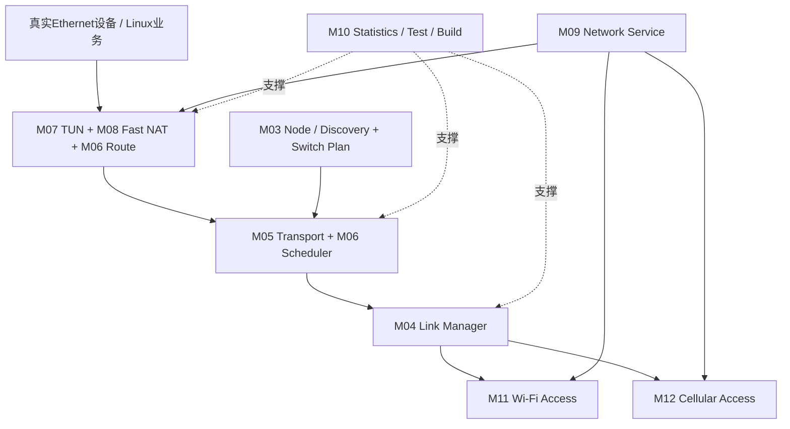

从上往下：

```text
真实设备与Linux
→ 虚拟地址和TUN边界
→ LinkG逻辑传输与调度
→ Peer / Path状态
→ 统一Link
→ Wi-Fi / 5G具体网络
```

每层只解决自己的问题。

---

## 3. 当前组网模型

当前产品拓扑固定为：

```text
1 AP + 最多16 STA
```

Direct Peer 只存在：

```text
AP ↔ STA
```

STA 与 STA 之间不建立直接 Peer。

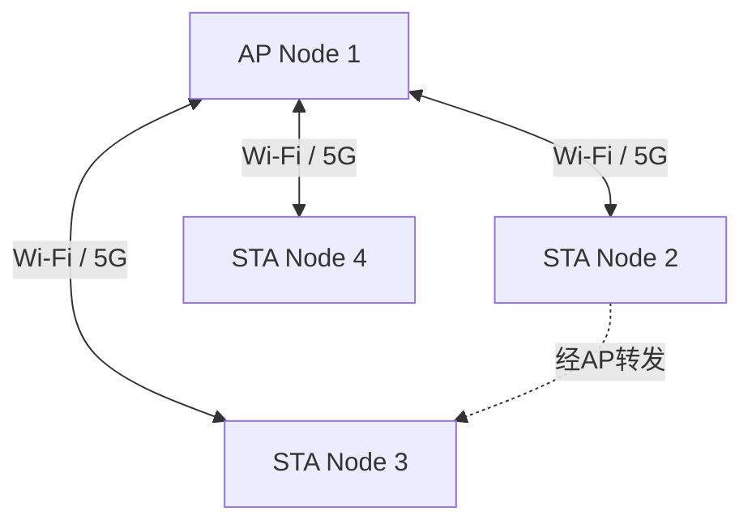

AP 保存所有 STA 的 Direct Peer 和 Path；STA 只保存 AP 这个 Direct Peer，其他 STA 通过 AP Topology 获得虚拟路由视图。

这一结构把连接状态规模控制在星型拓扑，而不是 N 个节点全互联。

---

## 4. 两套地址体系

LinkG 同时存在四类地址：

```text
真实Ethernet网络
例如 192.168.1.0/24

用户虚拟网络
172.28.0.0/16
每个Node一个/24

TUN节点网络
172.31.8.0/24

Wi-Fi互联网络
11.21.191.0/24
```

蜂窝数据面则直接使用 `usb0` 的 Global IPv6。

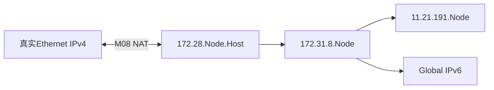

不同地址空间各有明确用途，不互相替代。

---

## 5. Linux → 远端节点的数据路径

用户访问远端虚拟地址，例如：

```text
172.28.2.100
```

完整发送路径为：


各层职责：

```text
Fast NAT
真实源地址 → 本节点虚拟地址

Route
目标172.28.N.0/24 → linkg0

TUN
解析Destination Node和业务类别

Transport
增加LinkG Header / Sequence / Fragment

Scheduler
根据Send Plan选择Link

Link
通过具体Path Endpoint发送
```

没有任何一层需要同时理解全部系统细节。

---

## 6. 远端 → Linux 的接收路径

反方向：


Transport 完成去重和必要重组以后，TUN 把原始 IPv4 Packet 写回 Linux，Fast NAT 再把虚拟目标地址恢复成本节点真实 Ethernet 地址。

---

## 7. STA → AP → STA 中继路径

STA 访问另一个 STA 时，最终目标和物理下一跳不同。

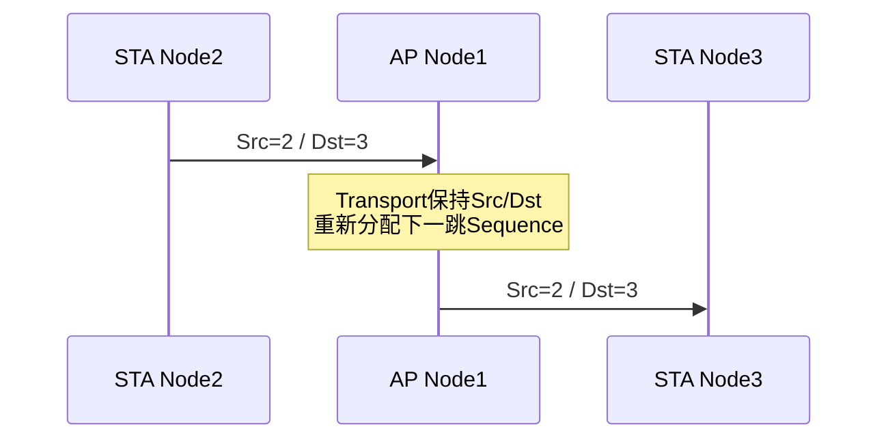

STA 只需要知道 AP 是唯一 Direct Peer；AP 根据最终 `destination_node_id` 再转发到对应 STA。

因此不需要建立 STA 全互联 Path。

---

## 8. Wi-Fi 与 5G 的统一方式

Wi-Fi 和 5G 的接入方式完全不同：

```text
Wi-Fi
AP / STA、hostapd、wpa_supplicant、IPv4、WMM

5G
RG255、AT/URC、SIM、PDP、usb0、Global IPv6
```

但从 Scheduler 往上，只看到统一：

```text
Link ID
Path
Endpoint
Packet
```

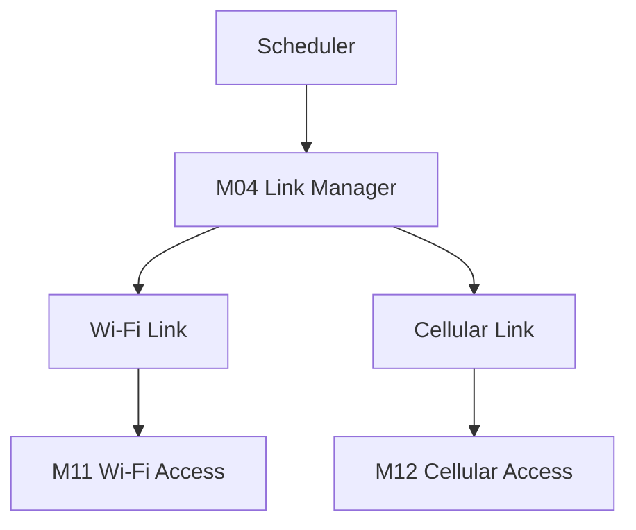

M11/M12 解决“网络能力是否存在”，M04 解决“如何统一使用这些网络能力”。

---

## 9. 多链路调度模型

每个 Direct Peer 最多拥有：

```text
Wi-Fi Path
Cellular Path
```

当前 Send Plan 支持：

```text
NONE
SINGLE
REDUNDANT
```

Scheduler 发送策略支持：

```text
DEFAULT
REDUNDANT
SPECIFIED
```

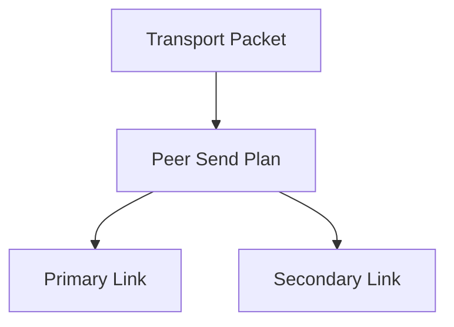

持续性故障通过 Path 状态变化更新 Send Plan；需要瞬时双路可靠性时使用 REDUNDANT。

当前 DEFAULT 不在一次发送失败后临时重试 Secondary，避免把故障检测和发送执行混进 Scheduler 热路径。

---

## 10. QoS 数据路径

业务分类只在 TUN 入口解析一次：

```text
REALTIME
VIDEO
DATA
```

随后作为 Packet 元数据一路传递。

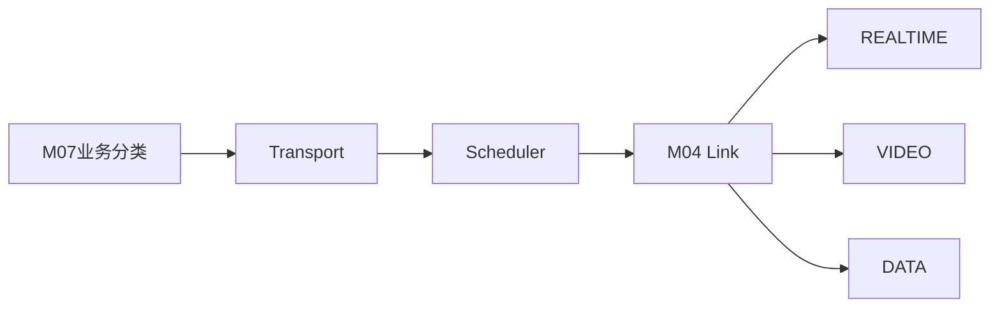

Scheduler 负责选 Link，不负责业务优先级。

具体 Link 再映射到：

```text
Wi-Fi：TOS / WMM / 独立业务Socket
5G：IPv6 TCLASS / SO_PRIORITY / 独立业务Socket
```

这样路径调度与 QoS 不互相耦合。

---

## 11. 控制面发现与数据面解耦

Discovery 使用：

```text
Wi-Fi 5006
Cellular 5007
```

周期交换完整 Report，维护：

```text
Node身份
Session / Revision
Wi-Fi Endpoint
Cellular Endpoint
双Access Liveness
AP Topology
```

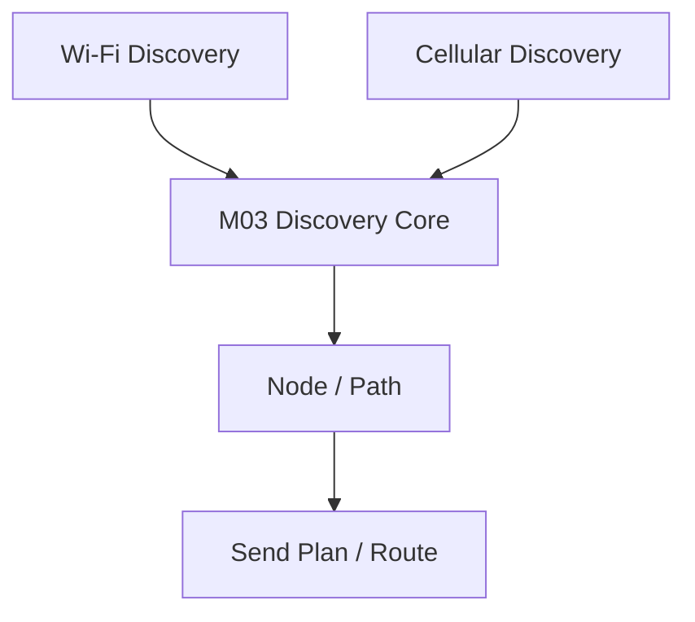

当前 Wi-Fi 是初始 Bootstrap；获得对端 Global IPv6 后 Cellular Discovery 才能建立独立控制面 Liveness。

Peer 在线和数据 Path 可用是两个独立状态，因此单条数据链重建不会直接销毁整个 Peer。

---

## 12. 系统运行依赖

初始化顺序：

```text
M01 Config / Infra
    ↓
M02 Packet Pool
    ↓
M09 Network Service初始化
    ↓
M04 Link Manager
    ↓
M03 Node基础状态
    ↓
M06 Switch / Scheduler
    ↓
M05 Transport
    ↓
M07 TUN
    ↓
M06 Route
    ↓
M08 NAT
    ↓
M03 Discovery
```

实际运行启动主线：

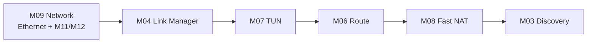

其中：

```text
M11 / M12
由M09 Network Service的Owner线程管理

M10
不属于运行主数据链，是整个项目的工程保障层
```

停止按反方向撤销运行资源，避免下层资源提前消失而上层线程仍在使用。

---

## 13. 性能设计主线

LinkG 数据面设计总体遵循：

```text
固定资源
批量处理
减少Packet复制
减少线程切换
缩短快速路径锁范围
控制面和数据面分离
```

主要实现包括：

```text
M02
固定Packet Pool + Headroom

M07
TUN Batch READ / WRITE

M05
Transport Batch + 普通包原地加头

M06
按Peer Group批量调度

M04
Link Batch Submit

M11/M12
具体Link批量Socket收发

M08
NAT放在内核Netfilter Fast Path
```


后续性能优化仍坚持逐层隔离和回退实验，不在没有证据时同时修改多层。

---

## 14. 当前实现边界

当前系统明确边界包括：

```text
组网：1 AP + 最多16 STA

Direct Peer：AP ↔ STA

单Peer Path：最多Wi-Fi + Cellular两条

TUN MTU：1500

Transport Frame Max：1452
Transport最大Header：24B
Transport最大两片分片

Wi-Fi：IPv4
Cellular：Global IPv6

Wi-Fi Discovery：广播Bootstrap
Cellular-only Bootstrap：当前不支持

Fast NAT：固定LinkG规则，不是通用NAT引擎
Fast SNAT状态：固定容量

Transport：不提供ACK/重传，不是可靠传输协议
```

这些边界是当前设计的一部分，不应在后续模块里被隐式突破。

---

## 15. 项目收口重点

M01～M12 的主体架构已经形成，后续工作重点从“大模块搭建”转向三类收口。

### 第一类：性能收口

重点检查：

```text
TUN → Transport → Scheduler → Link
```

端到端快速路径。

尤其 Transport 当前仍存在较多统计和状态维护，需要继续通过最小化实验确认真实性能瓶颈。

### 第二类：故障恢复收口

重点覆盖：

```text
Wi-Fi断链和STA恢复
5G注册 / PDP / usb0异常恢复
单Path失效后的Send Plan切换
Peer重启 / LEAVE / Timeout
Fast NAT Start / Stop
```

### 第三类：工程保障收口

M10 当前已有基础统计、Cellular专项测试和 x86/ARM 构建能力，但还需要逐步形成覆盖关键跨模块路径的稳定回归集合。

---

## 16. 项目完成后的模块关系

最终系统可以压缩成下面这张图：

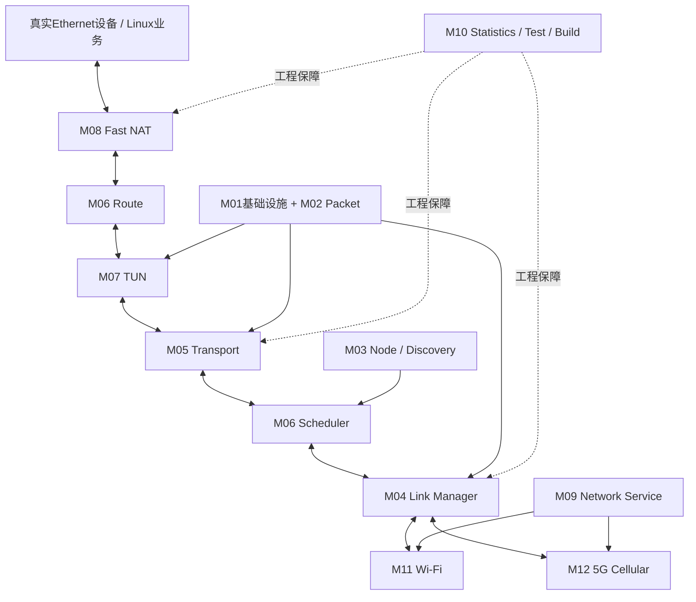

这套架构最终形成三条非常清楚的边界：

```text
控制面
Discovery / Network / Wi-Fi / Cellular
负责“网络和Peer当前是什么状态”

逻辑数据面
TUN / Transport / Scheduler / Link
负责“一个Packet如何从Node A到Node B”

Linux快速数据面
Route / Fast NAT
负责“真实IPv4和LinkG虚拟IPv4如何接入Linux”
```

M01、M02 提供统一基础设施和数据资源，M10 则贯穿整个项目提供统计、测试、构建和发布保障。

---

## 17. 总体结论

LinkG 当前已经不是由 Wi-Fi、5G、TUN、NAT 等独立功能简单拼接而成，而是形成了一套明确分层的多链路虚拟网络体系：

```text
真实Ethernet网络
        ↓
虚拟IPv4映射
        ↓
Linux Route / linkg0
        ↓
逻辑Transport
        ↓
多链路Scheduler
        ↓
统一Link
       /   \
   Wi-Fi   5G
```

设备发现负责建立 Peer 和 Path 事实，Scheduler 消费发送计划，Link 屏蔽物理链路差异，Wi-Fi/5G 各自负责把真实网络能力保持可用，Fast NAT 则把重复现场 IPv4 地址映射成统一的 LinkG 虚拟地址空间。

后续项目工作的重点不再是继续增加新的架构层，而是围绕现有 M01～M12 完成性能、故障恢复和工程回归收口，使这套架构从“功能完整”进入“稳定可交付”。
