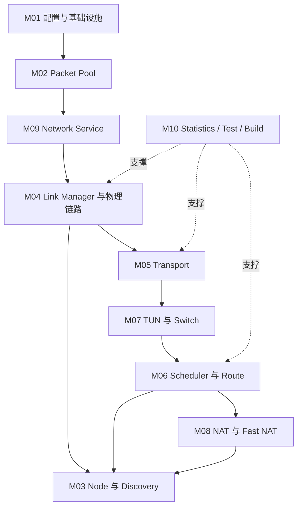

# LinkG 项目具体落实方案（可实施版）

> 状态：目录与模块骨架已建立，后续基于当前 `main` 源码逐章补全。

## 0. 项目总览

本文件作为 LinkG 项目的总计划，负责说明项目目标、最终架构、模块边界、模块依赖、总体里程碑、测试验收和交付标准。

## 1. 模块划分

| 编号 | 模块 | 当前源码范围 |
|---|---|---|
| M01 | 应用骨架、配置与基础设施 | `app/`、`infra/`、公共头文件与生命周期基础能力 |
| M02 | Packet 与数据包资源管理 | `core/packet/` |
| M03 | Node 与 Discovery 设备发现 | `core/node/`、`core/discovery/` |
| M04 | Link Manager 与物理链路 | `core/link/`、`modules/cellular/`、`modules/wifi/`、相关 `platform/` 适配 |
| M05 | Transport 传输协议 | `core/transport/` |
| M06 | Scheduler 与 Route 路径调度 | `core/scheduler/`、`core/route/` |
| M07 | TUN 与 Switch 数据转发 | `core/tun/`、`core/switch/` |
| M08 | NAT 与 Fast NAT 内核加速 | `core/nat/`、`kernel/linkg_fast_nat/` |
| M09 | Network Service 与系统网络适配 | `service/network/`、相关平台网络配置 |
| M10 | Statistics、测试、构建与发布保障 | `core/statistics/`、`test/`、`CMakeLists.txt`、`build.sh` |

## 2. 当前运行依赖

## 3. 后续编写顺序

1. 冻结总架构和关键数据路径。
2. 按 M01-M10 逐模块梳理现状、目标、接口、依赖和问题。
3. 明确每个模块的改造计划、测试项和验收标准。
4. 汇总开发顺序、里程碑、风险和最终交付物。
