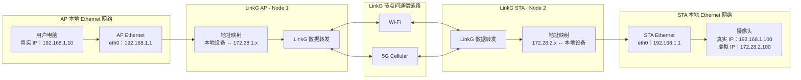
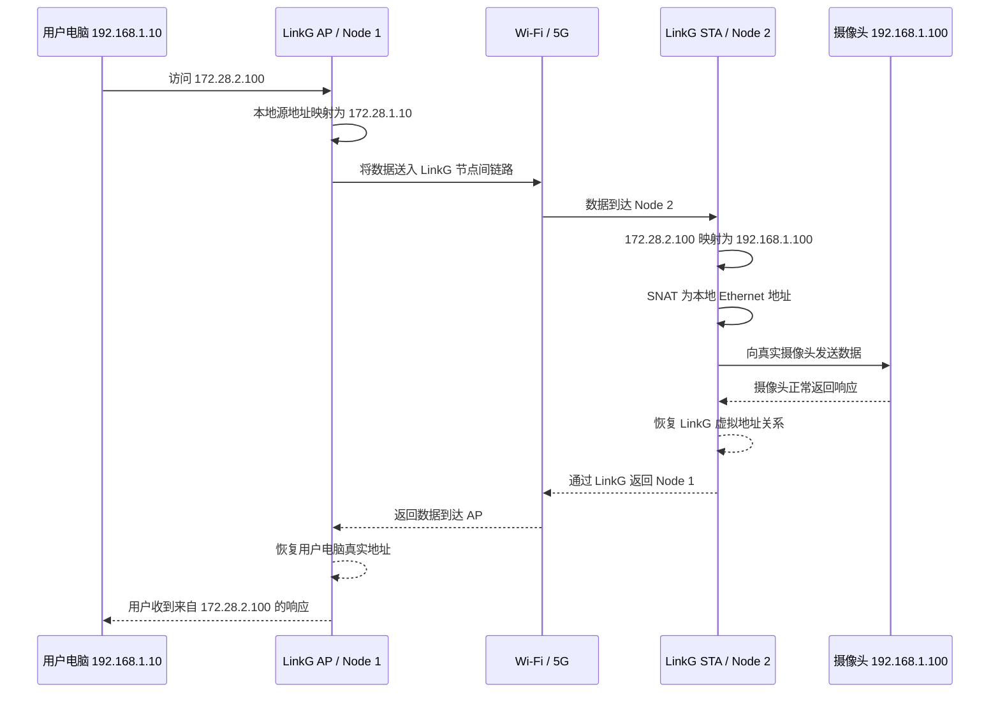

# 0. LinkG 架构总览与模块关系

> 本文首先从用户和网络使用视角描述 LinkG 的整体运行方式：设备如何接入、AP/STA 如何组成网络、什么是虚拟 IP，以及一台用户电脑访问远端摄像头时数据如何经过 LinkG。后续章节再逐步展开内部模块、数据面、控制面、生命周期和实现约束。

---

## 0.1 LinkG 是什么

LinkG 的目标，是把分布在多个 LinkG 节点后面的本地 Ethernet 设备，通过 Wi-Fi 和 5G 等通信链路连接成一个统一的虚拟 IPv4 网络。

用户侧不需要直接感知远端设备实际位于哪个 STA 后面，也不需要关心当前数据最终通过 Wi-Fi 还是 5G 传输。对用户而言，远端摄像头、飞控、工控设备或其他 Ethernet 终端都表现为虚拟网络中的一个普通 IPv4 地址。

可以把整个系统理解为：

> **LinkG 在多个彼此独立的本地局域网之间建立一张统一的虚拟网络，并通过 Wi-Fi / 5G 将这些局域网连接起来。**

典型使用方式为：

- 用户电脑连接在 AP 节点的 Ethernet 侧；
- 摄像头、飞控或其他业务设备连接在一个或多个 STA 节点的 Ethernet 侧；
- AP 与 STA 之间可以建立 Wi-Fi、5G 或两者并存的通信链路；
- 用户访问远端设备时只使用该设备的 **LinkG 虚拟 IP**；
- LinkG 自动完成节点识别、地址映射、路径选择和数据传输；
- 远端摄像头等终端设备不需要理解 LinkG，也不需要修改自身应用协议。

当前系统资源模型支持单个 LinkG 网络由 **1 个 AP + 最多 16 个 STA** 组成。

---

## 0.2 整体通信框图

下面以最典型的“用户电脑通过 AP 访问 STA 后面的摄像头”为例说明 LinkG 的整体运行形态。

假设：

- AP 为 `Node 1`；
- STA 为 `Node 2`；
- AP 和 STA 两侧的本地 Ethernet 网络都使用 `192.168.1.0/24`；
- 用户电脑真实地址为 `192.168.1.10`；
- 摄像头真实地址为 `192.168.1.100`；
- LinkG 虚拟聚合网络为 `172.28.0.0/16`；
- Node 1 对应虚拟子网 `172.28.1.0/24`；
- Node 2 对应虚拟子网 `172.28.2.0/24`；
- 因此远端摄像头对 LinkG 网络表现为虚拟地址 `172.28.2.100`。



从用户视角看，上图可以进一步简化成：

```text
用户电脑
192.168.1.10
    │
    │ 访问 172.28.2.100
    ▼
LinkG AP
    │
    ├──────── Wi-Fi ────────┐
    │                       │
    └──────── 5G ───────────┤
                            ▼
                         LinkG STA
                            │
                            ▼
                         摄像头
                      192.168.1.100
```

用户只需要知道目标设备的虚拟 IP，LinkG 内部负责把这次访问送到正确的远端节点和真实设备。

---

## 0.3 LinkG 中的三个主要 IPv4 地址空间

LinkG 同时存在多个不同用途的网络。理解它们的职责，是理解整个项目运行方式的基础。

| 网络 | 当前地址空间 | 用途 | 用户是否直接使用 |
|---|---|---|---|
| Ethernet 本地网络 | 默认 `192.168.1.0/24` | 每个 LinkG 节点后面的真实设备局域网 | 是，本地设备使用 |
| LinkG 虚拟聚合网络 | 默认 `172.28.0.0/16` | 为所有节点后的 Ethernet 设备提供全局唯一虚拟地址 | **是，跨节点访问主要使用这个地址** |
| LinkG TUN 网络 | 固定 `172.31.8.0/24` | LinkG 内部 `linkg0` 虚拟接口和系统路由使用 | 否，属于内部运行资源 |

此外，Wi-Fi 当前使用独立的链路网络 `11.21.191.0/24`；5G 则使用蜂窝网络提供的实际网络地址。它们属于 LinkG 的底层承载网络，不是用户访问远端业务设备时使用的业务地址。

最重要的区分是：

> **Ethernet IP 是设备在某个节点本地局域网中的真实地址；虚拟 IP 是该设备在整个 LinkG 网络中的统一地址。**

---

## 0.4 什么是 LinkG 虚拟 IP

LinkG 允许不同节点后面的 Ethernet 网络使用相同的真实网段，甚至允许不同节点后面的设备拥有完全相同的真实 IP。

例如两个不同 STA 后面都存在一个地址为：

```text
192.168.1.100
```

的摄像头。

如果直接使用真实地址，AP 侧无法仅通过 `192.168.1.100` 判断用户希望访问哪个 STA 后面的摄像头。

因此 LinkG 为每个节点分配一个独立的虚拟 `/24` 子网。

当前默认虚拟聚合网络为：

```text
172.28.0.0/16
```

虚拟地址中的第三个字节用于区分 Node：

```text
Node 1 -> 172.28.1.0/24
Node 2 -> 172.28.2.0/24
Node 3 -> 172.28.3.0/24
...
```

真实设备地址中的最后一个字节保持不变。

例如：

| 所属节点 | 真实 Ethernet IP | LinkG 虚拟 IP |
|---|---:|---:|
| Node 1 | `192.168.1.10` | `172.28.1.10` |
| Node 2 | `192.168.1.100` | `172.28.2.100` |
| Node 3 | `192.168.1.100` | `172.28.3.100` |

因此，即使 Node 2 和 Node 3 后面都存在 `192.168.1.100`，在 LinkG 网络中仍然可以分别通过：

```text
172.28.2.100
172.28.3.100
```

进行唯一访问。

虚拟 IP 本质上是 **LinkG 对远端真实 Ethernet 设备提供的统一网络身份**。

---

## 0.5 DNAT、SNAT 在整个通信流程中的作用

在架构总览中只需要理解 NAT 的外部作用，不需要在这里展开内核 Hook、连接表、端口池等实现原理。

### DNAT：把虚拟目标转换回真实设备

当数据已经到达目标 STA，例如目标地址为：

```text
172.28.2.100
```

LinkG 会在进入 Node 2 本地 Ethernet 网络前，把目标地址转换为：

```text
192.168.1.100
```

于是数据最终可以正常发送给真实摄像头。

这个过程可以概念性理解为：

```text
虚拟设备地址
172.28.2.100
    │
    │ DNAT / 地址映射
    ▼
真实设备地址
192.168.1.100
```

### SNAT：保证真实设备能够正常把响应送回来

远端摄像头只认识自己所在的本地 `192.168.1.0/24` 网络，它并不知道 `172.28.0.0/16` 是什么，也不应该要求摄像头额外配置 LinkG 路由。

因此 LinkG 在把跨节点访问送入目标 Ethernet 网络时，可以把数据包源地址转换成本节点 Ethernet 地址，例如：

```text
原虚拟源地址：172.28.1.10
        ↓ SNAT
摄像头看到：192.168.1.1
```

这样摄像头只会认为：

> “本地网关 `192.168.1.1` 正在访问我。”

摄像头的响应自然返回 STA 的 `192.168.1.1`，之后再由 LinkG 恢复原有虚拟通信关系并发送回远端用户。

因此从项目整体目标来看，NAT 的意义是：

> **让现有 Ethernet 设备在完全不了解 LinkG 的情况下，被纳入 LinkG 虚拟网络。**

---

## 0.6 用户电脑访问远端摄像头的完整流程

仍然使用前面的例子：

```text
AP Node ID       = 1
STA Node ID      = 2
用户电脑真实 IP  = 192.168.1.10
摄像头真实 IP    = 192.168.1.100
摄像头虚拟 IP    = 172.28.2.100
```

用户希望访问摄像头时，不访问远端的 `192.168.1.100`，而是直接访问：

```text
172.28.2.100
```

例如摄像头提供 HTTP、RTSP、TCP 或 UDP 服务时，业务端口保持原来的业务端口，只改变访问使用的 IP 地址。

整体过程如下：



从业务应用视角，最终形成的是一条普通的双向 IP 会话：

```text
用户电脑  <-------------------------->  远端摄像头虚拟 IP
192.168.1.10                           172.28.2.100
```

而真正的底层通信过程则是：

```text
用户电脑
   ↓
AP Ethernet
   ↓
地址映射
   ↓
LinkG
   ↓
Wi-Fi / 5G
   ↓
LinkG
   ↓
地址映射
   ↓
STA Ethernet
   ↓
真实摄像头
```

---

## 0.7 AP、STA 和多链路在整体系统中的位置

LinkG 使用 AP / STA 角色组织节点。

### AP

AP 是一个 LinkG 网络的中心接入节点。典型部署中，用户电脑、控制终端或上位机位于 AP 一侧，通过 AP 访问各个 STA 后面的远端设备。

### STA

STA 是远端业务节点。摄像头、飞控、传感器、工控设备等通过 Ethernet 连接到 STA。

每个 STA 拥有独立 Node ID，因此也拥有独立的 LinkG 虚拟子网。

### Wi-Fi 与 5G

Wi-Fi 和 5G 是 AP 与 STA 之间的 **底层承载链路**。

在概念层面，它们都完成同一件事情：

```text
把一个 LinkG 节点的数据送到另一个 LinkG 节点。
```

当两种链路同时可用时，LinkG 可以根据后续的路径和调度策略选择具体链路。对用户电脑和摄像头来说，这种选择是透明的。

因此用户看到的是：

```text
172.28.2.100
```

而不是：

```text
这个摄像头当前应该通过 Wi-Fi 地址访问
或者
这个摄像头当前应该通过 5G 地址访问
```

这也是 LinkG 将“业务网络”和“物理通信链路”解耦的核心价值之一。

---

## 0.8 用户实际需要做什么

从最终产品使用角度，用户不需要理解 LinkG 内部模块，只需要完成下面几件事：

1. 部署一个 AP 节点和所需数量的 STA 节点；
2. 为每个 LinkG 节点配置唯一的 Node ID；
3. 将用户电脑或上位机接入 AP Ethernet；
4. 将摄像头等业务设备接入对应 STA Ethernet；
5. 确保 AP 与 STA 至少存在一条可用 LinkG 通信链路；
6. 用户按照目标节点的 Node ID 和设备真实地址确定其虚拟 IP；
7. 后续业务软件直接访问虚拟 IP，不需要关心远端设备所在位置以及当前实际承载链路。

例如：

```text
Node 2 后面的 192.168.1.100 摄像头

对用户暴露为：
172.28.2.100
```

用户直接访问 `172.28.2.100` 即可。

---

## 0.9 本节结论

从整个项目运行流程看，LinkG 可以概括成三个层次：

```text
真实业务设备网络
        ↓
LinkG 虚拟地址与数据转发网络
        ↓
Wi-Fi / 5G 实际通信链路
```

其核心效果是：

> **把多个地理位置不同、真实网段可以重复的 Ethernet 局域网，组合成一个地址统一、设备可唯一寻址、底层链路对业务透明的虚拟网络。**

用户最终只面对虚拟设备地址；LinkG 负责在背后完成真实地址与虚拟地址的转换，并通过可用的 Wi-Fi / 5G 链路把数据送到正确节点。

这一层只定义 LinkG 的整体使用方式和外部通信语义，不讨论内部模块的具体实现原理。

---

## 后续章节待完善

后续在本文件中继续补充：

- LinkG 内部整体运行架构；
- AP / STA 控制关系与组网关系；
- Wi-Fi / 5G 多链路模型；
- `TUN -> Route -> Scheduler -> Transport -> Link` 数据面路径；
- Discovery 控制面路径；
- NAT / Fast NAT 内部数据路径；
- 模块初始化、启动、停止、反初始化顺序；
- 模块依赖关系；
- 架构不变量。
