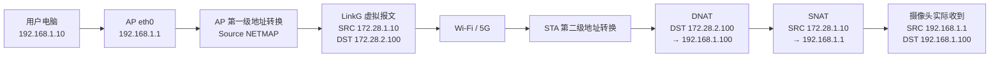
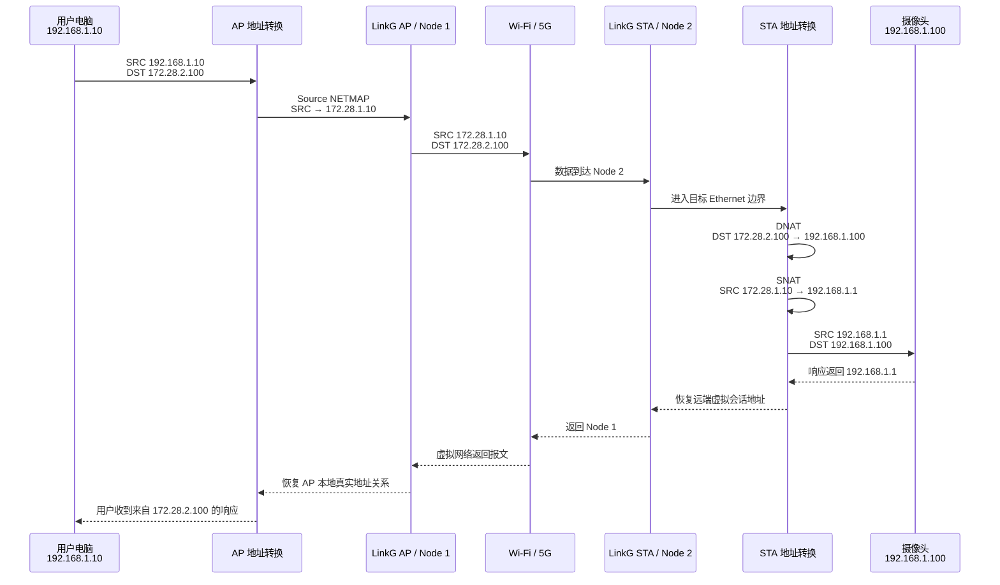
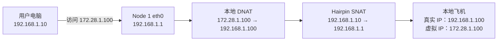
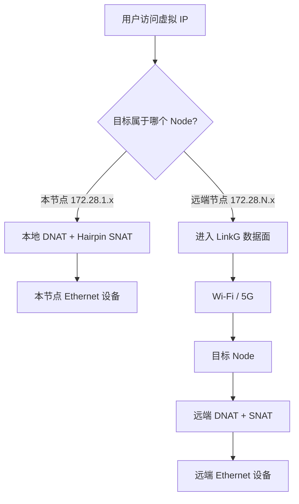

# 0. LinkG 架构总览与模块关系

> 本文首先从用户和网络使用视角描述 LinkG 的整体运行方式：设备如何接入、AP/STA 如何组成网络、什么是虚拟 IP，以及一台用户电脑访问远端摄像头时数据如何经过 LinkG。后续章节再逐步展开内部模块、数据面、控制面、生命周期和实现约束。

---

## 0.1 LinkG 是什么

LinkG 的目标，是把分布在多个 LinkG 节点后面的本地 Ethernet 设备，通过 Wi-Fi 和 5G 等通信链路连接成一个统一的虚拟 IPv4 网络。

用户侧不需要直接感知远端设备实际位于哪个 STA 后面，也不需要关心当前数据最终通过 Wi-Fi 还是 5G 传输。对用户而言，远端摄像头、飞控、工控设备或其他 Ethernet 终端都表现为虚拟网络中的一个普通 IPv4 地址。

可以把整个系统理解为：

> **LinkG 在多个彼此独立的本地局域网之间建立一张统一的虚拟网络，并通过 Wi-Fi / 5G 将这些局域网连接起来。**

典型使用方式为：

- 用户电脑连接在 AP 节点的 Ethernet 侧；
- 摄像头、飞控或其他业务设备连接在一个或多个 STA 节点的 Ethernet 侧；
- AP 与 STA 之间可以建立 Wi-Fi、5G 或两者并存的通信链路；
- 用户访问远端设备时只使用该设备的 **LinkG 虚拟 IP**；
- LinkG 自动完成节点识别、地址映射、路径选择和数据传输；
- 远端摄像头等终端设备不需要理解 LinkG，也不需要修改自身应用协议。

当前系统资源模型支持单个 LinkG 网络由 **1 个 AP + 最多 16 个 STA** 组成。

---

## 0.2 整体通信框图

下面以最典型的“用户电脑通过 AP 访问 STA 后面的摄像头”为例说明 LinkG 的整体运行形态。

这里首先要明确一个非常重要的物理关系：

> **用户电脑和远端摄像头并不连接在同一个 Ethernet 局域网中。LinkG AP 和 LinkG STA 各自拥有一个 Ethernet 侧，形成两个彼此独立的本地局域网，中间由 LinkG 的 Wi-Fi / 5G 网络连接。**

因此从物理拓扑看，完整路径是：

```text
用户电脑
   │
   │ Ethernet LAN A
   ▼
LinkG AP
   │
   │ Wi-Fi / 5G
   ▼
LinkG STA
   │
   │ Ethernet LAN B
   ▼
摄像头
```

假设：

- AP 为 `Node 1`；
- STA 为 `Node 2`；
- AP 和 STA 两侧的本地 Ethernet 网络都使用 `192.168.1.0/24`；
- 两个 LinkG 节点各自的 `eth0` 地址均为 `192.168.1.1`；
- 用户电脑真实地址为 `192.168.1.10`；
- 摄像头真实地址为 `192.168.1.100`；
- LinkG 虚拟聚合网络为 `172.28.0.0/16`；
- Node 1 对应虚拟子网 `172.28.1.0/24`；
- Node 2 对应虚拟子网 `172.28.2.0/24`；
- 因此远端摄像头对 LinkG 网络表现为虚拟地址 `172.28.2.100`。

虽然 AP 和 STA 的 Ethernet 网络都可以使用 `192.168.1.0/24`，两个 `eth0` 也都可以使用 `192.168.1.1`，但它们位于两个完全独立的二层网络中，因此不会产生地址冲突。

```mermaid
flowchart LR
    subgraph LAN_A[Ethernet LAN A · AP侧局域网]
        PC[用户电脑<br/>192.168.1.10]
        APETH[AP eth0<br/>192.168.1.1]
    end

    subgraph AP[LinkG AP · Node 1]
        NAT_A[第一级地址转换<br/>192.168.1.10 → 172.28.1.10]
        AP_CORE[LinkG 虚拟网络入口]
    end

    subgraph LINKG_NET[LinkG 节点间网络]
        WIFI[Wi-Fi]
        CELL[5G Cellular]
    end

    subgraph STA[LinkG STA · Node 2]
        STA_CORE[LinkG 虚拟网络出口]
        NAT_B[第二级地址转换<br/>DNAT + SNAT]
    end

    subgraph LAN_B[Ethernet LAN B · STA侧局域网]
        STAETH[STA eth0<br/>192.168.1.1]
        CAMERA[摄像头<br/>真实 IP：192.168.1.100<br/>虚拟 IP：172.28.2.100]
    end

    PC -->|目标 172.28.2.100| APETH
    APETH --> NAT_A
    NAT_A -->|172.28.1.10 → 172.28.2.100| AP_CORE

    AP_CORE <--> WIFI
    AP_CORE <--> CELL
    WIFI <--> STA_CORE
    CELL <--> STA_CORE

    STA_CORE --> NAT_B
    NAT_B -->|192.168.1.1 → 192.168.1.100| STAETH
    STAETH --> CAMERA
```



这张图表达了 LinkG 最基本的网络结构：

```text
真实网络 A
192.168.1.0/24
      │
      │ 第一级地址转换
      ▼
LinkG 虚拟网络
172.28.0.0/16
      │
      │ 第二级地址转换
      ▼
真实网络 B
192.168.1.0/24
```

也就是说，LinkG 实际上是在两个独立 Ethernet 网络之间建立一层统一的虚拟网络。

用户只需要知道目标设备的虚拟 IP，LinkG 内部负责把这次访问送到正确的远端节点和真实设备。

---

## 0.3 LinkG 中的三个主要 IPv4 地址空间

LinkG 同时存在多个不同用途的网络。理解它们的职责，是理解整个项目运行方式的基础。

| 网络 | 当前地址空间 | 用途 | 用户是否直接使用 |
|---|---|---|---|
| Ethernet 本地网络 | 默认 `192.168.1.0/24` | 每个 LinkG 节点后面的真实设备局域网 | 是，本地设备使用 |
| LinkG 虚拟聚合网络 | 默认 `172.28.0.0/16` | 为所有节点后的 Ethernet 设备提供全局唯一虚拟地址 | **是，跨节点访问主要使用这个地址** |
| LinkG TUN 网络 | 固定 `172.31.8.0/24` | LinkG 内部 `linkg0` 虚拟接口和系统路由使用 | 否，属于内部运行资源 |

此外，Wi-Fi 当前使用独立的链路网络 `11.21.191.0/24`；5G 则使用蜂窝网络提供的实际网络地址。它们属于 LinkG 的底层承载网络，不是用户访问远端业务设备时使用的业务地址。

最重要的区分是：

> **Ethernet IP 是设备在某个节点本地局域网中的真实地址；虚拟 IP 是该设备在整个 LinkG 网络中的统一地址。**

这里的 Ethernet 网络是“每个节点一张独立局域网”，并不是所有节点共享同一张 `192.168.1.0/24` 网络。

---

## 0.4 什么是 LinkG 虚拟 IP

LinkG 允许不同节点后面的 Ethernet 网络使用相同的真实网段，甚至允许不同节点后面的设备拥有完全相同的真实 IP。

例如两个不同 STA 后面都存在一个地址为：

```text
192.168.1.100
```

的摄像头。

如果直接使用真实地址，AP 侧无法仅通过 `192.168.1.100` 判断用户希望访问哪个 STA 后面的摄像头。

因此 LinkG 为每个节点分配一个独立的虚拟 `/24` 子网。

当前默认虚拟聚合网络为：

```text
172.28.0.0/16
```

虚拟地址中的第三个字节用于区分 Node：

```text
Node 1 -> 172.28.1.0/24
Node 2 -> 172.28.2.0/24
Node 3 -> 172.28.3.0/24
...
```

真实设备地址中的最后一个字节保持不变。

例如：

| 所属节点 | 真实 Ethernet IP | LinkG 虚拟 IP |
|---|---:|---:|
| Node 1 | `192.168.1.10` | `172.28.1.10` |
| Node 2 | `192.168.1.100` | `172.28.2.100` |
| Node 3 | `192.168.1.100` | `172.28.3.100` |

因此，即使 Node 2 和 Node 3 后面都存在 `192.168.1.100`，在 LinkG 网络中仍然可以分别通过：

```text
172.28.2.100
172.28.3.100
```

进行唯一访问。

虚拟 IP 本质上是 **LinkG 对远端真实 Ethernet 设备提供的统一网络身份**。

---

## 0.5 两端 Ethernet 与两级 NAT

理解 LinkG 端到端通信时，不能只看目标 STA 一侧的 DNAT / SNAT。一次“电脑访问远端摄像头”的通信会经过 **两个 LinkG 节点的地址转换边界**。

从系统概念上，可以把它理解为两级 NAT：

```text
Ethernet LAN A
用户电脑 192.168.1.10
        │
        │ 第一级：AP侧地址转换
        ▼
LinkG 虚拟网络
172.28.1.10 → 172.28.2.100
        │
        │ 第二级：STA侧地址转换
        ▼
Ethernet LAN B
STA 192.168.1.1 → 摄像头 192.168.1.100
```

严格按照当前 Fast NAT 实现，正向报文实际包含三次地址改写，但它们发生在两个 LinkG NAT 边界上。

### 第一级：AP 侧把本地 Ethernet 主机映射为虚拟 Endpoint

用户电脑发出的原始报文为：

```text
SRC = 192.168.1.10
DST = 172.28.2.100
```

数据从 AP 的 Ethernet 进入 LinkG 后，AP 把本地真实源地址映射为 Node 1 的虚拟 Endpoint 地址，主机号保持不变：

```text
192.168.1.10
      ↓ Source NETMAP
172.28.1.10
```

进入 LinkG 虚拟网络后，报文表现为：

```text
SRC = 172.28.1.10
DST = 172.28.2.100
```

这一步解决的是：

> **让 AP 本地电脑在 LinkG 网络中也拥有一个全局唯一的虚拟身份。**

因此严格来说，AP 入口当前不是传统“端口状态 SNAT”，而是按网段进行的 `Source NETMAP`；但从整个系统的概念层面，它属于第一级地址转换。

### 第二级：STA 侧把虚拟会话重新落到真实 Ethernet 网络

报文到达 Node 2 后，首先需要把虚拟目标：

```text
DST = 172.28.2.100
```

转换回摄像头真实地址：

```text
DST = 192.168.1.100
```

这是目标地址转换（DNAT）。

此时源地址仍然是：

```text
SRC = 172.28.1.10
```

但摄像头所在的本地 Ethernet 网络并不认识 LinkG 虚拟网络。为了让摄像头可以直接把响应返回给本地 LinkG STA，STA 在数据离开 `eth0` 前再次执行 SNAT，把源地址转换为 STA 本机 Ethernet 地址：

```text
SRC = 172.28.1.10
      ↓ SNAT
SRC = 192.168.1.1
```

因此摄像头真正收到的报文可以概念性表示为：

```text
SRC = 192.168.1.1
DST = 192.168.1.100
```

摄像头完全不知道远端存在 `172.28.1.10`，也不知道数据经过 Wi-Fi、5G 或 LinkG。

### 一张图看完整地址变化



因此一条业务会话实际上跨越了三个地址空间：

```text
192.168.1.10
   本地真实网络 A
        ↓
172.28.1.10 → 172.28.2.100
   LinkG 虚拟网络
        ↓
192.168.1.1 → 192.168.1.100
   远端真实网络 B
```

返回方向执行对应的逆向恢复，使用户电脑最终仍然认为自己正在和 `172.28.2.100` 通信。

这套两端地址转换机制带来的直接效果是：

> **电脑和摄像头两端都不需要增加 LinkG 专用路由，也不需要修改现有业务应用；两个真实局域网可以继续独立工作，LinkG 只在中间提供统一虚拟地址和跨节点通信能力。**

---

## 0.6 用户电脑访问远端摄像头的完整流程

仍然使用前面的例子：

```text
AP Node ID       = 1
STA Node ID      = 2
用户电脑真实 IP  = 192.168.1.10
AP Ethernet IP   = 192.168.1.1
STA Ethernet IP  = 192.168.1.1
摄像头真实 IP    = 192.168.1.100
用户电脑虚拟 IP  = 172.28.1.10
摄像头虚拟 IP    = 172.28.2.100
```

用户希望访问摄像头时，不访问远端的 `192.168.1.100`，而是直接访问：

```text
172.28.2.100
```

例如摄像头提供 HTTP、RTSP、TCP 或 UDP 服务时，业务端口保持原来的业务端口，只改变访问使用的 IP 地址。

整体过程如下：



从业务应用视角，最终形成的是一条普通的双向 IP 会话：

```text
用户电脑  <-------------------------->  远端摄像头虚拟 IP
192.168.1.10                           172.28.2.100
```

但从网络实际路径看，它经过的是：

```text
用户电脑
192.168.1.10
   │
   │ Ethernet LAN A
   ▼
LinkG AP eth0
192.168.1.1
   │
   │ 第一级地址转换
   ▼
虚拟源 172.28.1.10
   │
   │ LinkG / Wi-Fi / 5G
   ▼
虚拟目标 172.28.2.100
   │
   │ 第二级地址转换：DNAT + SNAT
   ▼
LinkG STA eth0
192.168.1.1
   │
   │ Ethernet LAN B
   ▼
摄像头
192.168.1.100
```

这条路径是后续理解 LinkG TUN、Route、Scheduler、Transport、Link 和 Fast NAT 各模块职责的基础。

---

## 0.7 用户电脑访问本节点设备

LinkG 不仅需要支持跨节点访问，还必须保证用户使用同一套虚拟 IP 访问方式访问 **本节点 Ethernet 后面的设备**。

例如 Node 1 的本地 Ethernet 网络中同时连接：

```text
用户电脑：      192.168.1.10
LinkG Node 1： 192.168.1.1
本地飞机：      192.168.1.100
```

Node 1 的虚拟子网为 `172.28.1.0/24`，因此本地飞机在 LinkG 中的统一虚拟地址为：

```text
172.28.1.100
```

即使电脑和飞机就在同一个 LinkG 节点后面，用户也仍然访问 `172.28.1.100`，而不是切换回真实地址 `192.168.1.100`。

这样上层业务始终只使用虚拟地址，不需要判断目标设备究竟位于本节点还是远端节点。

### 本节点访问路径

本节点访问不会进入 `linkg0`，也不会经过 Wi-Fi / 5G。数据在当前节点的 Ethernet 侧直接完成回环地址转换。



用户电脑最初发出的报文为：

```text
SRC = 192.168.1.10
DST = 172.28.1.100
```

由于目标虚拟地址属于本节点的 `172.28.1.0/24`，LinkG 直接把目标地址映射回本地 Ethernet 中的真实设备地址：

```text
DST 172.28.1.100
        ↓ DNAT
DST 192.168.1.100
```

随后执行 Hairpin SNAT，把电脑的真实源地址转换为 LinkG 本机 Ethernet 地址：

```text
SRC 192.168.1.10
        ↓ Hairpin SNAT
SRC 192.168.1.1
```

因此本地飞机真正收到的报文为：

```text
SRC = 192.168.1.1
DST = 192.168.1.100
```

飞机只看到本地 LinkG 网关 `192.168.1.1` 正在访问自己，不需要知道虚拟网络的存在。

返回方向执行对应的逆向恢复：

```text
飞机返回：
SRC = 192.168.1.100
DST = 192.168.1.1

        ↓ Fast NAT 反向恢复

用户最终看到：
SRC = 172.28.1.100
DST = 192.168.1.10
```

因此从用户电脑看来，整个会话始终是：

```text
192.168.1.10 <--------> 172.28.1.100
   用户电脑                本地飞机虚拟 IP
```

本节点访问与跨节点访问的区别可以概括为：



所以 LinkG 对上层提供的访问语义始终一致：

> **无论目标设备位于本节点还是远端节点，用户始终访问设备的 LinkG 虚拟 IP；目标在本节点时由本机 Fast NAT 直接回环到 Ethernet，目标在远端时才进入 LinkG 多链路数据面。**

---

## 0.8 AP、STA 和多链路在整体系统中的位置

LinkG 使用 AP / STA 角色组织节点。

### AP

AP 是一个 LinkG 网络的中心接入节点。典型部署中，用户电脑、控制终端或上位机位于 AP 一侧，通过 AP 访问各个 STA 后面的远端设备。

AP 同时也是用户侧真实 Ethernet 网络进入 LinkG 虚拟网络的入口，因此它不仅负责节点间通信，还负责把本地 Ethernet 主机映射为本节点的虚拟 Endpoint。

### STA

STA 是远端业务节点。摄像头、飞控、传感器、工控设备等通过 Ethernet 连接到 STA。

每个 STA 拥有独立 Node ID，因此也拥有独立的 LinkG 虚拟子网。

STA 是 LinkG 虚拟网络重新进入远端真实 Ethernet 网络的出口，负责把虚拟目标地址还原为本地真实设备地址，并保证本地设备可以正常返回响应。

### Wi-Fi 与 5G

Wi-Fi 和 5G 是 AP 与 STA 之间的 **底层承载链路**。

在概念层面，它们都完成同一件事情：

```text
把一个 LinkG 节点的数据送到另一个 LinkG 节点。
```

当两种链路同时可用时，LinkG 可以根据后续的路径和调度策略选择具体链路。对用户电脑和摄像头来说，这种选择是透明的。

因此用户看到的是：

```text
172.28.2.100
```

而不是：

```text
这个摄像头当前应该通过 Wi-Fi 地址访问
或者
这个摄像头当前应该通过 5G 地址访问
```

这也是 LinkG 将“业务网络”和“物理通信链路”解耦的核心价值之一。

---

## 0.9 用户实际需要做什么

从最终产品使用角度，用户不需要理解 LinkG 内部模块，只需要完成下面几件事：

1. 部署一个 AP 节点和所需数量的 STA 节点；
2. 为每个 LinkG 节点配置唯一的 Node ID；
3. 将用户电脑或上位机接入 AP Ethernet；
4. 将摄像头等业务设备接入对应 STA Ethernet；
5. 确保 AP 与 STA 至少存在一条可用 LinkG 通信链路；
6. 用户按照目标节点的 Node ID 和设备真实地址确定其虚拟 IP；
7. 后续业务软件直接访问虚拟 IP，不需要关心远端设备所在位置以及当前实际承载链路。

例如：

```text
Node 2 后面的 192.168.1.100 摄像头

对用户暴露为：
172.28.2.100
```

用户直接访问 `172.28.2.100` 即可。

如果设备就在 AP 本节点，例如 Node 1 后面的 `192.168.1.100` 飞机，则仍然使用：

```text
172.28.1.100
```

访问方式不发生变化。

---

## 0.10 本节结论

从整个项目运行流程看，LinkG 可以概括成五个连续部分：

```text
AP侧真实 Ethernet 网络
        ↓
AP侧地址转换
        ↓
LinkG 虚拟网络 + Wi-Fi / 5G 承载
        ↓
STA侧地址转换
        ↓
STA侧真实 Ethernet 网络
```

对于本节点设备，路径会在 AP 侧地址转换后直接回到本地 Ethernet，不进入节点间承载网络。

其核心效果是：

> **把多个地理位置不同、真实网段可以重复的 Ethernet 局域网，组合成一个地址统一、设备可唯一寻址、底层链路对业务透明的虚拟网络。**

用户最终只面对虚拟设备地址；LinkG 根据目标虚拟地址自动判断是本节点回环还是跨节点转发，并在对应位置完成真实网络与虚拟网络之间的地址转换。

这一层只定义 LinkG 的整体使用方式和外部通信语义，不讨论内部模块的具体实现原理。

---
