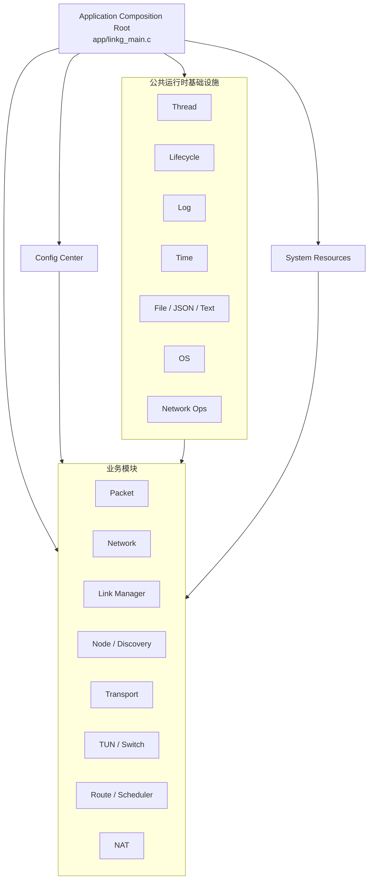
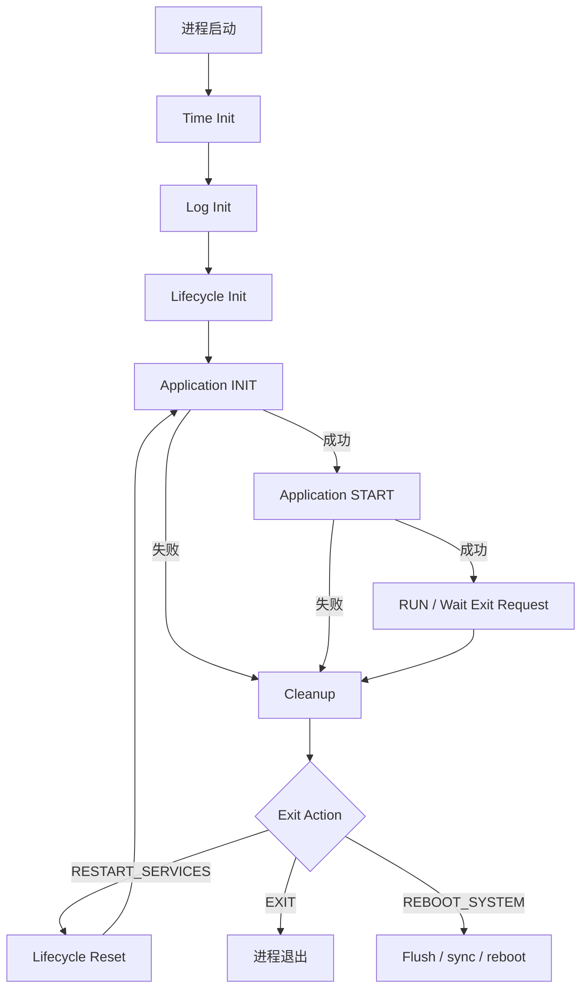
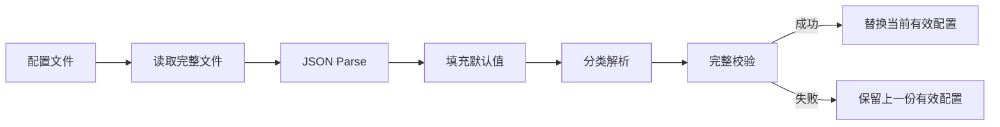

# M01：应用骨架、配置与基础设施

> M01 是 LinkG 的公共地基层。它不实现具体的数据转发、链路传输或设备发现业务，而是规定整个应用如何启动、运行、退出和重启，并向所有业务模块提供统一的线程、生命周期、日志、时间、文件、JSON、OS、网络操作、配置和系统固定资源能力。

源码范围：

```text
app/linkg_main.c
infra/base/
infra/config/
include/linkg/base/
include/linkg/config/
include/linkg/platform/linkg_system_resources.h
config/default_config_ap.json
config/default_config_sta.json
```

Packet、Node、Link、Transport、TUN、Route、NAT、Discovery 等业务模块虽然由 `linkg_main.c` 统一装配，但其内部设计分别由后续模块文档负责，本章只描述它们与应用骨架之间的生命周期契约。

---

## 1. 模块定位

M01 由四部分组成：

1. **应用组合根**：负责把 LinkG 各业务模块按照依赖关系组织成一个完整应用；
2. **公共运行时基础设施**：提供 Thread、Lifecycle、Log、Time、File、JSON、OS、Network Ops 等公共能力；
3. **全局配置中心**：统一加载、校验、读取、替换和持久化 LinkG 静态配置；
4. **系统资源契约**：集中定义 Node 数量、固定网段、UDP 端口和网络接口名称等系统级资源。

整体关系如下：



M01 的核心目标不是增加业务功能，而是保证：

> **所有业务模块都在同一套生命周期、线程、配置、时间、日志和资源规则下运行。**

---

## 2. 模块职责与边界

### 2.1 M01 负责

M01 负责：

- LinkG 进程入口和全局运行循环；
- 公共服务初始化；
- 业务模块初始化、启动、停止和反初始化编排；
- 部分初始化或部分启动失败后的安全清理；
- 正常退出、服务重启和系统重启请求处理；
- 通用线程对象和线程停止/唤醒机制；
- 单调时间、超时和睡眠接口；
- 统一日志输出；
- 文件、JSON、文本、OS 和基础网络操作封装；
- 全局静态配置加载、校验、快照和原子保存；
- 系统固定资源集中定义。

### 2.2 M01 不负责

M01 不负责：

- Packet 内存池内部实现；
- Wi-Fi / Cellular 链路实现；
- Transport 协议头、分片和重组；
- 路径选择和调度策略；
- TUN 数据收发；
- Discovery Peer 状态机；
- NAT 数据面规则实现；
- 具体业务模块运行状态统计。

应用骨架只决定“谁先建立、谁先启动、谁先停止、谁最后释放”，不进入业务模块内部替代其职责。

---

## 3. 应用组合根

### 3.1 `linkg_main.c` 的职责

`app/linkg_main.c` 是 LinkG 的 Application Composition Root。

它维护一个全局应用上下文，记录各模块是否已经完成初始化以及是否已经进入运行态。当前主要状态包括：

```text
Config Loaded
Packet Pool Initialized
Network Initialized / Started
Link Manager Initialized / Started
Node Initialized
Switch Initialized
Scheduler Initialized
Transport Initialized
TUN Initialized / Started
Route Initialized / Started
NAT Initialized / Started
Discovery Initialized / Started
```

这些状态不是业务状态，而是 **资源所有权记录**。

其意义是：发生异常时，应用能够准确知道哪些资源已经建立，只清理实际已经获得的资源，而不是盲目执行全部反初始化流程。

### 3.2 全局运行模型

LinkG 主程序整体运行流程如下：



Time、Log 和 Lifecycle 属于进程级公共服务，位于业务服务重启循环之外。

因此 `RESTART_SERVICES` 不会重新创建整个进程，而是执行：

```text
停止当前业务模块
        ↓
反初始化当前业务模块
        ↓
Lifecycle Reset
        ↓
重新加载配置
        ↓
重新初始化并启动业务模块
```

这为后续运行期配置更新和服务恢复提供统一入口。

---

## 4. 应用初始化与启动顺序

### 4.1 INIT 阶段

INIT 阶段只建立软件资源和模块依赖，不启动具有独立运行态的业务服务。

当前初始化顺序为：

```text
Config
  ↓
Packet Pool
  ↓
Network
  ↓
Link Manager
  ↓
Node
  ↓
Switch
  ↓
Scheduler
  ↓
Transport
  ↓
TUN
  ↓
Route
  ↓
NAT
  ↓
Discovery
```

关键依赖包括：

- Config 最先加载，为后续模块提供统一配置快照；
- Packet Pool 在 Link 和 TUN 之前建立，作为全局数据包资源；
- Transport 必须在业务 Link 启动前完成 Link Manager 接收回调注册；
- TUN 初始化时向 Transport 注册本机 `USER_DATA` 交付入口；
- Route、NAT、Discovery 在其依赖的软件对象建立后再初始化。

### 4.2 START 阶段

真正具有运行资源的模块按照以下顺序启动：


当前启动顺序为：

```text
Network
  ↓
Link Manager
  ↓
TUN
  ↓
Route
  ↓
NAT
  ↓
Discovery
```

原因如下：

- Network 首先建立 Ethernet 和系统网络基础能力；
- Transport 已在 INIT 阶段完成回调注册后，Link Manager 才允许启动实际收发线程；
- Route 和 NAT 都依赖已经存在的 `linkg0`，因此必须先启动 TUN；
- NAT 需要 Ethernet、IPv4 forwarding 和 `linkg0` 均已准备完成；
- Discovery 最后启动，从此刻开始 Peer 上线才允许创建 Node、Transport、Path 和 Linux Route 等运行状态。

因此 Discovery 启动完成可以视为 LinkG 业务进入完整运行态的最后一步。

---

## 5. STOP、DEINIT 与错误回退

### 5.1 STOP 必须按运行依赖反序执行

当前停止顺序为：

```text
Discovery
  ↓
NAT
  ↓
Route
  ↓
TUN
  ↓
Link Manager
  ↓
Network
```

停止顺序不能随意调整。

例如：

- Discovery 停止期间仍可能需要 Link 和 Route 发送 LEAVE、注销 Peer 和删除路由，因此必须最先停止；
- Route 必须在 TUN 销毁前释放 `linkg0` 的接口索引和路由资源；
- 所有 Link 收发线程退出后，才能关闭底层 Network 接入资源。

### 5.2 DEINIT 按初始化依赖反序执行

所有运行模块成功停止后，再按初始化顺序的逆序释放软件资源：

```text
Discovery
NAT
Route
TUN
Transport
Scheduler
Switch
Node
Link Manager
Network
Packet Pool
Config
```

业务模块尚处于 Started 状态时禁止直接进入 Deinit。

### 5.3 部分失败回退

应用上下文为每个资源维护独立的 `initialized` / `started` 标志。

例如 INIT 执行到 Transport 成功、TUN 失败：

```text
Config          initialized
Packet Pool     initialized
Network         initialized
Link Manager    initialized
Node            initialized
Switch          initialized
Scheduler       initialized
Transport       initialized
TUN             failed
```

此时 Cleanup 不会调用未成功初始化模块的 Deinit，而只逆序清理已经获得的资源。

START 阶段同理。

### 5.4 Stop 失败原则

关键模块停止失败后，不应继续盲目拆除其下层依赖。

例如 TUN Stop 无法确认成功时，继续销毁 Link Manager 或 Network 可能导致仍在运行的数据路径引用已经释放的资源。

因此当前应用骨架采用：

> **停止失败优先保留依赖资源，避免把“未完全停止”扩大成“使用已经释放资源”。**

这是整个 LinkG 生命周期必须保持的基本原则。

---

## 6. 公共运行时基础设施

`infra/base/` 是 LinkG 的通用运行时层，不包含具体 LinkG 业务语义。

| 能力 | 主要接口 | 统一解决的问题 |
|---|---|---|
| Thread | `linkg_thread_*` | 线程创建、停止、唤醒、CPU 亲和性和调度配置 |
| Lifecycle | `linkg_lifecycle_*` | 全局退出、服务重启、系统重启请求 |
| Log | `linkg_log_*` | 统一日志等级、Console 和文件输出、Flush |
| Time | `linkg_time_*` | 单调时间、运行时间、Deadline 和 Sleep |
| File | `linkg_file_*` | 文件读写、目录、磁盘空间和原子文件替换 |
| JSON | `linkg_json_*` | JSON 解析、类型检查、重复键检查和序列化 |
| Text | `linkg_text_*` | 通用字符串和文本处理 |
| OS | `linkg_os_*` | 外部程序执行、子进程启动和停止 |
| Network Ops | `linkg_network_*` | IP、掩码、接口、IPv6 RA、路由和 forwarding 基础操作 |

### 6.1 Thread

`linkg_thread_t` 是 LinkG 的通用线程对象。

它统一保存：

```text
线程名称
pthread_t
用户线程函数
user_data
wakeup_fd
stack_size
CPU core
sched_policy
sched_priority
started / running
```

线程统一生命周期为：

```text
init
  ↓
start
  ↓
running
  ↓
wakeup / stop request
  ↓
join
  ↓
deinit
```

`wakeup_fd` 用于解决一个关键问题：线程如果阻塞在 `poll/epoll` 等等待中，仅修改 `running=false` 不能保证线程及时醒来，因此停止动作必须同时具备显式唤醒能力。

线程层还预留：

- CPU affinity；
- POSIX scheduling policy；
- realtime scheduling priority；
- 自定义栈大小。

#### Thread 设计原则

业务模块应优先使用统一 Thread 抽象，而不是各自重复实现：

```text
pthread_create
atomic running flag
eventfd wakeup
pthread_join
CPU affinity
scheduler priority
```

这样可以统一线程停止语义和资源回收行为。

### 6.2 Lifecycle

Lifecycle 管理的是整个 LinkG 应用的退出意图，而不是单个业务模块状态。

当前退出动作包括：

```text
NONE
EXIT
RESTART_SERVICES
REBOOT_SYSTEM
```

运行线程通过：

```text
linkg_lifecycle_request_exit()
```

提交退出请求，主线程通过：

```text
linkg_lifecycle_wait_for_exit()
```

统一等待和执行最终动作。

因此业务模块不应该直接：

```text
exit()
reboot()
销毁其他业务模块
```

而应把退出意图交给应用组合根统一执行。

### 6.3 Log

所有业务模块使用统一日志接口：

```text
DEBUG
INFO
WARNING
ERROR
FATAL
```

当前日志层支持：

- Console 输出；
- 目录文件输出；
- 日志等级过滤；
- 日志 Flush；
- Session 文件；
- 文件大小控制；
- 磁盘剩余空间保护；
- 连续重复日志抑制。

业务模块不应自行维护第二套日志文件生命周期。

### 6.4 Time

时间模块统一提供：

```text
monotonic_us
elapsed_ms / elapsed_us
sleep_ms / sleep_us
sleep_until_us
```

所有以下逻辑都应优先基于统一单调时间：

- 超时；
- Deadline；
- 重试窗口；
- 心跳周期；
- 状态机等待；
- RTT / 延迟测量。

运行控制逻辑不得依赖系统墙上时间跳变来判断超时。

### 6.5 File / JSON

File 层提供完整文件读写和原子替换能力，例如：

```text
read_all
write_all
write_all_atomic
replace_atomic
mkdirs
free_bytes
```

JSON 层在 cJSON 之上统一处理：

- 必选字段；
- 可选字段；
- 类型检查；
- 数值范围；
- 缓冲区长度；
- 重复字段；
- 格式化和非格式化输出。

因此 Config 等上层模块不应直接散布大量裸 cJSON 访问逻辑。

### 6.6 OS

OS 层统一封装：

```text
run
run_ignore
shellf
spawn
process_running
process_stop
```

其目标是把外部程序执行和子进程生命周期集中到公共接口，避免业务模块重复处理 `fork/exec/wait/kill` 等细节。

### 6.7 Network Ops

Network Ops 是业务模块与 Linux 基础网络能力之间的公共接口，当前覆盖：

- IPv4 字符串和地址转换；
- netmask / prefix；
- 子网重叠判断；
- IPv6 Global 地址判断；
- 接口存在、Up/Down、MTU、MAC；
- IPv4 / IPv6 地址读取；
- IPv6 RA 配置；
- IPv4 / IPv6 默认网关查询；
- IPv4 forwarding。

Network Service、Cellular Status、NAT 等模块均可复用该层，而不需要分别实现相同 Linux 网络操作。

---

## 7. 全局配置中心

### 7.1 配置模型

当前顶层配置结构为：

```c
typedef struct
{
    linkg_device_config_t  device;
    linkg_network_config_t network;
    linkg_links_config_t   links;
    linkg_paths_config_t   paths;
} linkg_config_t;
```

逻辑结构为：

```text
LinkG Config
├── device
│   └── role
│
├── network
│   ├── node_id
│   ├── virtual_network
│   ├── ethernet_network
│   └── traffic_rules
│
├── links
│   ├── wifi
│   └── cellular
│
└── paths
    ├── wifi
    └── cellular
```

其中：

- `device` 定义 AP / STA 全局角色；
- `network` 定义 Node ID、虚拟网络、Ethernet 网络和业务流量分类；
- `links` 定义 Wi-Fi / Cellular 物理接入能力；
- `paths` 定义哪些逻辑路径启用以及路径模式和优先级。

### 7.2 配置加载

配置加载流程为：



加载和完整校验成功前，不允许破坏上一份有效配置。

### 7.3 Snapshot 和 Getter

配置模块不向业务模块暴露内部可写指针。

业务模块通过：

```text
linkg_config_create_snapshot()
```

获取完整配置副本，或者通过分类 Getter 获取：

```text
device
network
links
paths
wifi
cellular
```

如果一次业务决策依赖多个配置域，应优先读取完整 Snapshot，避免连续多个 Getter 跨越配置替换边界后获得不一致组合。

### 7.4 Replace 与 Save

配置更新被拆分为两个不同动作：

```text
replace = 更新当前内存配置
save    = 持久化指定配置
```

这两个接口不自动启动、停止或重启业务模块。

推荐运行期配置更新事务为：

```text
获取旧配置快照
        ↓
构造新配置
        ↓
完整校验
        ↓
原子保存
        ↓
替换内存配置
        ↓
请求 RESTART_SERVICES
        ↓
失败时恢复旧配置
```

应用配置与业务生命周期必须由更高层编排，Config 本身只负责配置数据。

### 7.5 配置并发原则

当前配置通过锁保护内部有效配置。

必须保持以下原则：

1. Getter 返回副本，不返回内部生命周期指针；
2. 文件 I/O 和 JSON 格式化不得长期持有配置锁；
3. 配置模块不得在持锁状态下调用业务模块；
4. 多步骤“保存 + 替换 + 服务重启”事务必须由上层串行化；
5. 配置失败不得留下半更新状态。

---

## 8. 系统固定资源契约

所有系统固定资源统一集中在：

```text
include/linkg/platform/linkg_system_resources.h
```

当前主要资源包括：

### 8.1 Node 资源

```text
有效 Node ID：1 ~ 254
Broadcast ID：255
单组网最大节点：17
最大 STA：16
```

产品当前组网约束为：

```text
1 AP + 最多 16 STA
```

### 8.2 固定网络资源

```text
TUN Network : 172.31.8.0/24
TUN MTU     : 1500
Wi-Fi Network: 11.21.191.0/24
```

### 8.3 UDP 端口

```text
Wi-Fi Data       5000
Wi-Fi Realtime   5001
Wi-Fi Video      5002
Cellular Data    5003
Cellular Realtime 5004
Cellular Video   5005
Wi-Fi Discovery  5006
Cellular Discovery 5007
```

### 8.4 网络接口

```text
Wi-Fi    wlan0
Cellular  usb0
TUN       linkg0
Ethernet  eth0
```

这些资源属于系统契约，不应在各业务模块中重复定义 magic number 或接口字符串。

---

## 9. M01 架构不变量

M01 必须长期保持以下规则：

1. **单一组合根**：业务模块之间的全局启动和销毁顺序只能由应用组合根统一编排；
2. **先初始化后启动**：模块必须先完成软件资源建立，再进入运行态；
3. **反序停止和释放**：Stop / Deinit 必须遵循依赖反序；
4. **部分成功可回退**：任何初始化或启动阶段失败，都必须能够只清理已经成功获得的资源；
5. **停止失败不继续破坏依赖**：无法确认上层模块已停止时，不继续销毁其依赖资源；
6. **统一退出请求**：业务模块不直接退出进程或重启系统；
7. **统一线程抽象**：需要可控停止和唤醒的业务线程优先使用 `linkg_thread_t`；
8. **统一单调时间**：运行超时、Deadline 和周期逻辑使用公共 Time 接口；
9. **配置只提供数据**：Config 不负责业务模块启停；
10. **配置读取返回副本**：业务模块不得长期持有 Config 内部地址；
11. **固定资源唯一来源**：系统端口、接口名称和固定网段统一来自 `linkg_system_resources.h`；
12. **公共能力不得重复实现**：已有 File、JSON、OS、Network Ops 能力时，业务模块原则上不重复维护另一套实现。

---

## 10. 当前实现状态

当前 M01 已经具备完整骨架：

| 能力 | 当前状态 |
|---|---|
| Application Composition Root | 已实现 |
| INIT / START / STOP / DEINIT 编排 | 已实现 |
| 部分初始化状态记录 | 已实现 |
| `RESTART_SERVICES` 运行循环 | 已实现 |
| `REBOOT_SYSTEM` 退出动作 | 已实现 |
| Thread 抽象 | 已实现 |
| Lifecycle 全局退出通知 | 已实现 |
| Log | 已实现 |
| Monotonic Time | 已实现 |
| File / JSON / OS / Network Ops | 已实现 |
| Config Snapshot / Replace / Save | 已实现 |
| System Resources 集中管理 | 已实现 |

因此 M01 当前不需要进行大规模架构重写，重点应从“继续增加公共封装”转向 **冻结边界、清理重复实现、补齐测试和消除文档/接口漂移**。

---

## 11. 当前问题与改造计划

### P0：统一配置定义和配置文档

当前公共接口 `linkg_config.h` 已包含：

```text
device
network
links
paths
```

默认配置路径为：

```text
/app/current/config/linkgDefault.json
```

但现有 `infra/config/README.md` 仍存在旧结构和旧默认路径描述。

因此需要：

- 以当前公共 Header 和默认配置文件作为唯一事实来源；
- 更新 Config README；
- 文档同步加入 `paths`；
- 清除旧 `linkg.json` 路径描述；
- 后续配置字段变更必须同步接口、模板和文档。

### P0：冻结应用生命周期依赖

将当前 INIT / START / STOP / DEINIT 顺序作为正式架构契约，并通过测试固定下来，避免后续新增模块时随意插入导致隐藏依赖。

新增模块必须明确回答：

```text
INIT依赖谁？
START依赖谁已经运行？
STOP时谁仍然需要它？
DEINIT前谁必须已经释放？
```

### P1：审计业务模块对公共基础设施的绕过

逐步检查业务代码中是否存在可由公共层替代的重复实现，例如：

```text
直接 pthread_create / join
重复 eventfd 停止协议
直接 clock_gettime / usleep 形成独立时间语义
重复文件原子写
重复 JSON 字段解析
重复 fork/exec/wait
重复接口和地址基础操作
硬编码 wlan0 / usb0 / linkg0 / eth0
硬编码 5000~5007 端口
```

不是要求所有 Linux API 都禁止直接使用，而是避免同一种系统能力出现多套不同生命周期和错误语义。

### P1：补齐配置更新事务

当前已经具备 Snapshot、Save、Replace 和 `RESTART_SERVICES` 基础能力。

下一步需要把运行期配置更新正式定义为一个完整事务：

```text
Validate
  ↓
Persist
  ↓
Replace
  ↓
Restart Services
  ↓
Success / Rollback
```

失败后必须明确恢复旧配置和旧服务状态的边界。

### P1：统一错误语义

公共基础层目前同时存在：

```text
errno 风格负值
CONFIG_ERR_*
LINKG_JSON_ERR_*
```

这些分层错误码本身可以保留，但必须明确跨层转换点，禁止将底层实现错误无规则地泄漏到上层。

### P2：增加基础设施可观测性

后续可增加只读诊断信息，例如：

- 当前服务生命周期阶段；
- 最近一次退出动作；
- 当前配置加载路径；
- 配置版本或 generation；
- 活动线程名称；
- 最后一次基础设施错误。

这些信息服务于诊断，不应反向控制业务模块。

---

## 12. 测试计划

### 12.1 Application 生命周期测试

对每一个初始化阶段进行故障注入：

```text
Config失败
Packet Pool失败
Network失败
Link Manager失败
...
Discovery失败
```

验证：

- 已成功初始化模块全部逆序释放；
- 未初始化模块不会被错误 Deinit；
- 无重复 Stop / Deinit；
- 无资源泄漏；
- 进程最终返回正确失败状态。

对 START 阶段逐模块故障注入，验证已进入运行态模块按依赖反序停止。

### 12.2 Restart Services 测试

至少覆盖：

```text
正常运行
  ↓
请求 RESTART_SERVICES
  ↓
STOP
  ↓
DEINIT
  ↓
Lifecycle Reset
  ↓
重新加载配置
  ↓
INIT
  ↓
START
  ↓
再次进入 Ready
```

连续执行多轮 Restart，检查线程、FD、内存和系统网络资源是否持续增长。

### 12.3 Thread 测试

覆盖：

- Init / Start / Stop / Deinit 正常路径；
- 重复 Start / Stop；
- 阻塞线程 Wakeup；
- Stop 后线程已经 Join；
- Wakeup FD 生命周期；
- CPU affinity 配置；
- Scheduling 配置失败时的错误返回；
- 高频启动停止压力测试。

### 12.4 Lifecycle 测试

覆盖：

```text
EXIT
RESTART_SERVICES
REBOOT_SYSTEM请求路径（使用Mock，不执行真实reboot）
等待线程唤醒
重复退出请求
Reset后重新等待
```

### 12.5 Config 测试

覆盖：

- AP 默认配置正常加载；
- STA 默认配置正常加载；
- Node ID 边界；
- 虚拟网络和 Ethernet 网络冲突；
- Wi-Fi / Cellular enable 组合；
- Paths 配置；
- traffic rule 重叠；
- JSON 字段类型错误；
- 必选字段缺失；
- JSON duplicate key；
- Snapshot 一致性；
- Replace 完整校验；
- Atomic Save；
- Save 失败不破坏原配置文件；
- Load 失败保留上一份有效内存配置。

### 12.6 Base 基础设施测试

覆盖：

- File 原子写和异常中断；
- JSON 解析和序列化；
- Log 多线程输出和文件轮转；
- Time 单调性和 Deadline Sleep；
- OS 子进程正常退出、超时停止；
- Network Ops IPv4 / IPv6 地址解析、接口状态和默认网关读取。

---

## 13. 验收标准

M01 完成验收时必须满足：

| 编号 | 验收项 | 标准 |
|---|---|---|
| M01-A01 | 冷启动 | 合法 AP / STA 配置均可完成 INIT → START → Ready |
| M01-A02 | 初始化失败回退 | 任意 INIT 节点故障均无已知资源泄漏 |
| M01-A03 | 启动失败回退 | 已启动模块严格按依赖反序停止 |
| M01-A04 | 正常退出 | STOP → DEINIT 完整完成，无活动业务线程残留 |
| M01-A05 | 服务重启 | 连续多次 `RESTART_SERVICES` 后可重新进入 Ready |
| M01-A06 | Thread | Stop 返回后不存在尚未 Join 的活动线程 |
| M01-A07 | Config | 非法配置不得替换当前有效配置 |
| M01-A08 | Config Save | 原子保存失败不得留下半文件 |
| M01-A09 | Config Snapshot | 同一 Snapshot 内字段来自同一份有效配置 |
| M01-A10 | Time | 超时和 Deadline 不受系统墙上时间调整影响 |
| M01-A11 | System Resources | 固定接口、端口、网段无业务模块重复定义 |
| M01-A12 | 文档一致性 | Header、默认 JSON、README 和项目计划描述一致 |

---

## 14. 本模块最终交付

M01 最终交付物包括：

```text
稳定的 LinkG Application Composition Root
统一 INIT / START / STOP / DEINIT 生命周期契约
统一 Thread / Lifecycle / Log / Time 公共运行时
统一 File / JSON / OS / Network Ops 基础能力
完整 Config 数据模型和配置更新事务
唯一 System Resources 资源定义
生命周期和基础设施测试集
与代码一致的配置及公共接口文档
```

M01 完成后，后续模块只需要关注自己的业务职责，并遵守本章定义的公共运行规则，不再各自解决应用生命周期、线程基建、配置加载和系统固定资源问题。
