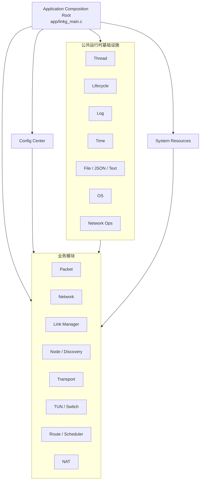
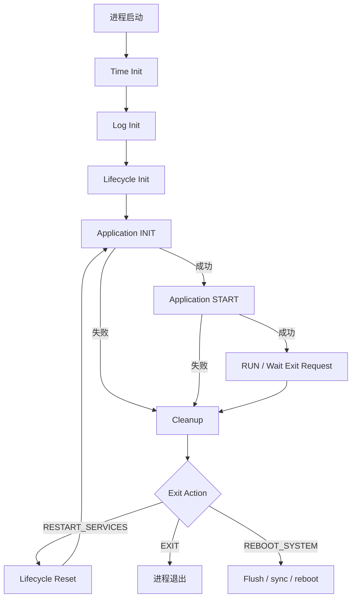
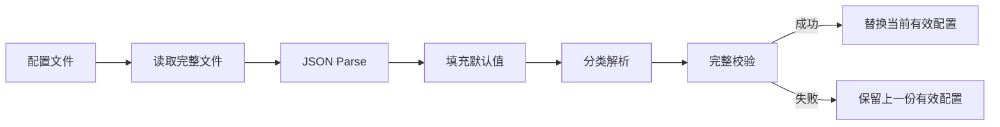
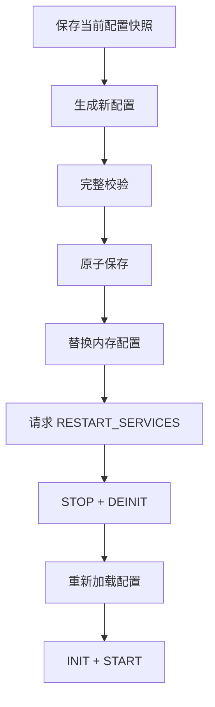

# M01：应用骨架、配置与基础设施

> 这一模块我主要把 LinkG 的公共地基固定下来。这里不做具体的数据转发、链路传输或设备发现，而是先把整个应用怎么启动、怎么退出、配置从哪里来、公共线程和日志怎么统一这些基础规则定下来。后面的业务模块都建立在这套规则上。

源码范围：

```text
app/linkg_main.c
infra/base/
infra/config/
include/linkg/base/
include/linkg/config/
include/linkg/platform/linkg_system_resources.h
config/default_config_ap.json
config/default_config_sta.json
```

Packet、Node、Link、Transport、TUN、Route、NAT、Discovery 等业务模块虽然由 `linkg_main.c` 统一装配，但它们内部怎么实现我放到后续模块里单独写。这一章只把公共骨架和各模块必须遵守的运行规则说明清楚。

---

## 1. 模块定位

我把 M01 分成四部分：

1. **应用组合根**：把 LinkG 各业务模块按照依赖关系组织成一个完整应用；
2. **公共运行时基础设施**：统一 Thread、Lifecycle、Log、Time、File、JSON、OS、Network Ops 等能力；
3. **全局配置中心**：统一加载、校验、读取、替换和持久化 LinkG 静态配置；
4. **系统资源契约**：集中定义 Node 数量、固定网段、UDP 端口和网络接口名称等系统级资源。

整体关系如下：



这一层我最终想达到的效果很简单：

> **后面的所有业务模块都在同一套生命周期、线程、配置、时间、日志和系统资源规则下运行。**

---

## 2. 模块职责与边界

### 2.1 这一层负责什么

这一层负责：

- LinkG 进程入口和全局运行循环；
- 公共服务初始化；
- 业务模块初始化、启动、停止和反初始化编排；
- 部分初始化或部分启动失败后的安全清理；
- 正常退出、服务重启和系统重启请求处理；
- 通用线程对象和线程停止/唤醒机制；
- 单调时间、超时和睡眠接口；
- 统一日志输出；
- 文件、JSON、文本、OS 和基础网络操作封装；
- 全局静态配置加载、校验、快照和原子保存；
- 系统固定资源集中定义。

### 2.2 这一层不负责什么

我不会在 M01 里继续往业务里面伸，下面这些内容分别留给后面的模块：

- Packet 内存池内部实现；
- Wi-Fi / Cellular 链路实现；
- Transport 协议头、分片和重组；
- 路径选择和调度策略；
- TUN 数据收发；
- Discovery Peer 状态机；
- NAT 数据面规则实现；
- 具体业务模块运行状态统计。

所以 `linkg_main.c` 只决定“谁先建立、谁先启动、谁先停止、谁最后释放”，不会进入业务模块内部替代它们自己的职责。

---

## 3. 应用组合根

### 3.1 `linkg_main.c` 的职责

我把 `app/linkg_main.c` 当成整个 LinkG 的组合根。

它维护一个全局应用上下文，记录各模块是否已经完成初始化以及是否已经进入运行态。当前主要状态包括：

```text
Config Loaded
Packet Pool Initialized
Network Initialized / Started
Link Manager Initialized / Started
Node Initialized
Switch Initialized
Scheduler Initialized
Transport Initialized
TUN Initialized / Started
Route Initialized / Started
NAT Initialized / Started
Discovery Initialized / Started
```

这些状态不是业务状态，而是资源所有权记录。

这样做的目的，是在某一步失败以后，我能准确知道前面哪些资源已经建立，只清理实际已经拿到的资源，而不是不分状态地全部调用一遍 Stop / Deinit。

### 3.2 全局运行模型

LinkG 主程序整体运行流程如下：



Time、Log 和 Lifecycle 属于进程级公共服务，我把它们放在业务服务重启循环之外。

所以后面如果配置变化触发 `RESTART_SERVICES`，我不会重新拉起整个进程，而是让业务部分走一遍：

```text
停止当前业务模块
        ↓
反初始化当前业务模块
        ↓
Lifecycle Reset
        ↓
重新加载配置
        ↓
重新初始化并启动业务模块
```

这样后面做运行期配置更新时，就有一个统一的服务重建入口。

---

## 4. 应用初始化与启动顺序

### 4.1 INIT 阶段

INIT 阶段只建立软件资源和模块依赖，不启动真正的业务运行线程。

当前初始化顺序为：

```text
Config
  ↓
Packet Pool
  ↓
Network
  ↓
Link Manager
  ↓
Node
  ↓
Switch
  ↓
Scheduler
  ↓
Transport
  ↓
TUN
  ↓
Route
  ↓
NAT
  ↓
Discovery
```

这里我主要按依赖来排：

- Config 最先加载，后面的模块直接读结构化配置，不再自己解析 JSON；
- Packet Pool 在 Link 和 TUN 之前建立，后面作为全局数据包资源；
- Transport 必须在业务 Link 启动前先把 Link Manager 的统一接收回调注册好；
- TUN 初始化时再把 `USER_DATA` 本机交付入口注册给 Transport；
- Route、NAT、Discovery 等模块放到依赖对象建立之后再初始化。

### 4.2 START 阶段

真正进入运行态的模块按照下面的顺序启动：


当前顺序为：

```text
Network
  ↓
Link Manager
  ↓
TUN
  ↓
Route
  ↓
NAT
  ↓
Discovery
```

这个顺序我暂时不准备再改：

- Network 先把 Ethernet 和系统网络基础能力准备好；
- Transport 已经在 INIT 阶段注册好回调以后，Link Manager 才开始真正收发；
- Route 和 NAT 都依赖 `linkg0`，所以必须先启动 TUN；
- NAT 要等 Ethernet、IPv4 forwarding 和 `linkg0` 都可用后再安装；
- Discovery 最后启动，因为一旦 Discovery 开始工作，Peer 上线就会开始创建 Node、Transport、Path 和 Linux Route 等运行状态。

所以我把 Discovery 启动完成看成 LinkG 进入完整 Ready 状态的最后一步。

---

## 5. STOP、DEINIT 与错误回退

### 5.1 STOP 按运行依赖反序执行

当前停止顺序为：

```text
Discovery
  ↓
NAT
  ↓
Route
  ↓
TUN
  ↓
Link Manager
  ↓
Network
```

这里我不会简单理解成“启动顺序反过来”，而是看停止时谁还需要谁。

例如：

- Discovery 停止期间仍可能需要 Link 和 Route 发 LEAVE、注销 Peer、删除路由，所以必须最先停；
- Route 要先释放 `linkg0` 相关索引和路由资源，然后 TUN 才能真正销毁；
- 所有 Link 收发线程退出以后，再关闭底层 Network 接入资源。

### 5.2 DEINIT 按初始化依赖反序执行

所有运行模块成功停止后，我再按初始化顺序的逆序释放软件对象：

```text
Discovery
NAT
Route
TUN
Transport
Scheduler
Switch
Node
Link Manager
Network
Packet Pool
Config
```

如果还有模块处于 Started 状态，就不允许直接进入 Deinit。

### 5.3 部分失败回退

我目前给每个资源分别保存 `initialized` / `started` 标志。

例如 INIT 执行到 Transport 已经成功、TUN 初始化失败：

```text
Config          initialized
Packet Pool     initialized
Network         initialized
Link Manager    initialized
Node            initialized
Switch          initialized
Scheduler       initialized
Transport       initialized
TUN             failed
```

这时 Cleanup 只会逆序清理到 Transport，不会去 Deinit 一个从来没有初始化成功的 TUN。

START 阶段也是同一套思路。

### 5.4 Stop 失败时的处理

如果某个关键模块 Stop 失败，我现在选择先保留下层依赖，不继续往下拆。

例如 TUN Stop 无法确认成功时，如果继续把 Link Manager 或 Network 销毁，就可能出现仍在运行的数据路径访问已经释放的资源。

所以这一层我先固定一个原则：

> **宁可保留还没有完全释放的依赖资源，也不把一次停止失败扩大成 use-after-free 或野线程访问。**

---

## 6. 公共运行时基础设施

`infra/base/` 我把它看成整个项目的公共运行时层，这一层不带 LinkG 具体业务语义。

| 能力 | 主要接口 | 我用它统一解决的问题 |
|---|---|---|
| Thread | `linkg_thread_*` | 线程创建、停止、唤醒、CPU 亲和性和调度配置 |
| Lifecycle | `linkg_lifecycle_*` | 全局退出、服务重启、系统重启请求 |
| Log | `linkg_log_*` | 统一日志等级、Console 和文件输出、Flush |
| Time | `linkg_time_*` | 单调时间、运行时间、Deadline 和 Sleep |
| File | `linkg_file_*` | 文件读写、目录、磁盘空间和原子文件替换 |
| JSON | `linkg_json_*` | JSON 解析、类型检查、重复键检查和序列化 |
| Text | `linkg_text_*` | 通用字符串和文本处理 |
| OS | `linkg_os_*` | 外部程序执行、子进程启动和停止 |
| Network Ops | `linkg_network_*` | IP、掩码、接口、IPv6 RA、路由和 forwarding 基础操作 |

### 6.1 Thread

`linkg_thread_t` 是当前的统一线程对象。

它保存：

```text
线程名称
pthread_t
用户线程函数
user_data
wakeup_fd
stack_size
CPU core
sched_policy
sched_priority
started / running
```

线程生命周期统一为：

```text
init
  ↓
start
  ↓
running
  ↓
wakeup / stop request
  ↓
join
  ↓
deinit
```

这里我最看重的是 `wakeup_fd`。如果线程阻塞在 `poll/epoll`，只把 `running=false` 并不能保证线程马上退出，所以 Stop 必须同时具备主动唤醒能力。

线程层还保留：

- CPU affinity；
- POSIX scheduling policy；
- realtime scheduling priority；
- 自定义栈大小。

后面的业务线程如果需要“可控停止 + 明确 join”，我优先走这套 Thread，不再每个模块自己重新做一套 pthread 生命周期。

### 6.2 Lifecycle

Lifecycle 管的是整个 LinkG 进程的退出意图，而不是某一个业务模块的状态。

当前动作包括：

```text
NONE
EXIT
RESTART_SERVICES
REBOOT_SYSTEM
```

业务线程通过：

```text
linkg_lifecycle_request_exit()
```

提出请求，主线程通过：

```text
linkg_lifecycle_wait_for_exit()
```

统一处理。

这样后面业务模块就不需要自己 `exit()`、`reboot()` 或主动销毁其他模块。

### 6.3 Log

日志层我继续保持统一：

```text
DEBUG
INFO
WARNING
ERROR
FATAL
```

当前已经支持 Console、文件、等级过滤、Flush、Session 文件、文件大小控制、磁盘剩余空间保护和重复日志抑制。

这一层我不准备继续扩展第二套日志系统，后面模块统一使用现有日志接口。

### 6.4 Time

时间模块统一提供：

```text
monotonic_us
elapsed_ms / elapsed_us
sleep_ms / sleep_us
sleep_until_us
```

后面的超时、Deadline、重试、心跳、状态机等待、RTT 等运行逻辑，我都统一按单调时间来做，不用系统墙上时间判断运行期超时。

### 6.5 File / JSON

File 层已经提供：

```text
read_all
write_all
write_all_atomic
replace_atomic
mkdirs
free_bytes
```

JSON 层在 cJSON 上再统一处理必选字段、可选字段、类型、范围、重复字段和序列化。

所以配置层和后面的业务模块，我尽量不再散布裸 `fopen`、裸 cJSON 的重复处理。

### 6.6 OS

OS 层目前统一封装：

```text
run
run_ignore
shellf
spawn
process_running
process_stop
```

外部程序和子进程生命周期继续从这里走，避免业务模块分别处理 `fork/exec/wait/kill`。

### 6.7 Network Ops

Network Ops 作为 Linux 基础网络能力的公共接口，目前覆盖：

- IPv4 地址和字符串转换；
- netmask / prefix；
- 子网重叠判断；
- IPv6 Global 地址判断；
- 接口存在、Up/Down、MTU、MAC；
- IPv4 / IPv6 地址读取；
- IPv6 RA 配置；
- IPv4 / IPv6 默认网关查询；
- IPv4 forwarding。

后面的 Network Service、Cellular Status、NAT 等都继续复用这一层，不再分别实现相同能力。

---

## 7. 全局配置中心

### 7.1 配置模型

当前顶层配置结构为：

```c
typedef struct
{
    linkg_device_config_t  device;
    linkg_network_config_t network;
    linkg_links_config_t   links;
    linkg_paths_config_t   paths;
} linkg_config_t;
```

逻辑结构为：

```text
LinkG Config
├── device
│   └── role
│
├── network
│   ├── node_id
│   ├── virtual_network
│   ├── ethernet_network
│   └── traffic_rules
│
├── links
│   ├── wifi
│   └── cellular
│
└── paths
    ├── wifi
    └── cellular
```

我现在把它分成四个层次：

- `device`：设备角色；
- `network`：Node ID、虚拟网、Ethernet 网和业务流量分类；
- `links`：Wi-Fi / Cellular 的物理接入配置；
- `paths`：逻辑路径是否启用、模式和优先级。

### 7.2 配置加载

配置加载流程为：



这里我保持一个原则：加载和完整校验没有全部成功前，不破坏上一份有效配置。

### 7.3 Snapshot 和 Getter

配置模块不向业务模块暴露内部可写指针。

需要完整配置时直接：

```text
linkg_config_create_snapshot()
```

如果只需要单个分类，再使用对应 Getter。

一次业务决策如果同时依赖多个配置域，我优先让它拿完整 Snapshot，避免连续多个 Getter 刚好跨过一次配置替换，拿到两代配置的组合。

### 7.4 Replace 与 Save

我把配置更新拆成两个动作：

```text
replace = 更新当前内存配置
save    = 持久化指定配置
```

Config 本身不会因为配置变化直接启动、停止业务模块。

后面真正做运行期配置更新时，我准备走下面这个闭环：

```text
获取旧配置快照
        ↓
构造新配置
        ↓
完整校验
        ↓
原子保存
        ↓
替换内存配置
        ↓
请求 RESTART_SERVICES
        ↓
业务重新建立
```

如果重建失败，再由上层决定是否恢复旧配置。这部分我放在 M01 里把框架定住，不把具体 Wi-Fi / 5G 重配逻辑塞进 Config。

---

## 8. 系统固定资源契约

系统固定资源继续统一放在：

```text
include/linkg/platform/linkg_system_resources.h
```

### 8.1 Node 资源

```text
有效 Node ID：1 ~ 254
Broadcast ID：255
单组网最大节点：17
最大 STA：16
```

当前产品组网按：

```text
1 AP + 最多 16 STA
```

### 8.2 固定网络资源

```text
TUN Network  : 172.31.8.0/24
TUN MTU      : 1500
Wi-Fi Network: 11.21.191.0/24
```

### 8.3 UDP 端口

```text
Wi-Fi Data        5000
Wi-Fi Realtime    5001
Wi-Fi Video       5002
Cellular Data     5003
Cellular Realtime 5004
Cellular Video    5005
Wi-Fi Discovery   5006
Cellular Discovery 5007
```

### 8.4 网络接口

```text
Wi-Fi    wlan0
Cellular  usb0
TUN       linkg0
Ethernet  eth0
```

这些我都当成系统契约使用，后面模块不再单独写一份 magic number 或接口字符串。

---

## 9. 我准备固定的 M01 基本规则

后面的模块开发我会按下面这些规则约束：

1. 全局启动和销毁顺序统一由 `linkg_main.c` 编排；
2. 模块先完成 Init，再进入 Start；
3. Stop / Deinit 按实际依赖反序执行；
4. Init 或 Start 只成功一部分时，必须能只回退已经获得的资源；
5. Stop 无法确认完成时，不继续销毁它依赖的下层资源；
6. 业务模块不直接退出进程或重启系统；
7. 需要可控停止的业务线程优先使用 `linkg_thread_t`；
8. 超时、Deadline 和周期逻辑统一使用公共 Time；
9. Config 只管理配置数据，不负责业务启停；
10. 配置读取返回副本，不把内部地址交给业务模块长期保存；
11. 系统端口、接口名称和固定网段统一从 `linkg_system_resources.h` 获取；
12. 已经有公共 File、JSON、OS、Network Ops 能力时，不再重复维护另一套公共实现。

---

## 10. 我对当前 M01 的判断

这一层现在已经不是“从零开始搭框架”的阶段，核心骨架基本都有了：

```text
Application Composition Root     已有
INIT / START / STOP / DEINIT      已有
RESTART_SERVICES                  已有
Thread / Lifecycle                已有
Log / Time                        已有
File / JSON / OS / Network Ops    已有
Config Snapshot / Replace / Save  已有
System Resources                  已有
```

所以我接下来不会继续给 M01 增加很多新抽象，也不准备大改 `linkg_main.c`。

这一阶段我的目标是：

> **把已有公共骨架收口，把边界固定下来，把现在存在的不一致和重复实现清掉，然后尽快进入 Packet、Link、Transport 这些真正影响数据面的模块。**

现在 M01 最明显的问题不是“能力不够”，而是几处公共规则还没有完全收紧：

- Config Header、默认 JSON 和旧 README 之间还有版本漂移；
- 后面的业务模块里仍可能存在绕过 Thread / Time / OS / Network Ops 的重复实现；
- `RESTART_SERVICES` 已经有入口，但配置修改到服务重建这一条链还没有形成完整闭环；
- 公共错误码分层存在，但跨层转换规则还没有完全固定。

这些就是我准备在 M01 里继续处理的内容。

---

## 11. M01 具体实施计划

我准备按下面的顺序推进，不在 M01 上无限扩展。


### 11.1 第一步：先冻结现有应用生命周期

`linkg_main.c` 当前的 INIT / START / STOP / DEINIT 顺序已经和实际依赖基本对应，我这里先不做重构。

我会先把当前顺序作为正式基线保留下来：

```text
INIT：
Config
→ Packet Pool
→ Network
→ Link Manager
→ Node
→ Switch
→ Scheduler
→ Transport
→ TUN
→ Route
→ NAT
→ Discovery

START：
Network
→ Link Manager
→ TUN
→ Route
→ NAT
→ Discovery

STOP：
Discovery
→ NAT
→ Route
→ TUN
→ Link Manager
→ Network
```

以后新增模块时，我不按“看起来放这里合适”来插，而是先说明它依赖谁、谁停止时还需要它，再决定具体位置。

这一阶段主要是冻结规则，不准备为了形式重新写一遍生命周期框架。

### 11.2 第二步：把配置定义统一到当前代码

这个是 M01 里我准备优先处理的实际问题。

目前 `linkg_config.h` 已经是：

```text
device
network
links
paths
```

默认配置路径也是：

```text
/app/current/config/linkgDefault.json
```

但 `infra/config/README.md` 里仍然保留旧的配置结构和旧路径描述。

这一部分我准备直接做一次收口：

```text
当前 Header
      +
默认 AP / STA JSON
      ↓
作为当前唯一配置定义
      ↓
反向更新 README 和项目文档
```

后面再增加配置字段时，我会同时修改：

```text
公共结构体
解析/校验
默认配置文件
README
项目计划
```

不再让配置接口和文档各走各的版本。

### 11.3 第三步：检查业务模块有没有重复造公共基础设施

公共层已经比较完整了，下一步我不会继续增加新的 Base 文件，而是从业务模块往回检查。

我会重点看下面几类代码：

```text
直接 pthread_create / pthread_join
自己维护 running + eventfd 停止逻辑
直接 clock_gettime / usleep 做状态机时间
重复做文件原子保存
直接大量访问 cJSON
重复 fork / exec / wait
重复做接口地址和网关查询
硬编码 wlan0 / usb0 / linkg0 / eth0
硬编码 5000 ~ 5007
```

这里不是要求所有 Linux API 都必须包一层，而是同一种公共能力只保留一套明确的生命周期和错误语义。

如果业务模块确实有特殊需求，我会保留特殊实现；如果只是重复代码，就回收到现有公共接口。

### 11.4 第四步：把配置修改到服务重启这一条链补完整

现在已经有：

```text
Config Snapshot
Config Save
Config Replace
Lifecycle RESTART_SERVICES
```

所以基础零件都有了。

我下一步准备把它们串成一条真正可用的流程：



这里 Config 只负责配置本身，真正什么时候重启、重启失败怎么办，仍然由应用骨架控制。

我暂时不会在 M01 里做很复杂的“单模块热更新”，先保证整套服务可以按照新配置可靠重建。等后面确实有不中断切换的需求，再单独设计。

### 11.5 第五步：把公共错误边界整理清楚

现在公共层同时有：

```text
errno 风格负值
CONFIG_ERR_*
LINKG_JSON_ERR_*
```

我不准备把这些全部强行改成一个错误码体系，因为不同层保留自己的错误语义是合理的。

我主要会把跨层转换位置固定：

```text
JSON错误
   ↓ Config层转换
CONFIG_ERR_*
   ↓ 应用层记录
启动/配置失败
```

底层错误只在真正需要诊断的位置保留，避免一个业务模块直接依赖另一层内部错误码。

### 11.6 M01 到这里收口

上面几项完成以后，我就不再继续扩 M01。

这一模块最终只保留：

```text
稳定的应用入口
稳定的生命周期顺序
统一的公共运行时
统一的配置入口
统一的固定资源定义
```

只要后面的业务模块能稳定依赖这些能力，就说明 M01 已经完成它的作用。

后续如果在 M02～M10 开发过程中发现公共层确实缺少能力，再回到 M01 增补，而不是现在提前把所有可能用到的公共接口全部设计出来。

---

## 12. 本阶段结束点

我把 M01 的结束点定得比较简单，不单独做一套很重的验收矩阵。

当下面这几个条件满足后，我就认为这一阶段可以结束：

```text
1. LinkG 可以按照当前固定顺序正常启动和退出；
2. 配置 Header、默认 JSON、README 描述一致；
3. 公共线程、时间、OS、网络资源没有明显重复实现；
4. 配置修改能够通过 RESTART_SERVICES 重新建立整套业务；
5. 后续模块可以直接依赖 M01，不需要自己再解决公共生命周期问题。
```

每一步修改完成后，我会直接结合对应模块做编译和实际启动验证，不在这一章单独展开测试用例表。

M01 收口以后，下一步进入 M02 Packet，开始处理真正的数据包资源和数据面基础问题。
