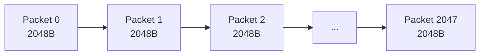
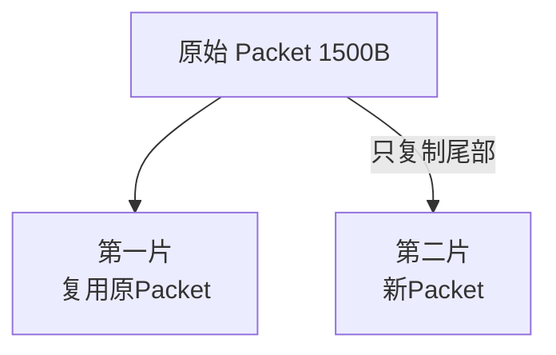
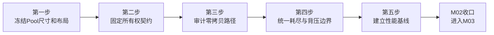

# M02：Packet 与数据包资源管理

> 这一模块我主要把 LinkG 数据面的 Packet 资源模型固定下来。Packet 本身不决定数据走 Wi-Fi 还是 5G，也不做路由和传输策略，它只负责提供一块可复用、可跨模块传递、可以安全管理生命周期的数据缓冲区。后面的 TUN、Transport、Scheduler、Link 都围绕同一个 Packet 工作。

源码范围：

```text
core/packet/linkg_packet_pool.c
include/linkg/core/packet/linkg_packet_pool.h
```

为了把 Packet 的实际使用方式说明清楚，这一章还会结合下面几层的数据路径一起看：

```text
TUN
Transport
Scheduler
Link
Wi-Fi / Cellular
```

但这些模块自己的业务逻辑仍然放到后续章节单独展开。

---

## 1. 我对 Packet 模块的定位

我不准备把 Packet 做成一个很重的数据对象。

它只保留数据面真正需要的几个信息：

```c
struct linkg_packet
{
    linkg_packet_pool_t *pool;
    uint8_t             *slot;
    _Atomic uint32_t     reference_count;
    uint32_t             data_offset;
    uint32_t             data_length;
    uint32_t             flags;
};
```

其中：

- `pool`：Packet 属于哪个内存池；
- `slot`：固定数据槽位起始地址；
- `reference_count`：跨线程和异步队列使用时的引用计数；
- `data_offset`：当前有效数据距离 slot 起点的位置；
- `data_length`：当前有效数据长度；
- `flags`：DATA / VIDEO / REALTIME 以及 Transport 原子发送组等少量数据面标志。

我希望后面的数据路径尽量保持下面这种模式：

```text
入口获得 Packet
      ↓
直接把数据写进 Packet
      ↓
各模块在同一块数据上解析 / push / pull
      ↓
需要异步保存时 retain
      ↓
最后一个引用 release
      ↓
Packet 自动回到 Pool
```

所以 M02 的重点不是 Packet 里再增加更多状态，而是把 **内存布局、所有权和零拷贝边界** 定清楚。

---

## 2. 当前 Packet Pool 设计

当前 Packet Pool 使用固定数量 Packet + 连续数据区。

应用层现在配置为：

```text
Packet Count = 2048
Slot Size    = 2048 Byte
Headroom     = 64 Byte
```

Pool 初始化时一次性建立：

```text
Packet描述符数组
        +
空闲Packet指针栈
        +
连续数据区
```

数据区按照 64 Byte 对齐：



当前 `slot_size=2048` 本身已经是 64 Byte 的整数倍，因此 `slot_stride` 也是 2048 Byte。

主数据区大小为：

```text
2048 × 2048 Byte = 4 MiB
```

除此之外还有 Packet 描述符数组和空闲指针数组，但数据区本身的上限已经固定，不会随着运行流量持续增长。

初始化时还会把整个数据区清零，相当于提前触碰内存页，避免 Packet 第一次进入高速路径时才发生大量缺页。

### 为什么我继续保留固定 Pool

这一层我暂时不准备改成运行期 `malloc/free`。

原因主要有三个：

1. 数据面内存上限明确；
2. 高速路径不需要频繁走通用堆分配器；
3. Packet 地址长期稳定，方便各层只传指针和引用。

所以 M02 的第一版目标不是把 Pool 做得更复杂，而是继续保持 **有界、预分配、可复用**。

---

## 3. slot、headroom 与 MTU 的关系

这一块是 Packet 设计里最关键的尺寸关系，我准备直接固定下来。

当前布局可以理解为：

```text
slot_size = 2048 Byte

┌───────────────────────────────────────────────────────────────┐
│ headroom 64B │               data area                        │
│              │                                               │
└───────────────────────────────────────────────────────────────┘
^              ^
slot           data
```

Packet 每次从 Pool 申请出来以后：

```text
data_offset = 64
data_length = 0
```

所以默认数据指针后面可直接使用：

```text
2048 - 64 = 1984 Byte
```

而当前 TUN MTU 为：

```text
1500 Byte
```

因此一个完整 IPv4 Packet 可以直接读进同一个 slot，不需要为了 TUN MTU 再申请第二块连续缓冲区。

### 3.1 为什么要留 64 Byte headroom

Transport 当前协议头为：

```text
基础头        16 Byte
分片扩展头     8 Byte
最大头部      24 Byte
```

发送时 Transport 通过 `linkg_packet_push()` 直接向当前数据前面压入协议头。

因此正常情况下：

```text
64 Byte Headroom
      ↓ push 16B
48 Byte Remaining
```

分片情况下：

```text
64 Byte Headroom
      ↓ push 8B fragment header
56 Byte
      ↓ push 16B base header
40 Byte Remaining
```

也就是说当前 64 Byte headroom 足够覆盖 Transport 最大 24 Byte 头部，同时还保留 40 Byte 余量。

这一块在应用入口已经有静态检查，我继续保留这种“编译期就把尺寸关系卡死”的方式，不让 MTU、slot 和 Transport Header 靠运行时碰运气。

### 3.2 Transport 为什么仍然需要分片

Wi-Fi 当前按照 1500 MTU 的 UDP 链路发送，扣掉 IPv4 + UDP 头以后，LinkG 单个 Transport Frame 最大为：

```text
1452 Byte
```

因此：

```text
普通Transport载荷最大 = 1436 Byte
分片Transport载荷最大 = 1428 Byte
原始完整Packet最大     = 1500 Byte
```

当 TUN 读到一个 1500 Byte Packet 时，Transport 仍然需要拆成两帧：

```text
原始 1500B

第一片：
1428B payload + 24B Transport header = 1452B

第二片：
72B payload + 24B Transport header = 96B
```

这里我继续保留当前两片分片逻辑，因为它解决的是底层 UDP 可发送尺寸问题，不是 Packet Pool 本身的问题。

---

## 4. Packet 引用与所有权

我准备把 Packet 的引用规则作为整个数据面的统一契约，而不是让各模块自己理解。

当前规则已经比较清楚：

```text
alloc成功
   ↓
调用方获得 1 个引用
   ↓
同步调用可以直接借用
   ↓
异步保存必须 retain
   ↓
每个引用最终对应一次 release
   ↓
reference_count == 0
   ↓
Packet回到Pool
```

### 4.1 我区分三种 Packet 使用方式

后续文档和代码里我准备统一使用下面三个概念：

| 方式 | 含义 | 是否需要 release |
|---|---|---|
| Owned Reference | 当前模块真正持有一个 Packet 引用 | 是 |
| Borrowed Reference | 只在当前同步调用期间使用 | 否 |
| Retained Reference | 为跨调用、异步 Queue 或缓存额外增加的引用 | 是 |

这样以后看到一个 Packet 指针时，不只是知道“这里有个指针”，而是要知道这一层到底是 Owner 还是 Borrower。

### 4.2 当前跨线程安全边界

现在只有 `reference_count` 是原子变量。

因此：

```text
retain / release
```

可以跨线程管理引用。

但下面这些字段：

```text
data_offset
data_length
flags
Packet数据内容
```

不允许多个线程无锁同时修改。

所以 retain 解决的是 **生命周期**，不是把 Packet 自动变成多线程可并发写对象。

### 4.3 Pool 销毁条件

`linkg_packet_pool_deinit()` 前必须满足：

```text
所有访问Pool的线程已经停止
        +
所有Packet引用已经归还
```

如果：

```text
free_count != packet_count
```

Pool 直接返回 `-EBUSY`，不会强行释放底层内存。

这一点我继续保留，因为宁可暴露引用没有归还，也不能把还在使用的 Packet 内存直接释放。

---

## 5. 发送方向的零拷贝边界

目前发送数据面的 Packet 路径已经比较接近我想要的形态。


### 5.1 TUN 直接读进 Packet

TUN 读取前先批量从 Packet Pool 申请 Packet，然后把：

```text
linkg_packet_data(packet)
```

直接作为内核批量 TUN 读取的目标缓冲区。

所以不是：

```text
TUN临时buffer
    ↓ memcpy
Packet
```

而是：

```text
TUN
 ↓
Packet Slot
```

TUN 读完后只设置 `data_length`，后面直接把同一个 Packet 交给 Transport。

### 5.2 Transport 正常包原地加头

对于不需要分片的 Packet，Transport 不重新申请数据缓冲区，而是在原 Packet 的 headroom 中直接 `push` 协议头：

```text
原Packet
[64B headroom][1500B以内业务数据]

        ↓ push Transport Header

同一个Packet
[剩余headroom][Transport Header][业务数据]
```

随后 Scheduler 和 Link 都只同步借用这个 Packet 指针。

### 5.3 异步 Queue 不复制 Packet

如果具体链路不能立即发送，例如 Wi-Fi 普通业务进入等待 Queue，我继续使用 retain 的方式保存原 Packet：

```text
当前调用方仍持有原引用
        +
Queue retain 一个引用
```

调用方返回后可以释放自己的引用，Queue 仍然能继续使用原来的 Packet。

等 Queue 最终发送、过期或丢弃时，再释放 Queue 自己持有的引用。

这里不需要为了异步发送重新 memcpy 一份数据。

---

## 6. 当前明确允许的数据复制

我不会把“零拷贝”理解成任何地方都绝对不能 memcpy。

当前真正需要复制的地方主要有两个，而且我准备把它们作为明确边界保留下来。

### 6.1 Transport 发送分片

1500 Byte 原始 Packet 需要拆成两个 Transport Frame。

当前做法是：

```text
第一片：直接复用原Packet
第二片：从同一个Pool申请新的Packet，只复制尾部载荷
```

也就是：



按照当前最大尺寸，1500 Byte Packet 的第二片实际只需要复制 72 Byte 业务载荷。

我认为这一处复制是合理的，因为两个 UDP Frame 最终必须拥有两个独立的发送缓冲区。

### 6.2 Transport 接收重组

接收端收到两个分片后，当前重组逻辑保留第一片 Packet 作为最终完整 Packet 的载体，再把尾片数据追加进去。

也就是：

```text
第一片Packet
    +
尾片payload memcpy
    ↓
完整1500B Packet
```

重组完成后继续把第一片 Packet 作为完整 Packet 向上交付，不再额外申请第三个完整 Packet。

所以我把当前零拷贝边界定义成：

> **普通包不复制；真正由链路 MTU 导致的分片/重组只复制必须复制的尾部数据。**

---

## 7. 接收方向的 Packet 流程

接收方向同样尽量围绕原 Packet 工作。


Link RX 先批量申请 Packet，然后具体 Wi-Fi / Cellular Link 直接把收到的数据写进 `linkg_packet_data()`。

对于普通 Transport Frame：

```text
Link RX Packet
      ↓
Transport pull 协议头
      ↓
同一个 Packet 只剩业务载荷
      ↓
TUN 同步写入
      ↓
Link RX 释放基础引用
```

TUN 写入时同样直接把 Packet 当前 data pointer 交给批量写接口，不再建立中间用户态数据副本。

如果 Transport Handler 只在回调期间同步使用 Packet，就只借用引用；只有需要回调返回后继续保存时才 retain。

---

## 8. Packet Pool 耗尽和背压

这一块我不准备让 Packet Pool 自己变成阻塞 Queue。

Pool 现在的行为是：

```text
单包 alloc
    无资源 → NULL

batch alloc
    资源不足 → 返回实际申请数量
```

也就是说 Pool 只负责告诉调用方：

> **现在还有多少 Packet 可以用。**

至于等待、丢包还是稍后重试，由真正知道业务语义的上层决定。

### 8.1 TUN 和 Link RX 的处理

当前 TUN RX 和 Link RX 在 Packet Pool 完全耗尽时都会：

```text
alloc_batch = 0
      ↓
sleep 1 ms
      ↓
退出当前 drain
      ↓
下一轮重新尝试
```

这样至少不会在 Pool 耗尽时形成 CPU 忙等。

这一机制我先保留，不把阻塞条件变量塞进 Packet Pool。

### 8.2 发送等待由具体 Link 处理

例如 Wi-Fi 发送因为：

```text
EAGAIN
EWOULDBLOCK
ENOBUFS
流控限制
```

不能立即完成时，具体 Wi-Fi TX 有自己的有界等待 Queue。

Queue 通过 retain 持有 Packet，而不是把 Packet Pool 本身改造成一套业务发送队列。

因此我准备固定这一层职责：

```text
Packet Pool
    只负责有限资源分配

TUN / Link RX
    负责入口资源不足时的重试节奏

Wi-Fi / Cellular TX Queue
    负责具体链路的异步发送和背压策略
```

### 8.3 我暂时不做动态扩容

Pool 耗尽时我不会自动 malloc 新 Packet。

如果真实测试发现 2048 个 Packet 不够，我优先分析：

```text
Packet被谁长期持有？
哪个Queue积压？
Transport重组占了多少？
链路发送是不是堵塞？
```

确认资源模型以后再决定调整固定数量，而不是用动态扩容掩盖背压问题。

---

## 9. 当前 Packet Flags 的边界

Packet 现在同时携带两类轻量标志。

### 9.1 业务分类

```text
DATA
VIDEO
REALTIME
```

TUN 根据流量规则写入分类，Scheduler / Link 最终据此选择对应发送类别。

### 9.2 Transport 原子发送组

```text
TX_GROUP_FIRST
TX_GROUP_LAST
```

当前两片 Transport 分片用这两个标志告诉下层：这两个 Frame 属于同一个原始 Packet，等待 Queue 或批处理不能只留下第一片而把第二片人为截断。

我会继续让 Packet Flags 只保存这类真正影响数据面处理的少量信息，不把统计状态、路由状态、Peer 状态继续塞进 Packet。

---

## 10. 我对当前 M02 的判断

Packet Pool 本身现在已经比较稳定：

```text
固定容量内存池            已有
64 Byte slot对齐          已有
64 Byte headroom          已有
单包 / 批量申请           已有
单包 / 批量释放           已有
Atomic引用计数            已有
push / pull               已有
DATA/VIDEO/REALTIME       已有
分片原子组标志            已有
Pool Deinit引用检查       已有
```

而且当前实现已经做过 x86 clean build、ASan / UBSan、TSan 多线程引用和 Pool 耗尽等专项验证。

所以这一模块我不准备做一次大重构。

我现在更倾向于：

> **保留现有 Pool，实现层尽量不动，把它在整条数据面上的所有权和零拷贝契约固定下来。**

前面的性能排查也没有显示 Packet Pool 是当前主要瓶颈，所以 M02 不作为这一阶段的重点性能重构对象。

---

## 11. M02 具体实施计划

我准备按下面的顺序把 Packet 模块收口：



### 11.1 第一步：冻结当前 Pool 尺寸关系

第一阶段我先保持：

```text
2048 Packet
2048 Byte Slot
64 Byte Headroom
1500 Byte TUN MTU
24 Byte Transport最大头
```

不为了“看起来更省内存”去压缩 slot，也不为了预防未知情况先扩大 Pool。

这套尺寸目前同时覆盖：

```text
完整TUN Packet
Transport Header Push
Transport两片分片
接收端完整重组
```

后面如果 Transport 协议头或链路 MTU 发生变化，再由静态检查直接暴露尺寸不匹配。

### 11.2 第二步：把所有权契约写进各层接口

这一部分我准备重点检查：

```text
TUN → Transport
Transport → Scheduler
Scheduler → Link
Link → Wi-Fi / Cellular TX
Link RX → Transport
Transport → TUN
Transport Reassembly
各种异步 Queue / Cache
```

每一条 Packet 传递关系都明确成：

```text
Owned
Borrowed
Retained
```

同步调用默认借用；只有调用返回以后还要继续持有，才允许 retain。

这样后面查内存泄漏或 double release 时可以直接顺着所有权链定位。

### 11.3 第三步：固定正常包零拷贝路径

我会把正常数据路径作为基线保持：

```text
TUN直接写Packet
→ Transport原地Push Header
→ Scheduler借用
→ Link借用
→ 具体链路直接发送
```

接收则保持：

```text
Socket直接写Packet
→ Transport原地Pull Header
→ TUN直接写Packet
```

后面做性能优化时，如果某次改动在正常包路径里新增 memcpy 或每包 malloc，需要先说明为什么必须增加。

### 11.4 第四步：统一资源耗尽责任

我不会在 Packet Pool 内增加业务等待逻辑。

我准备把规则定成：

```text
Pool没有资源
    ↓
立即返回
    ↓
调用层决定 retry / queue / drop
```

TUN / Link RX 保持短暂退让，具体链路 Queue 继续负责自己的有界积压和过期策略。

如果后续需要增加 Pool 资源可观测性，我只考虑增加低开销的：

```text
当前free_count
历史最低free_count
alloc失败次数
```

不在 Packet 快速路径里加入复杂统计和锁竞争。

### 11.5 第五步：建立 Packet 性能基线，而不是提前换 lock-free

Pool 当前空闲栈由一个 mutex 保护，批量接口已经可以把一次锁操作摊到多个 Packet 上。

这一版我不会直接改 lock-free free list。

先测：

```text
单包 alloc/release
batch alloc/release
多线程竞争
TUN满速收发时Pool最低余量
Wi-Fi/5G堵塞时Pool占用
```

只有确认 Pool lock 本身成为热点后，再考虑 per-thread cache 或 lock-free free list。

我不准备在没有数据的情况下先把这一层复杂化。

---

## 12. M02 性能目标

这里我不先写一个没有实测依据的 Mpps 数字，先把数据面目标固定成可以直接检查的工程约束：

```text
正常包：
入口一次Pool申请
全路径不做用户态payload memcpy
不做每包malloc/free
最终一次引用归还

分片包：
第一片复用原Packet
只为第二片申请额外Packet
只复制必须拆出的尾部payload

接收普通包：
Socket直接写Pool Packet
Transport原地去头
TUN直接读取同一Packet

资源使用：
运行期Packet内存有固定上限
Pool耗尽不动态扩容
批量路径优先减少锁次数和系统调用次数
```

真正的吞吐和 CPU 指标后面和 TUN、Transport、Link 一起做端到端性能测试，因为单测 Packet Pool 很快，并不能代表整条链路吞吐。

---

## 13. M02 本阶段结束点

M02 我准备在下面几件事确认后直接收口：

```text
1. Pool尺寸和MTU / Transport Header关系固定；
2. Packet所有权在主要数据路径上没有模糊交接；
3. 正常收发路径没有多余用户态payload复制；
4. 分片和重组复制边界明确；
5. Pool耗尽不会忙等，也不会运行期无限扩容；
6. 现有ASan / UBSan / TSan和Pool专项验证继续通过；
7. 实际性能测试没有证据表明Packet Pool是主要瓶颈。
```

如果这几项都成立，我就不继续在 Packet Pool 上做结构性优化，直接进入后面的 Node / Discovery 和实际链路模块。

M02 的目标不是把 Packet 做得越来越复杂，而是让后面的数据面可以放心地把 Packet 当成统一、稳定、低开销的数据载体。
