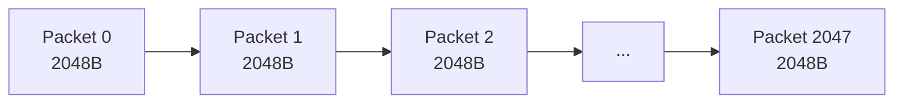
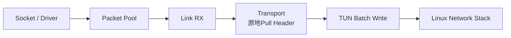
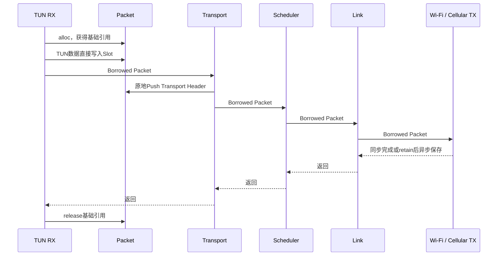

# M02：Packet 与数据包资源管理

> M02 定义 LinkG 数据面的统一 Packet 资源模型。这里采用固定容量 Packet Pool、固定 Slot、预留 Headroom 和引用计数管理生命周期。TUN、Transport、Scheduler、Link 以及 Wi-Fi / Cellular 数据链路都围绕同一个 Packet 传递数据，正常数据路径不重复申请业务缓冲区，也不做无意义的 payload 拷贝。

源码范围：

```text
core/packet/linkg_packet_pool.c
include/linkg/core/packet/linkg_packet_pool.h
```

为了说明 Packet 在整个数据面中的实际作用，本章同时结合以下调用链说明其所有权和零拷贝边界：

```text
TUN
Transport
Scheduler
Link
Wi-Fi / Cellular
```

---

## 1. Packet 模块定位

Packet 是 LinkG 数据面统一使用的数据载体，本身不承担路由、调度、链路选择或协议状态。

当前 Packet 保留的字段只有：

```c
struct linkg_packet
{
    linkg_packet_pool_t *pool;
    uint8_t             *slot;
    _Atomic uint32_t     reference_count;
    uint32_t             data_offset;
    uint32_t             data_length;
    uint32_t             flags;
};
```

各字段职责如下：

| 字段 | 作用 |
|---|---|
| `pool` | 指向所属 Packet Pool，引用归零后通过它归还资源 |
| `slot` | 当前 Packet 对应的固定数据槽位起始地址 |
| `reference_count` | 管理跨模块、跨线程和异步 Queue 的 Packet 生命周期 |
| `data_offset` | 当前有效数据相对 Slot 起点的偏移 |
| `data_length` | 当前有效数据长度 |
| `flags` | DATA / VIDEO / REALTIME 以及 Transport 原子发送组等轻量数据面标志 |

整个数据面的基本使用方式固定为：

```text
入口从 Pool 获得 Packet
        ↓
数据直接写入 Packet Slot
        ↓
各层围绕同一块数据做解析、Push、Pull
        ↓
同步调用只借用 Packet
        ↓
异步保存时增加引用
        ↓
最后一个引用释放
        ↓
Packet 自动归还 Pool
```

这样设计的核心目的，是把“数据内容”和“数据生命周期”统一到一个对象上，避免每经过一层就重新 `malloc + memcpy + free`。

---

## 2. Packet Pool 设计

Packet Pool 当前采用 **固定数量 Packet 描述符 + 固定大小 Slot + 连续数据区 + 空闲指针栈** 的方式实现。

应用当前固定配置为：

```text
Packet Count = 2048
Slot Size    = 2048 Byte
Headroom     = 64 Byte
Slot Align   = 64 Byte
```

Pool 初始化时一次性建立：

```text
┌──────────────────────────────┐
│ Packet描述符数组             │
├──────────────────────────────┤
│ Free Packet指针栈            │
├──────────────────────────────┤
│ 连续Packet数据区             │
│ 2048 × 2048 Byte             │
└──────────────────────────────┘
```

主数据区大小固定为：

```text
2048 × 2048 Byte = 4 MiB
```

运行过程中 Packet 数量不会因为瞬时流量增加而自动扩容，因此数据面内存上限是确定的。

每个 Slot 起始地址按 64 Byte 对齐：



初始化阶段会清零整块数据区并提前触碰内存页，避免高速路径第一次使用某个 Packet 时才产生集中缺页开销。

### 2.1 为什么使用固定 Pool

这里采用固定 Pool，而不是运行期按包 `malloc/free`，主要有四个原因：

1. **内存上限确定**：最坏情况下 Packet 数据区就是约 4 MiB；
2. **高速路径不依赖通用堆分配器**：不会因为包量变化频繁进入 malloc/free；
3. **Packet 地址稳定**：模块之间只传 Packet 指针和引用，不需要反复建立新缓冲区；
4. **资源耗尽可以被明确暴露**：Pool 没有资源时直接返回，问题不会被无限动态扩容掩盖。

因此 Packet Pool 的设计目标是 **有界、预分配、可复用**，不是做成通用动态内存管理器。

---

## 3. Slot、Headroom 与 MTU 的尺寸关系

当前 Packet 尺寸关系已经固定：

```text
Slot Size            = 2048 Byte
Headroom              = 64 Byte
TUN MTU               = 1500 Byte
Transport Base Header = 16 Byte
Transport Frag Header = 8 Byte
Transport Max Header  = 24 Byte
```

Packet 从 Pool 申请出来时：

```text
data_offset = 64
data_length = 0
```

所以初始数据指针之后可直接使用：

```text
2048 - 64 = 1984 Byte
```

完整 1500 Byte TUN IPv4 Packet 可以直接读进同一个 Slot。

```text
0                    64                         1564              2048
│                    │                           │                  │
├──── Headroom ──────┼──── 最大1500B业务包 ──────┼──── 预留空间 ─────┤
^                    ^
slot                 data
```

### 3.1 64 Byte Headroom 的作用

Headroom 专门给后续协议层原地向前增加头部使用。

Transport 普通帧需要 16 Byte：

```text
64B Headroom
    ↓ Push 16B
48B Remaining
```

Transport 分片帧需要最大 24 Byte：

```text
64B Headroom
    ↓ Push Fragment Header 8B
56B
    ↓ Push Base Header 16B
40B Remaining
```

因此 Transport 加头不需要把原业务数据整体后移，也不需要重新申请一个更大的发送缓冲区。

### 3.2 为什么 Slot 仍然保留 2048 Byte

从纯尺寸下限看，2048 Byte 不是最小值。

最严格的场景出现在接收分片重组：第一片 Packet 去掉 24 Byte Transport 头后，`data_offset` 会从 64 增加到 88，随后这个 Packet 直接作为完整 1500 Byte 原始包的最终载体。

所以理论上至少需要：

```text
64B 初始Headroom
+ 24B 已Pull的Transport最大头
+ 1500B 完整原始Packet
= 1588 Byte
```

也就是说：

```text
1600 Byte Slot
```

在当前协议下也能工作，但完整重组后只剩：

```text
1600 - 88 - 1500 = 12 Byte
```

余量过小。

当前继续使用 2048 Byte 是一个有意的工程取舍：

```text
2048 - 88 - 1500 = 460 Byte
```

它带来的好处是：

- Slot 大小为 2 的幂，布局简单；
- 自然满足 64 Byte 对齐；
- Transport Header 后续小幅扩展时不用立即修改 Pool；
- TUN MTU 或内部协议增加少量元数据时仍有空间；
- 分片重组边界更宽，不把 Packet 设计卡在理论最小值附近。

2048 个 Packet 对应的数据区约 4 MiB。即使将 Slot 压缩到 1600～1664 Byte，节省也不到 1 MiB，而当前 Packet Pool 已不是性能和内存问题的主要来源。

因此当前版本保持：

> **2048 Byte Slot + 64 Byte Headroom 不再缩减，用不到 1 MiB 的额外固定内存换取更清晰的边界和后续协议扩展余量。**

---

## 4. Transport 分片与 Packet 尺寸

底层 Wi-Fi 走 UDP，接口 MTU 当前为 1500 Byte。

扣除 IPv4 和 UDP 头以后：

```text
1500 - 20 - 8 = 1472 Byte UDP Payload
```

当前 LinkG 再将单个 Transport Frame 限制为：

```text
LINKG_TRANSPORT_WIRE_FRAME_MAX_SIZE = 1452 Byte
```

所以：

```text
普通Transport最大载荷 = 1452 - 16 = 1436 Byte
分片Transport最大载荷 = 1452 - 16 - 8 = 1428 Byte
原始完整Packet最大     = 1500 Byte
```

因此一个最大 1500 Byte 原始 Packet 会拆成固定两片：

```text
第一片：1428B Payload + 24B Transport Header = 1452B
第二片：  72B Payload + 24B Transport Header =   96B
```

这里的分片是为了满足底层单个 UDP Frame 的尺寸限制，与 Packet Pool 是否有足够空间是两件不同的事情。

Packet Pool 本身可以完整容纳 1500 Byte 原始包；Transport 只是在实际通过物理链路发送时将其拆成两个 Frame。

---

## 5. Packet 所有权模型

Packet 生命周期统一采用引用计数管理。

当前规则固定为：

```text
alloc成功
   ↓
调用方获得 1 个有效引用
   ↓
同步下层调用只借用
   ↓
需要跨调用或异步保存时 retain
   ↓
每一个有效引用对应一次 release
   ↓
reference_count == 0
   ↓
Packet立即归还Pool
```

### 5.1 三种所有权语义

整个数据面统一区分三种 Packet 使用方式：

| 类型 | 含义 | 是否释放 |
|---|---|---|
| **Owned Reference** | 当前模块真正持有一个 Packet 引用 | 必须 release |
| **Borrowed Reference** | 仅在当前同步调用期间临时使用 | 不 release |
| **Retained Reference** | 为异步 Queue / Cache / 跨调用保存而额外增加的引用 | 必须 release |

所有权是 Packet 数据面最重要的接口契约之一。

### 5.2 TUN → Transport

TUN RX 从 Pool 申请一批 Packet，因此基础引用归 TUN RX 所有。

```text
TUN RX
  │ Owned
  ▼
Packet
  │ Borrowed
  ▼
Transport Send
```

`linkg_transport_send_batch()` 在同步调用期间借用这些 Packet，不接管 TUN 的基础引用。

Transport 返回后，TUN RX 统一释放本轮申请的 Packet。

### 5.3 Transport → Scheduler → Link

正常发送路径继续采用同步借用：

```text
Transport
   │ Borrowed
   ▼
Scheduler
   │ Borrowed
   ▼
Link
```

Scheduler 明确不接管调用方 Packet 原始引用。

Link 基类同样只在当前提交过程中借用 Packet。

如果具体 Wi-Fi / Cellular TX 在 `send_batch()` 返回以后仍需要继续保存 Packet，则由具体链路自己 `retain()`。

### 5.4 异步 Queue

例如 Wi-Fi 普通业务由于流控或 socket 暂时不可写进入等待 Queue：

```text
调用方原引用
      +
Queue retain引用
```

Queue 入队时对 Packet 增加引用，调用方随后可以正常释放自己的引用。

Packet 在 Queue 中发送完成、过期或被丢弃时，由 Queue 对称释放自己的引用。

这样异步发送不需要复制整个业务 Packet。

### 5.5 Link RX → Transport

Link RX 每轮先从 Pool 申请 Packet，基础引用由 Link RX 持有：

```text
Link RX
  │ Owned
  ▼
Packet
  │ Borrowed
  ▼
Transport RX
```

具体 Wi-Fi / Cellular Receive 只负责把 socket 数据写进这些已经申请好的 Packet。

Transport 在当前接收回调里同步处理普通帧，不接管 Link RX 的基础引用。

Transport 返回后 Link RX 统一释放本轮基础引用。

### 5.6 Transport → TUN

普通本机交付时，Transport Handler 获得的是借用引用：

```text
Transport
   │ Borrowed
   ▼
TUN Write
```

TUN 必须在 Handler 返回前同步完成写入。

如果某个 Handler 以后需要异步保存 Packet，就必须在回调返回前自己 `retain()`。

### 5.7 Transport Reassembly

分片重组属于明确的长期持有场景。

重组缓存需要等待另一片到达，因此会对分片 Packet 增加引用：

```text
Link RX基础引用
      +
Reassembly retained引用
```

Link RX 当前回调结束后释放自己的基础引用，但 Reassembly 仍然可以继续保存 Packet。

重组完成后，第一片 Packet 的引用直接移交给完整 Packet；尾片引用释放。

超时或缓存替换时，Reassembly 同样负责释放自己持有的全部引用。

---

## 6. 并发边界

`reference_count` 使用 C11 Atomic，因此 Packet 的生命周期引用可以跨线程增减。

但这不代表整个 Packet 对象可以被多个线程同时修改。

以下内容仍然属于可变 Packet 状态：

```text
data_offset
data_length
flags
slot中的业务数据
```

这些字段不支持多个线程无锁并发写入。

因此当前并发模型是：

> **引用计数允许跨线程管理生命周期；Packet 内容和可变元数据在任一时刻只由明确的数据路径 Owner 修改。**

这比给整个 Packet 加锁更轻，也符合当前 Packet 在线性数据路径中逐层流动的实际使用方式。

---

## 7. 发送方向零拷贝设计

正常发送路径为：


### 7.1 TUN 直接写 Packet

TUN RX 在读取前先从 Pool 批量申请 Packet，然后直接把：

```text
linkg_packet_data(packet)
```

作为内核批量 TUN 读取的目标地址。

因此不存在：

```text
TUN临时缓冲区
      ↓ memcpy
Packet
```

而是：

```text
TUN内核数据
    ↓
Packet Slot
```

读取完成后只更新 `data_length`。

### 7.2 Transport 原地加头

普通 Transport Frame 直接在 Packet Headroom 内执行 `push()`：

```text
发送前：
[ Headroom ][ IPv4 Packet ]

发送时：
[剩余Headroom][Transport Header][IPv4 Packet]
```

业务 Payload 不移动。

### 7.3 Scheduler / Link 不复制数据

Scheduler 只决定走哪一条 Path / Link，Link 基类只把 Packet 指针交给具体链路。

这两层都不重新建立业务数据副本。

### 7.4 异步发送只增加引用

具体链路暂时不能发送时，Queue 保存 Packet 引用而不是 Packet 副本。

因此正常发送路径的原则已经固定为：

> **入口申请一次 Packet，后续层只传指针和引用，业务 Payload 在用户态不重复 memcpy。**

---

## 8. 接收方向零拷贝设计

正常接收路径为：



### 8.1 Socket 直接写 Packet

Link RX 先从 Pool 批量申请 Packet，Wi-Fi / Cellular `receive_batch()` 直接把 `linkg_packet_data(packet)` 设置为 `recvmmsg` 等接收接口的数据目标地址。

因此接收以后不需要再从 socket 临时缓冲区复制到 Packet。

### 8.2 Transport 原地去头

普通 Transport Frame 在原 Packet 上执行 `pull()`：

```text
接收前：
[Transport Header][IPv4 Packet]

Pull后：
                 [IPv4 Packet]
                  ^ data
```

只调整：

```text
data_offset
data_length
```

底层业务 Payload 不移动。

### 8.3 TUN 直接写同一个 Packet

Transport 本机交付给 TUN 后，TUN 批量写接口直接使用 Packet 当前数据地址和长度。

因此普通接收路径同样不建立第二份用户态 Payload。

---

## 9. 明确的数据复制边界

LinkG 的目标不是追求字面意义上的“任何地方都不允许 memcpy”，而是只保留协议上必须发生的数据复制。

当前主要有两个明确复制点。

### 9.1 Transport 发送分片

1500 Byte 原始 Packet 需要拆成两个 UDP Frame。

当前设计为：

```text
第一片：复用原 Packet
第二片：从同一个 Pool 申请新 Packet
        只复制第二片尾部 Payload
```


最大 1500 Byte Packet 实际只复制第二片的 72 Byte Payload，而不是把整个 1500 Byte Packet 复制两份。

### 9.2 Transport 接收重组

接收端以第一片 Packet 作为最终完整 Packet 的载体：

```text
第一片 Packet
      +
尾片 72B Payload
      ↓ memcpy
完整 1500B Packet
```

尾片内容追加完成后，第一片 Packet 直接向上交付，不再额外申请第三个“完整包”缓冲区。

因此当前复制原则可以概括为：

> **普通 Packet 不复制；只有链路 MTU 导致的分片和重组复制必要的尾部数据。**

---

## 10. Packet Flags 设计

Packet Flags 只携带真正需要跟随数据一起向下传递的轻量数据面信息。

### 10.1 业务分类

当前三种业务类型为：

```text
DATA
VIDEO
REALTIME
```

其中 REALTIME 和 VIDEO 互斥，两者都未设置时自然属于 DATA。

TUN 根据 ICMP、SSH 和用户 traffic rules 对 Packet 分类，Scheduler / Link 最终依据该标志选择具体业务发送类别。

### 10.2 Transport 原子发送组

分片发送增加：

```text
TX_GROUP_FIRST
TX_GROUP_LAST
```

它表示两个 Transport Frame 属于同一个原始 Packet。

下层等待 Queue 或批量处理不能只接受 FIRST 而把 LAST 因容量边界人为截断，否则会产生必然无法重组的半组数据。

Packet 不承载 Peer 状态、Route 状态、统计状态等控制信息，避免 Packet 从轻量数据载体逐渐演变成跨模块上下文对象。

---

## 11. Packet Pool 资源耗尽设计

Packet Pool 本身不承担业务等待和排队策略。

单包申请行为：

```text
有空闲Packet → 返回Packet
无空闲Packet → 返回NULL
```

批量申请行为：

```text
申请N个
   ↓
Pool只有M个
   ↓
实际返回M个
```

Pool 只回答一个问题：

> **当前还有多少 Packet 资源可以使用。**

具体如何退让、排队或丢弃，由真正知道业务语义的调用层处理。

### 11.1 TUN RX

TUN RX 完全拿不到 Packet 时：

```text
alloc_batch = 0
      ↓
sleep 1 ms
      ↓
退出当前Drain
      ↓
下一轮重新读取
```

这样避免 Pool 耗尽后持续读取可读 FD 形成忙等。

### 11.2 Link RX

Link RX 同样采用：

```text
Pool耗尽
  ↓
短暂退让1 ms
  ↓
下一轮重新接收
```

不在 Packet Pool 内部阻塞线程。

### 11.3 Wi-Fi / Cellular TX

具体链路发送由于流控、`EAGAIN`、`EWOULDBLOCK`、`ENOBUFS` 等原因无法立即完成时，由具体链路自己的有界 Queue 处理。

Queue 通过 retain 保存 Packet 生命周期。

因此职责边界固定为：

```text
Packet Pool
    负责有限Packet资源

TUN / Link RX
    负责入口资源不足时的读取节奏

Wi-Fi / Cellular TX
    负责具体链路发送积压、过期和丢弃策略
```

### 11.4 不做动态扩容

Packet Pool 耗尽时不会临时 `malloc` 新 Packet。

这样做的优点是：

- 数据面最大内存使用始终明确；
- 链路堵塞会真实反映成 Pool / Queue 压力；
- 不会因为下游长期阻塞最终把系统内存拖垮；
- 更容易通过 `free_count` 和 Queue 深度定位真正的拥塞位置。

---

## 12. Packet Pool 并发设计

空闲 Packet 指针栈当前由一个 `pthread_mutex_t` 保护。

单次申请和释放需要获取 Pool Lock，但数据面已经提供：

```text
alloc_batch()
release_batch()
```

批量接口可以一次锁操作处理多个 Packet。

这里没有采用 lock-free free list，原因是当前 Packet Pool 操作已经很小，而且 TUN / Link RX 都按照 Batch 工作。

当前设计优先保证：

```text
实现简单
所有权明确
无ABA问题
易于调试
批量摊薄锁成本
```

Packet Pool 已经过多线程申请、retain/release 压力验证，目前没有证据表明这把锁是数据面的主要性能瓶颈，因此不为了形式上的 lock-free 增加复杂度。

---

## 13. Packet 生命周期完整示例

### 13.1 正常发送



如果 TX 没有异步保存，TUN 的基础引用就是这条同步调用链中唯一的生命周期引用。

### 13.2 Wi-Fi Queue 异步保存

```text
TUN基础引用 = 1
        ↓
数据进入Wi-Fi Queue
        ↓ retain
reference_count = 2
        ↓
Transport/Scheduler/Link返回
        ↓
TUN release
reference_count = 1
        ↓
Wi-Fi Queue最终发送/丢弃
        ↓ release
reference_count = 0
        ↓
Packet归还Pool
```

### 13.3 接收重组

```text
Link RX基础引用
        ↓
Transport发现分片
        ↓
Reassembly retain
        ↓
Link RX回调结束并release基础引用
        ↓
Reassembly继续持有
        ↓
另一片到达
        ↓
尾部Payload追加到第一片
        ↓
尾片release
        ↓
第一片作为完整Packet向上交付
        ↓
最终release
        ↓
Packet归还Pool
```

这三条路径基本覆盖了当前 Packet 的主要生命周期语义。

---

## 14. 当前设计的优点

当前 Packet 资源模型有几个比较明确的优势。

### 14.1 内存使用确定

Packet 数据区约 4 MiB，运行过程中不会因为流量增加不断扩张。

### 14.2 正常路径没有每包堆分配

Packet 在程序启动阶段统一建立，高速路径主要执行：

```text
alloc from free stack
retain / release
push / pull
```

不会每个数据包都走通用 `malloc/free`。

### 14.3 正常 Payload 全路径复用

发送方向：

```text
TUN
→ Packet
→ Transport原地加头
→ Scheduler
→ Link
→ Socket
```

接收方向：

```text
Socket
→ Packet
→ Transport原地去头
→ TUN
```

正常包没有中间业务数据副本。

### 14.4 异步生命周期和数据副本解耦

异步 Queue 只需要 retain Packet，不需要复制 Payload。

这让“需要延长生命周期”和“需要复制数据”成为两件独立的事情。

### 14.5 分片复制量被限制在最小范围

最大 1500 Byte Packet 的两片分片只复制 72 Byte 尾部；接收重组同样只复制这部分尾部。

### 14.6 Pool 耗尽不会转化成无限内存增长

资源不足会通过固定 Pool 和有界 Queue 显式表现出来，便于定位真正的下游阻塞位置。

---

## 15. 当前实现状态

M02 当前已经完成定版，核心能力如下：

```text
固定2048个Packet                 已实现
2048 Byte固定Slot                已实现
64 Byte Headroom                 已实现
64 Byte Slot对齐                 已实现
连续数据区                       已实现
内存页预触碰                     已实现
单包申请/释放                    已实现
批量申请/释放                    已实现
Atomic引用计数                   已实现
Push / Pull                      已实现
DATA / VIDEO / REALTIME分类      已实现
Transport原子发送组标志          已实现
Pool引用未归还时拒绝Deinit       已实现
TUN直接读写Packet                已实现
Link Socket直接收包到Packet       已实现
Transport正常包原地加头/去头      已实现
异步Queue retain/release         已实现
两片分片最小尾部复制             已实现
接收重组复用第一片Packet          已实现
```

现有专项审计已经验证：

```text
x86 clean build + -Werror                 PASS
ASan + UBSan Packet Pool专项              PASS
ThreadSanitizer多线程alloc/retain/release  PASS
Pool全申请、耗尽、部分Batch、完整回收      PASS
deinit -> EBUSY -> release -> deinit      PASS
push / pull / headroom / capacity          PASS
业务分类与Packet复用reset                  PASS
```

因此 M02 当前不属于需要继续结构性重构的模块。

当前实现已经满足 LinkG 对统一 Packet 载体的要求，后续数据面优化如果出现新的性能问题，应优先在 TUN、Transport、Scheduler、Link 或具体物理链路中定位；只有实测确认 Packet Pool 本身成为瓶颈时，才需要重新讨论 Pool 锁、Slot 数量或内存布局。

---

## 16. 本模块结论

Packet Pool 在 LinkG 中承担的是整个用户态数据面的统一内存底座。

最终设计可以概括为：

```text
固定容量预分配
        +
固定Slot
        +
64B Headroom
        +
Atomic引用计数
        +
同步借用 / 异步retain
        +
正常包零Payload复制
        +
分片只复制必要尾部
        +
资源耗尽不动态扩容
```

这套设计让 Packet 的内存上限、生命周期和复制边界都保持明确，同时把具体的排队、流控和链路策略留给真正负责这些业务的上层模块。

M02 到这里作为定版基础模块使用，后面的 TUN、Transport、Scheduler 和 Link 都直接建立在这套 Packet 契约上。
