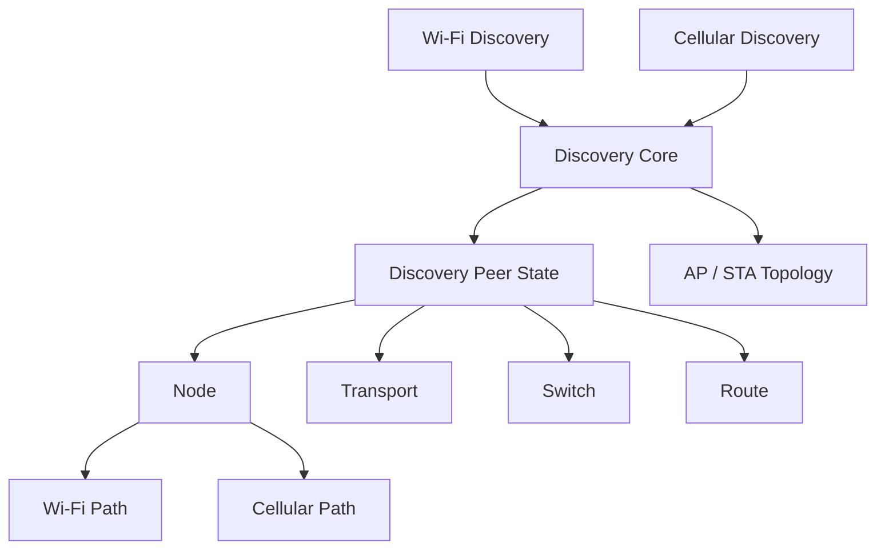
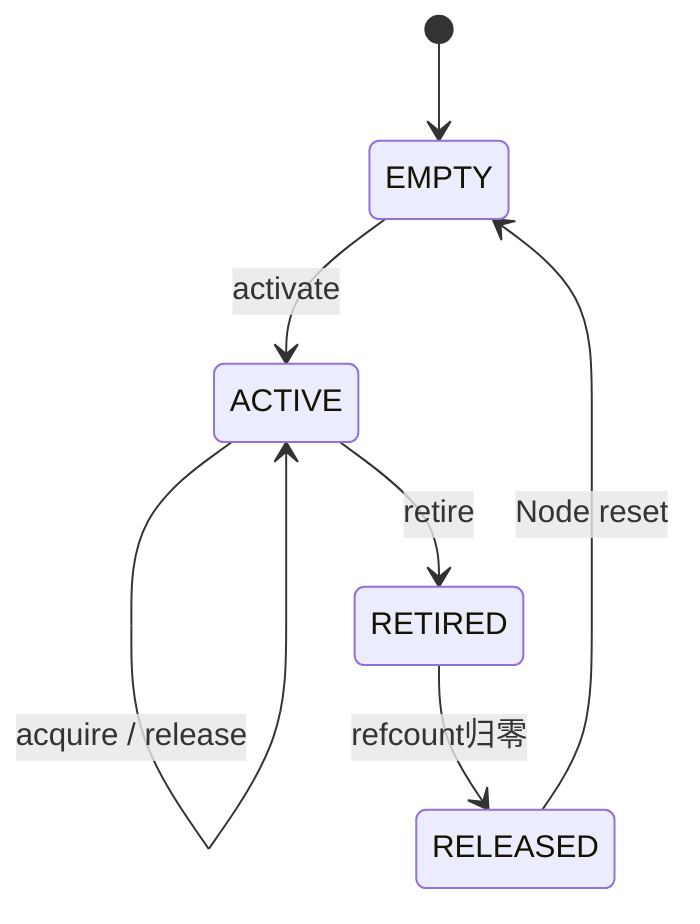
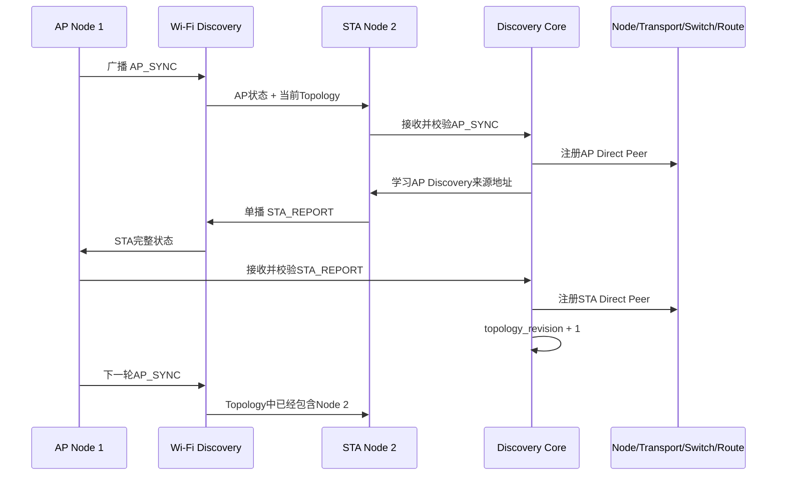
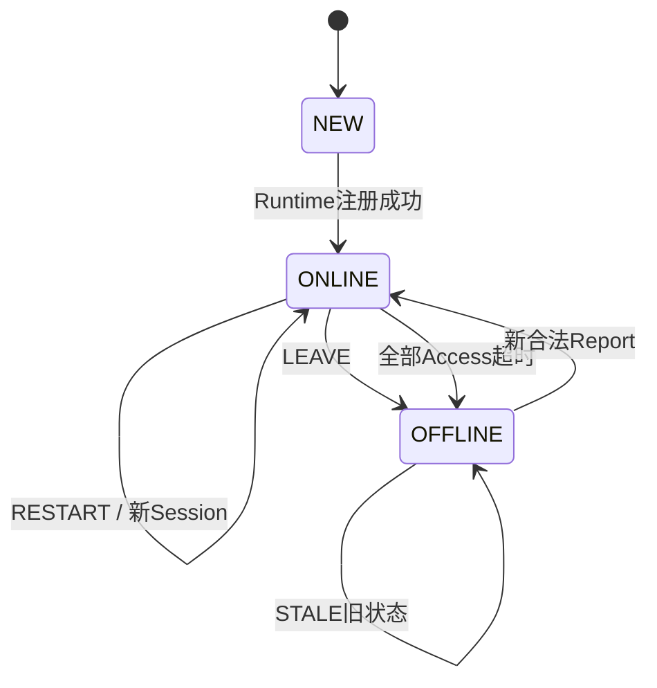
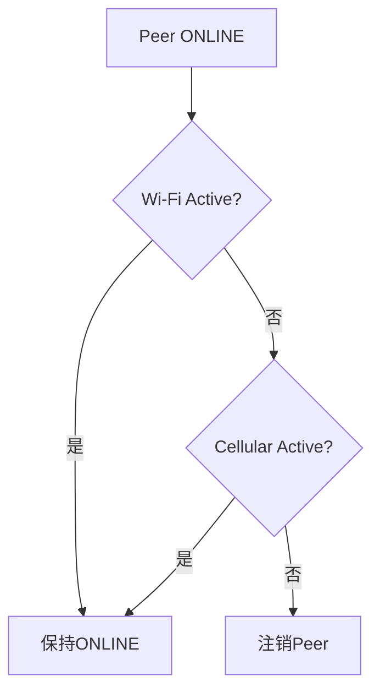
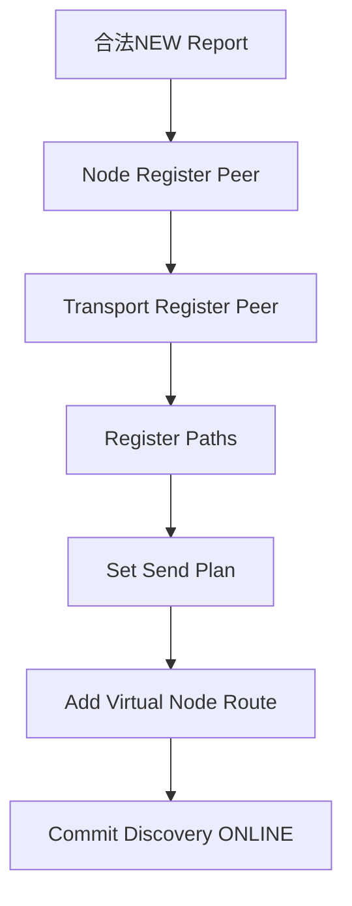
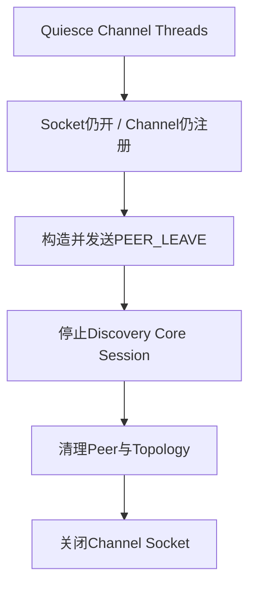

# M03：Node 与 Discovery 设备发现

> M03 负责把“网络上出现了一台设备”最终变成 LinkG 内部可使用的 Node、Path、Transport、Switch 和 Route 状态。这个模块的复杂点不在于发一个广播包，而在于设备身份、双链路存活、会话版本、路径变化、Peer 重启、主动离线、超时离线、拓扑同步以及异步 Path 退役必须同时保持一致。

源码范围：

```text
core/node/
core/discovery/
include/linkg/core/node/
include/linkg/core/discovery/
```

本章同时会引用：

```text
Path
Transport
Switch
Route
Link Manager
```

这些模块的内部实现分别在后续章节展开，这里只说明 Discovery 上下线时如何联动它们。

---

## 1. Node 和 Discovery 的职责划分

这里我把 Node 和 Discovery 明确分成两层。

### Node

Node 是 **直接 Peer 和数据 Path 的生命周期 Owner**。

它负责保存：

```text
本机Node身份
直接Peer
每个Peer的Wi-Fi / Cellular Path
Path Endpoint
Path引用和退役状态
Path接收统计
```

Node 不负责：

```text
周期广播
Discovery协议
Peer心跳超时
Session / Revision判断
AP拓扑广播
Linux Route联动策略
```

### Discovery

Discovery 是 **设备状态控制面和运行资源编排者**。

它负责判断：

```text
这个Report是不是有效？
Peer是不是新上线？
是不是同一个Session？
是不是旧Revision？
Wi-Fi和Cellular哪一路还活着？
Peer是否应该真正下线？
Path是否变化？
应该创建或销毁哪些运行资源？
STA应该知道哪些远端Node？
```

然后通过 Node、Transport、Switch、Route 把状态真正落下去。

整体关系可以理解成：



这里最重要的一条边界是：

> **Discovery 决定一个 Peer“应该是什么状态”，Node 负责保证对应 Peer / Path 对象在并发数据面里安全存在和安全退出。**

---

## 2. 当前组网不是全互联，而是 AP 中心拓扑

Node 模块管理的是 **直接 Peer**，不是整个网络中所有 Node。

当前产品组网固定为：

```text
1 AP + 最多 16 STA
```

直接关系只有：

```text
AP <------> STA
```

不建立：

```text
AP <------> AP
STA <-----> STA 直接Peer
```

因此：

### AP 侧

AP 最多拥有 16 个直接 STA Peer：

```text
AP Node 1
├── Peer STA 2
│   ├── Wi-Fi Path
│   └── Cellular Path
├── Peer STA 3
│   ├── Wi-Fi Path
│   └── Cellular Path
└── ...
```

### STA 侧

一个 STA 只允许存在一个直接 Peer，也就是 AP：

```text
STA Node 2
└── Peer AP Node 1
    ├── Wi-Fi Path
    └── Cellular Path
```

STA 想访问另外一个 STA 时，并不会建立：

```text
STA 2 <----直接Peer----> STA 3
```

而是：

```text
STA 2
  ↓
AP
  ↓
STA 3
```

这一点对理解后面的 AP Topology 非常重要。

---

## 3. Node 模型

当前 Node 基础身份很小：

```c
typedef struct
{
    uint8_t             node_id;
    linkg_device_role_t role;
} linkg_node_info_t;
```

直接 Peer 固定使用槽位管理，每个 Peer 最多两条 Path：

```text
LINKG_NODE_PEER_MAX = 16
LINKG_NODE_PATH_MAX = 2
```

每个 Peer Slot 内部结构可以概括为：

```text
Peer Slot
├── Node Info
├── Path[0]
├── Path[1]
├── path_count
├── valid
└── retiring
```

两条 Path 当前对应：

```text
Wi-Fi
Cellular
```

但 Node 本身并不把数组位置硬编码成 Wi-Fi 或 Cellular，它实际通过 `link_id` 区分 Path。

---

## 4. Path 生命周期设计

Path 是 M03 里一个非常关键的细节。

它不是 Discovery 一说“离线”就直接清零，因为此时 Scheduler、Link 或具体异步 TX Queue 可能已经拿到了这个 Path 的引用。

当前 Path 状态为：

```text
EMPTY
  ↓ activate
ACTIVE
  ↓ retire
RETIRED
  ↓ 最后一个引用释放
RELEASED
  ↓ Node reset
EMPTY
```



### ACTIVE

Path 已经可以被 Scheduler / Link 获取。

### RETIRED

Discovery 已经认为这条 Path 不再可用。

从这一刻开始：

```text
不再允许新的Path引用产生
```

但已经拿到引用的异步发送可以继续结束自己的生命周期。

### RELEASED

最后一个异步引用已经释放，Path 可以由 Node 安全回收。

### 为什么不能直接删除

假设 Wi-Fi Path 正在 Queue 中被一个异步发送任务持有：

```text
Discovery发现Wi-Fi Path失效
        ↓
如果直接memset/free Path
        ↓
TX Queue仍保存Path指针
        ↓
Use After Free
```

当前设计改成：

```text
Discovery注销Path
        ↓
Node将Path标记RETIRED
        ↓
禁止新acquire
        ↓
已有异步引用继续完成
        ↓
最后一个release触发回调
        ↓
Node reset Path
```

因此 Node 才是 Path 生命周期 Owner，而不是 Discovery 线程直接管理 Path 内存。

---

## 5. Discovery Report：一台设备对外公布的完整状态

每个节点周期发送的不是简单 Heartbeat，而是一份 **完整状态 Report**：

```c
typedef struct
{
    uint64_t              session_id;
    uint64_t              revision;
    linkg_node_info_t     node;
    linkg_path_endpoint_t wifi_endpoint;
    linkg_path_endpoint_t cellular_endpoint;
    uint8_t               path_flags;
} linkg_discovery_report_t;
```

它同时描述：

```text
我是谁
当前属于哪个Discovery Session
当前状态版本是多少
Wi-Fi数据Path是否可用
Wi-Fi数据Endpoint是什么
Cellular数据Path是否可用
Cellular数据Endpoint是什么
```

### 5.1 Session ID

每次 Discovery Core 启动都会通过 `getrandom()` 生成新的非零 `session_id`。

所以：

```text
同一台设备重启Discovery
        ↓
Node ID不变
        ↓
Session ID变化
```

这样对端能够明确区分：

```text
“这是原进程的一次状态更新”
```

和：

```text
“这个Peer已经重新启动了一轮Discovery会话”
```

### 5.2 Revision

每个 Session 内部维护单调递增的 `revision`。

新 Session 从：

```text
revision = 1
```

开始。

只有本机实际可发布状态变化时才推进，例如：

```text
Wi-Fi Endpoint出现
Wi-Fi Endpoint消失
Wi-Fi IP变化
Cellular Global IPv6出现
Cellular Global IPv6消失
Cellular地址变化
```

普通周期 Heartbeat 不改变 Revision。

这意味着：

```text
相同Session + 相同Revision
```

表示：

> 状态内容没有变化，只是在告诉对端“我仍然活着”。

---

## 6. Discovery 在线状态和数据 Path 状态是两件事

这个模块里我刻意没有把：

```text
Peer在线
```

等价成：

```text
一定存在可发送数据Path
```

Discovery 控制面允许在数据 Path 尚未准备好时先建立会话。

例如 Wi-Fi Discovery 控制通道已经能广播：

```text
Node 2 / STA / Session X / Revision 1
```

但此时 Wi-Fi 数据 Link 还没有可发布 Endpoint，则：

```text
path_flags = 0
```

仍然可以识别出这个设备。

它对应的运行状态可能是：

```text
Discovery Peer = ONLINE
Node Peer      = 已注册
Path Count     = 0
Switch Plan    = NONE
```

等后面数据 Endpoint 出现，新的 Revision 再把 Path 动态补上。

这个设计把两件事解耦：

```text
设备是否存在        → Discovery Liveness
数据现在能从哪走    → Path / Switch
```

这样不会因为 Wi-Fi 或 5G 数据接口短暂重建，就把整个 Peer 身份也同时销毁重建。

---

## 7. 本机 Endpoint 的发布规则

Discovery 发布的是 **数据面 Endpoint**，不是 Discovery Socket 自己的端口。

### Wi-Fi 数据 Endpoint

Wi-Fi Endpoint 只有同时满足下面条件时才标记有效：

```text
Wi-Fi业务Link存在
wlan0存在并UP
wlan0存在有效IPv4
```

发布地址使用：

```text
<wlan0 IPv4>:5000
```

其中 `5000` 是 Wi-Fi DATA 基准端口。

### Cellular 数据 Endpoint

Cellular Endpoint 只有同时满足：

```text
Cellular业务Link存在
usb0存在并UP
usb0存在Global IPv6
```

才会发布：

```text
<usb0 Global IPv6>:5003
```

其中 `5003` 是 Cellular DATA 基准端口。

### Endpoint 刷新规则

Wi-Fi 和 Cellular Endpoint 独立查询。

如果明确确认接口或地址已经不存在：

```text
清除对应Path Flag
清空对应Endpoint
revision + 1
```

如果只是本次系统查询失败：

```text
保留最近一次已经发布的状态
```

不会因为一次瞬时查询错误就把已经工作的 Path 立即撤销。

Wi-Fi 和 Cellular 两路同时变化时，本轮只推进一次 Revision。

另外两个 Discovery Channel 都可能触发 Endpoint Refresh，因此内部还有单独的 Refresh Lock，保证不会出现两个线程同时推进 Local Revision。

---

## 8. Discovery Wire 协议

当前 Discovery Wire 协议固定为：

```text
Magic   = "LGDS"
Version = 2
```

公共头长度：

```text
8 Byte
```

当前只有三种消息：

| 消息 | 方向 | 作用 |
|---|---|---|
| `STA_REPORT` | STA → AP | STA完整状态上报 |
| `AP_SYNC` | AP → STA | AP完整状态 + 当前在线STA拓扑 |
| `PEER_LEAVE` | AP / STA → Peer | 当前Discovery Session主动离开 |

消息尺寸很小：

```text
STA_REPORT = 65 Byte
PEER_LEAVE = 25 Byte
AP_SYNC    = 77 Byte + 在线STA数量
最大        = 93 Byte
```

因此当前 1 秒周期即使在 16 个 STA 的最大规模下，Discovery 本身的控制流量仍然很小。

这里采用周期发送完整状态，而不是只发送增量事件，主要是为了让状态天然具备重新收敛能力：

```text
某一帧丢失
   ↓
下一秒继续发送完整状态
   ↓
对端重新得到完整事实
```

不需要为了丢失一条“ADD_PATH / DEL_PATH / NODE_ONLINE”增量事件再维护复杂补偿协议。

---

## 9. Wi-Fi Discovery Channel

Wi-Fi Discovery 是当前整个组网的初始 Bootstrap 通道。

它使用：

```text
Interface : wlan0
Address   : IPv4
Port      : 5006
Network   : 11.21.191.0/24
Broadcast : 11.21.191.255:5006
IP TOS    : 0xC0
Period    : 1s
```

UDP Socket 绑定 `wlan0`，监听 `0.0.0.0:5006`，同时支持广播和单播接收。

### 9.1 Wi-Fi Discovery 和 Wi-Fi Data Link 解耦

Wi-Fi Discovery 启动只要求：

```text
wlan0存在
```

它不要求 Wi-Fi Data Path 已经建立。

因此控制面可以先发现设备，数据面随后再通过新的 Report Revision 补充 Path。

### 9.2 AP 的行为

AP 每 1 秒广播一次：

```text
AP_SYNC
```

内容包括：

```text
AP自身完整Report
+
当前在线STA Node ID列表
+
Topology Revision
```

即使当前还没有任何 STA，AP 也会周期发送合法的空拓扑 AP_SYNC。

这就是新 STA 能够被动发现 AP 的入口。

### 9.3 STA 的行为

STA 启动时并不知道 AP 的 Discovery 单播地址。

它先监听 Wi-Fi 广播：

```text
AP广播 AP_SYNC
      ↓
STA收到
      ↓
校验协议和来源
      ↓
处理AP Direct Peer状态
      ↓
记录实际UDP来源地址
      ↓
这个地址成为当前AP Discovery地址
```

一旦第一次学习到 AP 地址，STA 会把下一次 Report 时间提前到当前时刻，尽快发送自己的完整状态。

后续 STA 每 1 秒向当前 AP 单播：

```text
STA_REPORT
```

---

## 10. AP / STA 首次发现完整流程

一个新的 STA 加入网络时，完整过程如下：



这个流程里没有额外的：

```text
HELLO
HELLO_ACK
CONNECT
CONNECTED
```

状态握手。

完整 Report 本身同时承担：

```text
发现
状态同步
Endpoint通告
心跳
重新收敛
```

从而减少控制面状态数量。

---

## 11. Wi-Fi Discovery 来源校验

Wi-Fi 收到 Discovery 报文后不直接相信 Payload 中自己声明的地址。

首先要求 UDP 实际来源：

```text
IPv4有效
Source Port = 5006
报文实际从wlan0进入
```

如果 Report 声明存在 Wi-Fi 数据 Path，则：

```text
Report中的Wi-Fi数据IPv4
必须等于
实际Discovery UDP来源IPv4
```

如果 Report 没有声明 Wi-Fi Data Path，则 Wi-Fi Endpoint 必须为空。

因此控制面来源和节点自己声明的数据地址之间存在基本一致性校验，避免一个报文直接替其他 IPv4 地址注册 Wi-Fi Path。

---

## 12. Cellular Discovery Channel

Cellular Discovery 使用独立 IPv6 UDP 控制通道：

```text
Interface     : usb0
Address       : IPv6
Port          : 5007
Traffic Class : 0xC0
Period        : 1s
```

Socket 使用：

```text
AF_INET6
IPV6_V6ONLY
IPV6_RECVPKTINFO
```

发送时通过 `IPV6_PKTINFO` 明确指定：

```text
Source IPv6
usb0 ifindex
```

接收时同样读取 `IPV6_PKTINFO`，只接受真正从 `usb0` 进入的报文。

这样即使系统存在多个 IPv6 接口，也不会因为内核路由选择把 Discovery 控制流量错误归属到其他接口。

### 12.1 Cellular Discovery 不使用广播

蜂窝公网 IPv6 没有类似 Wi-Fi LAN Broadcast 的发现方式。

因此 Cellular Discovery 的发送目标来自：

```text
已经在线Direct Peer
        ↓
Peer Report中公布的Cellular Data Endpoint
        ↓
取IPv6地址
        ↓
端口替换为5007
        ↓
发送Cellular Discovery
```

也就是说 Discovery Report 中发布的是：

```text
[IPv6]:5003  数据面Endpoint
```

Cellular Discovery 实际使用相同 IPv6 的：

```text
[IPv6]:5007  控制面Endpoint
```

### 12.2 当前 Cellular 需要 Wi-Fi Bootstrap

当前没有公网信令服务器，也没有其他 Cellular Bootstrap 机制。

因此系统明确规定：

```text
Cellular Discovery enabled
        +
Wi-Fi Discovery disabled
        ↓
配置不允许启动
```

Discovery 启动阶段同样要求 Wi-Fi Bootstrap 条件可用。

原因很直接：

```text
Cellular要给Peer发包
        ↓
必须先知道Peer Global IPv6
        ↓
第一次IPv6地址来自Wi-Fi交换的完整Report
```

所以当前实际启动关系是：

```text
Wi-Fi先发现对端
      ↓
双方交换包含Cellular Endpoint的完整Report
      ↓
获得对端Global IPv6
      ↓
Cellular Discovery开始直接互发完整状态
```

一旦 Cellular Discovery 已经建立自己的 Liveness，后续 Wi-Fi Control 短暂失效并不会立即导致 Peer 离线。

---

## 13. Cellular 来源校验

Cellular Discovery 的来源检查比 Wi-Fi 更严格。

收到报文时要求：

```text
来源为Global IPv6
Source Port = 5007
IPV6_PKTINFO确认从usb0进入
```

同时 Report 必须声明有效 Cellular Path，并且：

```text
Report声明的Cellular IPv6
必须等于
实际UDP Source IPv6
```

因此一个从其他 IPv6 地址发来的 Report 不能直接声称自己拥有另一个 Cellular Endpoint。

---

## 14. Peer Report 状态机

Discovery 收到完整 Report 后，不是每次都重新创建 Peer，而是先根据：

```text
Node ID
Session ID
Revision
当前Online状态
Session是否已经关闭
```

分类。

当前事件分成：

| 事件 | 条件 | 处理 |
|---|---|---|
| `NEW` | 新Node，或离线Peer以合法状态重新上线 | 建立完整运行资源 |
| `REFRESH` | 同Session、同Revision | 只刷新当前Access Liveness |
| `UPDATE` | 同Session、更高Revision | 更新Path和发送计划 |
| `STALE` | 同Session旧Revision，或Session已被LEAVE关闭 | 忽略，不刷新Liveness |
| `RESTART` | 在线Peer出现新的Session ID | 处理Peer重启并重置Transport会话状态 |

状态关系可以简化成：



### 为什么 STALE 不刷新心跳

旧 Revision 报文即使网络上刚刚收到，也不代表当前状态仍然有效。

如果旧包也能刷新 `last_seen`，网络中持续存在的迟到旧包就可能让已经失效的 Peer 长期保持在线。

因此：

> **只有被当前状态机接受的完整状态，才允许刷新对应 Access 的 Liveness。**

---

## 15. 双 Access 独立 Liveness

每个 Discovery Peer 分别维护：

```text
Wi-Fi Liveness
Cellular Liveness
```

单个 Liveness 包含：

```text
registered
active
last_seen_us
```

当前参数：

```text
Report发送周期        = 1s
Access Liveness超时   = 10s
Peer Tombstone保留    = 15s
```

### 15.1 收到哪一路，只刷新哪一路

例如 Report 从 Wi-Fi 收到：

```text
Wi-Fi last_seen刷新
Cellular last_seen不动
```

从 Cellular 收到则相反。

即使 Payload 内容完全一样，也不会因为 Wi-Fi 报文中带有 Cellular Endpoint，就顺便认为 Cellular Control Path 也活着。

### 15.2 单路失效不等于Peer离线

例如：

```text
Wi-Fi Liveness     超时
Cellular Liveness  仍Active
```

则：

```text
Peer仍然ONLINE
```

只有：

```text
Wi-Fi inactive
AND
Cellular inactive
```

才进入真正的 Peer 注销流程。



### 15.3 Channel 本身异常退出

如果 Wi-Fi 或 Cellular Discovery 工作线程异常退出，对应 Channel 会主动从 Core 注销。

Core 随即清除这个 Access 在所有 Peer 上的 Liveness。

仍存在另一条活动 Access 的 Peer 不受影响；没有其他活动 Access 的 Peer 才真正离线。

因此 Discovery Channel 自己的故障也走同一套多路径存活逻辑，不需要额外维护第二种离线状态机。

---

## 16. Peer 上线时创建哪些运行资源

一个 Peer 被判定为 `NEW` 后，并不是立即把 `peer->online=true`。

Discovery 先建立完整运行资源：

```text
1. Node Register Peer
        ↓
2. Transport Register Peer
        ↓
3. Register Wi-Fi / Cellular Paths
        ↓
4. Switch Set Initial Plan
        ↓
5. Route Add Node
        ↓
6. Discovery提交ONLINE状态
```



只有全部外部资源都建立成功后，Discovery 才提交：

```text
peer.used   = true
peer.online = true
```

如果中间失败，则回滚已经建立的资源。

这保证不会出现：

```text
Discovery显示ONLINE
但Node没注册
```

或者：

```text
Route已经存在
但Transport没有Peer状态
```

这种半上线状态。

---

## 17. Peer 初始发送计划

Discovery 建立 Peer 时会根据 Report 当前声明的数据 Path 写入一份初始发送计划。

当前初始规则为：

```text
Wi-Fi可用：
    Primary   = Wi-Fi
    Secondary = Cellular（若存在）

只有Cellular可用：
    Primary = Cellular

没有数据Path：
    Mode = NONE
```

这里的 Switch Plan 是当前 Path 状态的初始可用关系。

后续真正的数据调度和链路切换策略由 Switch / Scheduler 自己负责，M03 只保证 Peer 上线时不会引用一个当前不存在的 Path。

---

## 18. 同一个Peer状态更新

同一 Discovery Session 内收到更高 Revision 时，进入 `UPDATE`。

更新顺序为：

```text
先注册 / 更新新Report中的Path
        ↓
生成并写入新的Switch Plan
        ↓
再退役新Report中已经不存在的旧Path
        ↓
最后提交新的Report
```

这里“先新后旧”的顺序是刻意保留的。

例如从：

```text
Wi-Fi + Cellular
```

变化成：

```text
Cellular only
```

会先确保 Cellular Path 和新发送计划有效，然后再退役 Wi-Fi Path。

如果同一个 Link 只是 Endpoint 地址变化：

```text
旧IPv6 → 新IPv6
```

Node 直接更新 ACTIVE Path 的 Endpoint，不重新销毁和创建整个 Path 对象。

---

## 19. Peer 重启处理

如果同一个 Node ID 在仍然 ONLINE 时出现新的 `session_id`，说明对端 Discovery 已经重新启动。

这时不能只把它当成普通 Endpoint Update。

当前首先执行：

```text
Transport Reset Peer
```

重置：

```text
TX Sequence
RX Window
```

但保留累计统计。

之后再按新 Report 更新 Path 和发送计划。

这样新 Session 的 Transport Sequence 不会和旧进程残留的接收窗口串在一起。

Session ID 相当于把设备重启前后的协议状态切成两个独立时代。

---

## 20. 主动 LEAVE 设计

正常停止 Discovery 时会主动发送：

```text
PEER_LEAVE
```

里面包含：

```text
Node ID
Session ID
Current Revision
```

对端只接受：

```text
相同Session
且 Leave Revision >= 当前Report Revision
```

如果一个旧 LEAVE 因网络延迟晚到：

```text
leave.revision < current.revision
```

直接忽略。

因此不会出现：

```text
Peer已经更新到Revision 10
网络里迟到一个Revision 8的LEAVE
结果把最新Peer错误下线
```

Session 不匹配的 LEAVE 同样直接忽略。

---

## 21. Discovery 停止顺序为什么要先 Quiesce

Discovery 的停止流程不是直接：

```text
Stop Thread
Close Socket
Clear Peer
```

当前采用：

```text
1. Quiesce Wi-Fi / Cellular工作线程
        ↓
2. 保留Socket和Channel注册
        ↓
3. Core构造稳定的PEER_LEAVE
        ↓
4. 通过所有已注册Channel同步发送LEAVE
        ↓
5. Core停止Session并清理Peer / Topology
        ↓
6. Channel Unregister + Close Socket
```



这里先 Quiesce 很重要。

如果工作线程仍然在跑：

```text
Core构造 Revision 10 的LEAVE
        ↓
Wi-Fi线程此时发现Endpoint变化
        ↓
Local Revision推进到11
        ↓
Revision 10 LEAVE才被发出去
```

对端会认为这个 LEAVE 已经是旧状态。

所以必须先冻结所有会改变 Local Report / Revision 的周期线程，再构造最后一次 LEAVE。

同时 Socket 不能提前关闭，因为 LEAVE 还需要从真实 Channel 发出去。

---

## 22. 超时离线与 Tombstone

Peer 没有主动发送 LEAVE 时，依靠 Liveness Timeout 自动下线。

当前：

```text
10 秒没有收到某个Access的有效完整状态
        ↓
该Access变为Inactive
```

所有 Access 都 Inactive 后：

```text
Peer进入OFFLINE
```

但 Discovery 不会立刻清空这个 Peer Slot。

而是保留：

```text
15秒 Tombstone
```

Tombstone 保存最近一次：

```text
Node ID
Session ID
Revision
Session Closed状态
Offline Time
```

目的主要是过滤网络中还可能继续到达的旧 Report。

例如已经收到合法 LEAVE 后，又迟到同一个 Session 的 Report：

```text
session_closed = true
        ↓
事件分类为STALE
        ↓
不能重新上线
        ↓
也不能刷新Liveness
```

如果同一个 Node 真正重新启动，会产生新的 Session ID，可以在 Tombstone 期间正常重新建立新的 Session。

Tombstone 不是为了阻止合法重启，而是为了阻止旧 Session 被迟到数据复活。

---

## 23. Peer 下线时运行资源如何撤销

Peer 真正离线后，Discovery 按以下顺序撤销运行状态：

```text
1. Switch Remove Plan
        ↓
2. Transport Unregister Peer
        ↓
3. Node Unregister Peer
        ↓
4. Route Remove Node
        ↓
5. Discovery Commit OFFLINE
```

### 23.1 先移除 Switch Plan

先阻止新的数据发送继续选中这个 Peer。

### 23.2 Transport 状态撤销

移除 Peer 的序列号和接收窗口等逻辑传输状态。

### 23.3 Node 逻辑下线

Node Peer 先：

```text
valid = false
retiring = true
```

从此禁止新 Path Acquire。

然后全部 Path 进入退役流程。

如果 Path 已经没有异步引用，立即 Reset；如果还有引用，则等待最后一个 Path Release 回调后再完成槽位回收。

### 23.4 Linux Route 删除

最后删除对应 Node 的虚拟 `/24` Route。

Route 属于外部 Linux 内核状态，删除有可能因为临时系统错误失败。

因此 Discovery 单独保存：

```text
route_cleanup_pending
```

后续 Peer Aging 继续重试 Route 清理。

不会因为一次 Netlink 删除失败就丢失后续清理目标。

---

## 24. AP Topology：为什么除了Direct Peer还要有一份拓扑

AP 自己直接知道所有在线 STA，因为它们都是 AP 的 Direct Peer。

但 STA 只知道自己的 Direct AP。

如果 Node 2 想访问 Node 3：

```text
Node 2必须至少知道：
“Node 3当前属于这个LinkG网络，而且应该把172.28.3.0/24送进linkg0”
```

因此 AP 额外维护：

```text
topology_revision
```

只要在线 STA 集合变化：

```text
STA上线
STA离线
```

AP 就推进 Topology Revision。

AP_SYNC 周期下发：

```text
AP自己的完整Report
+
Topology Revision
+
所有在线STA Node ID
```

所有 STA 收到的是同一份完整网络拓扑快照。

---

## 25. Local Revision 和 Topology Revision 是两套版本

这里有两套 Revision，职责不同。

### Local Report Revision

表示：

```text
AP自己或STA自己的Endpoint状态有没有变化
```

例如 AP Cellular IPv6 改变：

```text
AP Report Revision + 1
```

### Topology Revision

只在 AP 维护，表示：

```text
当前在线STA集合有没有变化
```

例如 Node 3 上线：

```text
Topology Revision + 1
```

但 AP 自己 Wi-Fi IP 变化并不要求 Topology Revision 改变。

这种拆分避免：

```text
一个AP自身Endpoint变化
```

被误认为：

```text
整个STA拓扑发生变化
```

---

## 26. STA 如何应用 AP Topology

STA 收到 AP_SYNC 后，首先处理 AP 自己的 Direct Peer Report。

只有确认这个 AP Session 当前确实在线后，才继续应用里面的 Topology。

这样一个已经被关闭的旧 AP Session，即使还有迟到 AP_SYNC，也不能继续修改 STA Route。

### 26.1 STA 不保存自己

AP_SYNC 中会包含全部在线 STA，包括当前接收 STA 自己。

STA 应用时会把自己的 Node ID 去掉，只保存其他远端 STA：

```text
AP Topology:
Node 2
Node 3
Node 4

当前STA = Node 2

本地Remote Topology:
Node 3
Node 4
```

### 26.2 先添加新路由，再删除旧路由

应用新 Topology 时采用：

```text
先确保新快照全部Route存在
        ↓
全部Add成功
        ↓
再删除旧快照里已经不存在的Route
        ↓
最后提交新的Topology Revision
```

这样如果建立新路由过程中失败，不会先把旧的、当前仍可用的远端路由删掉。

Route ADD 本身使用 CREATE / REPLACE，重复应用完整 Topology 是幂等的。

### 26.3 AP下线时清除远端拓扑

STA 的 Direct AP 一旦真正离线：

```text
AP Direct Peer Route
    → Peer Runtime负责清理

其他STA Remote Route
    → Discovery Topology统一清理
```

这样不会把“AP自身路由”和“AP告诉我的其他STA路由”混成一套生命周期。

---

## 27. STA 到 STA 的真实控制关系

假设：

```text
STA Node 2
需要访问
STA Node 3
```

Node 2 从 AP Topology 得知 Node 3 在线，于是存在：

```text
172.28.3.0/24 → linkg0
```

但 Node 2 的 Node / Transport 中并没有 Node 3 Direct Peer。

实际数据路径是：


Transport 在 STA 角色下只存在一个直接 Peer，因此：

```text
Final Destination = Node 3
Physical Next Hop = AP
```

AP 收到以后再根据最终 `destination_node_id` 转发到自己的 Direct Peer Node 3。

因此：

> **AP_SYNC 给 STA 的是“整个虚拟网络里哪些 Node 存在”的路由视图，而不是让所有 STA 之间建立全互联 Peer / Path。**

这个设计把 N 个 STA 的连接复杂度从全互联降到 AP 中心模型。

---

## 28. Report 更新与 AP Topology 更新互不干扰

同一个 AP_SYNC 同时包含：

```text
AP Report
Topology Snapshot
```

处理时两部分独立判断版本。

例如：

```text
AP Report Revision变化
Topology Revision不变
```

仍然会更新 AP Endpoint，但不会重复修改远端 STA Route。

反过来：

```text
AP Report Revision不变
Topology Revision增加
```

AP Direct Peer只刷新 Liveness，但 STA 会应用新的远端拓扑。

这让一个 AP_SYNC 同时承担两个同步任务，但不会让两个状态机互相绑死。

---

## 29. Discovery 与 Route / Transport / Switch / Link 的联动关系

整个 M03 最终可以归纳为下面这张表：

| Discovery事实 | 联动模块 | 动作 |
|---|---|---|
| 新Direct Peer | Node | 注册Peer |
| 新Direct Peer | Transport | 注册Peer协议状态 |
| Report声明Wi-Fi Endpoint | Node / Path | 建立或更新Wi-Fi Path |
| Report声明Cellular Endpoint | Node / Path | 建立或更新Cellular Path |
| Path集合变化 | Switch | 更新初始发送计划 |
| Direct Peer上线 | Route | 添加该Node虚拟子网路由 |
| Peer新Session | Transport | Reset Sequence / RX Window |
| Path失效 | Node | Retire对应Path |
| Direct Peer离线 | Switch | 删除发送计划 |
| Direct Peer离线 | Transport | 删除Peer协议状态 |
| Direct Peer离线 | Node | Peer逻辑下线并退役Path |
| Direct Peer离线 | Route | 删除该Node虚拟路由 |
| AP在线STA集合变化 | Discovery Topology | Topology Revision推进 |
| STA收到AP Topology | Route | 添加/删除其他STA虚拟路由 |

Link Manager 不由 Discovery 创建或销毁。

Discovery 只根据当前 `link_id` 把 Peer Endpoint 绑定成 Path；实际 Wi-Fi / Cellular Link 生命周期仍由 Link Manager 和 Network 模块管理。

---

## 30. Discovery Heartbeat 与 Cellular 数据端口保活不是同一个东西

这里需要明确区分两类“心跳”。

### Discovery Heartbeat

本章描述的是：

```text
5006 Wi-Fi Discovery
5007 Cellular Discovery
```

每 1 秒周期发送完整状态。

它解决：

```text
Peer是否在线
哪个Access还活着
Endpoint有没有变化
Topology有没有变化
```

### Cellular 数据通道保活

Cellular 数据面实际使用：

```text
5003 Data
5004 Realtime
5005 Video
```

这些 UDP 端口为了公网 P2P / 防火墙 / NAT 映射维持所做的链路保活属于 Cellular Link 数据面职责。

即使 `5007` Discovery 一直互通，也不能直接认为：

```text
5003 / 5004 / 5005
```

对应的状态映射一定同时存在。

因此两套机制不能合并描述：

```text
Discovery Heartbeat = 节点控制面存活
Cellular Link Heartbeat = 数据端口传输可达性维护
```

---

## 31. 当前 Discovery 控制流量开销

Discovery 使用周期完整状态，但报文本身很小。

最大 16 STA 时，仅看 Wire Payload：

### Wi-Fi

AP 每秒只需要广播一次最大 AP_SYNC：

```text
93 Byte/s
```

16 个 STA 每秒各向 AP 发送一个 STA_REPORT：

```text
16 × 65 = 1040 Byte/s
```

所以 AP 侧 Wi-Fi Discovery 应用层有效控制数据约为：

```text
约 1.1 KiB/s
```

### Cellular

Cellular 无广播，AP 对 16 个已知 STA 分别发送 AP_SYNC：

```text
16 × 93 = 1488 Byte/s
```

再接收：

```text
16 × 65 = 1040 Byte/s
```

合计也只有约：

```text
2.5 KiB/s
```

不包含 IP / UDP 头后仍然属于很小的控制开销。

因此当前用“1 秒完整状态 + 10 秒超时”换取简单可靠的最终一致性是合理的，不需要为了省几十字节把控制面改成复杂的增量状态协议。

---

## 32. 当前协议校验边界

Discovery 当前已经进行：

```text
Magic校验
Version校验
Payload长度校验
Node ID校验
AP / STA角色关系校验
Session非零
Revision非零
Path Flag和Endpoint一致性校验
Wi-Fi实际UDP来源与声明IPv4一致性校验
Cellular实际IPv6来源与声明Global IPv6一致性校验
Cellular usb0 ifindex校验
AP Topology Node ID合法性和去重校验
```

当前 Discovery Wire 不承担加密身份认证或公网信令认证职责。

当前信任边界建立在受控 LinkG Wi-Fi / Cellular 网络以及实际报文来源一致性校验上。

---

## 33. 当前设计的几个关键优点

### 33.1 控制面和数据面解耦

设备可以先被发现，再等待具体数据 Path 出现，不需要网络接口每次波动都销毁整个 Peer 身份。

### 33.2 双链路独立存活

Wi-Fi 和 Cellular 任何一路仍然有效，都能保持 Direct Peer 在线。

### 33.3 Session + Revision 防止状态串线

设备重启和普通更新被明确区分；旧 Report、旧 LEAVE 都不能覆盖新状态。

### 33.4 Tombstone 防止旧Session复活

离线以后短时间保留旧状态，不会被网络里迟到的同 Session 报文重新拉上线。

### 33.5 Runtime资源事务化上线

Node、Transport、Path、Switch、Route 全部建立成功以后才提交 ONLINE，避免半上线。

### 33.6 Path 可以安全异步退役

数据面已经取得的 Path 引用允许自然完成，新引用立即禁止，不需要停全局数据面等 Path free。

### 33.7 AP使用完整拓扑快照

STA 不依赖一连串增量“Node Add / Node Remove”事件，漏掉一帧后下一次完整 AP_SYNC 可以重新收敛。

### 33.8 星型拓扑控制状态规模小

STA 永远只有一个 Direct AP Peer，不需要维护其他 15 个 STA 的 Path / Transport 状态。

远端 STA 只体现为一个 Node ID 和对应虚拟路由。

---

## 34. 当前设计边界

当前 M03 的边界已经明确：

```text
组网规模：1 AP + 最多16 STA
直接Peer：仅AP <-> STA
单Peer数据Path：最多Wi-Fi + Cellular两条
Wi-Fi Discovery：IPv4广播Bootstrap
Cellular Discovery：IPv6已知Peer单播
Cellular-only Bootstrap：当前不支持
公网信令服务器：当前未接入
Peer Report周期：1s
单Access存活超时：10s
Offline Tombstone：15s
```

其中 Cellular-only Discovery 被明确拒绝，不会在没有 Bootstrap 能力时假装能够通过公网 IPv6 自动找到未知 Peer。

---

## 35. 本模块结论

M03 实际解决的不是简单的“设备发现”，而是整个 LinkG 控制面的节点一致性问题。

当前设计可以概括为：

```text
Node ID + Role
        ↓
Session + Revision
        ↓
Wi-Fi广播Bootstrap
        ↓
AP / STA完整Report交换
        ↓
双Access独立Liveness
        ↓
Node / Transport / Path / Switch / Route完整注册
        ↓
AP完整Topology同步
        ↓
周期状态维持
        ↓
Endpoint Update / Peer Restart / LEAVE / Timeout
        ↓
安全退役Path和清理Route
```

Node 负责直接 Peer 和 Path 的安全生命周期，Discovery 负责控制面状态判断和跨模块资源编排。

AP 保存全部 STA 的 Direct Peer；STA 只保存 AP 这个 Direct Peer，通过 AP_SYNC 获得其他 STA 的虚拟路由视图。Wi-Fi 负责当前初始发现，Cellular 在已知 Peer IPv6 后建立自己的独立 Discovery Liveness，两条 Access 共同决定 Peer 是否真正在线。

这一套状态机把设备重启、链路波动、控制包丢失、迟到报文、双链路切换和异步 Path 引用这些情况都统一到同一套状态模型里，是后续 Transport、Scheduler 和 Link 正常工作的控制面基础。
