# M03：Node 与 Discovery 设备发现

源码范围：`core/node/`、`core/discovery/`、`include/linkg/core/node/`、`include/linkg/core/discovery/`。

## 1. 模块定位

LinkG 的设备发现并不只是“找到一台设备”。真正需要解决的是：设备出现以后，系统如何确认它是谁、当前有哪些 Wi-Fi / 5G 路径、哪一路仍然存活、设备重启以后如何和旧状态区分，以及 Peer 上下线时如何同步建立或撤销 Node、Transport、Switch 和 Route 状态。

因此 M03 实际承担两层职责：

```text
Node
负责直接Peer和Path的生命周期

Discovery
负责设备状态同步、存活判断和跨模块资源编排
```

整体关系如下：

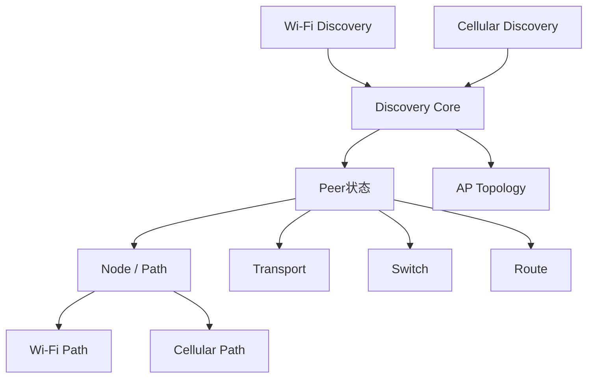

这层最终解决的是一个一致性问题：

> **Discovery 决定一个 Peer 当前应该是什么状态，Node 和其他运行模块负责把这个状态安全地落到数据面。**

---

## 2. Node：统一直接 Peer 和 Path

当前 LinkG 是 AP 中心组网：

```text
1 AP + 最多16 STA
```

Node 管理的是 **直接 Peer**，不是网络中的全部 Node。

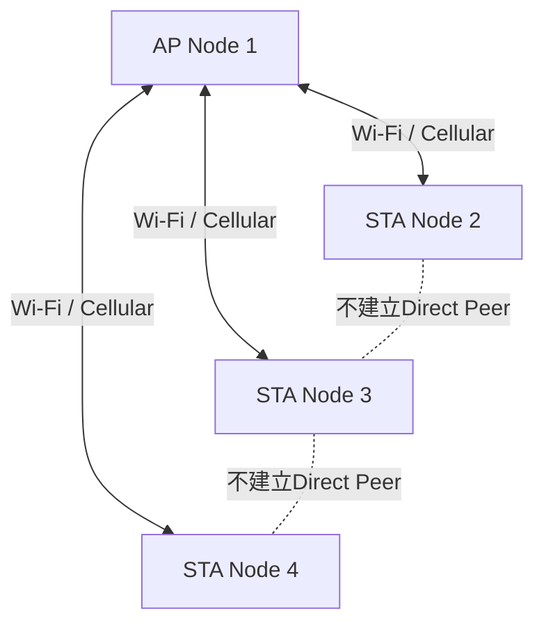

因此：

```text
AP
最多维护16个Direct STA Peer
每个Peer最多有Wi-Fi + Cellular两条Path

STA
只维护一个Direct Peer：AP
其他STA不建立Peer/Path
```

每个 Path 描述的是：

```text
某个Peer
通过某个Link ID
对应的下一跳Endpoint
```

例如：

```text
Node 2
├── Wi-Fi Path
│   ├── link_id = Wi-Fi Link
│   └── endpoint = IPv4
│
└── Cellular Path
    ├── link_id = Cellular Link
    └── endpoint = Global IPv6
```

这样 Node 把“设备是谁”和“通过哪条物理链路能到达它”统一成固定的数据模型，为后面的 Scheduler 提供稳定的 Path 查询入口。

---

## 3. Discovery 使用完整状态同步

每个节点周期发布一份完整 `Discovery Report`，核心内容包括：

```text
Node ID / Role
Session ID
Revision
Wi-Fi Endpoint
Cellular Endpoint
Path Flags
```

它同时回答三个问题：

```text
我是谁？
我现在有哪些数据Path？
这是不是我最新的一份状态？
```

当前没有采用大量 `NODE_ADD / PATH_ADD / PATH_DELETE` 这类增量消息，而是每 1 秒重新发送完整状态。


这样控制报文丢失以后不需要额外补偿协议，下一轮完整状态就可以重新收敛。

当前 Discovery Wire 只保留三种消息：

| 消息 | 方向 | 作用 |
|---|---|---|
| `STA_REPORT` | STA → AP | STA完整状态 |
| `AP_SYNC` | AP → STA | AP完整状态 + 在线STA拓扑 |
| `PEER_LEAVE` | AP / STA → Peer | 主动结束当前Session |

最大报文不足 100 Byte，所以在当前最多 16 个 STA 的规模下，1 秒一次完整状态带来的控制流量很小，换来的是更简单的状态一致性。

---

## 4. Session 和 Revision：区分重启、更新和迟到状态

仅靠 Node ID 无法判断一个 Peer 是“状态更新”还是“已经重启”。因此每次 Discovery 启动都会生成新的随机 `session_id`，同一个 Session 内再维护单调递增的 `revision`。

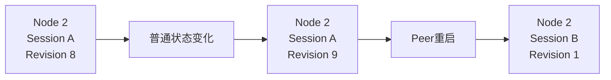

两者分工很明确：

```text
Session ID
区分设备不同运行会话

Revision
区分同一Session中的新旧状态
```

因此 Discovery 可以准确识别：

```text
同Session + 同Revision     → REFRESH，只刷新存活
同Session + 更高Revision   → UPDATE，更新Path状态
同Session + 旧Revision     → STALE，忽略
新Session                  → RESTART，按Peer重启处理
```

Wi-Fi / Cellular Endpoint 出现、消失或地址变化时才推进 Revision；普通周期上报不修改 Revision。

这套机制解决了网络乱序和 Peer 重启时最容易出现的“旧状态覆盖新状态”问题。

---

## 5. Wi-Fi 和 Cellular 两条 Discovery Channel

Discovery 控制面同时支持 Wi-Fi 和 Cellular，但两条通道解决的问题不同。

### Wi-Fi：负责初始 Bootstrap

Wi-Fi Discovery 使用：

```text
wlan0
IPv4 UDP 5006
11.21.191.0/24广播
1秒周期
```

AP 周期广播 `AP_SYNC`，新 STA 不需要预先知道 AP 地址，只要进入 Wi-Fi 网络就能收到广播并学习 AP 的实际 Discovery 地址。

随后 STA 向 AP 单播 `STA_REPORT`。

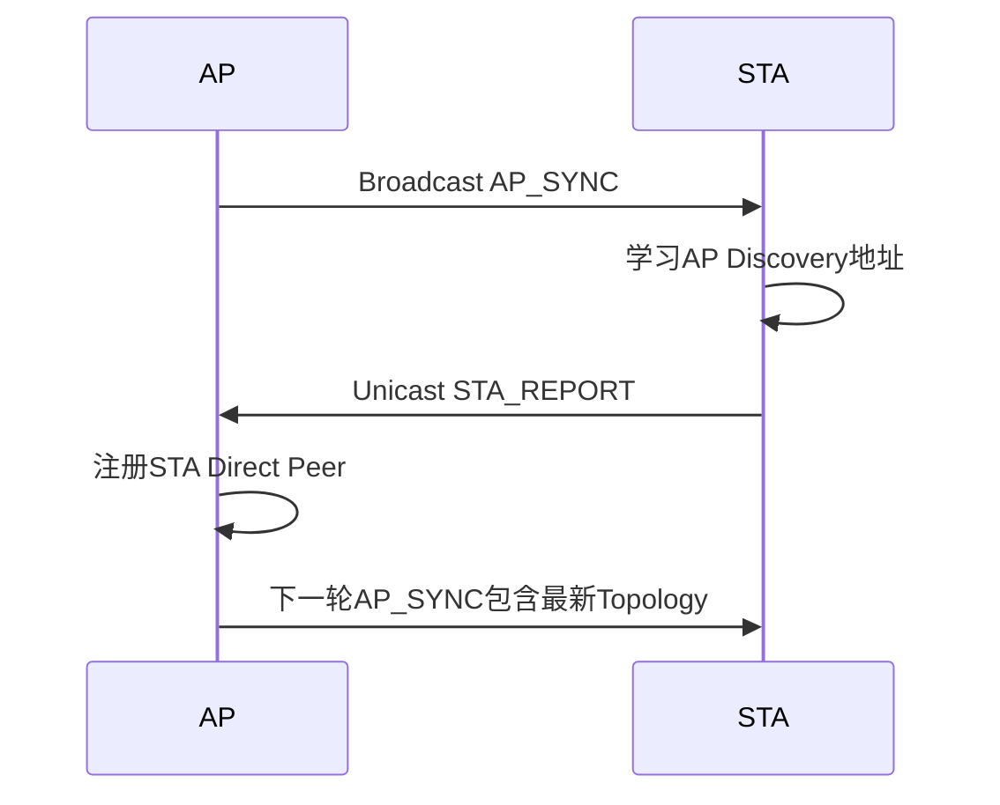

Wi-Fi Discovery 与 Wi-Fi Data Path 解耦，只要 `wlan0` 控制面可用就可以先建立 Discovery Session，数据 Endpoint 可以随后动态加入。

### Cellular：负责已知 Peer 的第二控制通道

Cellular Discovery 使用：

```text
usb0
IPv6 UDP 5007
Global IPv6
1秒周期
```

蜂窝公网没有类似 Wi-Fi LAN Broadcast 的机制，所以 Cellular 无法凭空发现一个未知 Peer。

当前流程是：

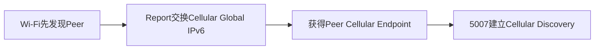

因此当前没有公网信令服务器时，Cellular Discovery 依赖 Wi-Fi 完成第一次 Bootstrap。建立以后，Wi-Fi 和 Cellular 就分别维护自己的存活状态。

---

## 6. Peer 在线与 Path 可用是两层状态

这里没有把：

```text
Peer ONLINE
```

等价成：

```text
一定存在可发送Path
```

Discovery 控制面可以先识别一个节点，而 Wi-Fi / Cellular Data Endpoint 暂时还没有准备完成。


这样把两个问题拆开：

```text
设备是否存在
→ Discovery Liveness

数据当前能从哪里走
→ Node Path / Switch Plan
```

网络接口短暂重建时，可以只更新 Path，而不需要把整个 Peer 身份反复删除和重新创建。

Discovery 发布的 Endpoint 是 **数据面 Endpoint**：

```text
Wi-Fi     <wlan0 IPv4>:5000
Cellular  <usb0 Global IPv6>:5003
```

接口或地址真正变化时推进 Revision；一次系统状态查询失败则保留最近一次有效状态，不因为瞬时读取错误立刻撤销正在工作的 Path。

---

## 7. 双 Access 独立判活

每个 Direct Peer 分别维护：

```text
Wi-Fi Liveness
Cellular Liveness
```

收到哪条 Discovery Channel 的有效完整状态，就只刷新哪一条 `last_seen`。

当前参数为：

```text
完整状态周期       1s
单Access超时      10s
Offline Tombstone 15s
```

Peer 是否在线按照两条 Access 合并判断：

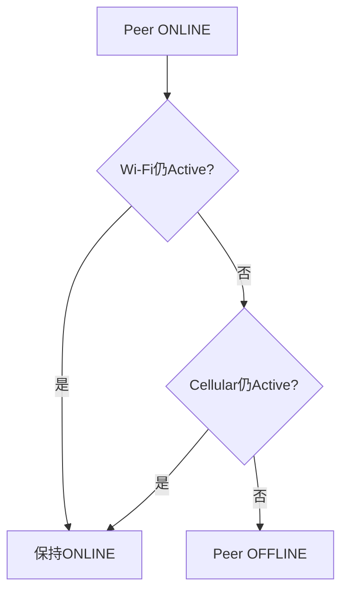

所以：

```text
Wi-Fi断开 + Cellular正常
→ Peer继续在线

Cellular断开 + Wi-Fi正常
→ Peer继续在线

两条Access全部失效
→ Peer真正离线
```

Channel 自身异常退出时也走同一套规则：只清除对应 Access 的 Liveness，不直接把所有 Peer 下线。

离线以后保留 15 秒 Tombstone，用于阻止同一个旧 Session 的迟到 Report 把 Peer 再次错误拉上线；真正重启产生新的 Session ID，则可以正常重新注册。

---

## 8. Peer 上线和更新如何落到数据面

Discovery 判定一个新 Peer 合法以后，不会立即把它标记 ONLINE，而是先把完整运行资源建立成功。

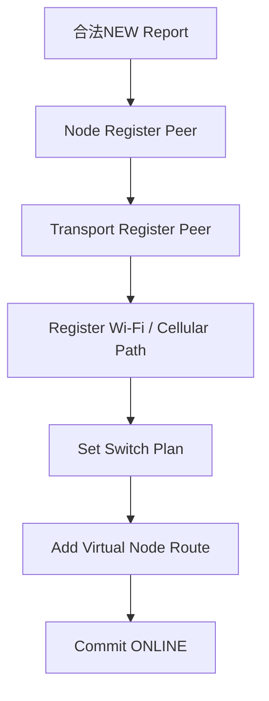

顺序对应：

```text
Node
建立Peer和Path容器

Transport
建立直接Peer协议状态

Path
登记当前可用Wi-Fi / Cellular Endpoint

Switch
形成初始主备链路计划

Route
把远端Node虚拟子网指向linkg0
```

只有这些资源全部建立成功以后，Discovery 才提交 ONLINE；中间失败则回滚已经建立的资源，避免系统出现半上线状态。

同一 Session 的新 Revision 更新时采用“先新后旧”：

```text
先建立 / 更新新Path
        ↓
更新Switch Plan
        ↓
再退役已经失效的旧Path
        ↓
提交新Report
```

因此链路从 Wi-Fi 切换到 Cellular 时，不会先把旧链路拆掉再尝试建立新链路。

如果只是同一个 Path 的 Endpoint 改变，则直接更新 ACTIVE Path，不重新创建整个 Peer。

Peer 出现新 Session 时，还会先 Reset Transport 的 Sequence / RX Window，避免新进程和旧 Session 的传输状态串在一起。

---

## 9. Path 退役保证正在进行的数据安全结束

Peer 或某条 Path 失效时不能直接清空 Path，因为 Scheduler / Link 的异步发送可能已经持有它。

所以 Path 使用独立生命周期：

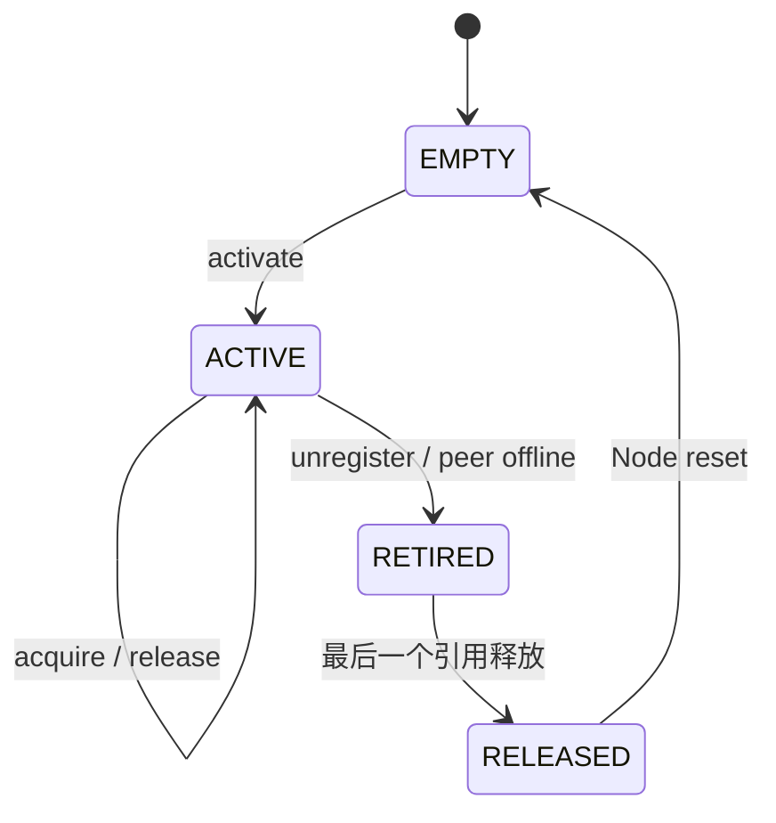

进入 `RETIRED` 后：

```text
禁止新的Path acquire
已有引用继续完成
最后一个release触发回收
```

因此 Peer 下线时做的是：

```text
先从逻辑上停止新发送
        ↓
再退役Path
        ↓
等待已有异步引用自然释放
        ↓
最后回收槽位
```

Node 是 Peer / Path 的生命周期 Owner，Discovery 只发起状态变化，不直接释放可能仍被数据面使用的 Path。

---

## 10. AP Topology：让 STA 知道其他 Node 存在

STA 只和 AP 建立 Direct Peer，但仍需要知道网络中还有哪些其他 STA，否则 Linux 不知道这些远端虚拟子网应该进入 `linkg0`。

因此 AP 在 `AP_SYNC` 中同时发布当前在线 STA 的完整 Topology。

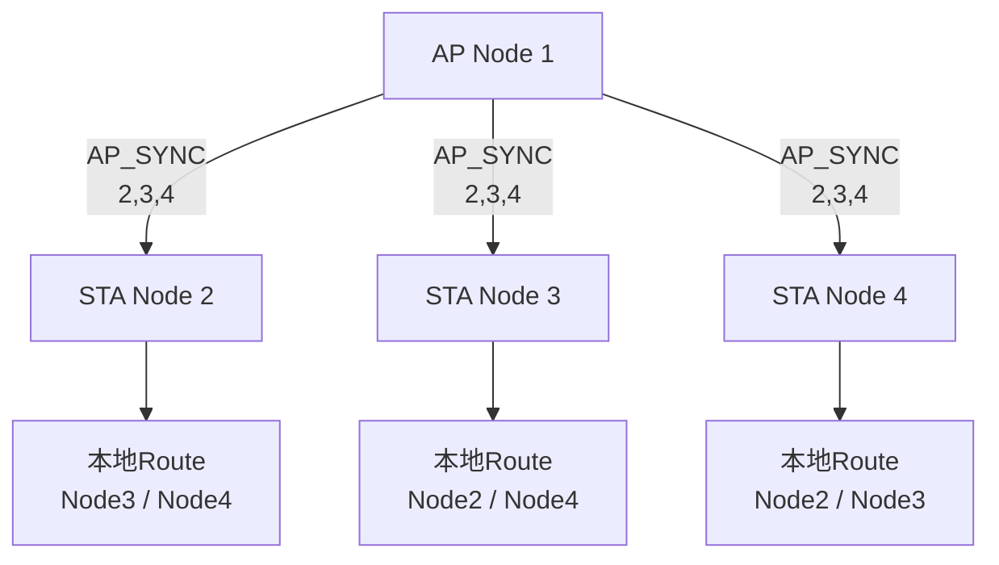

AP 自身状态和 STA 拓扑分别使用两套版本：

```text
Report Revision
表示AP自己的Endpoint状态变化

Topology Revision
表示在线STA集合变化
```

STA 收到 AP_SYNC 后先确认这个 AP Session 仍然是当前在线 Direct Peer，再应用 Topology。

更新路由时采用：

```text
先ADD新Topology中的Route
        ↓
全部成功后
        ↓
再删除旧Topology已经不存在的Route
        ↓
提交新Topology Revision
```

因此同步失败时不会先破坏已经可用的旧路由。

STA 到 STA 的数据仍然经过 AP：

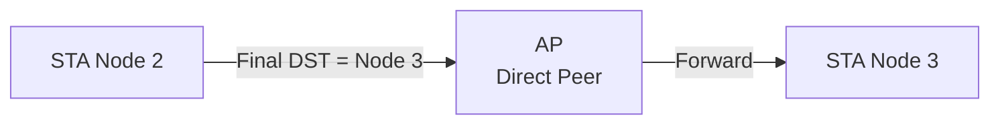

AP_SYNC 给 STA 的是“哪些远端 Node 存在”的路由视图，不是让所有 STA 之间建立全互联 Peer。

---

## 11. Peer 离线和 Discovery 停止

Peer 真正离线以后，运行资源按相反方向撤销：

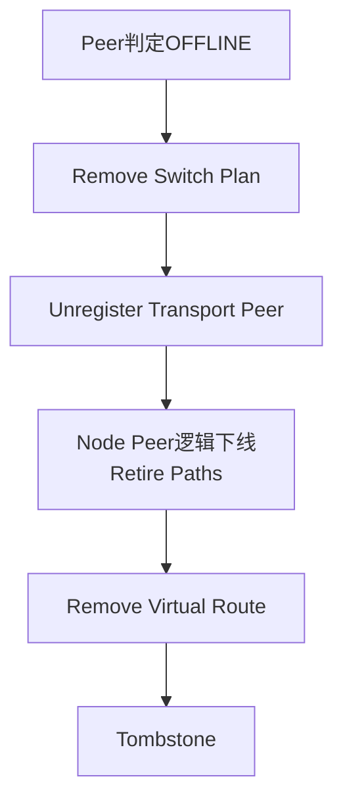

Route 属于 Linux 外部状态，如果删除临时失败，会保留 `route_cleanup_pending`，后续继续重试，而不是丢失清理目标。

正常停止整个 Discovery Session 时还需要先冻结工作线程，再发送最终 `PEER_LEAVE`：

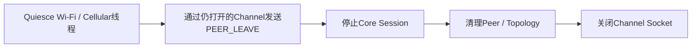

先 Quiesce 的原因是保证最终 Leave 使用的 Session / Revision 不再被后台 Endpoint Refresh 改变；Socket 则必须保留到 Leave 发送完成以后才能关闭。

迟到的旧 `PEER_LEAVE` 只有在 Session 相同且 Revision 不小于当前状态时才会生效，因此不会把已经更新到新状态的 Peer 错误下线。

---

## 12. M03 在整个系统中的位置

M03 最终把“网络里出现的一台设备”转换成一套完整、可运行的数据面状态：


整个模块的职责可以概括为：

```text
Discovery
解决：
设备发现、状态同步、双链路存活、Peer重启、拓扑收敛

Node / Path
解决：
Direct Peer和数据Path的统一表示与安全生命周期
```

最终形成几个明确边界：

```text
设备是否存在
→ Discovery

Peer有哪些数据Path
→ Node

当前应该使用哪条Path
→ Switch / Scheduler

逻辑传输状态
→ Transport

虚拟Node子网如何进入linkg0
→ Route
```

这样 Wi-Fi / 5G 的波动、控制报文丢失、Peer 重启和异步发送都不会各自形成一套独立状态逻辑，而是统一收敛到 Node + Discovery 这一套控制面模型中。
