# M04：Link Manager 与物理链路

源码范围：`core/link/`、`modules/wifi/`、`modules/cellular/`、`platform/wifi/`、`platform/cellular/`、`platform/uart/`。

## 1. 模块定位

LinkG 同时使用 Wi-Fi 和 5G 两种物理链路，两者在地址类型、Socket、网络接口、QoS 和硬件控制方式上都有明显差异。

如果上层直接使用具体链路，Scheduler、Transport 等模块就必须分别处理 Wi-Fi 和 5G，链路选择、发送和接收逻辑都会和具体硬件绑定，多链路调度也很难继续扩展。

因此这一层的核心作用是：

> **把 Wi-Fi 和 5G 统一抽象成标准 Link，对上提供统一的生命周期、发送和接收接口；具体链路差异全部收敛在 Link 实现和 Platform 层。**

整体关系：

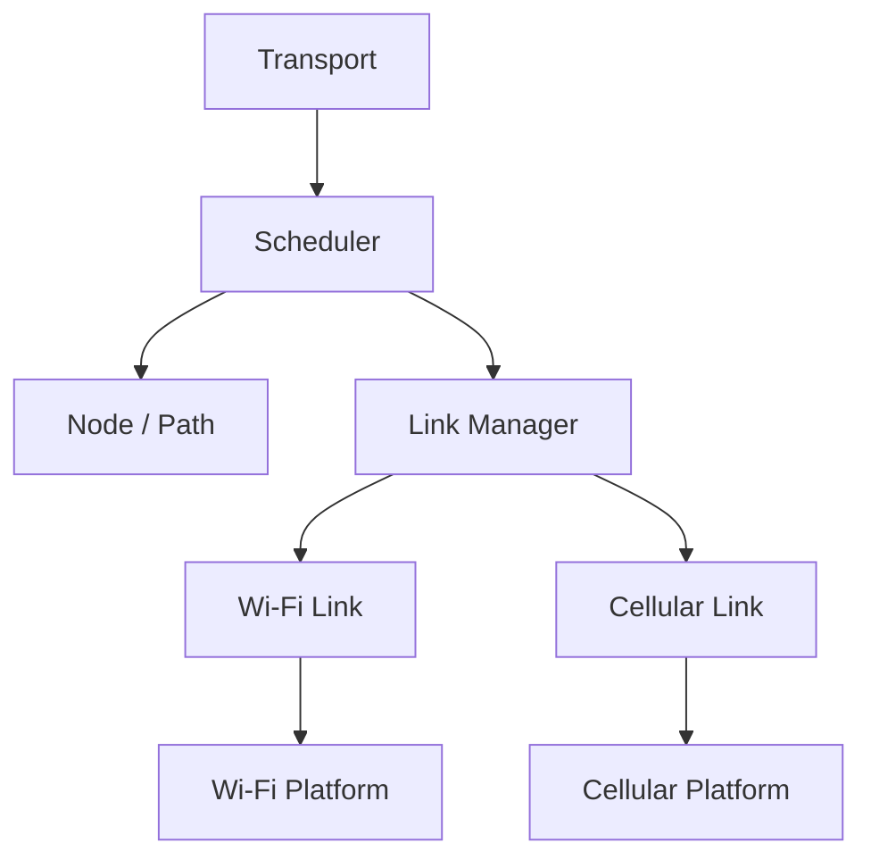

从这一层开始，上层面对的是：

```text
Link ID
Path
Packet
```

而不是：

```text
wlan0 / usb0
IPv4 / IPv6
Wi-Fi Socket / Cellular Socket
```

---

## 2. Link 统一抽象

所有物理链路统一实现：

```text
init / deinit
open / close
get_rx_fd
send_batch
receive_batch
```

Link 基类统一处理公共部分，具体链路只实现自己的差异。

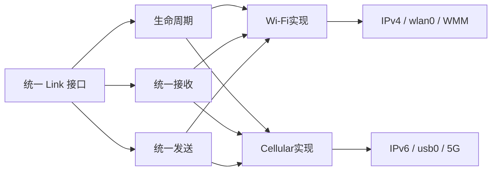

Link 基类负责：

```text
Link状态
RX线程
Packet Pool
批量收发入口
业务分类
生命周期并发保护
```

具体 Wi-Fi / Cellular Link 负责：

```text
Socket如何建立
数据如何发送和接收
Endpoint是什么
QoS如何映射
```

这样 Scheduler 只需要知道：

```text
通过某个 Link
向某个 Path
发送这一批 Packet
```

至于这条 Link 最终是 Wi-Fi 还是 5G，由 Link 内部完成。

---

## 3. Link Manager

Link 解决“链路怎么统一使用”，Link Manager 解决“链路由谁统一管理”。

当前最多存在：

```text
Wi-Fi Link
Cellular Link
```

Link Manager 根据 `paths` 配置创建实际参与 LinkG 数据传输的业务 Link，并统一负责：

```text
创建
分配 Link ID
保存实例
启动
停止
销毁
按 ID / Access 查询
```

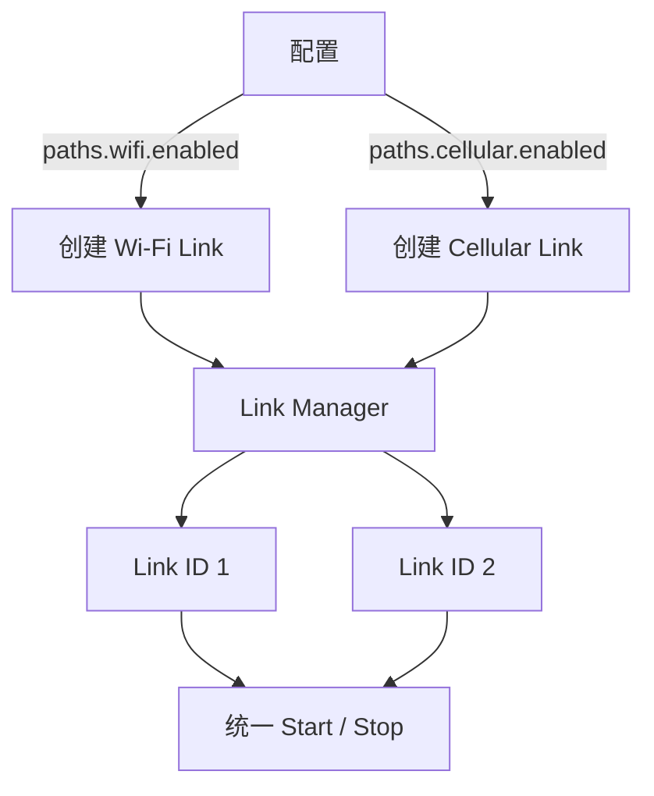

这里同时区分两类配置：

```text
links.xxx.enabled
```

表示底层网络接入能力是否启用；

```text
paths.xxx.enabled
```

表示这项网络能力是否参与 LinkG 数据传输。

例如 5G：

```text
Cellular Access
负责：
Modem运行
usb0建立
网络注册
IPv6准备

        ↓

Cellular Link
负责：
使用已经工作的usb0
承载LinkG业务Packet
```

所以：

> **Network Service 建立网络能力，Link Manager 把这些网络能力转换成 LinkG 可以调度的业务 Link。**

---

## 4. 统一发送模型

发送方向中，每一层只解决自己的问题：

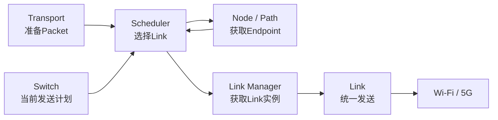

完整流程：

```text
Transport
    ↓
Scheduler读取发送计划
    ↓
确定Link ID
    ↓
Node获取对应Path / Endpoint
    ↓
Link Manager找到Link实例
    ↓
linkg_link_submit_batch()
    ↓
Wi-Fi / Cellular实际发送
```

这里的边界非常明确：

```text
Scheduler
负责：选择哪条Link

Link
负责：这条Link具体怎么发
```

所以 Scheduler 不需要理解 IPv4、IPv6、Socket 和硬件驱动。

---

## 5. 统一接收模型

接收方向同样在 Link 层完成统一。

具体 Wi-Fi 和 Cellular 内部虽然各自有不同 Socket，但对上最终都变成相同的：

```text
linkg_link_rx_item_t
```

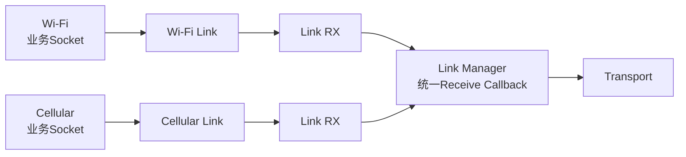

Link RX 统一负责：

```text
等待接收FD
    ↓
从Packet Pool批量申请Packet
    ↓
调用具体Link receive_batch
    ↓
把Packet交给统一Receive Callback
    ↓
Transport处理
    ↓
释放本轮基础Packet引用
```

因此 Transport 只需要注册一次接收入口，不需要分别对接：

```text
Wi-Fi RX
Cellular RX
```

---

## 6. 业务优先级

LinkG 统一物理链路，但不会把所有业务重新混成一种流量。

整个数据面统一使用三种业务类别：

```text
REALTIME
VIDEO
DATA
```

具体链路再把统一业务语义映射到自己的底层 QoS。

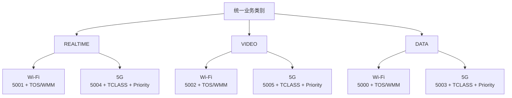

当前 Wi-Fi：

```text
DATA      5000
REALTIME  5001
VIDEO     5002
```

配合 IP TOS / WMM。

当前 Cellular：

```text
DATA      5003
REALTIME  5004
VIDEO     5005
```

配合 IPv6 Traffic Class 和 `SO_PRIORITY`。

这样上层只需要表达：

```text
这是什么业务
```

底层负责决定：

```text
这类业务在当前物理网络里怎么获得优先级
```

---

## 7. Link 生命周期与并发安全

Link 是并发数据面资源。

运行时可能同时存在：

```text
RX Thread
Scheduler TX
Wi-Fi / Cellular TX Queue
Cellular Heartbeat
```

所以 Stop 不能直接关闭 Socket。

当前 Link 状态为：

```text
STOPPED
STARTING
RUNNING
STOPPING
FAILED
```

停止流程：

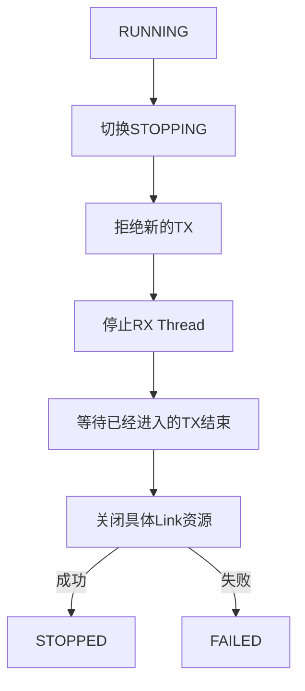

发送进入 Link 时持有：

```text
io_lock Read Lock
```

Stop 关闭底层资源前获取：

```text
io_lock Write Lock
```

所以：

```text
STOPPING
    ↓
新TX停止进入
    ↓
Write Lock等待旧TX全部退出
    ↓
再关闭Socket
```

这样可以保证：

> **底层链路资源被关闭时，已经不存在还在使用这些资源的同步发送。**

这一套生命周期由 Link 基类统一提供，不需要 Wi-Fi 和 Cellular 各实现一套。

---

## 8. Wi-Fi 与 Cellular 的差异边界

统一 Link 之后，两种物理链路仍然保留自己的实现特点。

### Wi-Fi Link

主要负责：

```text
IPv4 UDP
三业务Socket
TOS / WMM
Wi-Fi流控
VIDEO / DATA有界Queue
批量sendmmsg / recvmmsg
```

内部三个 Socket 最终通过 epoll 聚合：

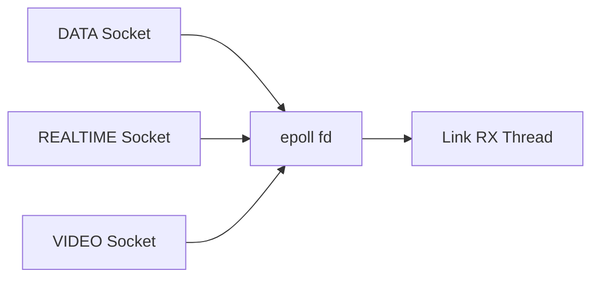

因此 Link 基类只需要等待一个 RX FD。

### Cellular Link

主要负责：

```text
IPv6 UDP
三业务Socket
IPv6 Traffic Class
SO_PRIORITY
Cellular TX Queue
usb0接口约束
业务端口Heartbeat
```

内部同样把三个业务 Socket 聚合后交给统一 Link RX。

---

## 9. Cellular 业务 Heartbeat

5G 和 Wi-Fi 的一个重要区别是公网 UDP 状态维护。

Cellular 使用三个真实业务 Socket：

```text
5003 DATA
5004 REALTIME
5005 VIDEO
```

为了保证长时间无业务流量时这些 UDP 通道仍然保持可达，Cellular Link 每 6 秒通过三个真实业务 Socket 向当前 Cellular Peer 发送一轮小型 Heartbeat。

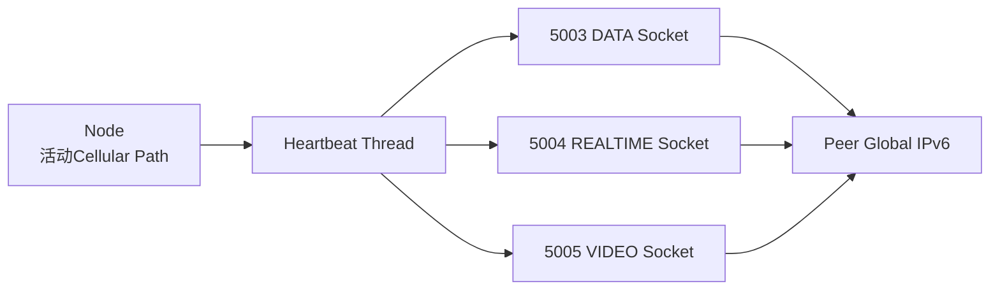

这里直接复用真实业务 Socket，而不是单独开一个 Heartbeat Socket。

原因是单独 Heartbeat Socket 只能维护自己的 UDP 状态，不能代表：

```text
5003
5004
5005
```

三个真实业务通道仍然可用。

它和 M03 Discovery Heartbeat 的职责也不同：

```text
Discovery
→ 维护Peer控制面存活

Cellular Link Heartbeat
→ 维护实际业务UDP通道状态
```

---

## 10. Platform 适配

LinkG 业务层不能和具体硬件型号绑定。

因此底层进一步拆成：

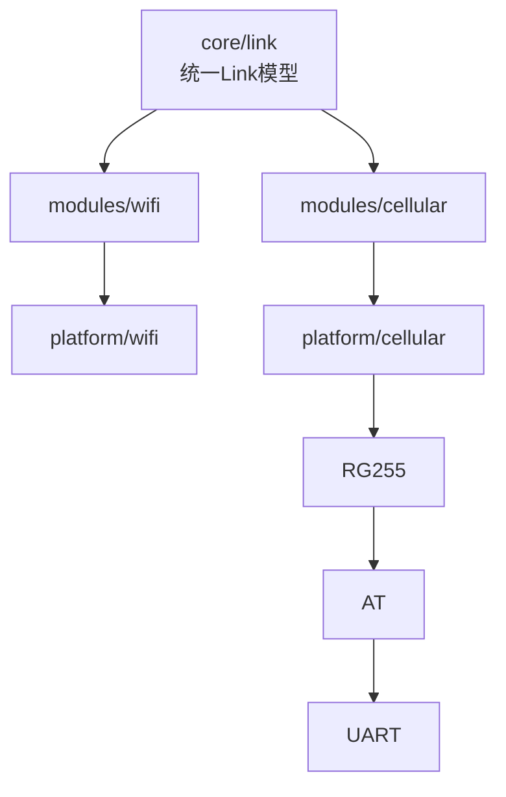

对应职责：

```text
core/link
定义“什么是一条Link”

modules/wifi / cellular
实现LinkG需要的具体网络能力

platform/*
适配具体系统和硬件

platform/cellular/rg255
处理RG255具体能力
```

所以更换 5G Modem 时，不应该让：

```text
Scheduler
Transport
Node
Link基类
```

跟着变化。

硬件差异应尽量限制在 Platform 层。

---

## 11. M04 在整个系统中的位置

M04 最终形成下面这条边界：

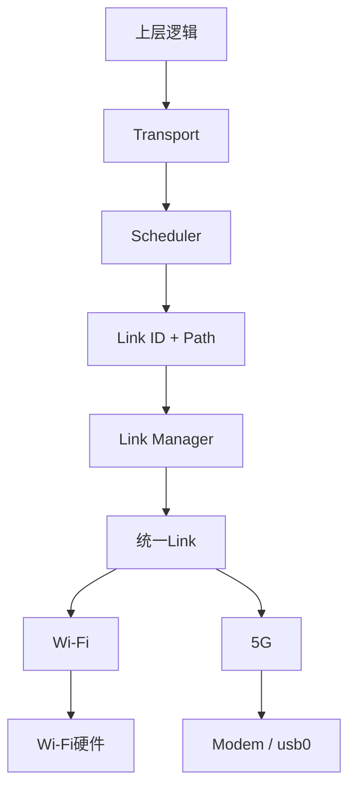

Link 以上统一处理：

```text
Link ID
Path
Packet
REALTIME / VIDEO / DATA
```

Link 以下处理：

```text
Wi-Fi / 5G
IPv4 / IPv6
Socket
QoS
流控
Heartbeat
Driver
Modem
AT / UART
```

因此整个模块的职责可以概括为：

> **Link 统一不同物理链路的使用方式，Link Manager 统一管理链路实例和生命周期，Path 描述 Peer 在某条 Link 上的具体下一跳。**

最终 Scheduler 只负责：

```text
选择哪条Link
```

而不负责：

```text
这条Link具体怎么工作
```

Transport 只负责：

```text
逻辑传输协议
```

而不需要分别处理：

```text
Wi-Fi怎么收发
5G怎么收发
```

这就是 M04 在 LinkG 多链路架构中的核心作用。
