# M05：Transport 传输协议

源码范围：`core/transport/`、`include/linkg/core/transport/`。

## 1. 模块定位

Transport 位于逻辑数据面和物理链路之间。

它需要解决的核心问题不是“做一套可靠传输协议”，而是让一个 LinkG Packet 能够在 Wi-Fi / 5G 多链路环境中明确表达：

```text
这个包从哪个Node来
最终要到哪个Node
当前这一跳是否已经接收过
超过物理链路MTU时如何分片
到达本机后交给哪类业务
到达AP但目标不是AP时如何继续转发
```

整体位置如下：

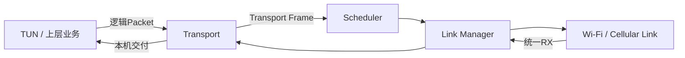

Transport 向上只处理逻辑 Node 和业务类型，向下只把已经封装好的 Transport Frame 交给 Scheduler。

它不负责：

```text
选择Wi-Fi还是5G           → Scheduler
维护Link生命周期          → Link Manager
发现Peer和Path            → Discovery / Node
维护Linux Route           → Route
NAT                       → NAT
物理链路QoS和发送Queue    → Wi-Fi / Cellular Link
```

因此 M05 的最终目标是把 Transport 收敛成一个尽可能薄的协议层：

> **加头、逐跳Sequence、必要分片/重组、本机交付、AP转发。**

---

## 2. 为什么需要独立的 Transport Header

Link 层只能告诉系统：

```text
这一帧从哪个物理Peer收到
```

但 LinkG 还需要知道：

```text
原始发送节点是谁
最终目标节点是谁
```

尤其在 STA → AP → STA 的场景中，物理下一跳和最终目标不是同一个 Node。

例如 Node 2 访问 Node 3：

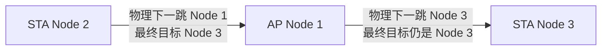

因此 Transport Header 同时保存：

```text
source_node_id       原始发送Node

destination_node_id  最终目标Node

sequence             当前物理一跳序列号
```

这样 AP 转发时不需要重新封装业务 Packet，也不会丢失原始源节点和最终目标节点。

---

## 3. Wire Header 设计

当前 Transport 基础头固定为 16 Byte：

```text
┌──────────────┬─────────┬──────┬───────┬──────────┬─────┬─────┬──────────┐
│ Magic 4B     │ Ver 1B  │Type1B│Flags2B│Sequence4B│Src1B│Dst1B│Reserved2B│
└──────────────┴─────────┴──────┴───────┴──────────┴─────┴─────┴──────────┘
                              16 Byte
```

当前定义：

```text
Magic   = LKG2
Version = 1
```

基础字段职责很少：

| 字段 | 作用 |
|---|---|
| `magic / version` | 判断是否为当前 LinkG Transport 协议 |
| `type` | 区分 USER_DATA 和其他逻辑消息类型 |
| `flags` | 当前主要表示是否为 Transport Fragment |
| `sequence` | 当前物理一跳的帧序列号 |
| `source_node_id` | 原始发送节点 |
| `destination_node_id` | 最终目标节点 |
| `reserved` | 保留，当前必须为 0 |

Transport Header 不携带：

```text
Wi-Fi / 5G类型
物理Endpoint
Scheduler策略
RTT
链路质量
队列状态
统计数据
```

这些都不属于逻辑传输协议本身。

---

## 4. 为什么 Transport Frame 最大固定为 1452 Byte

Wi-Fi 和 5G 的 IP Header 不同：

```text
Wi-Fi IPv4
1500 MTU - 20B IPv4 - 8B UDP = 1472B UDP Payload

Cellular IPv6
1500 MTU - 40B IPv6 - 8B UDP = 1452B UDP Payload
```

如果 Transport 按不同 Link 使用不同帧尺寸，就会出现：

```text
同一个逻辑Packet
走Wi-Fi时一种分片方式
走5G时另一种分片方式
```

这会让 Scheduler 的主备、切换和冗余发送都变复杂。

所以 Transport 统一采用两条链路都能直接承载的最小上限：

```text
Transport Frame Max = 1452 Byte
```

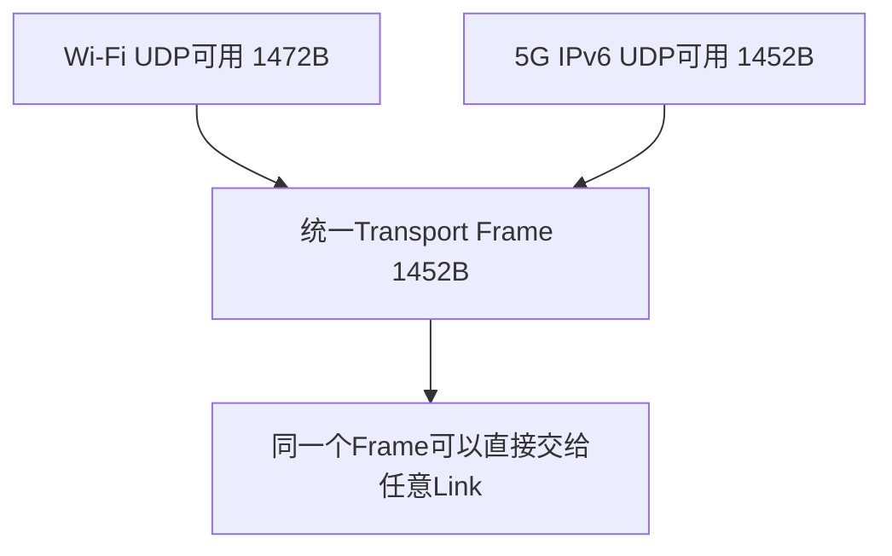

这使 Transport Frame 与具体物理链路解耦，同一个 Frame 可以由 Scheduler 选择 Wi-Fi、5G，或者同时冗余发送。

---

## 5. 分片设计

基础头为 16 Byte，因此普通 Transport Frame 最大业务载荷为：

```text
1452 - 16 = 1436 Byte
```

但 TUN 原始 Packet 最大为 1500 Byte，所以大包必须由 Transport 自己处理。

当前增加一个 8 Byte Fragment Header：

```text
┌──────────────┬──────────────────┬─────────────────┐
│ packet_id 4B │ fragment_offset2B│ packet_length2B │
└──────────────┴──────────────────┴─────────────────┘
                         8 Byte
```

分片 Frame 的实际载荷上限变成：

```text
1452 - 16 - 8 = 1428 Byte
```

由于 LinkG 原始 Packet 最大只有 1500 Byte，所以协议固定只需要两片：

```text
1500 Byte 原始Packet

第一片：1428B Payload + 24B Header = 1452B
第二片：  72B Payload + 24B Header =   96B
```

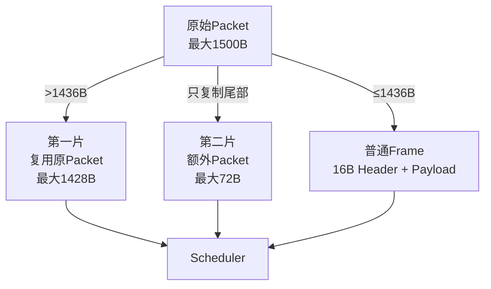

这里没有做通用 N 片分片协议，而是利用当前固定 1500 MTU 把协议约束成最多两片。

这样可以减少：

```text
复杂Fragment List
动态分片数组
大规模重组状态
每包多次内存申请
```

发送时第一片继续复用原 Packet，只有第二片从 Packet Pool 申请一个额外 Packet，并只复制必须拆出的尾部数据。

---

## 6. Sequence 与 Packet ID 的职责不同

Transport 里存在两个编号：

```text
sequence
packet_id
```

它们解决的是两个完全不同的问题。

### Sequence：当前一跳的Frame编号

每个 Direct Peer 分别维护自己的发送 Sequence。

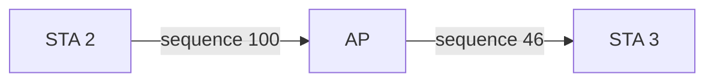

AP 转发时会重新分配下一跳 Sequence。

因此 Sequence 是：

> **Hop-by-Hop 序列号。**

它不要求从源 STA 一直保持到最终 STA。

### Packet ID：两片属于哪个原始Packet

只有分片包才使用 `packet_id`。

两片具有：

```text
相同 source_node_id
相同 destination_node_id
相同 type
相同 packet_id
不同 fragment_offset
不同 sequence
```

所以 `packet_id` 用于目的端重组，而 `sequence` 用于当前一跳的重复帧识别。

---

## 7. 为什么还需要接收 Sequence Window

Scheduler 支持冗余发送：

```text
同一个Transport Frame
        ↓
Wi-Fi发送一份
5G发送一份
```

接收端可能收到两个内容完全相同的 Frame。

同时 Wi-Fi 和 5G 延迟不同，Frame 也可能发生有限乱序。

因此每个 Direct Peer 当前维护一个 512 bit 接收窗口：

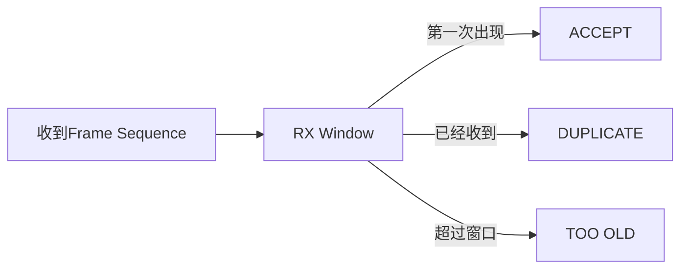

这个窗口只做：

```text
去重
有限乱序接受
```

它不缓存 Packet，也不负责重新排序，更不实现 ACK / Retransmission。

因此 Transport 仍然是轻量无连接协议层，而不是可靠传输层。

Peer 进入新的 Discovery Session 时，M03 会调用 Transport Reset，把当前 Peer 的发送 Sequence 和接收 Window 清零，避免新旧运行会话串在一起。

---

## 8. 接收后只有两条主路径

Transport 从 Link Manager 注册统一 RX Callback，收到 Frame 后最终只需要判断：

```text
最终目标是不是本机？
```

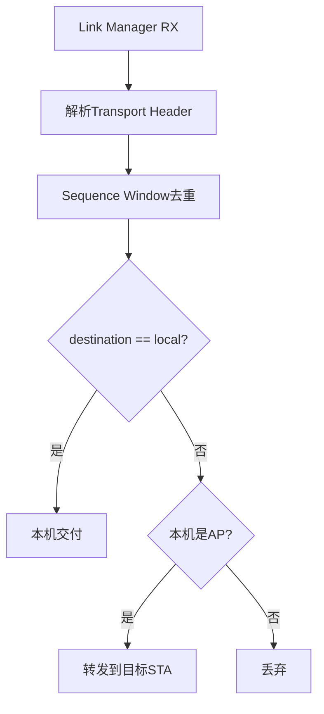

### 本机目标

普通 Frame：

```text
原地 Pull 16B Header
        ↓
直接交给对应Type Handler
```

分片 Frame：

```text
进入Reassembly
        ↓
两片完整
        ↓
恢复原始Packet
        ↓
交给Type Handler
```

### AP 非本机目标

AP 不把业务 Payload 交给本机 Handler，而是继续送往最终目标 STA。

STA 不承担其他 Node 的中继职责，所以 STA 收到非本机目标 Frame 不继续转发。

---

## 9. AP 转发为什么只改 Sequence

AP 转发的目标是尽量保持原始 Transport Frame 不变。

转发前后：

```text
保持不变：
source_node_id
destination_node_id
type
packet_id
fragment_offset
packet_length
Payload

只修改：
sequence
```

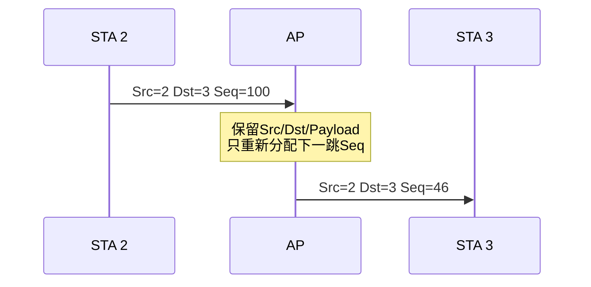

这样做有两个好处：

```text
AP不需要重新生成业务Packet
最终节点仍然能看到真实Source Node
```

对于分片包，AP 也不执行完整重组再重新分片。

当前做法是先等待 FIRST / LAST 两片配对完整，再保持原来的两片边界一起提交下一跳：

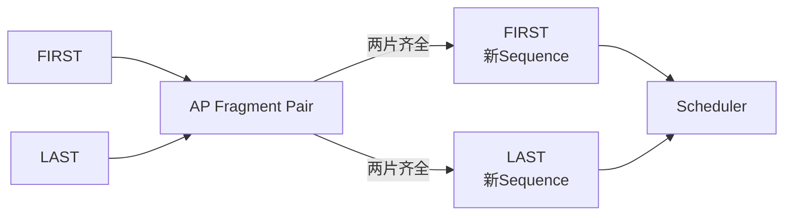

这样避免 AP 做一次：

```text
重组1500B
→ 再分片
```

也避免只转发其中一片、另一片因为调度边界丢失后让目的端永远无法重组。

---

## 10. 重组保持固定容量

目的端 Reassembly 使用固定容量缓存，不运行期无限扩容。

重组键由：

```text
source_node_id
destination_node_id
type
packet_id
```

共同确定。

两片可以乱序到达：

```text
FIRST先到
→ 保存FIRST
→ LAST到达后追加

LAST先到
→ 暂存LAST
→ FIRST到达后完成
```

最终继续复用 FIRST Packet 作为完整 Packet，只把尾片 Payload 追加进去。

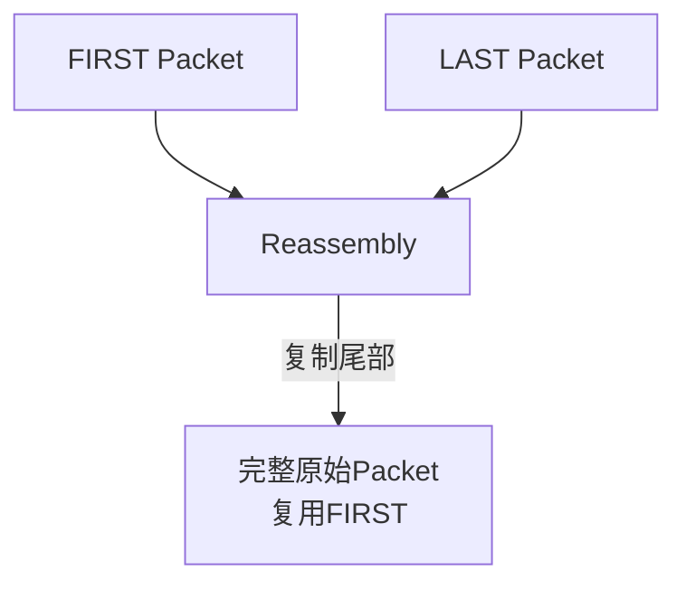

因此重组也没有额外申请第三个 1500 Byte Packet。

未完成的重组只保留很短时间，超时后直接释放，防止丢失一片时长期占用 Packet Pool。

---

## 11. Type 只负责逻辑复用，不把控制逻辑塞进 Transport

当前 Transport Wire 保留以下 Type：

```text
USER_DATA
CONTROL
STATISTICS
PING
SWITCH
```

Type 的作用只是让同一套 Transport Wire 可以承载不同逻辑消息。

Transport 自身不应该解释这些 Payload 的业务含义，而是通过注册 Handler 进行本机交付：

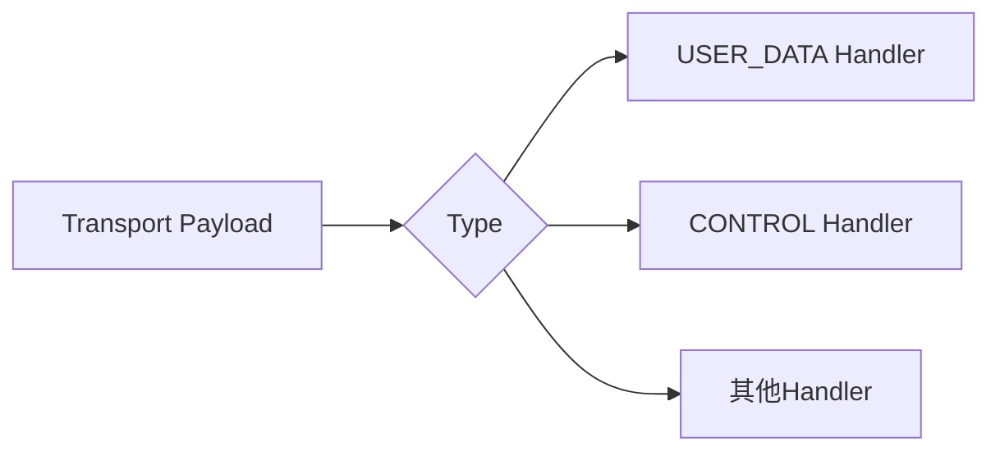

`USER_DATA` 承载正常 TUN 用户数据。

其他 Type 即使后续使用，也应该由对应上层模块处理，而不是不断把控制状态机加入 Transport Core。

这样可以保持：

> **Transport 负责封装和交付，业务模块负责解释 Payload。**

---

## 12. Transport 与 Scheduler / Link Manager 的边界

Transport 不直接选择和操作具体物理 Link。

发送方向：

```text
Transport
    ↓
填写Header / Sequence / Fragment
    ↓
确定当前Direct Peer
    ↓
Scheduler
    ↓
选择Wi-Fi / 5G / 冗余
```

接收方向：

```text
Wi-Fi / Cellular Link
    ↓
Link Manager统一RX
    ↓
Transport
```

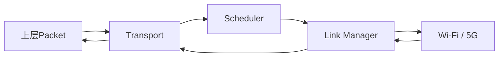

因此 Transport 只知道：

```text
最终目标Node
当前Direct Peer
Scheduler Policy
```

但它不决定：

```text
当前主链路是哪条
Wi-Fi是否拥塞
5G RTT多少
具体Path Endpoint
Socket怎么发送
```

这些继续留在 Scheduler、Node / Path 和 Link 层。

---

## 13. 最小 Transport 边界

当前 Transport 已经有完整协议能力，但实现中还包含较多统计和快速路径状态维护。

目前 Peer 状态中除了协议必须的：

```text
tx_sequence
rx_window
```

还维护：

```text
各Type TX / RX字节和包数
失败统计
重复包统计
last_tx_ms
last_rx_ms
全局非法Frame统计
AP不完整分片统计
```

这些统计对调试有价值，但不是 Transport 正确转发一个 Packet 的必要条件。

结合当前性能排查，M05 的实现重点是把 Transport 收缩到下面这个最小核心：

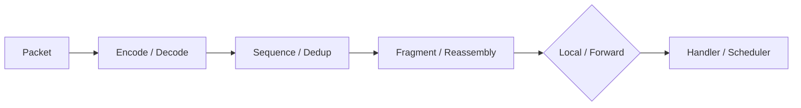

快速路径必须保留：

```text
Wire Encode / Decode
source / destination Node
Direct Peer解析
逐跳Sequence
冗余去重Window
固定两片Fragment
目的端Reassembly
AP Forward
Type Delivery
Scheduler提交
```

快速路径不应该继续承担：

```text
详细累计统计
last_tx / last_rx时间维护
重复的链路质量统计
复杂调试计数
与Transport无关的控制状态
```

Path 本身已经有物理链路 TX / RX 统计，后续性能统计应尽量放到专门 Statistics 模块统一采样，而不是每个 Transport Frame 都在核心路径里更新多组计数和时间。

这次收缩不是修改 Wire 协议，而是：

> **保持线上协议和分片行为不变，只减少 Transport 快速路径内部工作量。**

---

## 14. 性能基线

Transport 性能不能只测一个 Wire Encode 函数，因为真正的开销来自完整收发流水线。

本阶段主要比较精简前后的端到端数据：

```text
大包吞吐
小包PPS
CPU占用
Transport锁竞争
单包与Batch差异
Wi-Fi单链路
5G单链路
双链路冗余
STA → AP → STA转发
```

重点观察当前几个同步点：

```text
g_transport.lock
reassembly.lock
forward_pairs.lock
```

其中：

```text
正常不分片Packet
```

应该尽量只经过协议解析、必要的 Peer / Sequence 状态和一次 Scheduler 提交。

分片锁只应该影响真正的分片包，AP Pair Lock 只应该影响真正需要中继的分片包。

性能判断仍以实际 TUN → Transport → Scheduler → Link 端到端结果为准，不给 Transport 单独设一个脱离系统的数据指标。

---

## 15. M05 验证重点

M05 的验证只围绕协议边界和性能关键路径展开：

| 场景 | 必须保证 |
|---|---|
| 普通包直达 | 16B Header原地Push/Pull，Payload不复制 |
| 1500B大包 | 固定两片，目的端正确恢复1500B |
| 冗余发送 | 两条Link重复Frame只交付一次 |
| STA → AP → STA | AP保持原始Src/Dst，只更新下一跳Sequence |
| 分片经AP转发 | AP不重组再分片，两片完整转发 |
| Peer重启 | Sequence / RX Window重置，不和旧Session串状态 |
| Transport精简 | Wire行为不变，端到端吞吐和CPU有可比较结果 |

如果最小化以后性能明显改善，就说明原 Transport 快速路径确实承担了过多非协议工作；如果没有明显变化，再继续向 Scheduler / Link 或系统调用路径定位，不在 Transport 内继续盲目删功能。

---

## 16. 本模块结论

M05 最终把 LinkG 的 Transport 定义成一层很薄的逻辑传输协议：

```text
逻辑Node寻址
    +
固定16B基础头
    +
逐跳Sequence
    +
冗余去重
    +
最多两片Fragment
    +
目的端Reassembly
    +
AP透明中继
    +
Type交付
```

整体数据路径为：


Transport 解决的是 **一个逻辑 Packet 如何在 LinkG 节点之间正确传递**；物理链路怎么选、链路质量怎么样、Socket 怎么工作都继续留在它下面。

本阶段最重要的实现方向不是继续扩充 Transport，而是把协议必须能力保留下来，把统计和非必要状态从快速路径移开，最终形成稳定、简单、可测的最小传输层。
