# M06：Scheduler 与 Route 路径调度

源码范围：`core/scheduler/`、`core/route/`。

> 本章会引用 Node / Path、Switch 和 Link Manager 的状态，但只说明 Scheduler 与 Route 如何使用这些状态，不展开它们自己的内部实现。

## 1. 模块定位

M06 实际解决的是两个不同层次的“往哪里走”：

```text
Linux Route
解决：一个虚拟Node的数据是否应该进入LinkG数据面

Scheduler
解决：数据进入LinkG以后，这一次实际通过哪条物理Link发送
```

这两个动作不能混在一起。

例如用户访问：

```text
172.28.3.100
```

Linux 首先只需要知道：

```text
172.28.3.0/24
应该进入 linkg0
```

Packet 进入 LinkG 以后，Scheduler 才处理：

```text
下一跳是谁？
走Wi-Fi还是5G？
是否双链路冗余？
是否强制指定某条Link？
```

整体关系如下：

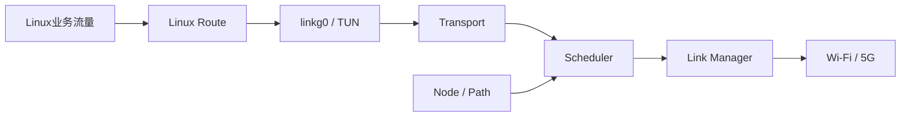

因此这一层的核心边界是：

> **Route 负责把虚拟节点流量送进 LinkG；Scheduler 负责在 LinkG 内选择实际物理发送路径。**

---

## 2. Route：让虚拟 Node 真正进入 LinkG

LinkG 对外使用的是统一虚拟地址空间：

```text
Node 1 → 172.28.1.0/24
Node 2 → 172.28.2.0/24
Node 3 → 172.28.3.0/24
...
```

Linux 本身并不知道这些远端虚拟子网应该由 LinkG 处理，所以 Route 模块负责把对应 `/24` 路由安装到 `linkg0`。

例如 Node 1 已知 Node 3 在线：

```text
172.28.3.0/24 → linkg0
```


这里的 Route 不决定 Wi-Fi 或 5G，也不保存 Peer Endpoint。

它只完成 Linux 网络栈和 LinkG 用户态数据面的接入。

---

## 3. Route 生命周期跟随节点状态

Route 自身启动时会获取 `linkg0` 的接口索引、建立持久化 `NETLINK_ROUTE` Socket，并安装本节点对应的虚拟子网路由。

远端节点路由则由 M03 的 Discovery 状态驱动：

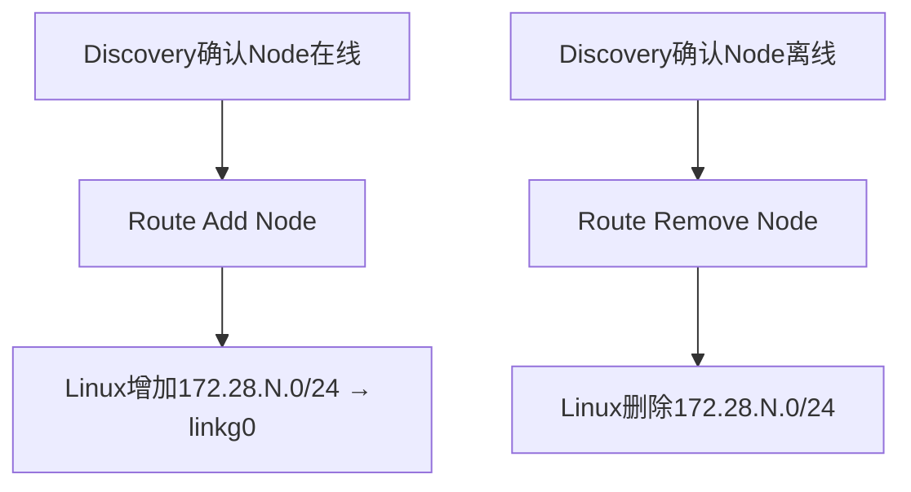

AP 和 STA 的路由来源略有不同：

```text
AP
直接Peer就是各STA
Peer上线 / 下线直接增加或删除对应Node Route

STA
Direct Peer只有AP
其他STA来自AP_SYNC Topology
根据AP完整拓扑增加或删除远端Node Route
```

所以 Route 本身不维护第二套 Peer 表。

> **谁在线由 Discovery 决定，Route 只负责把这个事实同步到 Linux。**

---

## 4. 为什么 Route 使用 Netlink，而不是 shell 命令

Route 运行期间可能随着 Peer 上下线持续变化，因此不能把核心路由管理建立在：

```text
system("ip route ...")
```

这类外部命令上。

当前直接使用持久化：

```text
NETLINK_ROUTE
```

每次修改都：

```text
构造RTM_NEWROUTE / RTM_DELROUTE
        ↓
发送Netlink请求
        ↓
等待对应Sequence ACK
        ↓
确认内核已经接受结果
```

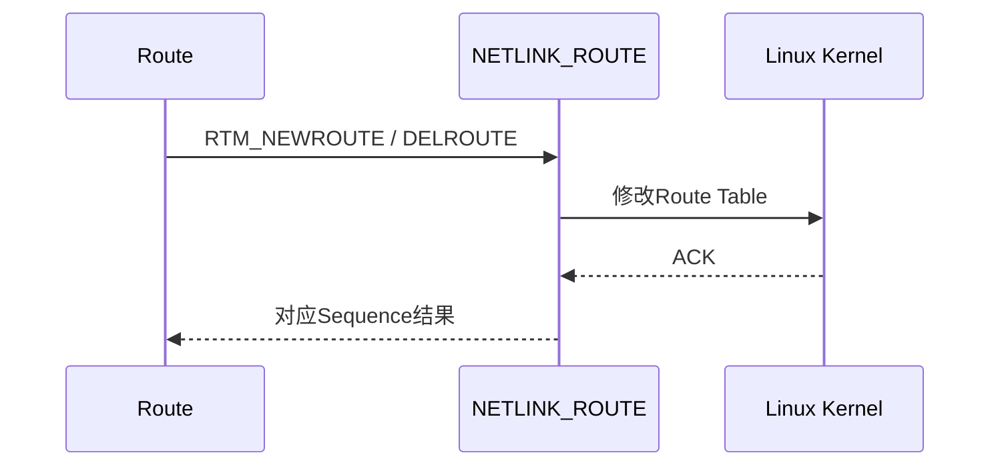

添加使用 `CREATE + REPLACE`，因此同一个 Node 重复 Add 可以直接收敛到目标状态。

删除时如果路由本来已经不存在，同样视为已经达到目标状态。

这种幂等性很重要，因为 Discovery 的完整状态同步和清理重试都可能重复执行 Route 操作。

---

## 5. Scheduler：把“发送计划”变成一次真实发送

Packet 进入 Scheduler 时，Transport 已经确定：

```text
当前物理下一跳Node
```

Scheduler 不重新计算最终目标，也不自己维护 Peer。

它需要把下面三类状态组合起来：

```text
Switch
当前Peer应该使用哪些Link

Node / Path
这个Peer在指定Link上的Endpoint是什么

Link Manager
本机指定Link实例在哪里
```

最后完成一次真实发送：

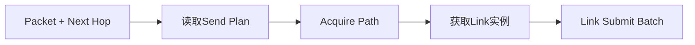

Scheduler 本身保持无队列、无工作线程。

它是同步调度执行层，不再建立一套新的异步发送系统。

---

## 6. Path 为什么是 Scheduler 和 Link 之间的关键对象

`link_id` 只能说明：

```text
我要走哪条本地物理Link
```

但实际发送还需要知道：

```text
这个Peer在该Link上的下一跳Endpoint
```

所以 Scheduler 最终使用的是：

```text
Link ID
+
Path
+
Endpoint
```

例如：

```text
Node 2

Wi-Fi Path
├── Link ID = Wi-Fi
└── Endpoint = 11.21.191.2:5000

Cellular Path
├── Link ID = Cellular
└── Endpoint = [Global IPv6]:5003
```

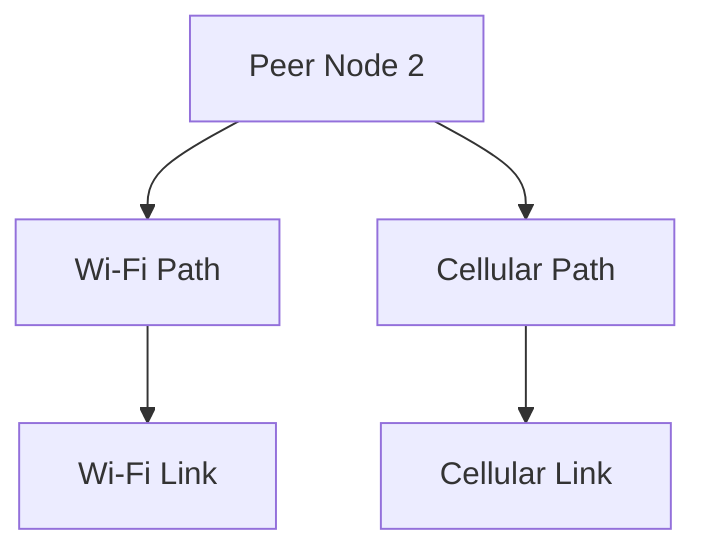

Scheduler 获取 Path 时持有一个引用和一份 Endpoint 快照，完成同步 `Link Submit` 后立即释放 Path 引用。

如果底层 Link 需要异步保存 Packet 或 Path，则由具体 Link 自己增加引用。

这样 Scheduler 不需要知道 Path 后面可能正在发生的退役过程。

---

## 7. 三种调度策略

当前 Scheduler 只保留三种明确的发送策略：

```text
DEFAULT
REDUNDANT
SPECIFIED
```

### DEFAULT

使用当前 Send Plan 的 Primary Link：

```text
Packet
  ↓
Switch Plan
  ↓
Primary Link
  ↓
对应Path
  ↓
发送
```

这是普通数据面的默认路径。

### REDUNDANT

如果当前计划同时存在 Primary 和 Secondary，则同一个 Transport Frame 向两条 Link 都提交：

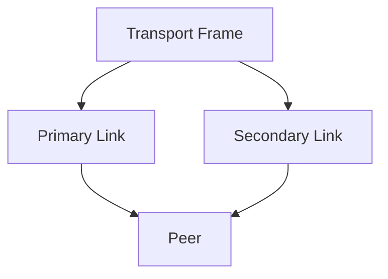

任意一条 Link 成功接受当前 Packet，这个 Packet 的调度结果就视为成功。

接收端的重复 Frame 由 M05 Transport Sequence Window 去重，因此 Scheduler 不需要自己解决重复交付。

### SPECIFIED

直接绕过当前 Send Plan，只走调用方指定的 `link_id`。

主要用于需要明确控制物理链路的场景和链路专项测试。

---

## 8. Send Plan 和 Scheduler 的职责分开

Scheduler 不负责长期维护：

```text
谁是Primary
谁是Secondary
当前是SINGLE还是REDUNDANT
```

这些状态通过 `linkg_send_plan_t` 提供：

```text
mode
primary_link_id
secondary_link_id
```

Scheduler 每次只读取当前计划并执行。


这样可以把：

```text
“计划应该是什么”
```

和：

```text
“按照这个计划怎么把Packet发出去”
```

拆成两个问题。

M06 的 Scheduler 只负责后者，发送计划的生成和动态更新在对应的 Switch / 状态管理模块中处理。

---

## 9. 当前故障切换边界

当前 DEFAULT 调度不是：

```text
Primary发送失败
      ↓
Scheduler立即重试Secondary
```

`SINGLE` 模式下，DEFAULT 只提交当前 Primary。

如果 Wi-Fi Path 消失，M03 Discovery 会根据新的 Peer Report 更新 Path 和 Send Plan，例如：

```text
原计划
Primary   = Wi-Fi
Secondary = Cellular

Wi-Fi Path失效
        ↓
更新计划
        ↓
Primary = Cellular
```

后续 Packet 自然开始走 Cellular。

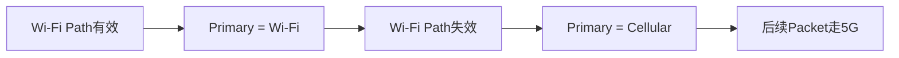

所以当前有两种不同的可靠性手段：

```text
持续故障 / Path变化
→ 更新Send Plan完成切换

关键Packet需要双路发送
→ REDUNDANT同时走Primary + Secondary
```

Scheduler 当前不在一次普通发送失败后自行临时改写计划，也不把瞬时发送错误升级成全局链路状态。

这个边界避免 Scheduler 同时承担：

```text
发送执行
故障检测
链路评分
状态机
计划管理
```

---

## 10. QoS 和路径调度分开

Scheduler 负责的是：

```text
哪条Link
```

它当前不根据：

```text
REALTIME
VIDEO
DATA
```

重新选择不同的 Path。

业务类别已经保存在 Packet Flag 中，Packet 到达 Link 基类以后再映射为：

```text
REALTIME
VIDEO
DATA
```

并固定按照：

```text
REALTIME
  ↓
VIDEO
  ↓
DATA
```

顺序提交给具体 Link。

具体 Wi-Fi / 5G 再映射到自己的 TOS、Traffic Class、Socket Priority 和业务 Socket。

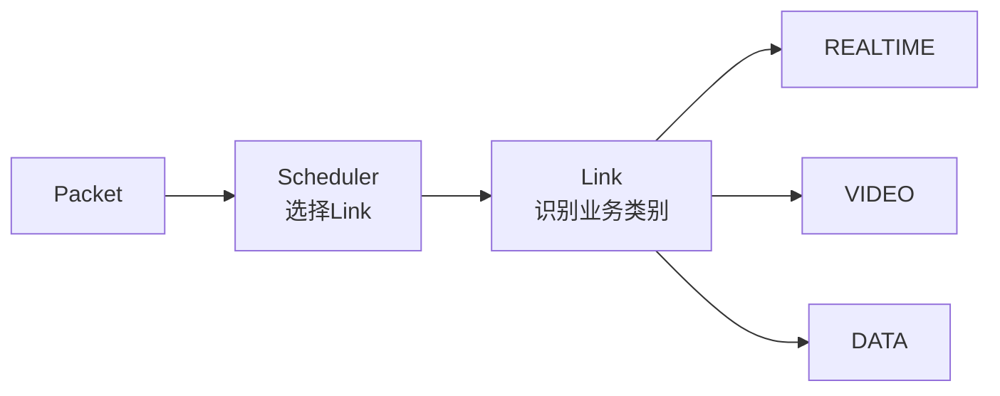

因此：

> **Scheduler 解决路径选择，Link 解决链路内部 QoS。**

这两层不互相侵入。

---

## 11. Batch 调度

Scheduler 的数据路径按照 Batch 设计，单个内部 Chunk 当前最多 32 个 Packet。

进入 Scheduler 后首先按 `next_hop_node_id` 分组：

```text
Batch
├── Peer 2 Packet × N
├── Peer 3 Packet × M
└── Peer 4 Packet × K
```

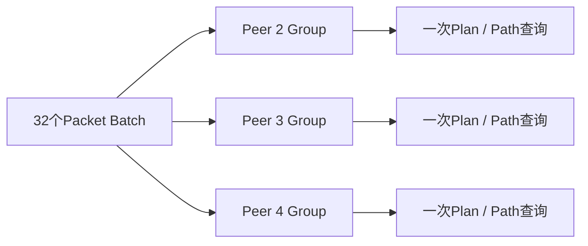

同一个 Peer Group：

```text
Send Plan只读取一次
每条实际发送Link只Acquire一次Path
Endpoint只复制一次
随后整批交给Link Submit Batch
```

这样 Scheduler 不需要为同一批中的每一个 Packet 重复：

```text
查Switch
查Link
Acquire Path
复制Endpoint
```

Scheduler 自己也不做 Packet memcpy，只传递 Packet 指针。

---

## 12. 调度失败的处理原则

Scheduler 执行过程中主要面对几类失败：

```text
没有Send Plan
→ 当前Peer不可调度

Send Mode = NONE
→ -ENETDOWN

Link不存在或未RUNNING
→ 当前Link不可发送

Path不存在或已经RETIRED
→ 当前Peer在这条Link上不可达

具体Link拒绝Packet
→ 保留具体发送结果
```

REDUNDANT 模式下：

```text
Primary成功，Secondary失败 → 成功
Primary失败，Secondary成功 → 成功
两条都失败               → 失败
```

DEFAULT 模式不自动把一次 Link Submit 错误解释成“这条链路已经坏了”。

链路是否应该退出计划，需要由更高层的 Path / Link 状态判断来决定。

---

## 13. Route 与 Scheduler 为什么不能合并

虽然两者都和“路由”有关，但处理的对象完全不同。

```text
Route
对象：IPv4虚拟子网
作用位置：Linux Kernel
结果：Packet是否进入linkg0

Scheduler
对象：Transport Packet / Direct Peer
作用位置：LinkG用户态
结果：Packet使用哪条物理Link
```

一条完整路径实际经历两次选择：

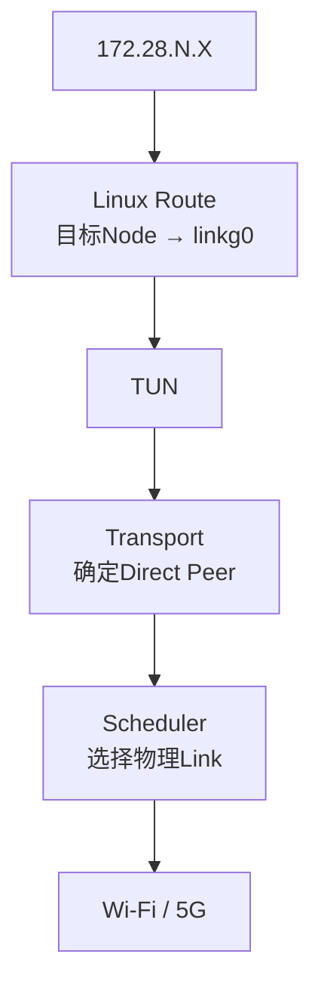

这种拆分让 Linux 网络栈完全不需要知道 Wi-Fi / 5G 调度策略，而 Scheduler 也不需要管理 Linux Route Table。

---

## 14. 性能边界

Scheduler 当前保持为同步、无队列、无独立线程的轻量层。

正常发送主要执行：

```text
按Peer分组
读取Send Plan
获取Link
Acquire Path
Link Submit Batch
Release Path
```

没有：

```text
Packet复制
动态业务队列
每包线程切换
复杂链路评分计算
```

这一层的性能重点主要是避免重复状态查询，因此已经通过：

```text
32 Packet Batch
按Peer Group
一次Plan查询
一次Path引用
批量Link提交
```

降低锁和函数调用次数。

如果后续需要增加 RTT、丢包率、带宽等动态链路评分，也应该先形成独立的低频状态结果，再更新 Send Plan，而不是把复杂计算直接塞到每个 Packet 的 Scheduler 快速路径中。

---

## 15. M06 验证重点

这一层主要验证“路由能进入、调度能出去、状态变化能收敛”：

| 场景 | 必须保证 |
|---|---|
| Remote Node上线 | 对应 `172.28.N.0/24` Route进入 `linkg0` |
| Remote Node离线 | 对应Linux Route被删除 |
| DEFAULT | 只通过当前Primary发送 |
| REDUNDANT | Primary / Secondary同时提交，任一路成功即成功 |
| SPECIFIED | 严格只通过指定Link发送 |
| Path失效 | Scheduler不能继续Acquire退役Path |
| Wi-Fi Path消失 | Send Plan更新后后续Packet切到Cellular |
| Batch发送 | 同Peer批量共用Plan / Path查询，不产生额外Packet复制 |
| Route重复ADD/DEL | 操作保持幂等，不产生重复或残留Route |

---

## 16. 本模块结论

M06 把 LinkG 的“路由”拆成了两个清晰阶段：

```text
第一阶段：Linux Route
虚拟Node地址
    ↓
172.28.N.0/24 → linkg0
    ↓
Packet进入LinkG

第二阶段：Scheduler
Direct Peer
    ↓
Send Plan
    ↓
Link + Path
    ↓
Wi-Fi / 5G
```

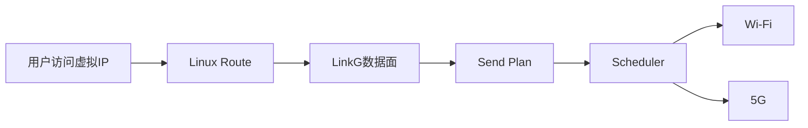

Route 只负责把正确的虚拟节点流量导入 LinkG；Scheduler 只负责把已经进入 LinkG 的 Packet 按当前发送计划提交给真实物理链路。

这样 Linux 路由、逻辑节点、物理 Path 和链路调度各自保持独立，后续无论增加新的链路切换策略还是调整虚拟网络路由，都不会把两个层次重新耦合在一起。
