# M07：TUN 与用户数据面接入

源码范围：`core/tun/`、`include/linkg/core/tun/`。

> 原规划中的 `Switch 数据转发` 不再放在 M07。当前 `core/switch/` 实际承担的是 Peer `Send Plan` 状态管理，已经归入 M06 Scheduler 体系；它本身不负责 Packet 转发。

## 1. 模块定位

TUN 是 Linux 网络栈和 LinkG 用户态数据面的边界。

它解决的核心问题只有两个方向：

```text
Linux → LinkG
把进入linkg0的IPv4 Packet转换成LinkG Packet，
解析最终Node和业务类型后交给Transport。

LinkG → Linux
把Transport已经送达本机的USER_DATA写回linkg0，
重新进入Linux网络栈。
```

整体关系如下：

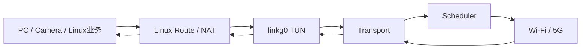

因此 TUN 不承担：

```text
Peer发现              → Discovery
链路选择              → Scheduler
Send Plan             → Switch
Transport协议         → Transport
物理发送              → Link
NAT地址转换            → NAT / FastNAT
```

它只负责把 Linux IPv4 数据准确、高效地接入和送出 LinkG。

---

## 2. linkg0 是 Linux 与 LinkG 的统一接口

当前 LinkG 使用一个三层 TUN 接口：

```text
Interface = linkg0
Mode      = IFF_TUN | IFF_NO_PI
MTU       = 1500
```

TUN 工作在 IP 层，因此从 `linkg0` 读取到的就是完整 IPv4 Packet，不包含 Ethernet Header。

Linux Route 决定哪些虚拟地址进入 `linkg0`，TUN 不再重复维护一套路由判断。

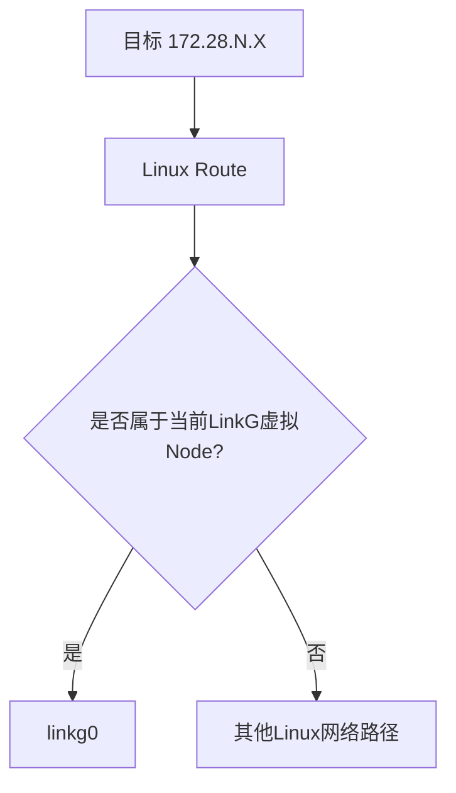

所以 M06 和 M07 的边界很清楚：

> **Route 决定 Packet 是否进入 linkg0；TUN 负责处理已经进入 linkg0 的 Packet。**

---

## 3. TUN 生命周期

TUN 生命周期分为初始化和运行两个阶段。

初始化阶段只建立进程内资源：

```text
保存Packet Pool
初始化状态锁
初始化TUN读取线程
向Transport注册USER_DATA Handler
```

真正启动时才：

```text
读取Network配置
    ↓
创建 /dev/net/tun
    ↓
建立linkg0
    ↓
设置MTU和TX Queue Length
    ↓
配置TUN IPv4
    ↓
接口UP
    ↓
启动读取线程
```

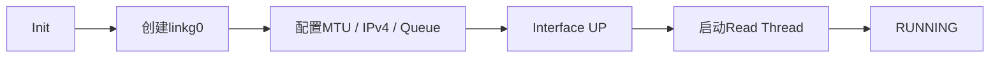

停止时先标记数据面停止，再终止读取线程，最后关闭接口和 FD。

Transport 的 USER_DATA Handler 只在 TUN 完全反初始化时注销，因此正常 Start / Stop 不需要反复修改 Transport 回调关系。

---

## 4. Linux → LinkG 数据路径

从 Linux 发往远端虚拟 Node 的 Packet 会被 Route 导入 `linkg0`。

TUN 读取以后主要完成四件事：

```text
读取IPv4 Packet
    ↓
解析最终Destination Node
    ↓
判断REALTIME / VIDEO / DATA
    ↓
以USER_DATA提交Transport
```

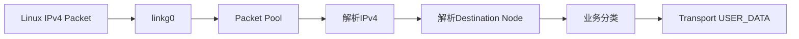

TUN 不产生第二份业务缓冲区。

读取前先从 Packet Pool 批量申请 Packet，然后直接把：

```text
linkg_packet_data(packet)
```

作为内核批量 TUN Read 的目标地址。

因此数据路径是：

```text
Linux TUN
   ↓
Packet Slot
```

而不是：

```text
Linux TUN
   ↓
临时buffer
   ↓ memcpy
Packet
```

这延续了 M02 的统一 Packet 零拷贝模型。

---

## 5. TUN 如何确定最终 Node

TUN 需要把 IPv4 Destination 转换成 Transport 使用的：

```text
destination_node_id
```

当前支持两类地址。

### LinkG TUN 节点地址

```text
172.31.8.<node_id>
```

Host 部分直接表示 Node ID。

### 用户虚拟地址

```text
172.28.<node_id>.<host>
```

例如：

```text
172.28.2.100
      ↑
    Node 2
```

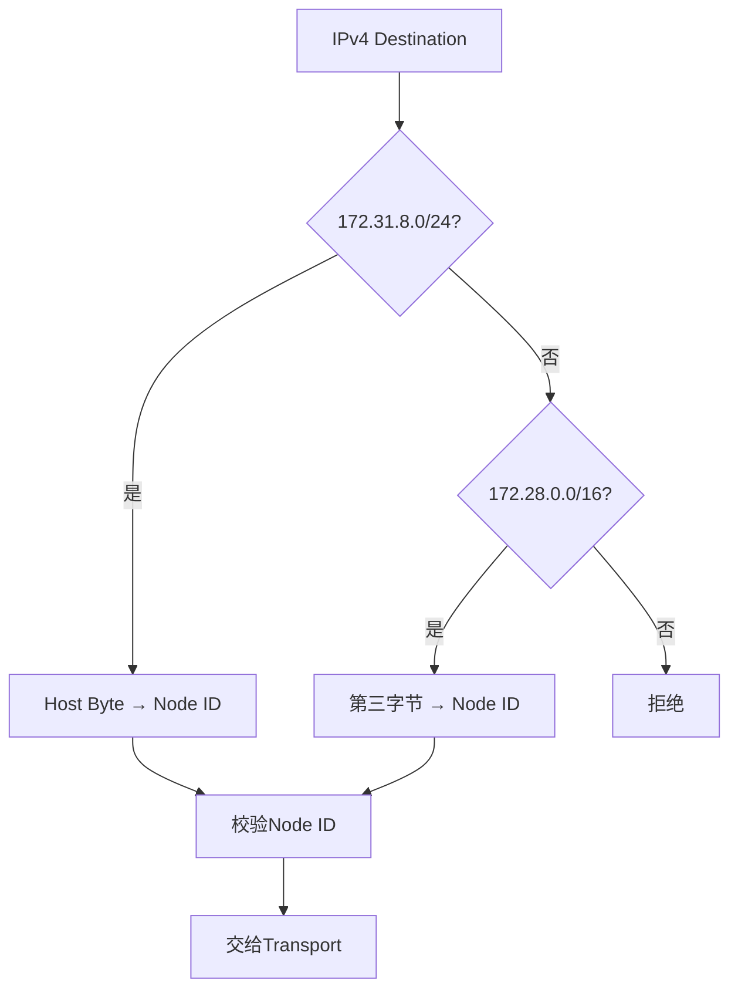

TUN 只负责确定性地址映射，不在热路径查询 Discovery 来判断 Node 是否在线。

节点是否真正可达继续由后面的：

```text
Transport Direct Peer
Scheduler Send Plan
Node / Path
```

共同约束。

这样 TUN 不会因为设备状态变化引入额外 Peer 状态锁。

---

## 6. 业务分类在数据入口完成

Packet 第一次进入 LinkG 时，TUN 就根据 IPv4 / L4 信息完成业务分类。

当前分类优先级为：

```text
ICMP
→ REALTIME

SSH TCP/22
→ REALTIME

用户traffic_rules
→ REALTIME / VIDEO

其他
→ DATA
```

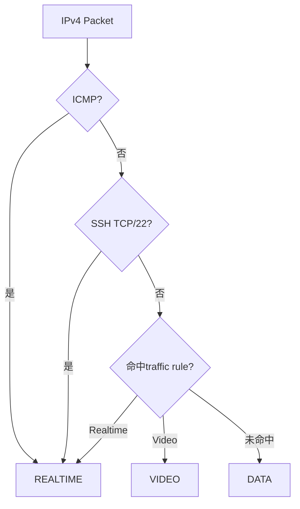

分类结果直接写入 Packet Flag。

后续：

```text
Transport
Scheduler
```

只传递这个 Packet，不重复解析 TCP / UDP Port。

最终到了 Link 层，再把 Packet Flag 映射到：

```text
REALTIME / VIDEO / DATA Socket与QoS
```

因此业务识别只做一次，物理 QoS 由具体 Link 落地。

---

## 7. TUN 到 Transport 的接口边界

TUN 将有效 Packet 组成一个逻辑发送批次：

```text
Packet
+
Destination Node ID
```

然后统一调用：

```text
linkg_transport_send_batch()

Type   = USER_DATA
Policy = DEFAULT
```

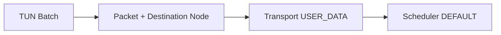

这里 TUN 不直接访问：

```text
Switch Plan
Path
Link Manager
Wi-Fi
5G
```

Transport 和 Scheduler 会继续完成后面的逻辑传输和物理路径选择。

因此用户数据入口和多链路调度完全解耦。

---

## 8. LinkG → Linux 本机交付

远端 USER_DATA 到达本机以后，M05 Transport 已经完成：

```text
Wire校验
Sequence去重
必要的Fragment Reassembly
去除Transport Header
```

随后根据 `USER_DATA` Type 调用 TUN 注册的 Handler。

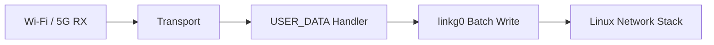

TUN 不再解析 Transport Header，也不关心数据最初从 Wi-Fi 还是 5G 到达。

它只接收到已经恢复好的原始 IPv4 Packet，然后批量写入 `linkg0`。

进入 Linux 后，后续由系统 Route / NAT / Local Socket 继续处理。

---

## 9. 本机交付保持同步，不再增加用户态Queue

Transport 调用 USER_DATA Handler 时，Packet 只在当前回调期间借用。

因此 TUN 的写入模型是：

```text
Transport Handler进入
      ↓
同步Batch Write到linkg0
      ↓
写入完成
      ↓
Handler返回
      ↓
Transport / Link释放Packet引用
```

没有额外建立：

```text
TUN TX Queue
TUN Write Thread
Packet再次retain
```

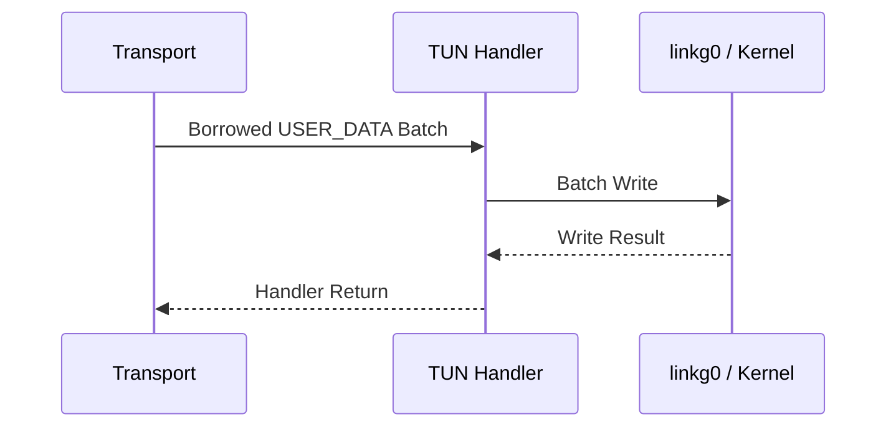

这样减少了一次线程切换和一层 Packet 生命周期管理。

当前 TUN 唯一的数据面工作线程是：

```text
TUN Read Thread
```

用于处理 Linux → LinkG 方向。

---

## 10. Batch 读取和写入

TUN 两个方向都使用批量接口。

当前用户态内部 Batch：

```text
Batch Size       = 16 Packet
Read Min Target  = 5 Packet
Read Timeout     = 60 us
```

读取时：

```text
Packet Pool一次申请最多16个
        ↓
一次READ_BATCH ioctl
        ↓
解析并组成Transport Batch
        ↓
一次Transport Send Batch
```

写入时：

```text
Transport Delivery Batch
        ↓
最多16个为一个Chunk
        ↓
一次WRITE_BATCH ioctl
```

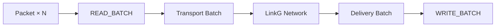

这里 Batch 的目标是同时减少：

```text
ioctl次数
Packet Pool锁次数
Transport调用次数
```

又通过很短的聚合等待避免为了凑大 Batch 明显增加实时业务延迟。

---

## 11. TUN 线程和背压边界

TUN Read Thread 使用 `poll()` 同时等待：

```text
TUN FD
Thread Wakeup FD
```

读取线程当前绑定到固定 CPU Core，避免高吞吐数据面线程在不同 CPU 间频繁迁移。

Packet Pool 耗尽时不会继续忙等：

```text
Packet Pool alloc = 0
        ↓
sleep 1 ms
        ↓
退出本轮Drain
        ↓
下一轮继续读取
```

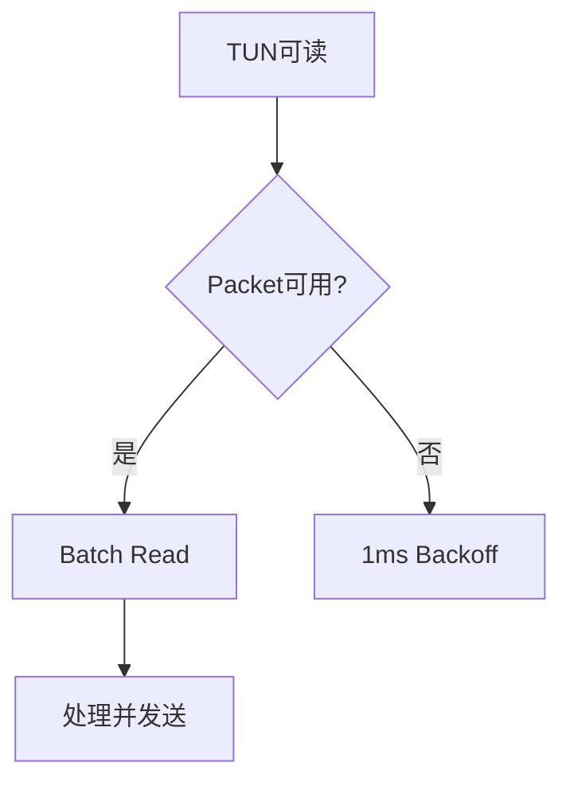

TUN 本身不建立无限等待队列。

真正的物理链路拥塞和发送积压继续由 Wi-Fi / Cellular Link 的有界 Queue 处理。

因此职责边界为：

```text
TUN
负责Linux数据入口节奏

Packet Pool
负责固定数据资源

Link
负责物理发送积压和流控
```

---

## 12. 当前性能设计

TUN 是整个用户数据面的入口和出口，因此这里的核心目标不是增加功能，而是减少每个 Packet 的固定成本。

当前快速路径保持：

```text
预分配Packet
直接读入Packet Slot
批量TUN ioctl
批量Transport提交
一次IPv4解析
一次业务分类
无额外TUN发送Queue
本机交付直接批量写回Kernel
```

正常 Linux → LinkG Packet 在 TUN 层不发生 Payload memcpy。

正常 LinkG → Linux Packet 同样直接把 Transport 交付的 Packet Data 地址提交给批量 TUN Write。

因此 TUN 性能主要看：

```text
Batch Size / 聚合时间
TUN ioctl成本
IPv4解析和分类成本
TUN Read Thread CPU占用
端到端小包PPS和大包吞吐
```

而不是在这一层增加新的缓存、复制或工作线程。

---

## 13. 与其他模块的边界

M07 在整个数据面中的位置可以压缩成下面这张图：

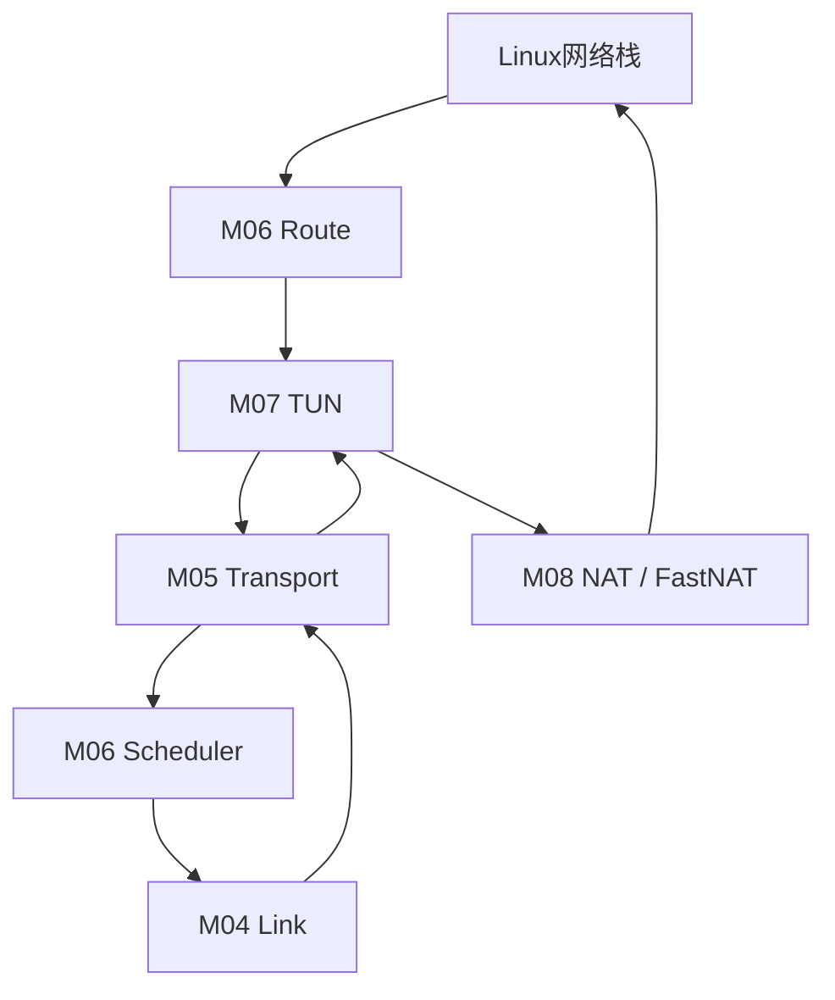

其中：

```text
Route
决定虚拟流量进入linkg0

TUN
完成Linux Packet与LinkG Packet之间的接入

Transport
增加LinkG逻辑传输语义

Scheduler
选择实际物理Path

Link
完成Wi-Fi / 5G收发

NAT
处理真实IPv4与虚拟IPv4映射
```

这里不存在一个额外的“Switch Packet Forwarding”层。

当前 `core/switch/` 只是 M06 中的 Send Plan 状态存储，不出现在 Packet 数据路径上。

---

## 14. M07 验证重点

这一层主要验证 Linux 与 LinkG 两个方向的数据边界：

| 场景 | 必须保证 |
|---|---|
| linkg0启动 | MTU、IPv4、接口状态正确 |
| Linux → LinkG | IPv4直接读入Packet，不增加Payload副本 |
| 172.28.N.X | 正确解析最终Node ID |
| 172.31.8.N | 正确解析TUN Node ID |
| ICMP / SSH / traffic rules | 正确写入Packet业务分类 |
| Transport USER_DATA → TUN | 批量写回Linux并保持原始IPv4 Packet |
| Packet Pool耗尽 | 不忙等、不动态扩容 |
| TUN Stop | 读取线程先退出，FD再关闭 |
| Batch路径 | READ / WRITE / Transport Batch保持工作 |

---

## 15. 本模块结论

M07 最终只保留一个非常明确的数据面职责：

```text
Linux IPv4
    ↓
linkg0
    ↓
目标Node解析 + 业务分类
    ↓
Transport USER_DATA
    ↓
LinkG网络
```

反方向：

```text
LinkG网络
    ↓
Transport USER_DATA
    ↓
linkg0
    ↓
Linux IPv4
```

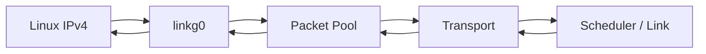

TUN 不管理 Peer、不选择 Link、不维护 Send Plan，也不承担额外的数据交换状态机。

它就是 Linux 网络栈与 LinkG 用户态数据面的高效入口和出口：**一边接 Linux IPv4，一边接 Transport USER_DATA，中间只完成必要的目标解析、业务分类和批量数据搬运。**
