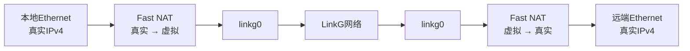
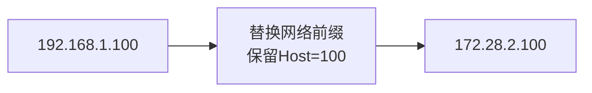
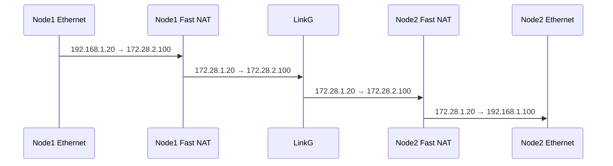
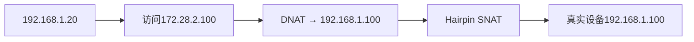
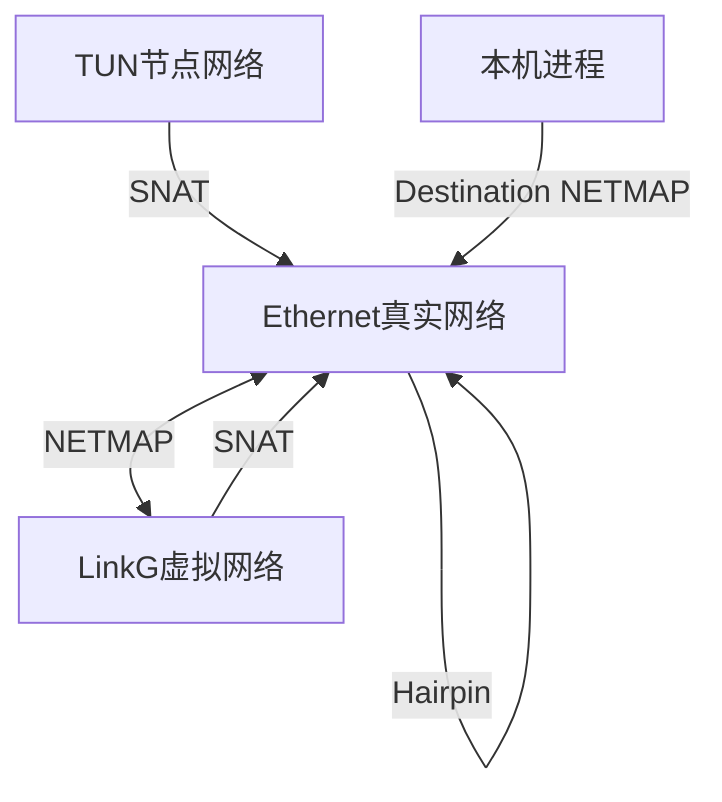
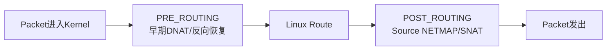
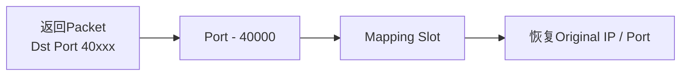
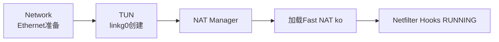

# M08：NAT 与 Fast NAT 内核加速

源码范围：`core/nat/`、`kernel/linkg_fast_nat/`。

## 1. 模块定位

LinkG 对外使用统一虚拟地址：

```text
172.28.<node_id>.<host>
```

但每个节点本地 Ethernet 设备仍然使用真实局域网地址，例如：

```text
192.168.1.<host>
```

因此 M08 解决的是：

> **在不修改终端设备网络配置的情况下，把真实 Ethernet 地址和 LinkG 虚拟地址进行透明映射。**

数据跨节点时，NAT 位于 Linux 网络栈和 `linkg0` 之间：



NAT 不负责设备发现、路由和链路调度；它只负责 IPv4 地址/端口转换。

---

## 2. 为什么采用“保留 Host 字节”的 NETMAP

每个 Node 拥有一个独立虚拟 `/24`，真实 Ethernet 子网与本节点虚拟子网使用相同掩码。

例如：

```text
真实设备：192.168.1.100
Node 2虚拟地址：172.28.2.100
```

转换只替换网络前缀，Host 部分保持不变：

```text
192.168.1.100
        ↓
172.28.2.100
```



这样同一真实地址可以在不同 Node 下拥有不同虚拟地址，即使多个现场都重复使用 `192.168.1.0/24`，也不会在 LinkG 虚拟网络中冲突。

---

## 3. 远端访问采用两端映射

假设 Node 1 的设备访问 Node 2 的真实设备 `192.168.1.100`，在 LinkG 中访问的是：

```text
172.28.2.100
```

源节点离开 Ethernet、进入 LinkG 时，将本地真实源地址映射为本节点虚拟地址；目标节点从 `linkg0` 出来时，再把目标虚拟地址映射回本地真实 Ethernet 地址。



返回方向执行对应反向恢复。

因此远端通信在 LinkG 内部始终使用全局唯一虚拟地址，真实 Ethernet 地址只在各自节点内部存在。

---

## 4. 本地虚拟地址访问不需要绕 LinkG

如果本节点 Ethernet 设备访问的虚拟地址仍然属于本节点，例如：

```text
Node 2本地：
192.168.1.20 → 172.28.2.100
```

这类流量不应该：

```text
Ethernet → linkg0 → Transport → Scheduler → 再回本机
```

Fast NAT 在本地直接完成 Destination NETMAP，并通过 Hairpin SNAT 保证返回流量仍经过同一映射关系：



所以本地 Hairpin 是纯内核本地转发路径，不进入 `linkg0`，也不消耗 Wi-Fi / 5G 数据面资源。

---

## 5. 当前固定规则覆盖的通信方向

Fast NAT 当前不是通用规则引擎，而是围绕 LinkG 固定拓扑实现 7 类规则。

这些规则可以归成三组：

```text
一、真实Ethernet ↔ LinkG虚拟网络
   - Source NETMAP
   - linkg0到本地Ethernet的Destination NETMAP

二、本机 / TUN / 远端虚拟Endpoint访问本地Ethernet
   - Local Output Destination NETMAP
   - Virtual Endpoint SNAT
   - TUN SNAT

三、本地Ethernet访问本节点虚拟Endpoint
   - Local Ethernet Destination NETMAP
   - Hairpin SNAT
```



用户态一次性启用现有全部规则，不在运行期动态增加任意 NAT 规则。

---

## 6. 为什么把高频转换放到内核

如果每个业务 Packet 都通过用户态做 NAT，会产生额外：

```text
用户态 / 内核态切换
Packet复制
TUN往返
状态查询
```

当前 Fast NAT 直接挂在 Linux IPv4 Netfilter：

```text
PRE_ROUTING
LOCAL_OUT
POST_ROUTING
```



需要修改目的地址的本机流量在 `LOCAL_OUT` 完成映射后重新执行路由选择。

Fast NAT Hook 对需要自己维护状态的流量提前标记为 `UNTRACKED`，避免再进入 Linux 通用 conntrack/NAT 状态路径。

因此 Fast NAT 的目标不是替代整个 Linux Netfilter，而是把 LinkG 固定高频 NAT 路径缩短到最小。

---

## 7. 用户态与内核态职责划分

用户态 `core/nat` 不参与逐包转换。

它只负责：

```text
读取本节点网络配置
加载 linkg_fast_nat.ko
打开 /dev/linkg_fast_nat
获取Ethernet / linkg0 ifindex
下发完整配置
START / STOP
校验驱动状态
关闭设备并卸载ko
```

内核态负责：

```text
Netfilter Hook
地址前缀映射
状态SNAT
反向映射
Hairpin
Checksum更新
映射表和方向表
```


这种设计让控制面保持简单，而逐包数据路径完全留在内核。

---

## 8. UAPI 保持稳定边界

用户态和内核态通过版本化 UAPI 通信：

```text
UAPI Version = 1
Device       = /dev/linkg_fast_nat
```

当前控制命令只有：

```text
SET_CONFIG
START
STOP
GET_STATUS
```

配置一次性包含：

```text
Ethernet真实网络
TUN节点网络
LinkG虚拟聚合网络
本节点虚拟子网
Ethernet IPv4
Ethernet / TUN ifindex
SNAT端口池
启用规则位图
```

用户态启动以后还会读取驱动状态，确认：

```text
UAPI版本一致
状态 = RUNNING
实际规则 = 预期规则
```

避免出现用户态认为 NAT 已经启动，但内核侧实际配置不一致的半启动状态。

---

## 9. 状态 SNAT 为什么使用固定表

Virtual Endpoint、TUN 和 Hairpin 访问本地 Ethernet 时，需要对源地址和端口进行状态转换。

当前使用固定容量映射表：

```text
Mapping Slot = 4096
动态端口池   = 40000 ~ 44095
最大活动映射 = 2000
```

每个槽位与 translated port 一一对应：

```text
translated_port = 40000 + slot
```

因此返回包拿到 translated port 后，可以直接：

```text
translated port
      ↓
O(1)定位Slot
      ↓
恢复原始IP / Port
```



普通已有映射读取不需要全局锁；只有第一次建立新映射时进入短 Spin Lock。

Source NETMAP 同样保存一份最小流方向表，用来区分“本地主动访问远端后的返回流量”和“远端主动访问本地的新流量”。

---

## 10. 生命周期与依赖顺序

Fast NAT 依赖真实存在的：

```text
Ethernet
linkg0
```

所以应用生命周期中必须先完成 Network 和 TUN，再启动 NAT。



停止时则相反：

```text
STOP Fast NAT
    ↓
注销Netfilter Hooks
    ↓
关闭字符设备
    ↓
卸载ko
```

字符设备必须先关闭，释放 `THIS_MODULE` 引用以后才能卸载模块。

---

## 11. 当前性能边界

Fast NAT 的性能设计重点是：

```text
逐包原地修改skb
固定规则判断
已有映射无锁读取
translated port直接反查
只在新建状态时加Spin Lock
避免通用conntrack
不经过用户态Packet路径
```

当前没有把 nftables / iptables 作为 LinkG 核心 NAT 数据面的回退实现；Fast NAT 启动失败会直接表现为 NAT 模块启动失败，而不是静默切换到另一套行为不同的规则系统。

这样可以保证开发和性能测试始终面对同一套 NAT 数据路径。

---

## 12. 当前协议边界

当前状态 SNAT 重点支持：

```text
TCP
UDP
ICMP Echo
```

Fast NAT 不处理 IPv4 Fragment 的状态 SNAT，也不解析应用层 Payload。

因此它是一个 L3/L4 NAT 加速模块，而不是应用层 ALG：

```text
不会理解RTSP、SIP等协议正文
不会修改应用层动态协商内容
```

状态表第一版在一次 `START → STOP` 生命周期内只增加、不做运行期老化删除，因此长期大量短连接场景需要重点关注活动映射容量。

这属于当前实现明确的容量边界，而不是无限状态表。

---

## 13. M08 验证重点

M08 主要验证地址映射正确性和 Fast Path 性能：

| 场景 | 必须保证 |
|---|---|
| Ethernet → 远端虚拟地址 | 源地址映射为本节点虚拟Endpoint |
| 远端虚拟地址 → 本地Ethernet | 目的地址恢复为真实Ethernet地址 |
| 本地访问本节点虚拟地址 | Hairpin本地完成，不进入linkg0 |
| TUN / Virtual访问本地Ethernet | SNAT及返回反向映射正确 |
| TCP / UDP / ICMP Echo | Checksum和地址/端口恢复正确 |
| Fast NAT Start / Stop | Hook、字符设备和ko生命周期完整 |
| 用户态/内核UAPI不匹配 | 启动明确失败，不带错误配置运行 |
| 高并发流 | 映射表、CPU和吞吐保持可观测 |

---

## 14. 本模块结论

M08 最终把 LinkG 的虚拟地址体系和现场真实 Ethernet 网络连接起来：

```text
真实Ethernet地址
      ↕
Fast NAT
      ↕
LinkG虚拟Endpoint地址
      ↕
linkg0 / LinkG网络
```


用户态只负责生命周期和配置，逐包转换全部在内核 Netfilter Fast Path 完成。

这样终端设备继续保持原有局域网地址，而 LinkG 网络内部只处理全局唯一虚拟地址，同时本地 Hairpin、远端跨节点和本机访问都统一落在同一套固定 NAT 规则中。