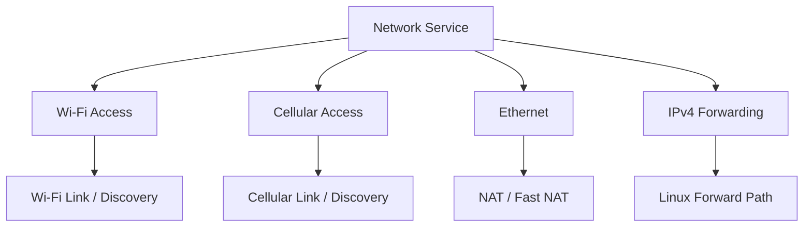
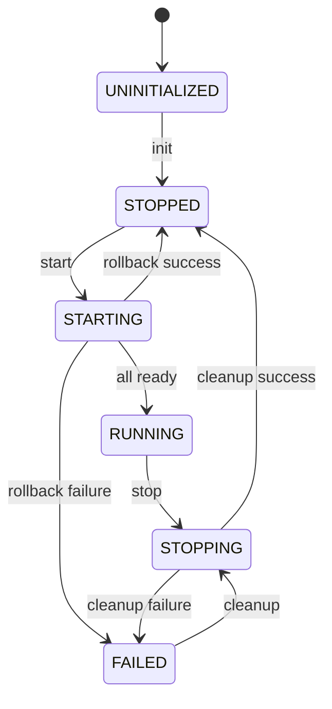
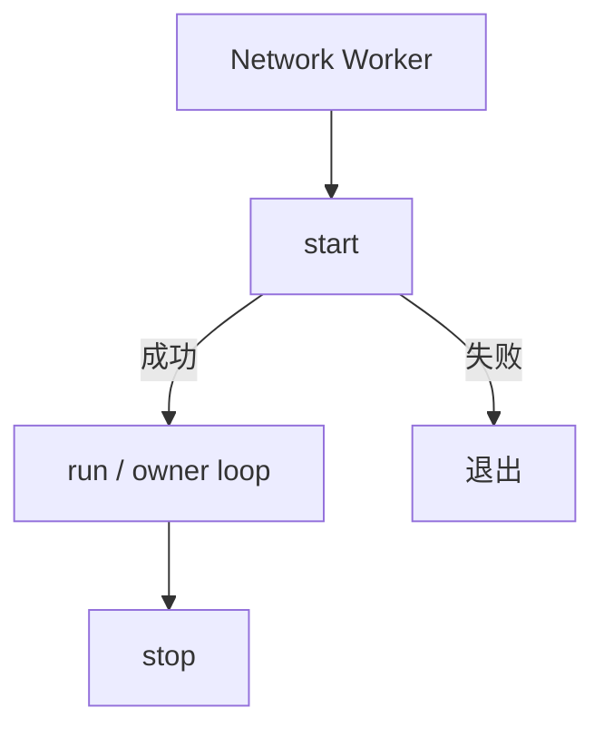
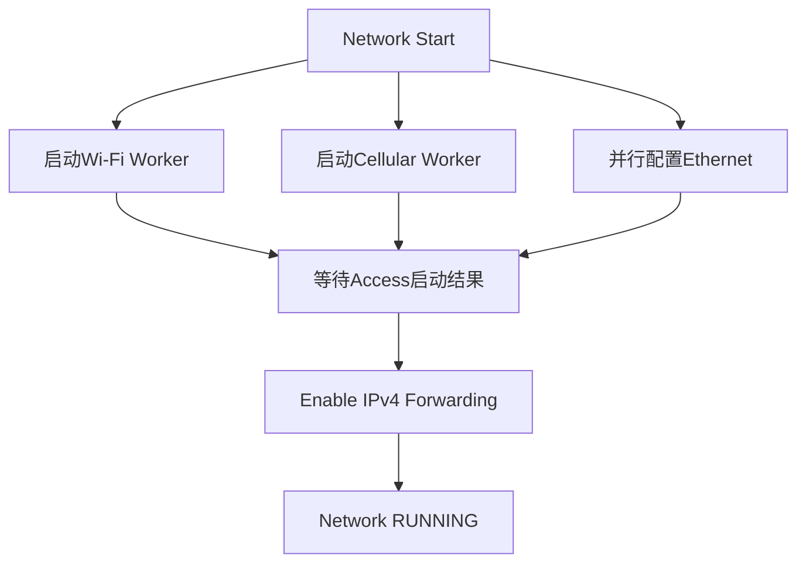
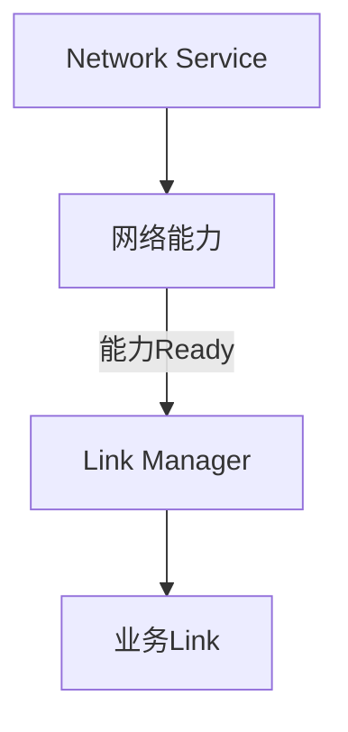
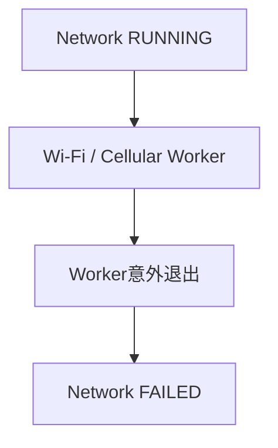
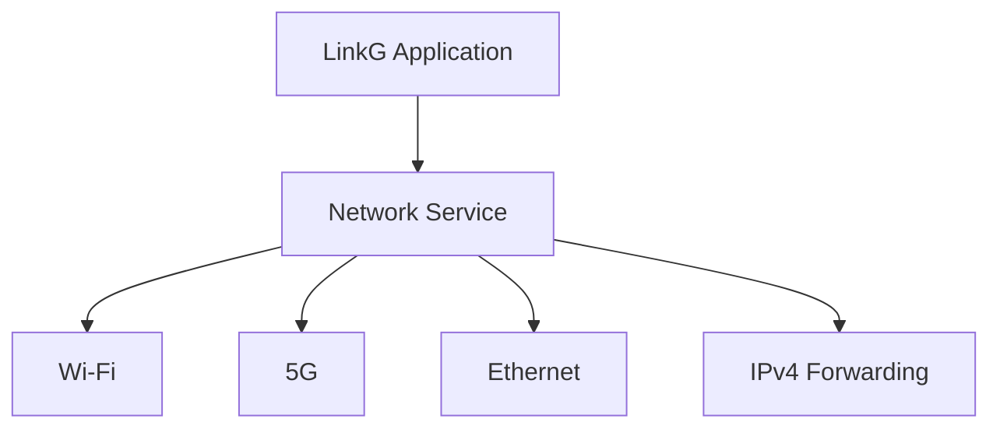

# M09：Network Service 与系统网络适配

源码范围：`service/network/` 及相关平台网络能力。

## 1. 模块定位

Network Service 负责把系统里的 Wi-Fi、5G、Ethernet 和 IPv4 Forwarding 组织成一个可控的网络运行环境。

它解决的不是具体 Packet 怎么发送，而是：

```text
Wi-Fi什么时候启动
5G什么时候启动
Ethernet什么时候配置
哪个模块拥有这些生命周期
系统网络能力什么时候可以认为Ready
运行期子模块异常以后谁把整体状态切到FAILED
```

整体关系如下：



因此：

> **Network Service 是“网络能力 Owner”，Link Manager 是“业务 Link Owner”。**

两者职责不同。

---

## 2. 为什么需要统一 Network Service

如果 Wi-Fi、Cellular、Ethernet 分别由各模块自行启动，会出现：

```text
谁先启动？
谁负责失败回滚？
某个模块运行期退出以后谁感知？
IPv4 forwarding什么时候打开？
应用退出时按什么顺序停止？
```

Network Service 将这些系统能力统一放进一个状态机：

```text
UNINITIALIZED
STOPPED
STARTING
RUNNING
STOPPING
FAILED
```



上层生命周期只需要启动/停止 Network Service，不需要分别编排每个系统网络模块。

---

## 3. Wi-Fi 和 5G 使用独立 Owner Thread

Wi-Fi 和 Cellular 都不是一次函数调用就结束的资源。

它们内部存在：

```text
启动
运行期状态机
异常检测
恢复
停止
```

因此 Network Service 为两者分别建立 Owner Worker：

```text
network-wifi
network-cell
```

每个 Worker 统一执行：

```text
start()
   ↓
run()
   ↓
stop()
```



这样 Wi-Fi 和 5G 自己维护各自内部状态机，Network Service 只负责线程所有权和整体生命周期。

---

## 4. 网络启动并行化

Wi-Fi 和 5G 的启动都可能涉及较长等待，例如：

```text
Wi-Fi AP / STA建立
5G Modem注册和数据会话
```

如果全部串行启动，会直接拉长系统启动时间。

当前流程是先启动 Wi-Fi / Cellular Worker，然后在它们后台启动期间并行配置 Ethernet：



只有所有启用的 Access 都确认 Start 成功，Ethernet 也完成配置后，才打开 IPv4 forwarding 并提交 `RUNNING`。

这避免系统在底层网络还没有准备完成时提前进入转发状态。

---

## 5. Ethernet 由 Network Service 统一配置

Ethernet 是终端设备接入 LinkG 的基础接口。

启动时主要执行：

```text
等待接口出现
    ↓
配置IPv4 / Netmask
    ↓
接口UP
    ↓
绑定Ethernet IRQ CPU
```


Network Service 停止时只撤销自己对 Ethernet 的管理状态，不主动把系统 Ethernet 接口关闭。

这是一个有意保留的系统边界：应用停止不应该无条件破坏底层系统接口状态。

---

## 6. 为什么管理 Ethernet IRQ affinity

LinkG 的数据面性能不只取决于用户态代码，网卡中断在哪个 CPU 上执行也会影响：

```text
Cache局部性
数据面线程竞争
CPU负载分布
```

当前启动时会从：

```text
/sys/class/net/<ifname>/device
/proc/interrupts
```

找到 Ethernet 平台设备对应 IRQ，再通过：

```text
/proc/irq/<irq>/smp_affinity_list
```

绑定到固定 CPU；旧内核没有该节点时回退到 `smp_affinity` 位掩码。


这属于系统网络适配，而不是 Link 或 Scheduler 应该承担的逻辑。

---

## 7. IPv4 Forwarding 的启动位置

LinkG 需要 Linux 在 Ethernet、linkg0 和本机网络栈之间允许 IPv4 转发。

但 forwarding 不能在应用一启动就立即打开。

当前顺序是：

```text
Wi-Fi / 5G Access启动完成
Ethernet配置完成
        ↓
Enable IPv4 Forwarding
        ↓
Network RUNNING
```

停止时则首先关闭 IPv4 forwarding，再逐步停止 Access Worker。


这样停止阶段一开始就先阻断新的 Linux 三层转发流量，再回收底层网络能力。

---

## 8. Network Service 与 Link Manager 的边界

这是 M09 最重要的模块边界之一。

Network Service 管：

```text
Wi-Fi Access
5G Modem / usb0
Ethernet
IPv4 Forwarding
```

Link Manager 管：

```text
Wi-Fi业务Link
Cellular业务Link
Link ID
Link RX/TX生命周期
```



例如 Cellular：

```text
Network Service
→ 让Modem和usb0真正工作

Link Manager
→ 在已经工作的usb0上创建Cellular Data Link
```

所以 Link Manager 不需要理解 AT、URC、网络注册等底层生命周期。

---

## 9. 与 TUN / NAT 的启动依赖

应用整体运行顺序中：

```text
Network
   ↓
Link Manager
   ↓
TUN
   ↓
Route
   ↓
NAT
   ↓
Discovery
```

Network Service 先建立真实系统网络能力；之后 TUN 才创建 `linkg0`，NAT 再获得 Ethernet / linkg0 ifindex 并启动 Fast NAT。


这个顺序保证每个模块启动时，它依赖的系统资源已经存在。

---

## 10. 运行期异常如何上升到系统状态

Network Worker 的 `run()` 如果在没有收到 Stop 请求时意外返回，就代表底层网络能力已经发生非预期故障。

Network Service 会把整体状态切换为：

```text
FAILED
```



这比单纯记录一条日志更重要，因为应用生命周期可以根据统一 Network 状态决定后续清理或服务重启。

Network Service 不把一个已经异常退出的 Access 伪装成仍然 `RUNNING`。

---

## 11. 启动失败必须完整回滚

Network Start 是一个组合操作。

如果中间任何一步失败，例如：

```text
Wi-Fi启动成功
5G启动失败
```

不能留下一个半启动网络环境。

当前失败路径统一回滚：

```text
Disable IPv4 Forwarding
Stop Cellular Worker
Release Ethernet管理状态
Stop Wi-Fi Worker
```

最终只有两种结果：

```text
全部回滚成功 → STOPPED
回滚本身失败 → FAILED
```

这样后续应用不会把残留网络资源误认为正常启动状态。

---

## 12. 系统操作与业务逻辑分层

Network Service 会操作系统资源，例如：

```text
网络接口IPv4
接口UP/DOWN
IPv4 forwarding
/proc/interrupts
IRQ affinity
```

这些具体动作继续通过 `linkg_network_ops`、文件封装和平台模块完成。

核心服务层只表达：

```text
“我要启用IPv4 Forwarding”
“我要配置Ethernet”
“我要启动Wi-Fi / Cellular”
```

而不让更上层的 Link、Scheduler、Transport 直接操作 `/proc`、`/sys` 或系统网络命令。

---

## 13. M09 验证重点

M09 主要验证系统网络资源是否能稳定建立和清理：

| 场景 | 必须保证 |
|---|---|
| Wi-Fi / 5G同时启用 | 两个Owner并行启动并正确汇总结果 |
| 只启用单Access | 未启用模块不创建无效Worker |
| Ethernet启动 | IP、接口状态和IRQ affinity正确 |
| IPv4 Forwarding | 只在所有网络能力Ready后启用 |
| Worker运行期异常 | Network状态进入FAILED |
| Start中途失败 | 已启动资源按顺序回滚 |
| Stop | 先关闭Forwarding，再停止Access |
| Deinit | 运行资源未清理时拒绝销毁 |

---

## 14. 本模块结论

M09 是 LinkG 和 Linux 系统网络环境之间的生命周期协调层。

```text
Network Service
├── Wi-Fi Owner
├── Cellular Owner
├── Ethernet
└── IPv4 Forwarding
```



它不参与 Packet 快速路径，而是确保所有数据面模块开始工作之前，底层网络能力已经处于一致、可用的状态；同时在任何网络 Owner 异常退出时，把故障统一上升到 Network Service 状态。

这样 Link Manager、TUN、NAT、Discovery 都可以建立在一个明确的系统网络生命周期之上，而不需要各自重复管理 Linux 接口和接入模块。