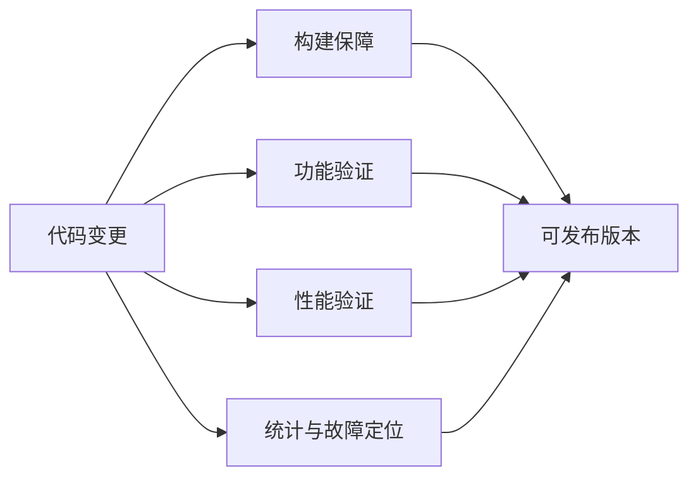
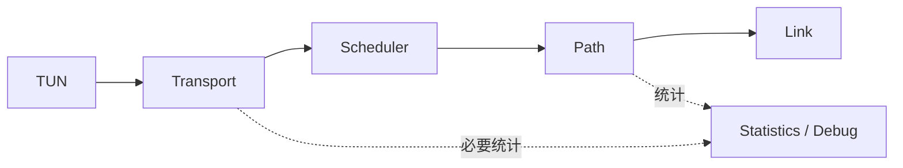
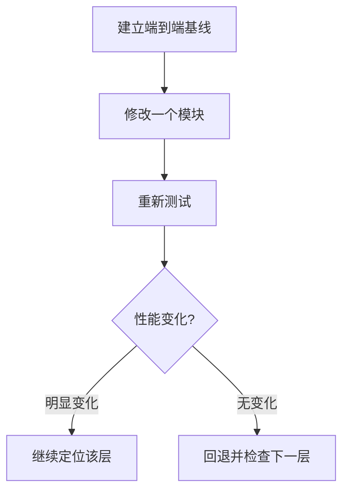
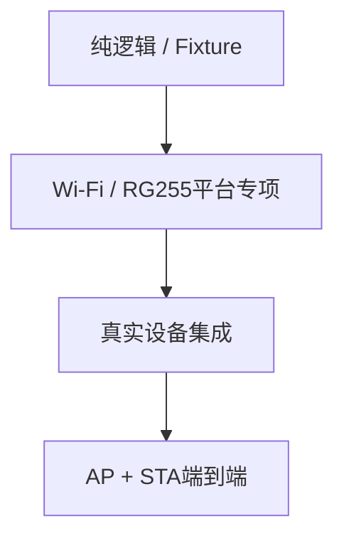
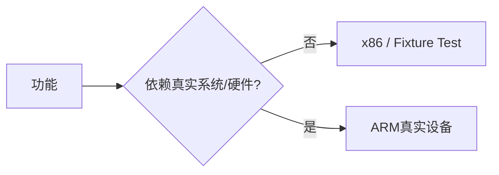
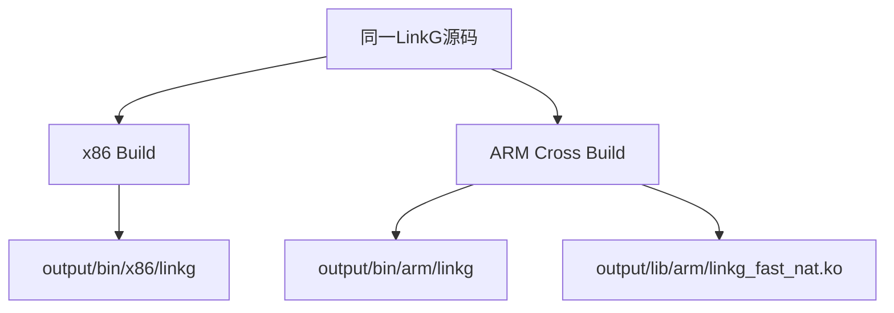
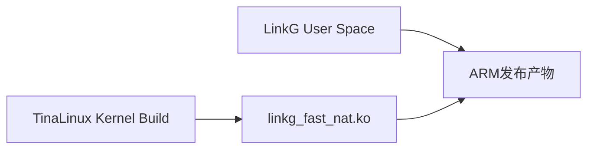
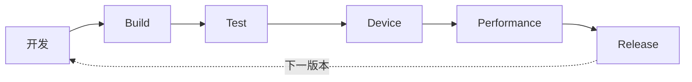

# M10：Statistics、测试、构建与发布保障

源码范围：`core/statistics/`、`test/`、`CMakeLists.txt`、`build.sh` 及相关构建脚本。

## 1. 模块定位

M10 不再负责新的数据面功能，它解决的是：

> **如何确认前面 M01～M09 的实现长期保持正确、可测、可构建、可发布。**

这部分不能只靠“程序能启动”判断。

LinkG 同时包含：

```text
用户态多线程数据面
Wi-Fi / 5G两种物理链路
TUN
Netlink Route
Fast NAT内核模块
硬件平台适配
```

任何一层改动都有可能表现成最终吞吐、时延或者网络可达性问题。

因此 M10 把项目收口分成四类能力：



---

## 2. Statistics 的定位：用于观察，不反向拖慢数据面

当前 Statistics 独立目录中已经存在 Path 累计统计，记录：

```text
TX成功字节 / 包数
TX失败字节 / 包数
主动丢弃
等待超时
RX字节 / 包数
```

Transport、Path 等模块内部也已经存在一些运行统计。

这些数据主要用于回答：

```text
Packet到底有没有进入这条Path？
是发送失败还是本地丢弃？
某条物理链路实际收发了多少？
性能下降发生在哪一层？
```



但 Statistics 不能重新变成快速路径负担。

原则是：

> **关键计数保留，复杂聚合、报表和分析放到低频查询或测试工具中完成。**

特别是 M05 Transport 的性能收缩以后，不应为了“统计更完整”再次在每个 Packet 上增加大量锁、时间戳和重复计数。

---

## 3. 性能问题必须按完整数据路径定位

LinkG 的性能不能只看单个函数。

真实数据路径是：

```text
Linux / Ethernet
    ↓
Fast NAT
    ↓
TUN
    ↓
Transport
    ↓
Scheduler
    ↓
Link
    ↓
Wi-Fi / 5G
```

因此性能验证采用逐层回退和对比的方法：



重点指标保持简单：

```text
吞吐 Mbps
小包 PPS
CPU占用
端到端延迟
丢包 / 失败数
```

不为了形成漂亮报表而增加大量无实际判断价值的指标。

---

## 4. 当前测试体系的真实状态

当前 `test/` 目录主要集中在 Cellular / RG255 专项验证，包括：

```text
AT RX Probe
Query Fixture Test
Network Card Fixture Test
Keepalive Test
抓包记录
问题诊断报告
```

这说明底层 5G 平台已经具备较强的专项测试能力，但当前仓库还没有形成覆盖 M01～M09 的统一自动化测试体系。

因此 M10 的目标不是声称“完整 CI 已经存在”，而是把已有专项测试逐步整理成稳定的项目验证入口。

当前测试层次可以理解为：



纯协议和解析逻辑优先在 PC 上验证；依赖 Modem、驱动、内核和真实网络的行为必须在目标设备上验证。

---

## 5. 单元测试和真实设备测试不能混为一类

适合 x86 / Fixture 验证的内容：

```text
配置解析
Wire Encode / Decode
Sequence Window
Fragment布局校验
地址映射函数
RG255响应解析
状态机纯逻辑
```

必须依赖真实设备的内容：

```text
Wi-Fi AP / STA建立
5G注册和IPv6
UDP公网P2P
TUN批量接口
Fast NAT内核Hook
真实IRQ affinity
链路吞吐与时延
```



这样不会为了“自动化率”把本来必须在真实网络环境验证的能力做成没有意义的 Mock。

---

## 6. 端到端测试围绕真实用户路径

最终验证必须回到 LinkG 的实际通信路径，而不是只验证内部 API。

核心路径包括：

```text
AP ↔ STA
STA ↔ AP ↔ STA
Ethernet真实设备 ↔ 远端虚拟Endpoint
本地Hairpin
Wi-Fi单链路
5G单链路
Wi-Fi + 5G冗余
链路掉线后Plan收敛
Peer重启重新发现
```


只要这条真实用户路径不稳定，即使单个模块测试全部通过，也不能认为版本已经可以发布。

---

## 7. 故障测试重点验证“能不能正确收敛”

LinkG 是长期运行网络设备，故障测试重点不是制造大量极端异常，而是验证常见运行期变化：

```text
Wi-Fi断开 / 恢复
5G掉线 / 恢复
Peer进程重启
Endpoint变化
单条Path消失
Packet Pool短时耗尽
TUN Stop / Start
Fast NAT Stop / Start
Modem异常退出
```

期望看到的是：

```text
状态进入明确失败或离线
资源不泄漏
旧Path不继续被新发送使用
恢复后能够重新建立状态
```


这里比“错误日志数量”更重要的是最终状态是否正确。

---

## 8. x86 与 ARM 双平台构建

当前 CMake 明确支持：

```text
ARCHITECTURE = x86
ARCHITECTURE = arm
```

两种构建使用同一套主要源码，平台差异通过编译配置和 Platform 层隔离。



x86 构建主要用于：

```text
快速编译检查
协议/解析逻辑开发
Fixture Test
静态问题提前暴露
```

ARM 构建才是最终产品构建。

---

## 9. ARM 构建同时生成 Fast NAT 内核模块

ARM 模式除了用户态 `linkg`，还会使用 TinaLinux 5.4 Kernel Build 环境编译：

```text
linkg_fast_nat.ko
```

构建前明确校验：

```text
Kernel Makefile
include/config/auto.conf
include/generated/autoconf.h
Module.symvers
交叉编译器
```

因此内核模块不是脱离目标 Kernel 单独随意编译，而是与产品内核构建环境绑定。



这避免出现用户态程序可以运行，但 `.ko` 因 Kernel ABI 不匹配无法加载的发布问题。

---

## 10. build.sh 作为统一开发构建入口

当前构建入口统一为：

```text
./build.sh
./build.sh x86
./build.sh arm
./build.sh clean
```

默认目标为 ARM。

脚本统一处理：

```text
架构参数
交叉编译环境
CMake配置
并行编译
构建目录
输出目录
安全清理
```

输出按架构隔离：

```text
output/bin/x86/
output/bin/arm/
output/lib/arm/
```

因此开发者不需要手工拼接一长串 CMake / Toolchain 参数，也降低不同开发环境构建方式不一致的问题。

---

## 11. 编译告警就是第一层质量门

主工程使用 C17，并开启：

```text
-Wall
-Wextra
-Wpedantic
-O2
```

第三方 `cJSON` 的特定告警单独降噪，不影响 LinkG 自己的源码告警策略。

因此最基础的提交要求应该是：

```text
x86能够完整编译
ARM能够完整交叉编译
LinkG源码不新增编译告警
Fast NAT ko能够成功生成
```

构建失败本身就是阻止版本继续进入设备测试的第一道门。

---

## 12. 当前还没有完整 CI，发布保障以明确检查链为主

当前仓库没有完整 `.github/workflows` CI 流程，所以现阶段不能把自动 CI 当成已经实现的能力。

当前更适合形成一条明确发布检查链：


以后如果接入 CI，也应该自动化这条已有检查链中的适合自动化部分，而不是重新设计另一套标准。

---

## 13. 版本回归重点

每次涉及数据面改动，不需要重新执行几十项形式化检查，但至少保证以下主路径没有回归：

| 范围 | 核心检查 |
|---|---|
| 启动 | AP / STA完整启动，无资源残留 |
| Discovery | Peer上线、离线、重启能够重新收敛 |
| Wi-Fi | 单链路通信和业务QoS正常 |
| Cellular | IPv6 P2P、三业务Socket和Heartbeat正常 |
| Transport | 普通包、1500B分片、冗余去重正常 |
| Scheduler | DEFAULT / REDUNDANT / SPECIFIED符合计划 |
| TUN | Linux ↔ LinkG双向数据正常 |
| NAT | 远端映射、本地Hairpin、返回流恢复正常 |
| Performance | 吞吐 / PPS / CPU相对基线无异常退化 |

这张表作为最终回归主线即可，不再把每个内部函数拆成独立验收项。

---

## 14. 性能基线必须可重复

性能优化最怕测试条件变化。

因此每次性能对比至少固定：

```text
同一硬件
同一固件 / Kernel
同一Wi-Fi信道或5G环境
同一Packet Size
同一流量方向
同一测试时长
同一调度策略
```

输出至少记录：

```text
Git Commit
测试拓扑
吞吐
PPS
CPU占用
关键错误计数
```

这样才能判断一次修改是真正优化，还是网络环境波动。

---

## 15. M10 的项目收口目标

M10 最终不是增加一个庞大的测试框架，而是形成一个可持续的工程闭环：

```text
开发
  ↓
编译
  ↓
专项测试
  ↓
真实设备集成
  ↓
端到端验证
  ↓
性能对比
  ↓
发布
  ↓
下一轮修改继续沿用同一基线
```



Statistics 提供必要观察能力；Test 保存可重复的专项验证；CMake 和 `build.sh` 保证 x86 / ARM 使用一致构建入口；真实 AP / STA 和目标硬件测试负责最终产品行为。

---

## 16. 本模块结论

M10 是 LinkG 的工程质量边界，而不是新的网络功能模块。

它最终需要保证三件事：

```text
代码能稳定构建
功能能重复验证
性能变化能够量化比较
```

当前项目已经具备：

```text
x86 / ARM双平台CMake构建
ARM Fast NAT内核模块联动构建
统一build.sh入口
Path / Transport等运行统计基础
Cellular / RG255专项测试和诊断工具
```

当前还需要持续补齐的是：

```text
更多核心模块可重复测试
统一端到端测试步骤
稳定性能基线记录
适合自动化部分的CI接入
```

M01～M09 决定 LinkG 怎么运行，M10 决定这些设计在持续修改以后还能不能被可靠地验证和交付。