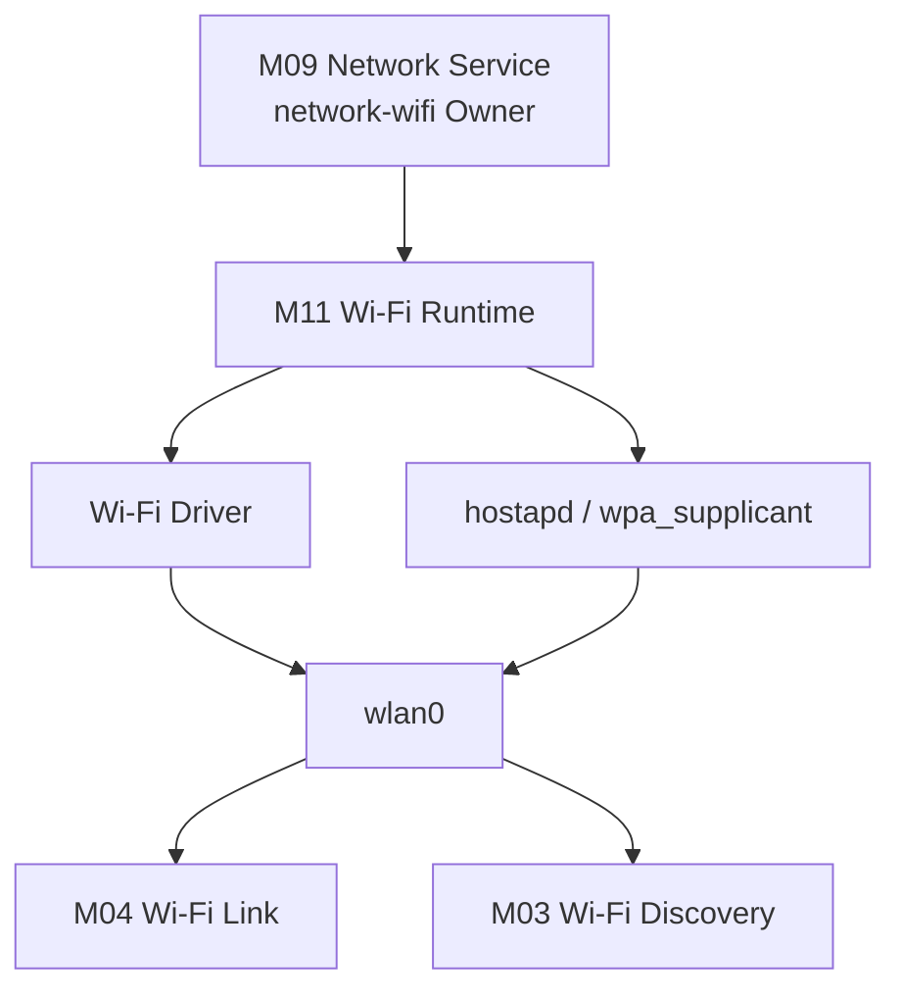
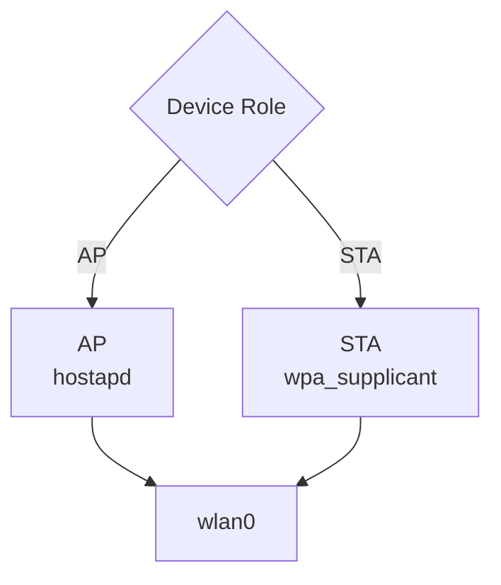
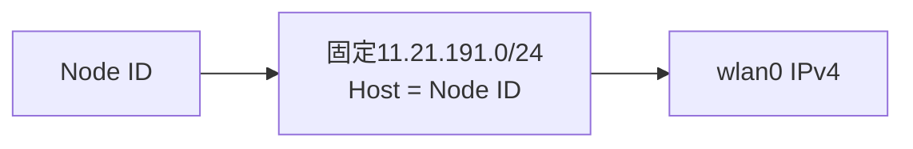
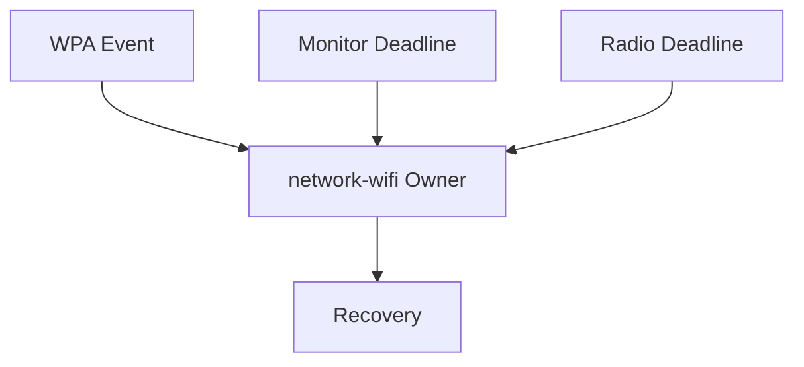
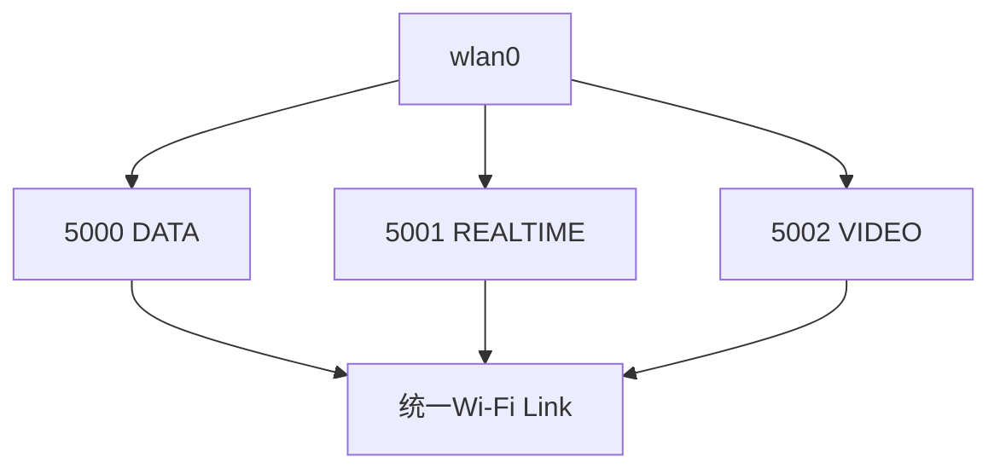
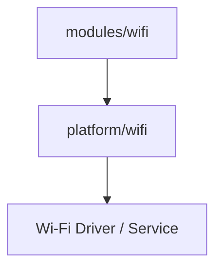

# M11：Wi-Fi 接入与无线运行管理

源码范围：`modules/wifi/`、`platform/wifi/`、相关 Wi-Fi 公共接口。

> M04 负责统一 Link 抽象；本章只说明 Wi-Fi 这项具体网络能力如何从驱动、AP/STA 服务一路建立到可供 LinkG 使用的 `wlan0`，以及运行期如何监控和恢复。

## 1. 模块定位

Wi-Fi 对 LinkG 来说同时承担两项职责：

```text
接入控制面
→ 建立并维护AP / STA无线连接

数据面
→ 为LinkG提供IPv4 UDP业务链路
```

因此 Wi-Fi 不能只理解成一个 UDP Socket。



M11 负责把硬件无线能力稳定转换成系统中的 `wlan0`；M04/M03 再分别使用它承载业务数据和 Discovery。

---

## 2. AP / STA 共用一套模块，角色行为分开

Wi-Fi 初始化同时接收：

```text
Device Role
Node ID
Wi-Fi Config
```

角色决定运行方式：

```text
AP
→ 启动hostapd
→ 建立中心无线网络

STA
→ 启动wpa_supplicant
→ 连接配置中的AP
→ 运行连接事件监控和恢复
```



上层 Network Service 不需要分别管理 hostapd 和 wpa_supplicant，只调用统一的 Wi-Fi 生命周期接口。

---

## 3. Wi-Fi 地址由 Node ID 直接派生

Wi-Fi 控制/数据网络固定使用：

```text
11.21.191.0/24
```

每个 Node 的 `wlan0` 地址直接由 Node ID 派生：

```text
Node 1 → 11.21.191.1
Node 2 → 11.21.191.2
Node 3 → 11.21.191.3
```



这样 Wi-Fi 地址不需要 DHCP，也不需要额外地址发现协议；节点身份和 Wi-Fi 地址之间保持确定映射。

---

## 4. 启动顺序解决驱动配置和服务时序问题

Wi-Fi 启动并不是简单 `ifconfig wlan0 up`。

当前顺序为：

```text
生成AP / STA服务配置
    ↓
准备驱动INI
    ↓
加载Wi-Fi驱动
    ↓
等待wlan0出现
    ↓
接口Down
    ↓
必要时重新加载驱动参数
    ↓
接口Up
    ↓
关闭Power Management
    ↓
启动hostapd / wpa_supplicant
    ↓
应用运行参数和IPv4
    ↓
启动Status / Monitor / Radio维护
```


这个顺序把经过硬件验证的驱动参数和角色服务时序固定下来，避免不同模块各自随意操作无线接口。

---

## 5. 运行参数面向低延迟数据链路

接口建立以后，Wi-Fi 会统一收敛一组运行参数：

```text
驱动日志降到ERROR
关闭NAPI
启用Low Latency
关闭Wi-Fi Power Management
STA关闭Power Save
```

再配置由 Node ID 派生的 IPv4 地址。

这些参数属于 Wi-Fi 平台能力，不应该进入 Scheduler 或 Transport。

> **上层只看到“Wi-Fi Link可用”，具体无线驱动如何配置由 M11 收口。**

---

## 6. 单一 Owner 线程维护 Wi-Fi 控制面

Wi-Fi 没有为 Monitor、Radio、Recovery 分别建立多套控制线程。

它们统一运行在 Network Service 创建的：

```text
network-wifi Owner Thread
```

Owner Loop 同时等待：

```text
线程停止事件
STA WPA事件FD
Monitor定时期限
Radio维护期限
```



这样 STA 连接状态、无线参数调整和服务恢复都在一个线程中串行执行，避免多个控制线程同时修改驱动或服务状态。

---

## 7. STA 断链恢复不直接重启整个 LinkG

STA 运行期会通过 Monitor 接收连接/断开和事件通道异常。

普通连接变化先更新 Wi-Fi Runtime；只有满足恢复条件时才进入 STA Service Recovery：

```text
停止Monitor
    ↓
停止wpa_supplicant服务
    ↓
重新启动STA服务
    ↓
重新应用Radio参数
    ↓
重新建立Monitor
    ↓
恢复运行状态
```


单次 Radio 驱动控制失败则保留内部重试期限，不立即放大成整个 Wi-Fi 服务失败。

这种分级恢复避免瞬时无线抖动导致 LinkG 全局生命周期反复重启。

---

## 8. Wi-Fi Data Link 与接入控制面分开

当 M11 已经把 `wlan0` 建立好以后，M04 的 Wi-Fi Link 才在其上创建 LinkG 业务 Socket。

当前业务通道：

```text
5000 DATA
5001 REALTIME
5002 VIDEO
```

同时通过 IP TOS / WMM 区分底层业务优先级。



因此两层职责为：

```text
M11 Wi-Fi Access
→ 让wlan0和无线连接保持可用

M04 Wi-Fi Link
→ 使用wlan0传输LinkG Packet
```

---

## 9. 业务流控留在 Wi-Fi Data Link

Wi-Fi 底层存在无线发送拥塞和驱动 Queue 波动，因此具体 Link 内保留自己的 Flow Control 和有界发送队列。

核心原则是：

```text
REALTIME
→ 优先提交，减少等待

VIDEO / DATA
→ 根据流控状态直接发送或进入有界Queue
```

队列只承担短时间吸收底层拥塞，不允许无限增长占满 Packet Pool。

这部分不会反向影响 Scheduler 的路径选择模型；Scheduler 只决定走 Wi-Fi，Wi-Fi 自己决定如何把当前 Packet 稳定提交给无线驱动。

---

## 10. Wi-Fi 与 Discovery 的边界

Wi-Fi Discovery 使用同一个 `wlan0`，但它不是 Wi-Fi Access 的一部分。

```text
M11
负责wlan0和AP / STA连接

M03
使用5006在wlan0上执行Discovery
```

只要 `wlan0` 存在，Discovery 控制面就可以工作；Data Link Endpoint 可以稍后再由新的 Report Revision 补充。

因此无线接入建立、设备发现和业务数据 Path 三者保持分层。

---

## 11. 平台适配边界

Wi-Fi 模块本身不直接散落硬件命令，而是通过 `platform/wifi/` 统一适配：

```text
Driver Loader / Driver Ops
hostapd
wpa_supplicant
Radio Status
TX Flow Control
NB Report / Netlink
```



这样 LinkG 的 Wi-Fi 运行状态机和具体驱动 ioctl、服务配置方式保持隔离。

---

## 12. 验证重点

| 场景 | 必须保证 |
|---|---|
| AP启动 | hostapd和wlan0按配置稳定建立 |
| STA启动 | 能连接目标AP并进入稳定运行状态 |
| Node ID变化 | wlan0地址按 `11.21.191.<node>` 正确派生 |
| STA断链 | Monitor识别状态并按策略恢复 |
| Radio控制瞬时失败 | 不立即终止整个Wi-Fi Owner |
| DATA / VIDEO / REALTIME | 三业务Socket和QoS映射正确 |
| Wi-Fi拥塞 | 有界Queue工作，不无限占用Packet Pool |
| Stop | Monitor / Radio / Service / Interface按逆序安全回收 |

---

## 13. 本模块结论

M11 最终把复杂的无线硬件和服务控制收敛成一个稳定的 Wi-Fi 接入能力：

```text
配置
 ↓
驱动
 ↓
hostapd / wpa_supplicant
 ↓
wlan0
 ↓
运行监控 / 恢复
 ↓
Wi-Fi Data Link / Discovery
```

上层不需要理解驱动加载、无线参数、WPA事件和恢复时序，只需要看到一个已经准备好的 Wi-Fi Access，以及建立在其上的统一 Wi-Fi Link。
