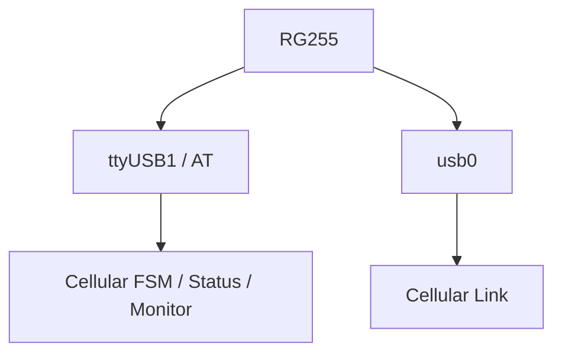
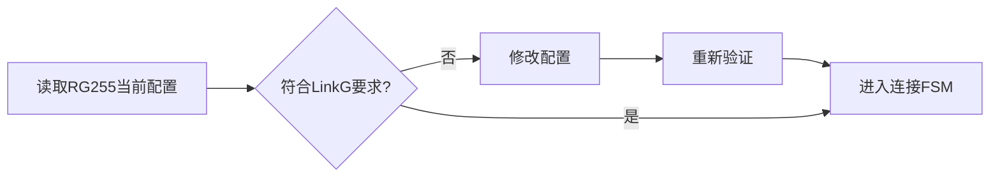
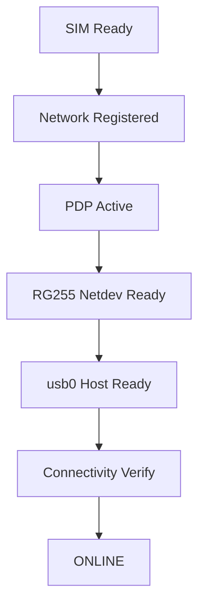
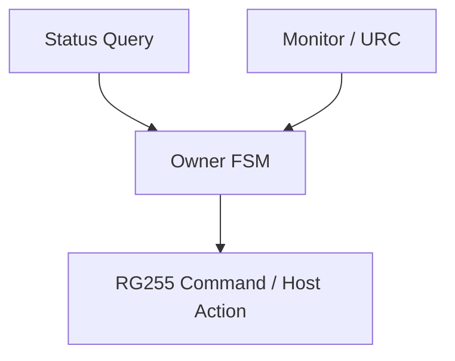
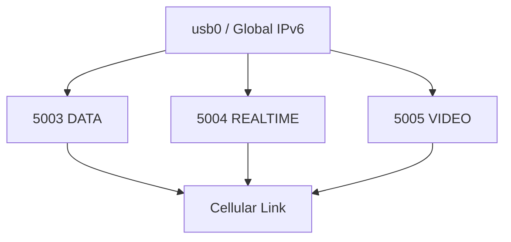
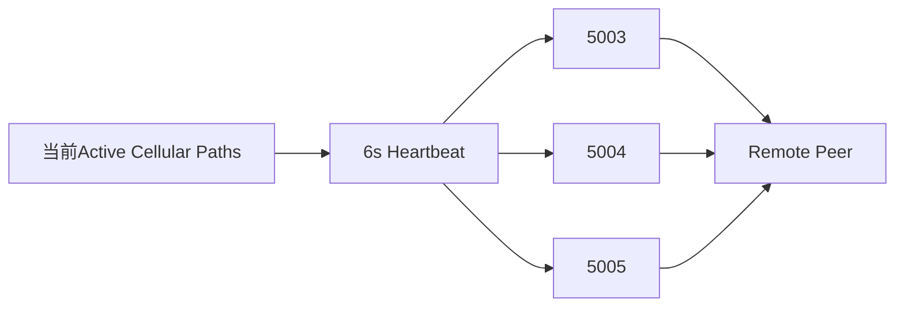
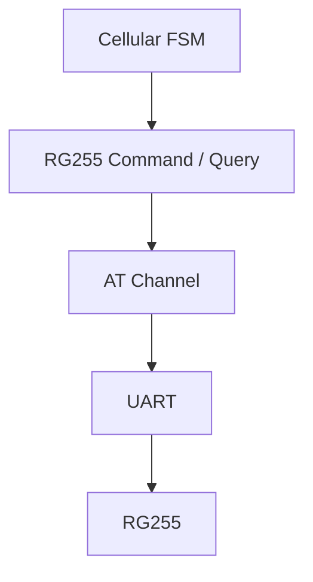

# M12：5G Cellular 与 RG255 接入

源码范围：`modules/cellular/`、`platform/cellular/`、`platform/uart/`、相关 Cellular 公共接口。

> M04 负责统一 Link 抽象；本章只说明 5G 接入能力如何从 RG255、AT/URC、SIM、注册、PDP、USB 网卡一路建立到可供 LinkG 使用的 `usb0`，以及运行期如何监控和恢复。

## 1. 模块定位

5G 接入比普通网卡复杂得多。

LinkG 不能假设 `usb0` 启动时天然可用，而是必须依次确认：

```text
RG255可以通信
SIM可用
移动网络注册成功
PDP上下文正确
USB网络设备已启动
Linux Host接口收敛
IPv4 / IPv6连通性通过
```

只有这些条件全部成立，Cellular 才真正进入 ONLINE。


M12 的核心作用就是：

> **把一个复杂、可能随时变化的 5G Modem，收敛成稳定的 Cellular Access 能力。**

---

## 2. 控制面和数据面完全分开

5G 模组存在两条完全不同的路径。

### 控制面

```text
/dev/ttyUSB1
→ UART
→ AT Channel
→ RG255 Command / Query / URC
```

负责：

```text
SIM
注册状态
PDP
USBNet模式
Modem配置
运行状态
```

### 数据面

```text
Linux IP Stack
→ usb0
→ IPv6 / IPv4
```

负责真正的业务 Packet。



因此业务数据不会经过 AT 串口，AT 只负责把 Modem 管到正确状态。

---

## 3. RG255 AT 通道是整个蜂窝控制面的基础

当前控制串口固定为：

```text
Device   = /dev/ttyUSB1
Baudrate = 115200
8N1
```

启动时不会只尝试一次，而是在规定时间内重复：

```text
创建AT Channel
    ↓
启动Channel
    ↓
发送AT探测
    ↓
关闭Echo
    ↓
启用CMEE错误信息
    ↓
关闭Modem Sleep
```


这样可以覆盖开机初期 Modem USB 节点已经出现、但 AT 固件尚未完全就绪的时间窗口。

---

## 4. 持久化 Modem 配置先收敛，再进入连接流程

RG255 某些参数会跨重启保存，因此不能假设设备上电后一定已经符合 LinkG 要求。

Cellular 启动阶段会查询并收敛关键持久配置，例如：

```text
USBNet模式
Network Card模式
4G / 5G网络模式
SIM Detect配置
相关URC配置
```

如果配置发生修改，按实际 Modem 要求重新建立后续运行环境。

这避免生产设备因为历史调试残留配置不同，导致同一版本 LinkG 在不同设备上行为不一致。



---

## 5. Cellular 使用单一 Owner 状态机建立网络

真正的 5G 网络建立过程由 `network-cell` Owner 线程串行推进。

当前状态主线为：

```text
WAIT_SIM
    ↓
CHECK_SIM / ENTER_PIN / WAIT_PIN / WAIT_PUK
    ↓
WAIT_REGISTRATION
    ↓
PREPARE_PDP
    ↓
ACTIVATE_PDP
    ↓
WAIT_PDP
    ↓
START_NETDEV
    ↓
WAIT_NETDEV
    ↓
PREPARE_HOST
    ↓
WAIT_HOST
    ↓
VERIFY_CONNECTIVITY
    ↓
ONLINE
```



这个状态机的意义是：每一步都有明确的完成条件、超时、重试和失败位置，不把几十条 AT 命令堆成一个无法恢复的大启动函数。

---

## 6. SIM 状态单独管理

SIM 是 5G 接入里最容易出现人工介入的环节之一。

当前状态明确区分：

```text
等待SIM
SIM检查
需要PIN
等待PIN
需要PUK
```

配置中允许提供 SIM PIN，但自动 PIN 尝试在一个 SIM Session 内受控，不会无限重复尝试。

如果进入 PUK 状态，则停止自动解锁流程，避免错误重试进一步锁死 SIM。

因此 SIM 问题不会被模糊成统一的“蜂窝启动失败”。

---

## 7. 注册、PDP 和 USB Netdev 分阶段确认

移动网络注册成功并不等于业务链路已经可用。

Cellular 继续要求：

```text
注册成功
    ↓
选择/准备PDP CID
    ↓
PDP激活
    ↓
RG255 USB Network连接
    ↓
usb0真正出现并进入可用状态
```


这样不会因为 Modem 显示“已注册”就提前让上层认为 Cellular Path 已经可发送。

---

## 8. Host 网络收敛后还要验证实际连通性

`usb0` 存在也不等于网络已经真正可用。

状态机还需要完成 Linux Host 侧准备，并最终进入：

```text
VERIFY_CONNECTIVITY
```

确认当前数据网络实际具备可用 IPv4 / IPv6 连通性以后才提交：

```text
ONLINE
```


这条边界非常重要：

> **Cellular ONLINE 表示数据链已验证可用，而不是“Modem大概已经连上”。**

---

## 9. Monitor / Status 不直接修改状态机

Cellular 内部把状态来源和状态决策分开。

```text
Status
→ 查询当前Modem / SIM / 注册 / PDP等事实

Monitor
→ 接收URC和异步变化

FSM
→ 根据这些事实决定下一状态和动作
```

只有 `network-cell` Owner 可以真正修改 Cellular Runtime。



这样 AT 回调线程不会直接改变连接状态，避免异步 URC 和主动查询同时修改同一份生命周期状态。

---

## 10. 失败统一进入退避重试

Cellular 网络可能在很多阶段失败：

```text
SIM暂时不可用
注册超时
PDP失败
USB Netdev失败
Host地址未收敛
连通性失败
```

可恢复失败不会立即结束整个进程，而是记录：

```text
failed_state
last_error
retry_target_state
retry_count
```

然后进入统一：

```text
RETRY_WAIT
```

等待退避时间后从指定状态重新推进。


不可恢复的软件错误才退出 Owner Run，并由 M09 Network Service 将整体网络状态标记为 FAILED。

---

## 11. Cellular Data Link 建立在 ONLINE 的 usb0 上

M12 把 5G Access 建立好以后，M04 的 Cellular Link 才负责真正的 LinkG 业务传输。

当前三个 IPv6 UDP 业务通道：

```text
5003 DATA
5004 REALTIME
5005 VIDEO
```

分别设置：

```text
IPv6 Traffic Class
SO_PRIORITY
```



因此：

```text
M12 Cellular Access
→ 负责把5G网络管到ONLINE

M04 Cellular Link
→ 使用已经可用的usb0发送LinkG Packet
```

---

## 12. 业务端口 Heartbeat 保持公网 UDP 可达

Cellular 数据通道位于公网 IPv6 环境，长时间没有业务时可能遇到运营商/防火墙状态回收。

因此 Cellular Link 每 6 秒针对当前所有活动 Cellular Path，通过真实的三个业务 Socket 分别发送一个小型 Heartbeat：

```text
5003
5004
5005
```



它与 M03 的 5007 Cellular Discovery 不同：

```text
5007 Discovery
→ Peer控制面存活

5003/5004/5005 Heartbeat
→ 实际业务UDP通道可达状态维护
```

---

## 13. RG255 平台细节隔离在 Platform

Cellular 核心状态机不应该直接包含大量具体 AT 字符串解析。

当前进一步拆分为：

```text
modules/cellular
→ Runtime / FSM / Status / Monitor

platform/cellular/at
→ 通用AT Channel

platform/cellular/rg255
→ RG255 Command / Query

platform/uart
→ 串口底层
```



以后更换蜂窝 Modem 时，Transport、Scheduler、Link 抽象甚至大部分 Cellular Runtime 都不应该被硬件命令细节污染。

---

## 14. 验证重点

| 场景 | 必须保证 |
|---|---|
| Modem冷启动 | AT通道在允许时间内稳定就绪 |
| 持久配置异常 | 自动收敛到LinkG要求并重新验证 |
| 无SIM / SIM拔插 | FSM正确停留或重新建立Session |
| PIN / PUK | PIN受控尝试，PUK不自动暴力重试 |
| 注册失败 | 超时后进入统一退避流程 |
| PDP / Netdev失败 | 能从明确阶段恢复而不是全局乱重启 |
| usb0出现但不可联网 | 不提前提交ONLINE |
| ONLINE网络掉线 | Monitor/FSM能够退出ONLINE并重新收敛 |
| 三业务Socket | IPv6 TCLASS / Priority和端口正确 |
| 业务Heartbeat | 对所有活动Cellular Path周期维护三端口 |

---

## 15. 本模块结论

M12 把 5G Modem 的复杂状态收敛成一个明确结果：

```text
RG255
 ↓
AT可通信
 ↓
SIM Ready
 ↓
Network Registered
 ↓
PDP Active
 ↓
USB Netdev
 ↓
Host网络收敛
 ↓
Connectivity Verified
 ↓
Cellular ONLINE
 ↓
Cellular Link
```

Cellular 上层只消费“网络是否已经真正可用”，而不需要理解 AT、URC、SIM、PDP 和 USBNet 的具体过程。

这让 5G 接入控制面和 LinkG 数据面保持清晰分层，同时为运行期断网、SIM变化和 Modem 异常提供可恢复的状态机基础。
